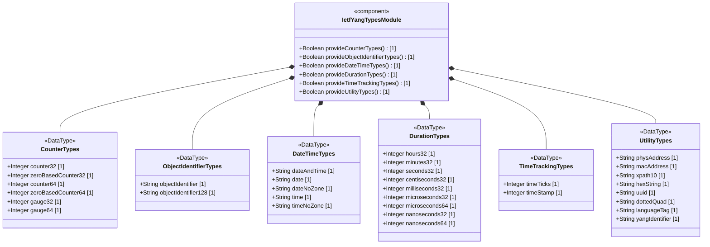
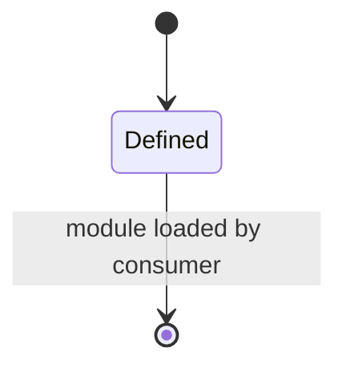

# Epic: ietf-yang-types: Core YANG Data Types

## 1. Context
This Epic covers the specification of the `ietf-yang-types` YANG module defined in RFC 9911 Section 3. This module contains a collection of generally useful derived YANG data types that serve as shared primitives for network management data models. The types are organized into semantic groups: counter and gauge integer types, object identifier types, date and time representations, time duration measurements, time tracking utilities, and address/string utility types. As a utility module with no concrete data nodes (containers or lists), these types form a Shared Type Registry consumed by functional YANG modules.

## 2. Requirements & Checklist
- [ ] #1 - [Define Counter and Gauge Integer Types](https://github.com/gintatkinson/3dgs-033/blob/main/docs/features/feat-01-counter-gauge-types.md)
- [ ] #2 - [Define Object Identifier Types](https://github.com/gintatkinson/3dgs-033/blob/main/docs/features/feat-02-object-identifier-types.md)
- [ ] #3 - [Define Date and Time Representation Types](https://github.com/gintatkinson/3dgs-033/blob/main/docs/features/feat-03-date-time-types.md)
- [ ] #4 - [Define Time Duration Measurement Types](https://github.com/gintatkinson/3dgs-033/blob/main/docs/features/feat-04-time-duration-types.md)
- [ ] #5 - [Define Time Tracking Types](https://github.com/gintatkinson/3dgs-033/blob/main/docs/features/feat-05-time-tracking-types.md)
- [ ] #6 - [Define Address and String Utility Types](https://github.com/gintatkinson/3dgs-033/blob/main/docs/features/feat-06-address-string-types.md)

### Associated Use Cases & User Stories

#### Associated Use Cases
- [ ] #21 - [Validate and Retrieve Core YANG Data Type Values](https://github.com/gintatkinson/3dgs-033/blob/main/docs/use-cases/uc-01-core-yang-type-system.md) (Use Case for the type-validation lifecycle of all typedefs in the ietf-yang-types module)

#### Associated User Stories
- [ ] #13 - [Counter Wrap-Aware Delta Calculation Across Discontinuity Boundaries](https://github.com/gintatkinson/3dgs-033/blob/main/docs/user-stories/us-01-counter-wrap-delta-calculation.md) (validates counter32/counter64 wrap-arithmetic for Feature feat-01)
- [ ] #14 - [Gauge Value Saturation Monitoring and Recovery from Boundary Clamping](https://github.com/gintatkinson/3dgs-033/blob/main/docs/user-stories/us-02-gauge-saturation-recovery.md) (validates gauge32/gauge64 boundary-clamping behaviour for Feature feat-01)
- [ ] #15 - [Timeticks Wrap Lifecycle and Timestamp Cascade Reset Expiration](https://github.com/gintatkinson/3dgs-033/blob/main/docs/user-stories/us-03-timeticks-wrap-timestamp-reset.md) (validates timetick wrapping and timestamp-reset lifecycle for Feature feat-05)
- [ ] #16 - [Canonical Time Zone Offset Derivation and Daylight Saving Time Transition Handling](https://github.com/gintatkinson/3dgs-033/blob/main/docs/user-stories/us-04-timezone-canonicalization-dst-transition.md) (validates timezone-offset derivation and DST handling for Feature feat-03)
- [ ] #17 - [Duration Unit Conversion Across Time Measurement Scales](https://github.com/gintatkinson/3dgs-033/blob/main/docs/user-stories/us-05-duration-unit-conversion.md) (validates duration-unit conversion arithmetic for Feature feat-04)
- [ ] #18 - [Counter Discontinuity Detection Using Associated Indicator Schema Nodes](https://github.com/gintatkinson/3dgs-033/blob/main/docs/user-stories/us-06-counter-discontinuity-detection.md) (validates discontinuity-detection behaviour for counter32/counter64 in Feature feat-01)

## 3. Architecture

### Subsystem Component Definition
The `ietf-yang-types` module is a Shared Type Registry subsystem that provides standardized data type definitions consumed by functional YANG modules. It has no state or lifecycle of its own but defines reusable UML DataType primitives.

## System-Level UML Class Diagram

## State Machine Definitions

The `ietf-yang-types` module has no state machine. All types are stateless value definitions provided at module compilation time. Downstream consumers reference these types in their own data nodes and manage state accordingly.

## System State Machine Diagram

## 4. Operational Considerations
- These types are referenced by other YANG modules via the `import` statement
- The module revision is 2025-12-22, obsoleting RFC 6991
- Canonical representations (lowercase, normalized time zones) must be enforced on output
- Counter discontinuity detection requires associated discontinuity indicator schema nodes
- Time zone offset handling must account for daylight saving time (DST) changes
- The `Z` vs `+00:00` time zone offset distinction preserves local reference point information

## 5. Security & Governance
- Counter and gauge types carry no sensitive data by themselves but may track system metrics that reveal operational patterns
- MAC addresses and physical addresses could be used for device fingerprinting and should be treated with appropriate access controls
- UUIDs may contain version/variant information but are not considered sensitive
- Language tags and domain names carry no inherent security risk
- All types are read-only data definitions with no executable security surface

## Specification Context
The `ietf-yang-types` module is defined in Section 3 of RFC 9911, "Core YANG Types". The module contains derived types built on YANG built-in base types (uint32, uint64, int32, int64, string). This version of the YANG module adds several new data types (date, date-no-zone, time, time-no-zone, hours32, minutes32, seconds32, centiseconds32, milliseconds32, microseconds32, microseconds64, nanoseconds32, nanoseconds64, language-tag). The yang-identifier definition has been aligned with YANG 1.1 (RFC 7950). Types representing time support the representation of leap seconds. The representation of time zone offsets has been aligned with RFC 9557.

## 6. Source References
Structural Schema: [ietf-yang-types@2025-12-22.yang](https://github.com/gintatkinson/3dgs-033/blob/main/standard/ietf/RFC/ietf-yang-types%402025-12-22.yang) (Clause: entire module)
Normative Specification: [RFC 9911](https://datatracker.ietf.org/doc/rfc9911/) (Clause: Section 3, Core YANG Types)
