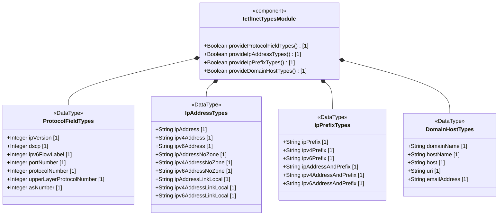
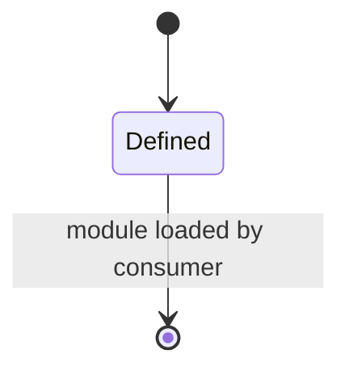

# Epic: ietf-inet-types: Internet Protocol Suite Data Types

## 1. Context
This Epic covers the specification of the `ietf-inet-types` YANG module defined in RFC 9911 Section 4. This module contains a collection of generally useful derived YANG data types for Internet addresses and related concepts. The types are organized into semantic groups: protocol field and AS number types, IP address representations with optional zone identifiers, IP prefix types, and domain/host/URI/email types. As a utility module with no concrete data nodes (containers or lists), these types form a Shared Type Registry consumed by functional YANG modules. This module imports no types from other modules.

## 2. Requirements & Checklist
- [ ] #7 - [Define Protocol Field and AS Number Types](https://github.com/gintatkinson/3dgs-033/blob/main/docs/features/feat-07-protocol-field-types.md)
- [ ] #8 - [Define IP Address Representation Types](https://github.com/gintatkinson/3dgs-033/blob/main/docs/features/feat-08-ip-address-types.md)
- [ ] #9 - [Define IP Prefix Representation Types](https://github.com/gintatkinson/3dgs-033/blob/main/docs/features/feat-09-ip-prefix-types.md)
- [ ] #10 - [Define Domain Name, Host, URI, and Email Types](https://github.com/gintatkinson/3dgs-033/blob/main/docs/features/feat-10-domain-host-types.md)

### Associated Use Cases & User Stories

#### Associated Use Cases
- [ ] #22 - [Validate and Retrieve Internet Protocol Suite Type Values](https://github.com/gintatkinson/3dgs-033/blob/main/docs/use-cases/uc-02-internet-type-system.md) (Use Case for the type-validation lifecycle of all typedefs in the ietf-inet-types module)

#### Associated User Stories
- [ ] #19 - [IP Prefix Host-Bit Zeroing and Canonical Normalization on Output](https://github.com/gintatkinson/3dgs-033/blob/main/docs/user-stories/us-07-ip-prefix-canonical-normalization.md) (validates IPv4/IPv6 prefix canonicalization for Feature feat-09)
- [ ] #20 - [URI Normalization to RFC 3986 Canonical Representation](https://github.com/gintatkinson/3dgs-033/blob/main/docs/user-stories/us-08-uri-canonical-normalization.md) (validates URI normalization per RFC 3986 for Feature feat-10)

## 3. Architecture

### Subsystem Component Definition
The `ietf-inet-types` module is a Shared Type Registry subsystem that provides standardized Internet-protocol-related data type definitions consumed by functional YANG modules. It has no state or lifecycle of its own but defines reusable UML DataType primitives for network addressing and naming.

## System-Level UML Class Diagram

## State Machine Definitions

The `ietf-inet-types` module has no state machine. All types are stateless value definitions provided at module compilation time. Downstream consumers reference these types in their own data nodes and manage state accordingly.

## System State Machine Diagram

## 4. Operational Considerations
- These types are referenced by other YANG modules via the `import` statement
- The module revision is 2025-12-22, obsoleting RFC 6991
- IPv6 addresses must use canonical representation per RFC 5952 Section 4
- Zone indices for scoped addresses use numerical format as the canonical representation
- IP prefixes accept non-canonical input (host bits set) but return canonical format (host bits zeroed) on output
- Domain names with internationalized characters MUST use A-label encoding per RFC 5890
- URIs must be normalized per RFC 3986 normalization rules on output
- The `inet:host` union was changed to use `inet:host-name` instead of `inet:domain-name`

## 5. Security & Governance
- IP addresses and prefixes may reveal network topology information and should be protected with appropriate access control
- Link-local addresses are scoped to the local link and carry no routable security implications
- Protocol numbers and port numbers are public IANA assignments with no inherent sensitivity
- AS numbers identify administrative domains but carry no personally identifiable information
- Email addresses may contain personally identifiable information (PII) and must be handled per applicable privacy regulations
- Domain names and URIs may reveal service dependencies and infrastructure relationships
- All types are read-only data definitions with no executable security surface

## Specification Context
The `ietf-inet-types` module is defined in Section 4 of RFC 9911. The module references several RFCs including RFC 791 (IPv4), RFC 8200 (IPv6), RFC 3986 (URI), RFC 4291 (IPv6 Addressing), RFC 5952 (IPv6 Text Representation), RFC 4007 (IPv6 Scoped Address), RFC 3927 (IPv4 Link-Local), RFC 5890 (IDNA), RFC 5646 (BCP 47), RFC 952/1123 (Host Names), and RFC 5322/6532 (Email). This version of the module adds new types for ip-address-and-prefix, ipv4-address-and-prefix, ipv6-address-and-prefix, protocol-number, upper-layer-protocol-number, host-name, email-address, and link-local address types. The inet:host union was changed to use inet:host-name instead of inet:domain-name. Several pattern statements have been improved.

## 6. Source References
Structural Schema: [ietf-inet-types@2025-12-22.yang](https://github.com/gintatkinson/3dgs-033/blob/main/standard/ietf/RFC/ietf-inet-types%402025-12-22.yang) (Clause: entire module)
Normative Specification: [RFC 9911](https://datatracker.ietf.org/doc/rfc9911/) (Clause: Section 4, Internet Protocol Suite Types)
