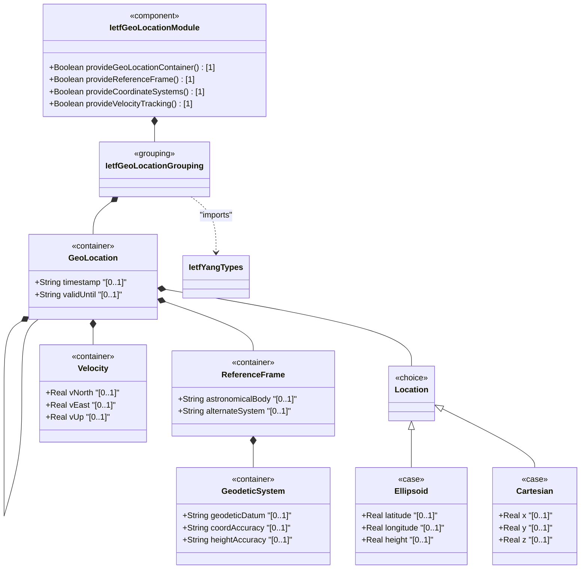
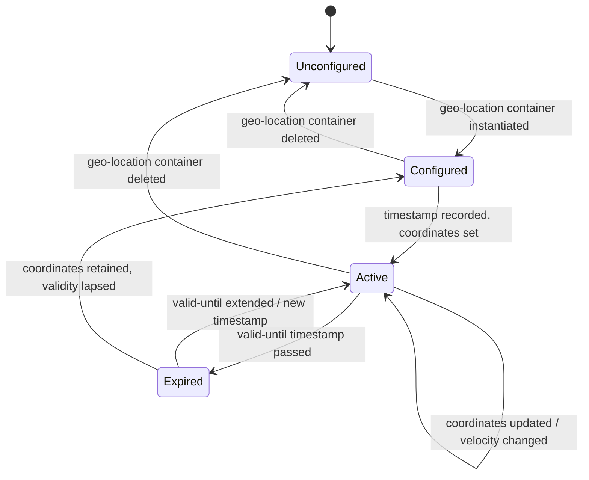

# Epic: ietf-geo-location: Geographic Location Data Model

## 1. Context
This Epic covers the specification of the `ietf-geo-location` YANG module defined in RFC 9179. This module defines a `geo-location` grouping containing a structured container hierarchy for specifying a location on, around, or relative to an astronomical body (e.g., Earth, Moon, Mars). The module supports two coordinate systems via a YANG choice (ellipsoidal latitude/longitude/height and Cartesian x/y/z), motion tracking via a velocity vector, and an optional alternate-systems feature for non-physical coordinate systems. This is a functional module with concrete containers, choices, and cases. The module imports `ietf-yang-types` (specified in Epic #11) for the `date-and-time` type used in `timestamp` and `valid-until` leaves.

**Parent Epics:**
- [ ] #11 - [ietf-yang-types: Core YANG Data Types](https://github.com/gintatkinson/3dgs-033/blob/main/docs/epics/epic-01-ietf-yang-types.md) (imported module providing `yang:date-and-time` type)

## 2. Requirements & Checklist
- [ ] #23 - [Define Geo-Location Container](https://github.com/gintatkinson/3dgs-033/blob/main/docs/features/feat-11-geo-location-container.md) (root container of the geo-location grouping, houses all sub-containers and temporal metadata leaves)
- [ ] #24 - [Define Reference Frame](https://github.com/gintatkinson/3dgs-033/blob/main/docs/features/feat-12-reference-frame.md) (defines the astronomical body and optional alternate-system for coordinate interpretation, RFC 9179 Section 2.1)
- [ ] #25 - [Define Geodetic System](https://github.com/gintatkinson/3dgs-033/blob/main/docs/features/feat-13-geodetic-system.md) (nested container specifying geodetic datum and accuracy parameters, RFC 9179 Section 2.1)
- [ ] #26 - [Define Location Coordinate Choice](https://github.com/gintatkinson/3dgs-033/blob/main/docs/features/feat-14-location-choice.md) (YANG choice node selecting between ellipsoidal and Cartesian coordinate alternatives, RFC 9179 Section 2.2)
- [ ] #27 - [Define Ellipsoid Coordinates](https://github.com/gintatkinson/3dgs-033/blob/main/docs/features/feat-15-ellipsoid-coordinates.md) (latitude, longitude, and optional height in decimal degrees per ISO 6709:2008, RFC 9179 Section 2.2)
- [ ] #28 - [Define Cartesian Coordinates](https://github.com/gintatkinson/3dgs-033/blob/main/docs/features/feat-16-cartesian-coordinates.md) (X, Y, Z coordinates in meters, RFC 9179 Section 2.2)
- [ ] #29 - [Define Velocity Vector](https://github.com/gintatkinson/3dgs-033/blob/main/docs/features/feat-17-velocity.md) (three-dimensional motion vector with v-north, v-east, v-up components, RFC 9179 Section 2.3)

### Associated Use Cases & User Stories

#### Associated Use Cases
- [ ] #38 - [Configure and Manage Geo-Location Container](https://github.com/gintatkinson/3dgs-033/blob/main/docs/use-cases/uc-03-configure-geo-location.md) (Use Case for the configuration lifecycle of the geo-location container, Feature feat-11)
- [ ] #39 - [Define and Validate Reference Frame for Geo-Location](https://github.com/gintatkinson/3dgs-033/blob/main/docs/use-cases/uc-04-define-reference-frame.md) (Use Case for defining the reference frame, Feature feat-12)
- [ ] #40 - [Configure Geodetic System with Datum and Accuracy Parameters](https://github.com/gintatkinson/3dgs-033/blob/main/docs/use-cases/uc-05-configure-geodetic-system.md) (Use Case for geodetic system configuration, Feature feat-13)
- [ ] #41 - [Select and Switch Between Location Coordinate Systems](https://github.com/gintatkinson/3dgs-033/blob/main/docs/use-cases/uc-06-select-coordinate-choice.md) (Use Case for coordinate system selection, Feature feat-14)
- [ ] #42 - [Configure Ellipsoidal Latitude-Longitude-Height Coordinates](https://github.com/gintatkinson/3dgs-033/blob/main/docs/use-cases/uc-07-configure-ellipsoid-coordinates.md) (Use Case for ellipsoidal coordinate configuration, Feature feat-15)
- [ ] #43 - [Configure Cartesian X-Y-Z Coordinates](https://github.com/gintatkinson/3dgs-033/blob/main/docs/use-cases/uc-08-configure-cartesian-coordinates.md) (Use Case for Cartesian coordinate configuration, Feature feat-16)
- [ ] #44 - [Configure and Derive Velocity Vector for Motion Tracking](https://github.com/gintatkinson/3dgs-033/blob/main/docs/use-cases/uc-09-configure-velocity-vector.md) (Use Case for velocity vector configuration, Feature feat-17)

#### Associated User Stories
- [ ] #31 - [Derive Speed and Heading from Velocity Vector Components](https://github.com/gintatkinson/3dgs-033/blob/main/docs/user-stories/us-09-derive-speed-heading-velocity.md) (validates 2D speed/heading derivation from velocity v-north/v-east, Feature feat-17)
- [ ] #32 - [Expire Geo-Location Data at valid-until Temporal Boundary](https://github.com/gintatkinson/3dgs-033/blob/main/docs/user-stories/us-10-expire-geo-location-valid-until.md) (validates temporal expiry lifecycle at valid-until, Feature feat-11)
- [ ] #33 - [Inherit Reference Frame from Parent Container in Nested Location Hierarchies](https://github.com/gintatkinson/3dgs-033/blob/main/docs/user-stories/us-11-inherit-reference-frame-nested-locations.md) (validates reference-frame inheritance in nested geo-location, Feature feat-12)
- [ ] #34 - [Transform Between Ellipsoidal and Cartesian Coordinate Representations](https://github.com/gintatkinson/3dgs-033/blob/main/docs/user-stories/us-12-transform-ellipsoidal-cartesian-coordinates.md) (validates coordinate transformation between ellipsoidal and Cartesian, Features feat-15 and feat-16)
- [ ] #35 - [Configure Geo-Location on a Non-Earth Astronomical Body](https://github.com/gintatkinson/3dgs-033/blob/main/docs/user-stories/us-13-configure-non-earth-astronomical-body.md) (validates alternate-systems feature guard for non-earth bodies, Feature feat-12)
- [ ] #36 - [Resolve Effective Coordinate Accuracy from Datum Defaults and Explicit Overrides](https://github.com/gintatkinson/3dgs-033/blob/main/docs/user-stories/us-14-resolve-coordinate-accuracy-override.md) (validates accuracy resolution from datum defaults and explicit accuracy leaf, Feature feat-13)
- [ ] #37 - [Compute Geo-Location Validity Window from Timestamp and valid-until](https://github.com/gintatkinson/3dgs-033/blob/main/docs/user-stories/us-15-compute-location-validity-window.md) (validates validity-window computation from timestamp and valid-until, Feature feat-11)

## 3. Architecture

### Subsystem Component Definition
The `ietf-geo-location` module is a **Geographic Location Subsystem** that provides a structured container hierarchy for geospatial data representation. It standardizes how geographic locations are modeled in YANG-based network management systems, supporting multiple coordinate systems, astronomical bodies, and motion tracking. The subsystem exposes data containers consumed by higher-level network inventory models (e.g., device locations, data center geolocation) and provides a `feature alternate-systems` flag for conditional compilation of virtual coordinate systems.

### System-Level UML Class Diagram

## State Machine Definitions

The `ietf-geo-location` module's state machine represents the lifecycle of a geo-location data record within a network inventory management context.

### System State Machine Diagram

## 4. Operational Considerations
- This module is a YANG grouping; it must be instantiated by a host module via the `uses geo:geo-location` statement
- The grouping does not define any config false (read-only) constraints — all data nodes are writable by default
- The `alternate-systems` feature flag controls whether the `alternate-system` leaf is present; deployments without this feature will not see this field
- The `timestamp` and `valid-until` leaves use the `yang:date-and-time` type from `ietf-yang-types` (Epic #11), ensuring ISO 8601 compliance
- Nested locations can inherit the parent's `reference-frame` per RFC 9179 Section 2.4; module authors are responsible for indicating this inheritance in their own YANG definitions
- The `geodetic-datum` default of "wgs-84" is implied by the specification, not encoded as a YANG `default` statement
- The IANA "Geodetic System Values" registry (RFC 9179 Section 6.1) governs allowable `geodetic-datum` values with a First Come First Served allocation policy
- Velocity tracking is designed for relatively stable motion; complex or rapidly changing motion patterns are out of scope and should be handled by the consuming module

## 5. Security & Governance
- Geographic location data may reveal sensitive information about network infrastructure, device placement, or personnel. Access SHOULD be controlled via NETCONF/RESTCONF access control models
- All data nodes are writable by default; consuming modules SHOULD apply appropriate access restrictions where location data is considered sensitive
- The `alternate-system` feature, when enabled, allows specifying non-physical coordinate systems which may introduce logics outside standard geographic models — consuming applications MUST validate these values appropriately
- Privacy considerations apply to any location data tied to individuals or customer premises equipment (CPE) per RFC 9179 Section 7
- The `geodetic-datum` registry values are assigned First Come First Served; consuming applications SHOULD validate registry membership before accepting datum values
- Module authors using this grouping should consider whether location data constitutes personally identifiable information (PII) under applicable regulations

## Specification Context
The `ietf-geo-location` YANG module is defined in RFC 9179 "A YANG Grouping for Geographic Locations". It defines a single grouping (`geo-location`) containing a structured container hierarchy for specifying geographic locations. The module conforms to ISO 6709:2008 for standard representation of geographic point location by coordinates. The grouping is designed to be reusable across many YANG data models by using the `uses` statement. It supports locations on any astronomical body (default Earth), multiple coordinate systems (ellipsoidal and Cartesian), motion tracking (velocity vectors), and optional alternate coordinate systems (via feature flag). The module imports the `ietf-yang-types` module (RFC 6991) for the `date-and-time` type.

## 6. Source References
Structural Schema: [ietf-geo-location@2022-02-11.yang](https://github.com/gintatkinson/3dgs-033/blob/main/standard/ietf/RFC/ietf-geo-location%402022-02-11.yang) (Clause: entire module)
Normative Specification: [RFC 9179](https://datatracker.ietf.org/doc/rfc9179/) (Clause: entire RFC)
