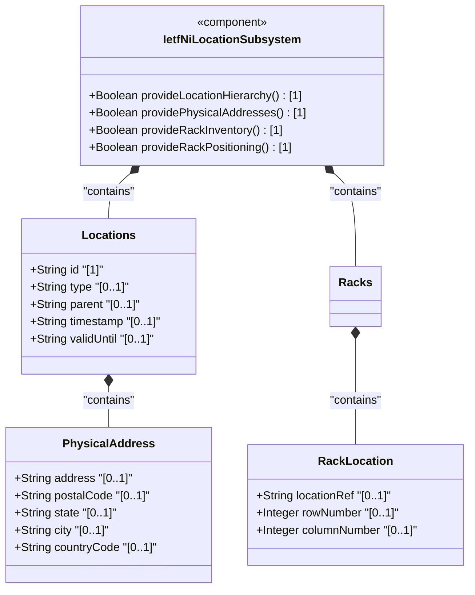
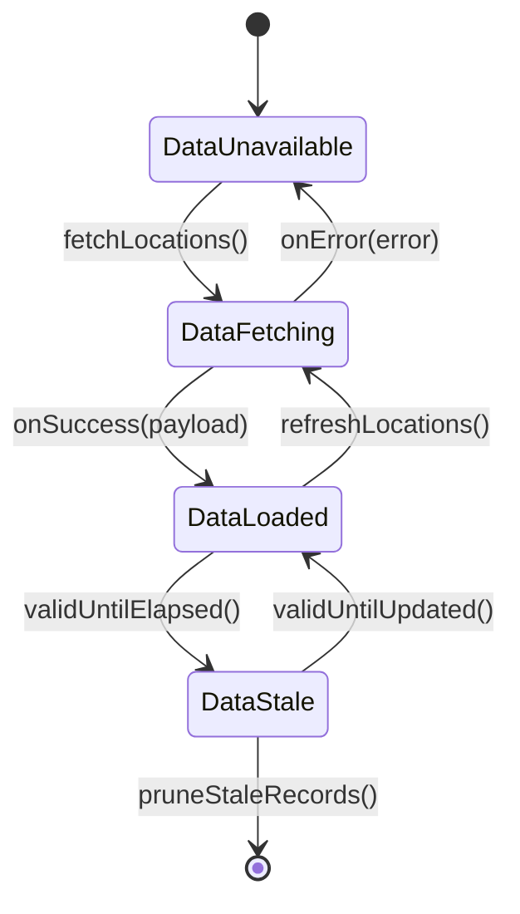

# Epic: ietf-ni-location: Network Inventory Location

## 1. Context
This Epic covers the specification of the `ietf-ni-location` YANG module defined in draft-ietf-ivy-network-inventory-location-06. This module augments the base `ietf-network-inventory` model (RFC AAAA) to enrich network elements with comprehensive location information. The module provides a read-only (`config false`) hierarchical location model supporting geographical locations (sites, buildings, equipment rooms), physical addresses with postal data, geodetic coordinates via RFC 9179's `ietf-geo-location` grouping, physical equipment racks with dimensional and electrical specifications, and rack positioning with grid coordinates. It also defines an extensible rack security classification identity hierarchy (`rack-class-type`) and a location reference typedef (`ni-location-ref`) for referential integrity between racks and locations. This is a functional module with four concrete containers: `locations`, `physical-address`, `racks`, and `rack-location`.

**Parent Epics:**
- [ ] #30 - [ietf-geo-location: Geographic Location Data Model](https://github.com/gintatkinson/3dgs-033/blob/main/docs/epics/epic-03-ietf-geo-location.md) (imported module providing `geo:geo-location` grouping, RFC 9179)
- [ ] #11 - [ietf-yang-types: Core YANG Data Types](https://github.com/gintatkinson/3dgs-033/blob/main/docs/epics/epic-01-ietf-yang-types.md) (imported module providing `yang:date-and-time` and `yang:uuid` types, RFC 9911)

**Import Dependency (No Epic in workspace):**
- `ietf-network-inventory` (RFC AAAA: A YANG Data Model for Network Inventory) — the base module that this module augments via `/nwi:network-inventory`. An Epic for this module must be specified before downstream implementation can proceed.

## 2. Requirements & Checklist
- [ ] #45 - [Define Locations Container](https://github.com/gintatkinson/3dgs-033/blob/main/docs/features/feat-18-locations-container.md) (top-level augment container anchoring all location data, draft-ietf-ivy-network-inventory-location Section 2)
- [ ] #46 - [Define Physical Address](https://github.com/gintatkinson/3dgs-033/blob/main/docs/features/feat-19-physical-address.md) (nested container providing postal address with ISO ALPHA-2 country code pattern constraint, draft-ietf-ivy-network-inventory-location Section 2)
- [ ] #47 - [Define Racks Container](https://github.com/gintatkinson/3dgs-033/blob/main/docs/features/feat-20-racks-container.md) (container for physical equipment racks with dimensions, power specs, and extensible security classification, draft-ietf-ivy-network-inventory-location Section 3)
- [ ] #48 - [Define Rack Location](https://github.com/gintatkinson/3dgs-033/blob/main/docs/features/feat-21-rack-location.md) (nested container for rack positioning with location leafref and grid coordinates, draft-ietf-ivy-network-inventory-location Section 3)

### Associated Use Cases & User Stories

#### Associated Use Cases

#### Associated User Stories

## 3. Architecture

### Subsystem Component Definition
The `ietf-ni-location` module is a **Network Inventory Location Subsystem** that extends the base network inventory model with structured location data. It provides read-only operational state containers for hierarchical locations, physical addresses, equipment rack specifications, and rack placement information. The subsystem consumes the `ietf-geo-location` grouping (RFC 9179) for geodetic coordinate data and the `ietf-yang-types` module (RFC 9911) for temporal and UUID types. It exports a single augment point at `/nwi:network-inventory` via the `locations` grouping.

### System-Level UML Class Diagram

## State Machine Definitions

### System State Machine Diagram

## 4. Operational Considerations
This model provides a read-only perspective of network inventory location information known to the controller. It reports the physical locations of network elements and components installed in the network, enabling queries for site, rack, and other location-related information. In brownfield scenarios, existing deployments are based on proprietary inventory OSS solutions, and the migration path is highly dependent on the specific proprietary implementation.

The model is designed with the controller maintaining authoritative location data through automated tooling, while OSS systems consume this data as read-only operational state. Sources of controller location data may include RFID tooling, geolocation services, and manual entry via controller interfaces. The controller does not support OSS modification of location records.

OSS systems obtain location information via standard YANG retrieval operations (NETCONF, RESTCONF). In large-scale inventories, mechanisms such as RESTCONF or NETCONF pagination should be utilized for queries involving large result sets. Data quality is indicated through timestamps recording the last update time, as well as an optional expiration time for location validity.

Before using a location for field dispatch or planning, verification is required to ensure at least one of physical-address or geo-location is present, and that the valid-until leaf is either not present or indicates a future time. Once the valid-until time has passed, the location MUST be considered stale and MUST NOT be used for operational purposes.

## 5. Security & Governance
The `ietf-ni-location` YANG module defines a data model designed to be accessed via YANG-based management protocols (NETCONF, RESTCONF). These protocols must use a secure transport layer (e.g., SSH, TLS, QUIC) and require mutual authentication.

The Network Configuration Access Control Model (NACM) provides the means to restrict access for particular NETCONF or RESTCONF users to a preconfigured subset of all available protocol operations and content.

The `locations` container reports physical deployment information including facility structures (sites, buildings, rooms), rack physical attributes (dimensions, power capacity, security classification), and geographic coordinates. It also references network elements and components by their inventory identifiers (ne-id, component-id). Uncontrolled disclosure may enable association of inventory identifiers with physical facility structures and geographic coordinates, reveal facility layouts and equipment density, expose precise geographic coordinates facilitating physical location identification, and indicate physical protection levels through rack security classifications.

Read access to these data nodes (e.g., via get, get-config, or notification) must be carefully controlled in sensitive network environments.

## Specification Context
> This document defines a YANG data model for Network Inventory location (e.g., site, room, rack, geo-location data), which provides location information with different granularity levels for inventoried network elements. Accurate location information is useful for network planning, deployment, and maintenance. However, such information cannot be obtained or verified from the Network Elements themselves.

> The Network Inventory location model is to record physical locations, such as sites, building, equipment rooms, racks, and so on. Additionally, it includes provisions for physical addresses or geo-location data (geographic coordinates). The location model augments the base network inventory to enrich NEs with location information.

> The Network Inventory location model is classified as a network model (Section 3.5.1 of [I-D.ietf-netmod-rfc8407bis]).

## 6. Source References
Structural Schema: [ietf-ni-location@2026-07-06.yang](https://github.com/ietf-ivy-wg/network-inventory-location/blob/main/ietf-ni-location.yang) (Clause: module ietf-ni-location)
Normative Specification: [draft-ietf-ivy-network-inventory-location-06](https://datatracker.ietf.org/doc/html/draft-ietf-ivy-network-inventory-location) (Clause: Sections 2-5)
