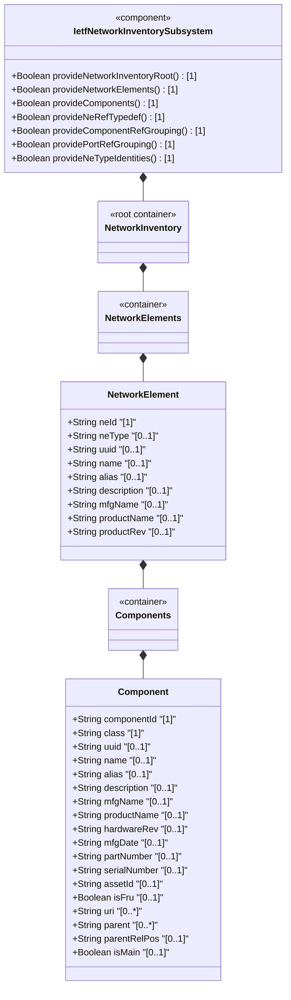
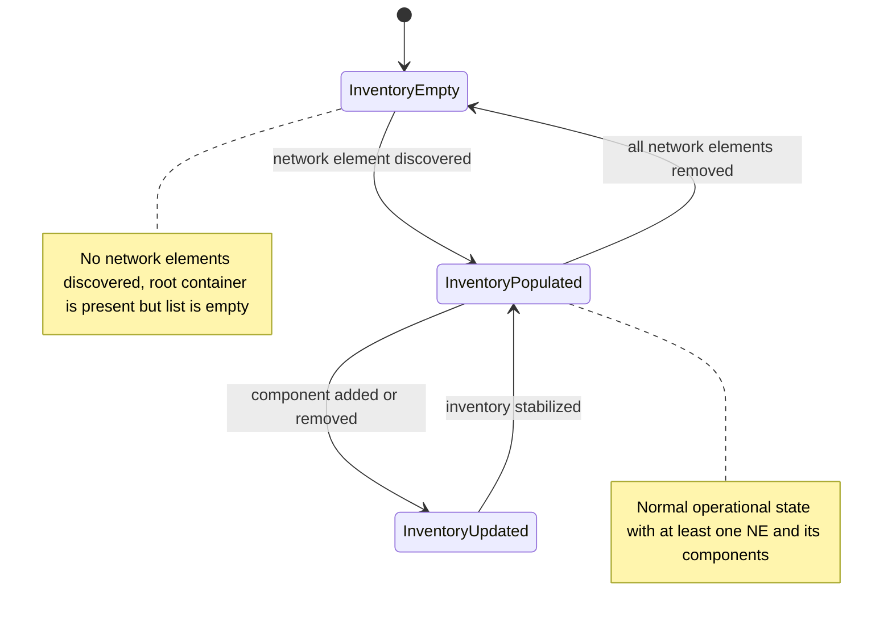

# Epic: ietf-network-inventory: Base Network Inventory Data Model

## 1. Context
This Epic covers the specification of the `ietf-network-inventory` YANG module defined in draft-ietf-ivy-network-inventory-yang-18. This module defines a base YANG data model for retrieving network inventory at a network-wide scope — it is application- and technology-agnostic and conforms to the Network Management Datastore Architecture (NMDA, RFC 8342). The module provides the top-level read-only (`config false`) `network-inventory` container anchoring the `network-elements` list and the per-element `components` list. Network elements are generalized entities keyed by a server-assigned `ne-id` with an extensible `ne-type` identity hierarchy (defaulting to `ne-physical` for physical NEs). Components form a recursive containment hierarchy within each NE, classified by a union of hardware class identities (`iana-hardware`) and non-hardware component identities, with exhaustive inventory attributes derived from RFC 6933 (Entity MIB) and RFC 8348 (Hardware Management).

This is a **foundational module** — the parent prerequisite for Epic #49 (`ietf-ni-location`) which augments `ietf-network-inventory` with location data. It imports `ietf-yang-types` (Epic #11) and `ietf-inet-types` (Epic #12) for type definitions, and `iana-hardware` for hardware class identities. The module also defines reusable groupings (`basic-common-entity-attributes`, `ne-component-common-entity-attributes`, `component-attributes`, `component-ref`, `port-ref`) and the `ne-ref` typedef for cross-module network element referencing.

**Parent Epics (Import Dependencies):** [Parent Epic: ietf-yang-types](https://github.com/gintatkinson/3dgs-033/blob/main/docs/epics/epic-01-ietf-yang-types.md)
- [ ] #11 - [ietf-yang-types: Core YANG Data Types](https://github.com/gintatkinson/3dgs-033/blob/main/docs/epics/epic-01-ietf-yang-types.md) (imported module providing `yang:uuid` and `yang:date-and-time` types, RFC 9911 Section 3)
- [ ] #12 - [ietf-inet-types: Internet Protocol Suite Data Types](https://github.com/gintatkinson/3dgs-033/blob/main/docs/epics/epic-02-ietf-inet-types.md) (imported module providing `inet:uri` type, RFC 9911 Section 4)

**Dependent Epics:**
- [ ] #49 - [ietf-ni-location: Network Inventory Location](https://github.com/gintatkinson/3dgs-033/blob/main/docs/epics/epic-04-ietf-ni-location.md) (augments `/nwi:network-inventory` with location data)

## 2. Requirements & Checklist
- [ ] #64 - [Define Network Inventory Root Container](https://github.com/gintatkinson/3dgs-033/blob/main/docs/features/feat-22-network-inventory-root.md) (top-level read-only root container anchoring all network inventory data, draft-ietf-ivy-network-inventory-yang Section 3)
- [ ] #65 - [Define Network Elements Container and List](https://github.com/gintatkinson/3dgs-033/blob/main/docs/features/feat-23-network-elements-list.md) (container and list for network elements with ne-id key, ne-type identity, software-rev tracking, and common attributes, draft-ietf-ivy-network-inventory-yang Section 3.2)
- [ ] #66 - [Define Components Container and List](https://github.com/gintatkinson/3dgs-033/blob/main/docs/features/feat-24-components-list.md) (container and list for components within each network element with component-id key, mandatory class union, hardware attributes, parent containment hierarchy, and conditional chassis/main flags, draft-ietf-ivy-network-inventory-yang Section 3.3)

### Associated Use Cases & User Stories

#### Associated Use Cases
- [ ] #78 - [Retrieve Network Inventory Root Structure](https://github.com/gintatkinson/3dgs-033/blob/main/docs/use-cases/uc-14-retrieve-network-inventory-root.md) (Use Case for the network-inventory root container retrieval, Feature feat-22)
- [ ] #79 - [Manage Network Elements Inventory](https://github.com/gintatkinson/3dgs-033/blob/main/docs/use-cases/uc-15-manage-network-elements-inventory.md) (Use Case for network element lifecycle management, Feature feat-23)
- [ ] #80 - [Manage Component Inventory Within Network Elements](https://github.com/gintatkinson/3dgs-033/blob/main/docs/use-cases/uc-16-manage-component-inventory.md) (Use Case for component lifecycle within a network element, Feature feat-24)

#### Associated User Stories
- [ ] #68 - [Identify Main Chassis in Multi-Chassis Network Element](https://github.com/gintatkinson/3dgs-033/blob/main/docs/user-stories/us-26-multi-chassis-ne-main-identification.md) (validates is-main chassis flag computation, Features feat-23 and feat-24)
- [ ] #69 - [Traverse Component Parent Containment Hierarchy Within a Network Element](https://github.com/gintatkinson/3dgs-033/blob/main/docs/user-stories/us-27-component-parent-containment-traversal.md) (validates parent reference containment traversal, Feature feat-24)
- [ ] #70 - [Compute Conditional Applicability of Parent Relative Position](https://github.com/gintatkinson/3dgs-033/blob/main/docs/user-stories/us-28-conditional-parent-rel-pos-computation.md) (validates parent-rel-pos conditional logic, Feature feat-24)
- [ ] #71 - [Compute Conditional Applicability of is-main Flag for Chassis Components](https://github.com/gintatkinson/3dgs-033/blob/main/docs/user-stories/us-29-conditional-is-main-chassis-computation.md) (validates is-main conditional logic for chassis, Features feat-23 and feat-24)
- [ ] #72 - [Report Non-Modular Pizza Box Network Element Inventory](https://github.com/gintatkinson/3dgs-033/blob/main/docs/user-stories/us-30-non-modular-pizza-box-ne-inventory.md) (validates non-modular NE inventory reporting, Feature feat-23)
- [ ] #73 - [Aggregate Network Inventory Across Hierarchical Controllers](https://github.com/gintatkinson/3dgs-033/blob/main/docs/user-stories/us-31-hierarchical-controller-inventory-aggregation.md) (validates multi-controller inventory aggregation, Feature feat-22)
- [ ] #74 - [Model Pluggable Transceiver Module Component Nesting](https://github.com/gintatkinson/3dgs-033/blob/main/docs/user-stories/us-32-pluggable-transceiver-component-nesting.md) (validates pluggable transceiver nesting in components, Feature feat-24)
- [ ] #75 - [Preserve Network Element Identity Across Disconnection Events](https://github.com/gintatkinson/3dgs-033/blob/main/docs/user-stories/us-33-ne-identity-persistence-disconnection.md) (validates NE identity persistence across disconnection, Feature feat-23)
- [ ] #76 - [Assemble Component Containment Tree from Parent References](https://github.com/gintatkinson/3dgs-033/blob/main/docs/user-stories/us-34-component-containment-tree-assembly.md) (validates containment tree assembly from parent references, Feature feat-24)
- [ ] #77 - [Validate Component Comparison Scope Within Manufacturer Boundaries](https://github.com/gintatkinson/3dgs-033/blob/main/docs/user-stories/us-35-mfg-scoped-part-serial-comparison.md) (validates mfg-scoped part/serial comparison, Feature feat-24)

## 3. Architecture

### Subsystem Component Definition
The `ietf-network-inventory` module is a **Network Inventory Subsystem** that provides a read-only operational state data tree for network-wide inventory reporting. It publishes a single top-level container (`network-inventory`) and exposes containment relationships for network elements and their components. The subsystem provides interfaces for:
- Retrieving the list of all network elements with their identifying, typing, and software attributes
- Retrieving the component hierarchy within each network element, including hardware identification, asset tracking, and structural containment
- Cross-module referencing via the `ne-ref` typedef and `component-ref` / `port-ref` groupings

### System-Level UML Class Diagram

### State Machine Definitions

### System State Machine Diagram

## 4. Operational Considerations
The network inventory data model provides a read-only perspective of the actual inventory data that a network controller knows of what is actually installed within the network. Spare or inactive assets are outside the scope of this model. The model generalizes both network element and component definitions to support extensibility through augmentation modules.

The distinction between a temporarily unreachable network element and one that has been removed from the network is outside the scope of this document and depends on the discovery mechanism used by the controller. All data nodes under `network-inventory` are `config false`, meaning no write operations are supported — the server populates the tree based on its discovery of the network.

The `ne-id` must be assigned such that the same network element is always identified through the same identifier across disconnections. Component identifiers (`component-id`) can be assigned by either the network element or the server. The model uses `require-instance false` on all leafref paths, meaning referential integrity is not enforced at the schema level — dangling references are permitted for operational flexibility.

## 5. Security & Governance
The `network-inventory` container is completely read-only (`config false`), meaning no data modification is possible through this model. However, the inventory data is highly sensitive as it exposes detailed information about network infrastructure, including manufacturer, product names, software versions, hardware revisions, serial numbers, and physical containment relationships. Unauthorized access to inventory data can aid in targeted attacks against specific hardware or software vulnerabilities.

Access control to inventory data should be enforced at the NETCONF/RESTCONF layer using standard access control models (NACM per RFC 8341). The operational considerations note that some inventory attributes (asset-id) may contain operator-defined asset tracking information which may be considered proprietary or sensitive.

## Specification Context
From draft-ietf-ivy-network-inventory-yang-18, Section 1:

> This document defines a base YANG data model for reporting network inventory that is application- and technology-agnostic. The base data model can be augmented to describe application- and technology-specific information.
>
> Network Inventory is a collection of data for network devices and their components managed by a specific management system.
>
> Network inventory management is a fundamental functional block in the overall network management which was specified many years ago. Network inventory management is a critical component of network management for ensuring that the network is well-planned (e.g., identify assets to upgrade or to decommission), remains healthy (e.g., auditing to identify faulty elements), and is maintained appropriately to meet the performance objectives.

From Section 6 (Operational Considerations):

> The YANG data model defined in this document provides a view of the actual network inventory organized by network element and their component as provided by the discovery data that a network controller maintains for all network elements in its domain.

## 6. Source References
Structural Schema: [ietf-network-inventory.yang](https://github.com/gintatkinson/3dgs-033/blob/main/yang/ietf-network-inventory.yang) (Full module, 489 lines)
Normative Specification: [draft-ietf-ivy-network-inventory-yang-18](https://datatracker.ietf.org/doc/html/draft-ietf-ivy-network-inventory-yang) (Sections 1, 3, 4, 5, 6, 7, Appendix D, Appendix E, Appendix F)
