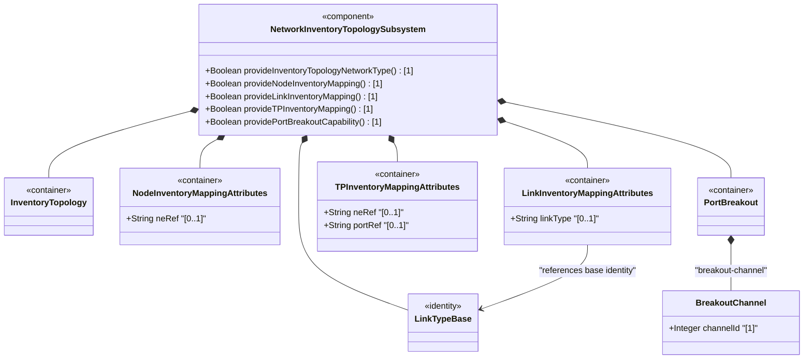
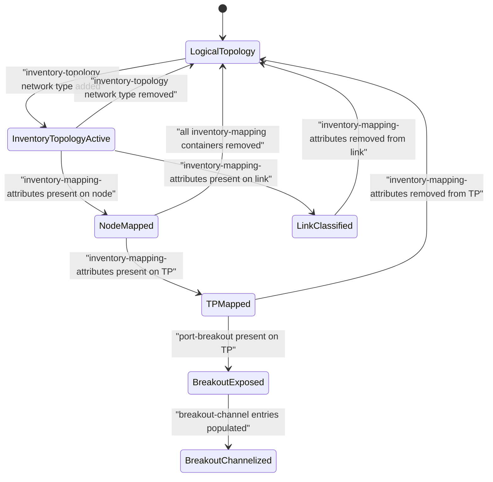

# Epic: ietf-network-inventory-topology: Network Inventory Topology Mapping

## 1. Context
This Epic covers the specification of the `ietf-network-inventory-topology` YANG module defined in draft-ietf-ivy-network-inventory-topology-08. This module extends the `ietf-network-topology` data model to map network topologies with network inventories. It introduces the "inventory-topology" network type as a presence-based discriminator, and defines augmentations on topology nodes, links, and termination points to correlate logical topology entities with physical inventory components — network elements (NEs), link media types, port components, and port breakout channel capabilities.

The module is designed to serve as the physical underlay layer, sitting beneath logical network topologies (Layer 2, Layer 3, TE). It provides the foundational mapping layer that other topology models (SAP, TE topology, L2 topology, etc.) can navigate downward through to locate physical resources. The module is a small functional module with 5 concrete augment containers: `inventory-topology`, three `inventory-mapping-attributes` containers (on nodes, links, and TPs), and `port-breakout`. It also defines an extensible `link-type` identity hierarchy for physical media classification.

**Parent Epics (Import Dependencies):**
- [Parent Epic: ietf-network-inventory](https://github.com/gintatkinson/3dgs-033/blob/main/docs/epics/epic-05-ietf-network-inventory.md)
- [ ] #67 - [ietf-network-inventory: Base Network Inventory Data Model](https://github.com/gintatkinson/3dgs-033/blob/main/docs/epics/epic-05-ietf-network-inventory.md) (imported module providing `nwi:ne-ref` typedef, `nwi:port-ref` grouping, `nwi:network-inventory` root container with network-elements and components lists — the target for all NE and port leafref mappings)
- **External Prerequisite**: [ietf-network-topology](https://www.rfc-editor.org/rfc/rfc8345) (augmented base module providing `nw:networks`, `nw:network`, `nw:network-types`, `nw:node`, `nt:link`, `nt:termination-point` structural hierarchy; the `nwit` module augments every major structural node in this hierarchy)

Epic scale: 5 Features, total leaf count across all augmented containers is approximately 4 leaves plus identity hierarchy — well within the small-module classification, mapping to exactly 1 Epic.

## 2. Requirements & Checklist
- [ ] #81 - [Define Inventory Topology Network Type](https://github.com/gintatkinson/3dgs-033/blob/main/docs/features/feat-25-inventory-topology-network-type.md) (presence container augmenting `/nw:networks/nw:network/nw:network-types` to identify inventory topology networks, serves as when-guard for all other augmentations, draft-ietf-ivy-network-inventory-topology Section 5)
- [ ] #82 - [Define Node Inventory Mapping Attributes](https://github.com/gintatkinson/3dgs-033/blob/main/docs/features/feat-26-node-inventory-mapping.md) (presence container augmenting `/nw:networks/nw:network/nw:node` with `ne-ref` leafref to map logical topology node to physical network element, establishing 1-to-1 mapping, draft-ietf-ivy-network-inventory-topology Section 5)
- [ ] #83 - [Define Link Inventory Media Classification](https://github.com/gintatkinson/3dgs-033/blob/main/docs/features/feat-27-link-inventory-media-classification.md) (presence container augmenting `/nw:networks/nw:network/nt:link` with `link-type` identityref and extensible identity hierarchy for physical media classification: copper, fiber, coax, microwave, wlan, unknown, leased-fiber, draft-ietf-ivy-network-inventory-topology Section 4.1)
- [ ] #84 - [Define Termination Point Inventory Mapping](https://github.com/gintatkinson/3dgs-033/blob/main/docs/features/feat-28-tp-inventory-mapping.md) (presence container augmenting `/nw:networks/nw:network/nw:node/nt:termination-point` with `nwi:port-ref` grouping providing `ne-ref` and `port-ref` leafrefs to map logical TP to physical port component, draft-ietf-ivy-network-inventory-topology Section 5)
- [ ] #85 - [Define Port Breakout Capability](https://github.com/gintatkinson/3dgs-033/blob/main/docs/features/feat-29-port-breakout-capability.md) (read-only presence container augmenting TP with `breakout-channel` list keyed by `channel-id` exposing hardware port partitioning capability — e.g., 400G to 4x100G breakout — independent of current trunk/breakout configuration, draft-ietf-ivy-network-inventory-topology Section 4.2)

### Associated Use Cases & User Stories

#### Associated Use Cases
- [ ] #95 - [Define Inventory Topology Network Type](https://github.com/gintatkinson/3dgs-033/blob/main/docs/use-cases/uc-17-define-inventory-topology-network-type.md) (Use Case for inventory-topology network type identity, Feature feat-25)
- [ ] #96 - [Map Topology Node to Network Element Inventory](https://github.com/gintatkinson/3dgs-033/blob/main/docs/use-cases/uc-18-map-node-to-network-element.md) (Use Case for node-to-NE inventory mapping, Feature feat-26)
- [ ] #97 - [Classify Link Media Type in Inventory Topology](https://github.com/gintatkinson/3dgs-033/blob/main/docs/use-cases/uc-19-classify-link-media-type.md) (Use Case for link media type classification, Feature feat-27)
- [ ] #98 - [Map Termination Point to Physical Port Component](https://github.com/gintatkinson/3dgs-033/blob/main/docs/use-cases/uc-20-map-termination-point-to-physical-port.md) (Use Case for TP-to-port mapping, Feature feat-28)
- [ ] #99 - [Expose Port Breakout Capability on Termination Point](https://github.com/gintatkinson/3dgs-033/blob/main/docs/use-cases/uc-21-expose-port-breakout-capability.md) (Use Case for port breakout capability, Feature feat-29)

#### Associated User Stories
- [ ] #87 - [Resolve Service Attachment Point to Physical Port via Inventory Topology](https://github.com/gintatkinson/3dgs-033/blob/main/docs/user-stories/us-36-resolve-sap-to-physical-port.md) (validates SAP-to-port resolution through topology-to-inventory chain, Features feat-26 and feat-28)
- [ ] #88 - [Navigate Multi-Layer Network Topology to Underlying Physical Inventory](https://github.com/gintatkinson/3dgs-033/blob/main/docs/user-stories/us-37-multilayer-topology-to-inventory-navigation.md) (validates multi-layer topology-inventory navigation, Features feat-25 and feat-26)
- [ ] #89 - [Execute What-If Scenario Analysis Using Topology-to-Inventory Mapping](https://github.com/gintatkinson/3dgs-033/blob/main/docs/user-stories/us-38-whatif-scenario-analysis.md) (validates what-if scenario analysis, Features feat-26 and feat-28)
- [ ] #90 - [Configure Manual Inventory-Topology Mapping for Undiscovered Resources](https://github.com/gintatkinson/3dgs-033/blob/main/docs/user-stories/us-39-manual-inventory-topology-mapping.md) (validates manual mapping for undiscovered resources, Feature feat-26)
- [ ] #91 - [Classify Link Media Type with Distinct Unknown-Versus-Unassessed Semantics](https://github.com/gintatkinson/3dgs-033/blob/main/docs/user-stories/us-40-link-type-unknown-vs-unassessed.md) (validates unknown vs unassessed link media semantics, Feature feat-27)
- [ ] #92 - [Configure Port as Trunk or Breakout from Breakout-Capable Hardware](https://github.com/gintatkinson/3dgs-033/blob/main/docs/user-stories/us-41-trunk-breakout-port-reconfiguration.md) (validates trunk/breakout configuration, Feature feat-29)
- [ ] #93 - [Enforce Breakout-Channel Exclusive Assignment Constraint](https://github.com/gintatkinson/3dgs-033/blob/main/docs/user-stories/us-42-breakout-channel-exclusive-assignment.md) (validates breakout-channel exclusivity constraint, Feature feat-29)
- [ ] #94 - [Validate Chained Leafref Referential Integrity from TP to Port Component](https://github.com/gintatkinson/3dgs-033/blob/main/docs/user-stories/us-43-chained-leafref-referential-integrity.md) (validates chained leafref integrity TP-to-port, Features feat-28 and feat-26)

## 3. Architecture

### Subsystem Component Definition
The `ietf-network-inventory-topology` module is a **Network Inventory Topology Mapping Subsystem** that bridges the logical topology layer with the physical inventory layer (ietf-network-inventory). It provides read-write (`config true`) mapping containers on network types, nodes, links, and termination points, plus a read-only (`config false`) hardware capability container for port breakout. The subsystem consumes the `ietf-network-inventory` module for NE/port reference types and groupings, and augments the `ietf-network-topology` hierarchy at every structural level. All augmentations are guarded by the `when '../nw:network-types/nwit:inventory-topology'` condition, creating a clean separation between purely logical topologies and physical inventory-mapped topologies.

```mermaid
classDiagram
    class NetworkInventoryTopologySubsystem {
        <<component>>
        +Boolean provideInventoryTopologyNetworkType() [1]
        +Boolean provideNodeInventoryMapping() [1]
        +Boolean provideLinkInventoryMapping() [1]
        +Boolean provideTPInventoryMapping() [1]
        +Boolean providePortBreakoutCapability() [1]
    }
    class Networks {
    }
    class Network {
    }
    class Node {
    }
    class Link {
    }
    class TerminationPoint {
    }
    class InventoryTopology {
        <<container>>
    }
    class NodeInventoryMappingAttributes {
        <<container>>
        +String neRef "[0..1]"
    }
    class LinkInventoryMappingAttributes {
        <<container>>
        +String linkType "[0..1]"
    }
    class TPInventoryMappingAttributes {
        <<container>>
        +String neRef "[0..1]"
        +String portRef "[0..1]"
    }
    class PortBreakout {
        <<container>>
    }
    class BreakoutChannel {
        +Integer channelId "[1]"
    }
    class LinkTypeBase {
        <<identity>>
    }
    Networks *-- Network
    Network *-- Node
    Network *-- Link
    Node *-- TerminationPoint
    NetworkInventoryTopologySubsystem *-- InventoryTopology : "augments network-types"
    NetworkInventoryTopologySubsystem *-- NodeInventoryMappingAttributes : "augments nw:node"
    NetworkInventoryTopologySubsystem *-- LinkInventoryMappingAttributes : "augments nt:link"
    NetworkInventoryTopologySubsystem *-- TPInventoryMappingAttributes : "augments nt:termination-point"
    NetworkInventoryTopologySubsystem *-- PortBreakout : "augments nt:termination-point"
    NetworkInventoryTopologySubsystem *-- LinkTypeBase : "defines identity hierarchy"
    Node *-- NodeInventoryMappingAttributes : "extended with"
    Link *-- LinkInventoryMappingAttributes : "extended with"
    TerminationPoint *-- TPInventoryMappingAttributes : "extended with"
    TerminationPoint *-- PortBreakout : "extended with"
    PortBreakout *-- BreakoutChannel : "breakout-channel"
    LinkInventoryMappingAttributes --> LinkTypeBase : "references base identity"
    note for NetworkInventoryTopologySubsystem "All augmentations guarded by when condition checking inventory-topology network type. Imports ietf-network-inventory (Epic 67) for ne-ref, port-ref. Augments ietf-network-topology (external prerequisite)."
```

### System-Level UML Class Diagram


## State Machine Definitions

## System State Machine Diagram


## 4. Operational Considerations
This module enables a network controller to report discovered network topology and inventory information. Automatic discovery serves as the primary mechanism for populating the mapping containers, with selective manual configuration provided for scenarios where discovery is not feasible — CPE outside the operator's management domain, leased lines and third-party transport resources, and planned or hypothetical resources for future deployment.

The `inventory-mapping-attributes` containers are defined as read-write (`config true`) to accommodate manual configuration, while `port-breakout` is read-only (`config false`) as it represents hardware-determined state. Operators should ensure leafref integrity between topology mapping references and the base network inventory — dangling references indicate stale or inconsistent data.

For deployment scenarios, this module sits at the physical underlay layer. It does not replace or conflict with overlay topology models; rather, it provides the downward navigation path from overlay (Layer 2, Layer 3, TE, SAP) to physical resources. The `when` guard mechanism ensures clean separation: purely logical topologies carry no inventory mapping overhead, while physical underlay networks expose full inventory correlation.

## 5. Security & Governance
All writable data nodes (`inventory-mapping-attributes` containers and their leaves) are sensitive as they establish the mapping between logical topology and physical inventory. Unauthorized modification could lead to incorrect resource allocation or service disruption. Access control should be applied via NACM to restrict write operations to authorized operators.

The `ne-ref` and `port-ref` leafrefs expose network infrastructure details — readable data nodes should have controlled read access to prevent unauthorized infrastructure reconnaissance. The `port-breakout` container exposes hardware capabilities which, while read-only, reveal port partitioning capacity that could inform targeted resource exhaustion attacks.

The `link-type` classification, while not inherently sensitive, reveals physical media deployment patterns. In sensitive network environments, all topology data should be protected by secure transport with mutual authentication as described in Section 7 of draft-ietf-ivy-network-inventory-topology-08.

## Specification Context
From draft-ietf-ivy-network-inventory-topology-08, Section 1 (Introduction):

> "[I-D.ietf-ivy-network-inventory-yang] defines the base network inventory model to aggregate the inventory data of Network Elements (NEs). This data includes identification of these NEs and their hardware, firmware, and software components. In order to ease navigation between inventory and network topologies, this document extends the network topology data model for network inventory mapping: 'ietf-network-inventory-topology' (Section 5)."

> "Similar to the base inventory data model, the network inventory topology does not make any assumption about involved NEs and their roles in topologies. As such, the mapping data model can be applied independent of the network type (optical local loops, access network, core network, etc.) and application."

> "Therefore, this YANG data model can be used to represent a physical network instance at the lowest underlay abstraction level."

From draft-ietf-ivy-network-inventory-topology-08, Section 4 (Module Tree Structure):

> "The module augments the 'ietf-network-topology' module as follows: Inventory mapping attributes for nodes, and termination points: The corresponding containers augments the topology module with the references to the base network inventory."

From the YANG module description statement:

> "This YANG module defines a YANG module for network topology and inventory mapping."

## 6. Source References
Structural Schema: [ietf-network-inventory-topology.yang](https://github.com/gintatkinson/3dgs-033/blob/main/yang/ietf-network-inventory-topology.yang) (entire module, 269 lines)
Normative Specification: [draft-ietf-ivy-network-inventory-topology-08](https://datatracker.ietf.org/doc/html/draft-ietf-ivy-network-inventory-topology) (Sections 1-8, Appendices A-B)
