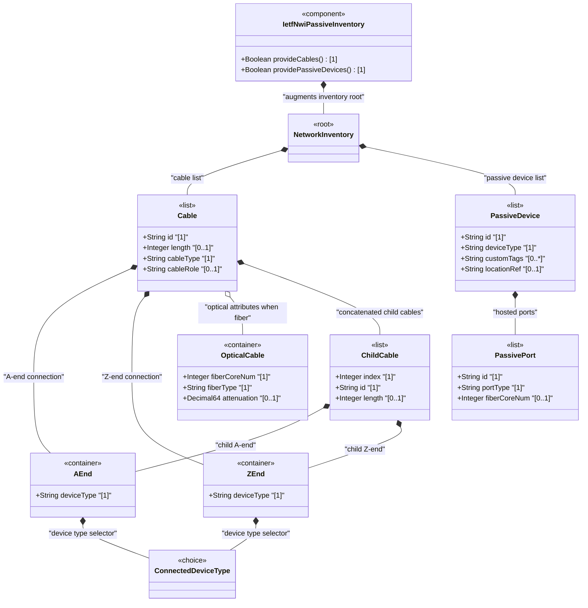
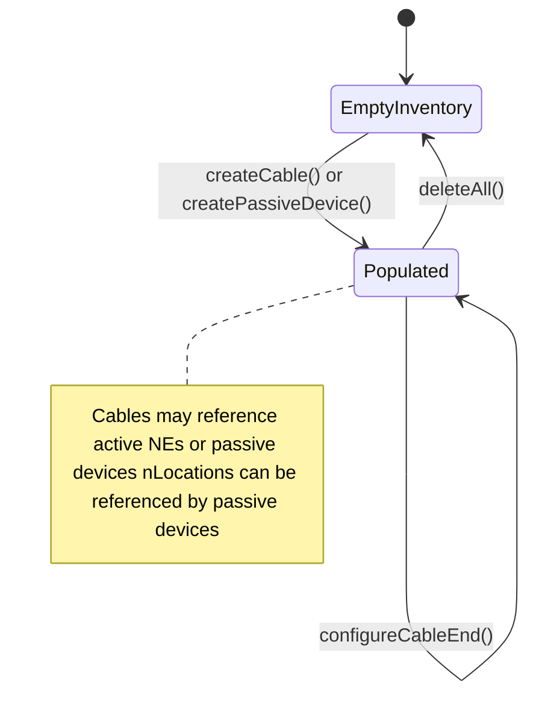

# Epic: ietf-nwi-passive-inventory: Passive Network Inventory Data Model

## 1. Context
This Epic covers the specification of the `ietf-nwi-passive-inventory` YANG module defined in draft-ygb-ivy-passive-network-inventory-05. This module augments the base `ietf-network-inventory` model (Epic #67) with passive network infrastructure information, including cables (optical fiber, electrical, coaxial), concatenated child cable segments, passive devices (optical distribution frames, wavelength division multiplexers, fiber access/distribution terminals, access terminal boxes), and their associated ports. The module is read-only operational state data (`config false`) and supports topological modeling of non-powered, non-communicating infrastructure deployed between and within actively managed network elements.

The module defines six identity hierarchies: `fiber-type` (G.652, G.653, G.654, G.655, G.656, G.657 standards), `cable-type` (optical-fiber, electrical-cable, coaxial-cable), `cable-role` (backbone, aggregation, access, trunk, distribution, branch), `passive-port-type` (service-port, input-port, output-port, p2mp-port), `connected-device-type` (passive-device, active-device), and `passive-device-type` (ODF, WDM, FAT, FDT, ATB). It also defines nine reusable groupings for cable attributes, connection endpoints, passive device attributes, and port specifications.

This is a **foundational passive infrastructure module** augmenting the base network inventory model at `/nwi:network-inventory`.

**Parent Epics:** [Parent Epic: ietf-network-inventory](https://github.com/gintatkinson/3dgs-033/blob/main/docs/epics/epic-05-ietf-network-inventory.md)
- [ ] #67 - [ietf-network-inventory: Base Network Inventory Data Model](https://github.com/gintatkinson/3dgs-033/blob/main/docs/epics/epic-05-ietf-network-inventory.md) (imported base module augmented via `/nwi:network-inventory`, draft-ietf-ivy-network-inventory-yang)
- [ ] #49 - [ietf-ni-location: Network Inventory Location](https://github.com/gintatkinson/3dgs-033/blob/main/docs/epics/epic-04-ietf-ni-location.md) (imported module providing `nil:ni-location-ref` typedef for passive device location referencing, draft-ietf-ivy-network-inventory-location)

## 2. Requirements & Checklist
- [ ] #100 - [Define Cable Entity](https://github.com/gintatkinson/3dgs-033/blob/main/docs/features/feat-30-cable-entity.md) (YANG list node defining cables keyed by id with type, role, and length attributes, grouping cables, lines 438-448)
- [ ] #101 - [Define Cable A-End Connection](https://github.com/gintatkinson/3dgs-033/blob/main/docs/features/feat-31-cable-a-end-connection.md) (YANG container node for A-end device connection reference, grouping connected-device-ref, lines 333-346)
- [ ] #102 - [Define Cable Z-End Connection](https://github.com/gintatkinson/3dgs-033/blob/main/docs/features/feat-32-cable-z-end-connection.md) (YANG container node for Z-end device connection reference, grouping connected-device-ref, lines 333-346)
- [ ] #103 - [Define Connected Device Type Selector](https://github.com/gintatkinson/3dgs-033/blob/main/docs/features/feat-33-connected-device-type-selector.md) (YANG choice node selecting passive/active device reference with must-constrained cases, grouping connected-device-end, lines 283-331)
- [ ] #104 - [Define Optical Cable Attributes](https://github.com/gintatkinson/3dgs-033/blob/main/docs/features/feat-34-optical-cable-attributes.md) (YANG container node for fiber-specific attributes conditionally attached to optical-fiber cables, grouping optical-cable-attributes, lines 366-395)
- [ ] #105 - [Define Child Cables](https://github.com/gintatkinson/3dgs-033/blob/main/docs/features/feat-35-child-cables.md) (YANG list node for concatenated child cable segments with min-elements 2, grouping child-cables, lines 419-436)
- [ ] #106 - [Define Passive Device Entity](https://github.com/gintatkinson/3dgs-033/blob/main/docs/features/feat-36-passive-device-entity.md) (YANG list node defining passive devices with type classification, location reference, and custom tags, grouping passive-devices, lines 478-511)
- [ ] #107 - [Define Passive Port](https://github.com/gintatkinson/3dgs-033/blob/main/docs/features/feat-37-passive-port.md) (YANG list node for ports hosted on passive devices with type classification and fiber core count, grouping passive-device-ports, lines 450-476)

### Associated Use Cases & User Stories

#### Associated Use Cases
- [ ] #117 - [Manage Cable Inventory](https://github.com/gintatkinson/3dgs-033/blob/main/docs/use-cases/uc-22-manage-cable-inventory.md) (Use Case for cable entity lifecycle management, Feature feat-30)
- [ ] #121 - [Configure Cable A-End Connection](https://github.com/gintatkinson/3dgs-033/blob/main/docs/use-cases/uc-23-configure-cable-aend-connection.md) (Use Case for A-end connection configuration, Feature feat-31)
- [ ] #122 - [Configure Cable Z-End Connection](https://github.com/gintatkinson/3dgs-033/blob/main/docs/use-cases/uc-24-configure-cable-zend-connection.md) (Use Case for Z-end connection configuration, Feature feat-32)
- [ ] #118 - [Select Connected Device Type](https://github.com/gintatkinson/3dgs-033/blob/main/docs/use-cases/uc-25-select-connected-device-type.md) (Use Case for device type choice selection, Feature feat-33)
- [ ] #123 - [Configure Optical Cable Attributes](https://github.com/gintatkinson/3dgs-033/blob/main/docs/use-cases/uc-26-configure-optical-cable-attributes.md) (Use Case for optical cable attribute configuration, Feature feat-34)
- [ ] #119 - [Manage Child Cable Concatenation](https://github.com/gintatkinson/3dgs-033/blob/main/docs/use-cases/uc-27-manage-child-cable-concatenation.md) (Use Case for child cable concatenation management, Feature feat-35)
- [ ] #116 - [Manage Passive Device Inventory](https://github.com/gintatkinson/3dgs-033/blob/main/docs/use-cases/uc-28-manage-passive-device-inventory.md) (Use Case for passive device inventory management, Feature feat-36)
- [ ] #120 - [Manage Passive Port Configuration](https://github.com/gintatkinson/3dgs-033/blob/main/docs/use-cases/uc-29-manage-passive-port-configuration.md) (Use Case for passive port configuration, Feature feat-37)

#### Associated User Stories
- [ ] #109 - [Concatenate Child Cable Segments into Ordered Composite Cable](https://github.com/gintatkinson/3dgs-033/blob/main/docs/user-stories/us-44-concatenate-child-cables.md) (validates child cable concatenation ordering, Feature feat-35)
- [ ] #110 - [Resolve Cascading Leafref Path for Active Device Component Reference](https://github.com/gintatkinson/3dgs-033/blob/main/docs/user-stories/us-45-resolve-active-device-component-leafref.md) (validates cascading leafref resolution, Features feat-31 and feat-32)
- [ ] #111 - [Connect Cable End to Passive Device by Device Identifier](https://github.com/gintatkinson/3dgs-033/blob/main/docs/user-stories/us-46-connect-cable-end-to-passive-device.md) (validates cable-to-passive-device connection, Features feat-31 and feat-36)
- [ ] #112 - [Conditionally Activate Optical Cable Attributes Based on Cable Type](https://github.com/gintatkinson/3dgs-033/blob/main/docs/user-stories/us-47-conditionally-activate-optical-cable-attributes.md) (validates when-expression for optical attributes, Feature feat-34)
- [ ] #113 - [Cross-Validate Connected Device Type with Choice Case Selection](https://github.com/gintatkinson/3dgs-033/blob/main/docs/user-stories/us-48-cross-validate-device-type-choice-consistency.md) (validates must-expression cross-validation, Feature feat-33)
- [ ] #114 - [Model PON ODN Feeder-Distribution-Drop Cable Topology](https://github.com/gintatkinson/3dgs-033/blob/main/docs/user-stories/us-49-model-pon-odn-feeder-distribution-drop-topology.md) (validates PON ODN topology modeling, Feature feat-30)
- [ ] #115 - [Inventory Passive Device with Identification Tags and Location Reference](https://github.com/gintatkinson/3dgs-033/blob/main/docs/user-stories/us-50-inventory-passive-device-location-tags.md) (validates passive device location and tag inventory, Feature feat-36)

## 3. Architecture

### Subsystem Component Definition
The `ietf-nwi-passive-inventory` module is a **Passive Network Inventory Subsystem** that extends the base network inventory model with structured passive infrastructure data. It provides read-only operational state containers for cables (guiding media) and passive devices. The subsystem augments `/nwi:network-inventory` with two top-level groupings: `cables` (list of cable entities) and `passive-devices` (list of passive device entities). It consumes the `ietf-ni-location` module for passive device-to-location referencing via the `ni-location-ref` typedef.

The subsystem exports a single augment point at `/nwi:network-inventory` and defines reusable groupings for cable attributes (`cable-attributes`, `common-cable-attributes`, `optical-cable-attributes`), connection endpoint references (`connected-device-ref`, `connected-device-end`), child cable concatenation (`child-cables`), passive device attributes (`passive-devices`), and port specifications (`passive-device-ports`).

### System-Level UML Class Diagram

## State Machine Definitions

### System State Machine Diagram

## 4. Operational Considerations
The passive inventory model is read-only operational state data (`config false`) representing externally discovered or manually inventoried infrastructure. Passive devices are not discoverable by network management protocols — their data must be populated through external inventory systems, manual provisioning interfaces, or bulk import mechanisms. Cables form the physical topology backbone connecting network elements across geographic sites. Child cable concatenation supports modeling of composite cables that span multiple infrastructure segments (e.g., joint boxes, splice points).

Location references on passive devices require the `ietf-ni-location` module (Epic #49) to be deployed for referential integrity. The `ne-ref` and `component-ref` leafrefs within active device connections require the `ietf-network-inventory` module (Epic #67) to be deployed with existing network element and component data.

## 5. Security & Governance
All data nodes are read-only operational state (`config false`). Write access to the underlying datastore must be controlled through the NETCONF access control model (RFC 8341) or equivalent authorization frameworks. Passive device identifiers, custom tags (e.g., RFID, QR codes), and location references may expose sensitive physical infrastructure deployment information. Access to cable topology (a-end, z-end connections) reveals network connectivity paths that may be considered operationally sensitive. Read access should be restricted to authorized inventory management personnel and network planning systems.

The YANG module inherits security considerations from the NETCONF/RESTCONF transport layers (SSH/TLS) and the access control model defined in RFC 8341.

## Specification Context
From draft-ygb-ivy-passive-network-inventory-05, Section 5 (YANG Model Overview):

> "The YANG data model in this draft augments the model defined in [I-D.ietf-ivy-network-inventory-yang] with the following information:
> * Passive devices: a list of passive devices with extended attributed reported by the domain controller.
> * Cables: a list of cables with each containing an optional list of child cables."

From Section 1 (Introduction):

> "Passive infrastructure refers to the underlying infrastructure of a telecommunication network that is not actively detectable or manageable. It typically includes non-powered, non-communicating devices and components, such as cabinets, cables, connectors, splitters, antennas, distribution frames, etc., that are either hosted within an actively managed device or deployed along the physical pathway between active devices."

## 6. Source References
Structural Schema: [ietf-nwi-passive-inventory.yang](https://github.com/gintatkinson/3dgs-033/blob/main/yang/ietf-nwi-passive-inventory.yang) (Full module, 522 lines)
Normative Specification: [draft-ygb-ivy-passive-network-inventory-05](https://datatracker.ietf.org/doc/draft-ygb-ivy-passive-network-inventory/) (Clause: Sections 1-6)
