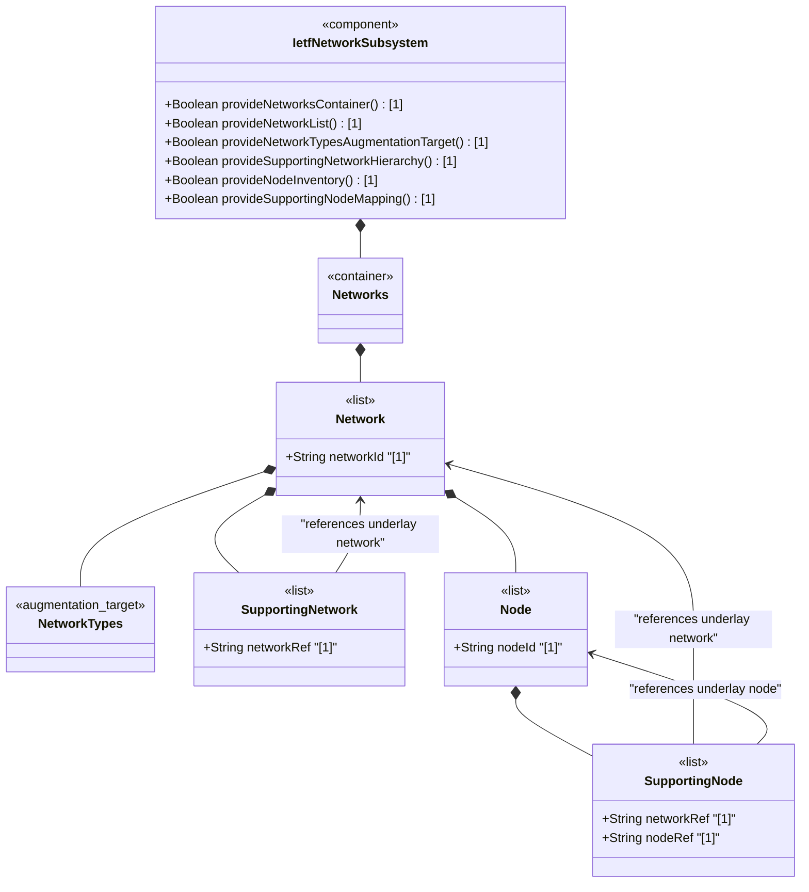
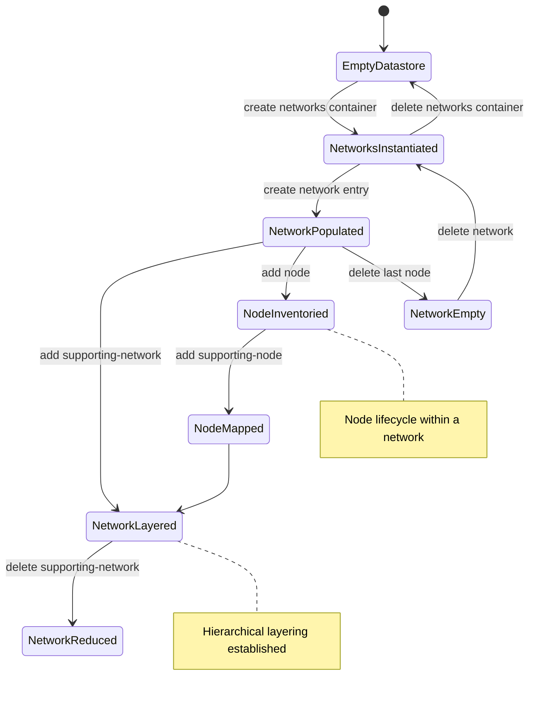

# Epic: ietf-network: Base Network Data Model

## 1. Context
This Epic covers the specification of the `ietf-network` YANG module defined in the IETF Network Topologies YANG Data Model specification. This is the foundational abstract (base) network data model that defines a common base for representing networks, their node inventories, and hierarchical network layering (network stacks). The module establishes the core abstraction: networks contain nodes; networks can be layered on top of supporting (underlay) networks; nodes can be mapped to supporting nodes in underlay networks.

The module defines two custom typedefs (`node-id` and `network-id`, both based on `inet:uri`), two reusable groupings (`network-ref` and `node-ref`), and the primary data tree rooted at the `networks` container with `network` list entries. The `network-types` container serves as an augmentation target for technology-specific network type classification.

This is the **base network module** upon which `ietf-network-topology` augments topology information (links, termination points). All technology-specific topology and inventory models ultimately build on this abstraction layer.

**Parent Epics:**
- [ ] #12 - [ietf-inet-types: Internet Protocol Suite Data Types](https://github.com/gintatkinson/3dgs-033/blob/main/docs/epics/epic-02-ietf-inet-types.md) (imported module providing `inet:uri` typedef used for node-id and network-id, RFC 6991)
- [ ] #11 - [ietf-yang-types: Core YANG Data Types](https://github.com/gintatkinson/3dgs-033/blob/main/docs/epics/epic-01-ietf-yang-types.md) (transitive import dependency via ietf-inet-types)

## 2. Requirements & Checklist
- [ ] #126 - [Define Networks Root Container](https://github.com/gintatkinson/3dgs-033/blob/main/docs/features/feat-38-networks-container.md) (YANG container nw:networks, top-level root for the network list, lines 119-121)
- [ ] #127 - [Define Network List Entry](https://github.com/gintatkinson/3dgs-033/blob/main/docs/features/feat-39-network-list.md) (YANG list nw:network keyed by network-id, contains network-types, supporting-network, and node children, lines 122-153)
- [ ] #128 - [Define Network Types Container](https://github.com/gintatkinson/3dgs-033/blob/main/docs/features/feat-40-network-types.md) (YANG container nw:network-types, augmentation target for network type classification, lines 134-139)
- [ ] #129 - [Define Supporting Network List](https://github.com/gintatkinson/3dgs-033/blob/main/docs/features/feat-41-supporting-network-list.md) (YANG list nw:supporting-network keyed by network-ref, underlay network layering hierarchy, lines 140-153)
- [ ] #130 - [Define Node List](https://github.com/gintatkinson/3dgs-033/blob/main/docs/features/feat-42-node-list.md) (YANG list nw:node keyed by node-id, inventory of nodes within a network, lines 155-164)
- [ ] #131 - [Define Supporting Node List](https://github.com/gintatkinson/3dgs-033/blob/main/docs/features/feat-43-supporting-node-list.md) (YANG list nw:supporting-node keyed by network-ref and node-ref, underlay node mapping hierarchy, lines 165-188)

### Associated Use Cases & User Stories

#### Associated Use Cases
- [ ] #147 - [Manage Networks Root Container Lifecycle](https://github.com/gintatkinson/3dgs-033/blob/main/docs/use-cases/uc-30-manage-networks-root-container.md) (Use Case for the networks root container, Feature feat-38)
- [ ] #148 - [Manage Network List Entry Lifecycle](https://github.com/gintatkinson/3dgs-033/blob/main/docs/use-cases/uc-31-manage-network-list-lifecycle.md) (Use Case for network list entry management, Feature feat-39)
- [ ] #149 - [Classify Network Instance by Topology Type](https://github.com/gintatkinson/3dgs-033/blob/main/docs/use-cases/uc-32-classify-network-by-type.md) (Use Case for network-types classification, Feature feat-40)
- [ ] #150 - [Configure Network Layering via Supporting-Network Chain](https://github.com/gintatkinson/3dgs-033/blob/main/docs/use-cases/uc-33-configure-network-layering.md) (Use Case for supporting-network layering, Feature feat-41)
- [ ] #151 - [Manage Node Inventory Within a Network](https://github.com/gintatkinson/3dgs-033/blob/main/docs/use-cases/uc-34-manage-node-inventory.md) (Use Case for node list management, Feature feat-42)
- [ ] #152 - [Map Node to Supporting Nodes Across Network Layers](https://github.com/gintatkinson/3dgs-033/blob/main/docs/use-cases/uc-35-map-node-to-supporting-nodes.md) (Use Case for supporting-node mappings, Feature feat-43)
- [ ] #153 - [Manage Topology Link Lifecycle](https://github.com/gintatkinson/3dgs-033/blob/main/docs/use-cases/uc-36-manage-topology-link.md) (Use Case for topology link management, Feature feat-44)
- [ ] #154 - [Configure Link Source Endpoint](https://github.com/gintatkinson/3dgs-033/blob/main/docs/use-cases/uc-37-configure-link-source.md) (Use Case for link source configuration, Feature feat-45)
- [ ] #155 - [Configure Link Destination Endpoint](https://github.com/gintatkinson/3dgs-033/blob/main/docs/use-cases/uc-38-configure-link-destination.md) (Use Case for link destination configuration, Feature feat-46)
- [ ] #156 - [Map Overlay Link to Supporting Underlay Link Chain](https://github.com/gintatkinson/3dgs-033/blob/main/docs/use-cases/uc-39-map-overlay-link-to-underlay-chain.md) (Use Case for supporting-link chain mapping, Feature feat-47)
- [ ] #157 - [Manage Termination Point Lifecycle on a Node](https://github.com/gintatkinson/3dgs-033/blob/main/docs/use-cases/uc-40-manage-termination-points.md) (Use Case for termination-point management, Feature feat-48)
- [ ] #158 - [Resolve Supporting Termination Point Underlay Mappings](https://github.com/gintatkinson/3dgs-033/blob/main/docs/use-cases/uc-41-resolve-supporting-tp-mappings.md) (Use Case for supporting-tp resolution, Feature feat-49)

#### Associated User Stories
- [ ] #138 - [Configure Underlay-Overlay Network Stacking via Supporting-Network Chain](https://github.com/gintatkinson/3dgs-033/blob/main/docs/user-stories/us-51-configure-underlay-overlay-network-layering.md) (validates supporting-network chain for underlay-overlay layering, Features feat-39 and feat-41)
- [ ] #139 - [Map Overlay Nodes to Supporting Nodes Across Layered Networks](https://github.com/gintatkinson/3dgs-033/blob/main/docs/user-stories/us-52-map-overlay-nodes-to-supporting-underlay-nodes.md) (validates node-to-supporting-node mapping across layers, Features feat-42 and feat-43)
- [ ] #140 - [Map Overlay Links to Supporting Links Across Layered Topologies](https://github.com/gintatkinson/3dgs-033/blob/main/docs/user-stories/us-53-map-overlay-links-to-supporting-underlay-links.md) (validates link-to-supporting-link mapping across topologies, Features feat-44 and feat-47)
- [ ] #141 - [Resolve Supporting Termination Point Mappings via Transitive Closure](https://github.com/gintatkinson/3dgs-033/blob/main/docs/user-stories/us-54-resolve-supporting-termination-point-via-transitive-closure.md) (validates transitive closure of supporting-TP chain, Features feat-48 and feat-49)
- [ ] #142 - [Reconcile Overlay Topology When Underlay Network Is Deleted](https://github.com/gintatkinson/3dgs-033/blob/main/docs/user-stories/us-55-reconcile-overlay-topology-on-underlay-network-deletion.md) (validates overlay reconciliation on underlay network deletion, Features feat-39 and feat-41)
- [ ] #143 - [Reconcile Overlay Topology When Underlay Nodes or Links Change](https://github.com/gintatkinson/3dgs-033/blob/main/docs/user-stories/us-56-reconcile-overlay-topology-on-underlay-entity-churn.md) (validates overlay reconciliation on underlay entity churn, Features feat-42 and feat-44)
- [ ] #145 - [Classify Network by Type for Conditional Augmentation Dispatch](https://github.com/gintatkinson/3dgs-033/blob/main/docs/user-stories/us-58-classify-network-by-type-for-conditional-augmentation.md) (validates network-type-based conditional augmentation, Feature feat-40)
- [ ] #146 - [Compose Multi-Domain Topology with Shared Devices Across Networks](https://github.com/gintatkinson/3dgs-033/blob/main/docs/user-stories/us-59-compose-multi-domain-topology-with-shared-devices.md) (validates multi-domain topology composition, Features feat-39)

## 3. Architecture

### Subsystem Component Definition
The `ietf-network` module is the **Abstract Network Subsystem** that defines the foundational data model for network representation. It provides read-write (`config true`) containers for networks and nodes with hierarchical layering through supporting-network and supporting-node lists. The subsystem exports its data tree at `/nw:networks` and defines reusable groupings for cross-module referencing (`network-ref`, `node-ref`). It consumes the `ietf-inet-types` module for the `inet:uri` typedef used in its custom `network-id` and `node-id` types.

The subsystem is designed to be augmented by topology modules (adding links and termination points), inventory modules (adding device-specific node attributes), and technology-specific modules (adding network-type classifications and type-specific attributes).

### System-Level UML Class Diagram

## State Machine Definitions

### System State Machine Diagram

## 4. Operational Considerations
The `ietf-network` module is designated as `config true` — all data is configuration data in the YANG schema. However, the distinction between configured (client-created) and system-controlled (discovered) data is provided through the NMDA datastores [RFC 8342]. Network data that is discovered is automatically populated as part of the operational state datastore (`<operational>`). Configured network data resides in the intended datastore (`<intended>`) and, when effective, is also reflected in the operational state datastore.

The use of `require-instance false` on all leafref paths means that dangling references (e.g., a supporting-network referencing a deleted underlay network) are tolerated in the intended datastore but excluded from the operational state datastore. Applications maintaining overlay networks must handle churn in underlay networks by monitoring operational state changes and updating references accordingly.

The module is designed for implementation as part of the ephemeral datastore, enabling configured overlay topologies to refer to discovered underlay topologies while maintaining referential integrity boundaries.

## 5. Security & Governance
- All data nodes are `config true` — write access to network topology data MUST be restricted to authorized management applications
- The `network-id` and `node-id` values are URIs that MAY contain sensitive organizational or topological information — access control SHOULD consider data sensitivity
- Supporting-network and supporting-node relationships expose cross-network dependencies that MAY reveal layering information across security domains — access control at the network level SHOULD restrict visibility of underlay dependencies
- Deletion of a network causes cascading removal of all child nodes, supporting-network entries, and augmented topology data — authorized clients MUST be aware of the blast radius
- Referential integrity violations (dangling leafrefs) result in automatic exclusion from operational state — applications SHOULD monitor for and resolve such conditions

## Specification Context
From the IETF Network Topologies YANG Data Model specification, Section 1 (Introduction):

"This document introduces an abstract (base) YANG data model to represent networks and topologies. The data model is divided into two parts: The first part of the data model defines a network data model that enables the definition of network hierarchies, or network stacks (i.e., networks that are layered on top of each other) and maintenance of an inventory of nodes contained in a network."

"The data model can be augmented to describe the specifics of particular types of networks and topologies. For example, an augmenting data model can provide network node information with attributes that are specific to a particular network type."

From the IETF Network Topologies YANG Data Model specification, Section 4.1 (Base Network Model):

"The abstract (base) network data model is defined in the 'ietf-network' module. Its structure is shown in Figure 4."

"Network data of a network at a particular layer can come into being in one of two ways: (1) the network data is configured by client applications -- for example, in the case of overlay networks that are configured by an SDN Controller application, or (2) the network data is automatically controlled by the system, in the case of networks that can be discovered. It is possible for a configured (overlay) network to refer to a (discovered) underlay network."

## 6. Source References
Structural Schema: [ietf-network@2018-02-26.yang](https://github.com/gintatkinson/3dgs-033/blob/main/standard/ietf/RFC/ietf-network%402018-02-26.yang) (Clause: 6.1)
Normative Specification: [the IETF Network Topologies YANG Data Model specification](https://datatracker.ietf.org/doc/rfc8345/) (Clause: 4.1)
