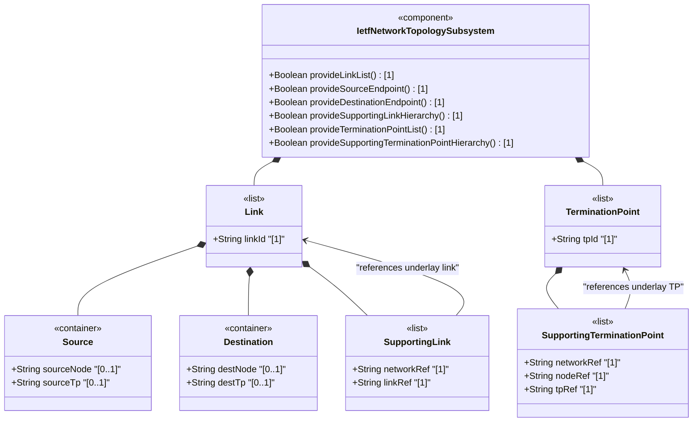
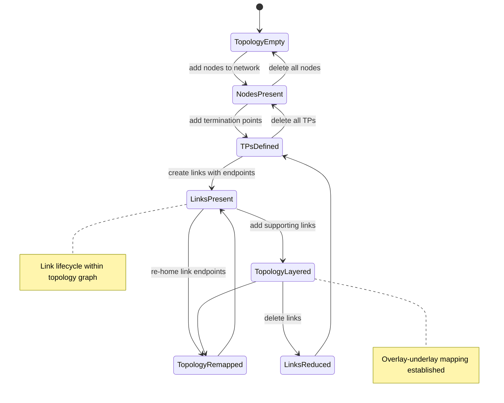

# Epic: ietf-network-topology: Base Network Topology Augmentation

## 1. Context
This Epic covers the specification of the `ietf-network-topology` YANG module defined in the IETF Network Topologies YANG Data Model specification. This module augments the base `ietf-network` data model with topology-specific information: links that connect nodes (graph edges) and termination points that anchor links on nodes. Together with the base network model, this forms a complete graph representation of network topology.

The module defines two custom typedefs (`link-id` and `tp-id`, both based on `inet:uri`), two reusable groupings for cross-module referencing (`link-ref` and `tp-ref`), and two augmentation targets: links augmented into the `network` list, and termination points augmented into the `node` list. Links are point-to-point and unidirectional, with source and destination endpoint containers. Both links and termination points support hierarchical layering through supporting-link and supporting-termination-point lists.

This is the **base topology augumentation module** that all technology-specific topology data models extend. For example, Layer 2 topology models, Layer 3 IGP topology models, and traffic engineering topology models all augment the link and termination-point lists with type-specific attributes.

**Parent Epics:**
- [ ] #124 - [ietf-network: Base Network Data Model](https://github.com/gintatkinson/3dgs-033/blob/main/docs/epics/epic-08-ietf-network.md) (imported base module defining networks and nodes that this module augments, the IETF Network Topologies YANG Data Model specification)
- [ ] #12 - [ietf-inet-types: Internet Protocol Suite Data Types](https://github.com/gintatkinson/3dgs-033/blob/main/docs/epics/epic-02-ietf-inet-types.md) (imported module providing `inet:uri` typedef used for link-id and tp-id, RFC 6991)
- [ ] #11 - [ietf-yang-types: Core YANG Data Types](https://github.com/gintatkinson/3dgs-033/blob/main/docs/epics/epic-01-ietf-yang-types.md) (transitive import dependency via ietf-inet-types)

## 2. Requirements & Checklist
- [ ] #132 - [Define Link List](https://github.com/gintatkinson/3dgs-033/blob/main/docs/features/feat-44-link-list.md) (YANG list nt:link keyed by link-id, point-to-point unidirectional topology edges augmented into network, lines 136-233)
- [ ] #133 - [Define Link Source Container](https://github.com/gintatkinson/3dgs-033/blob/main/docs/features/feat-45-link-source.md) (YANG container nt:source holding source-node and source-tp leafrefs, lines 157-179)
- [ ] #134 - [Define Link Destination Container](https://github.com/gintatkinson/3dgs-033/blob/main/docs/features/feat-46-link-destination.md) (YANG container nt:destination holding dest-node and dest-tp leafrefs, lines 181-204)
- [ ] #135 - [Define Supporting Link List](https://github.com/gintatkinson/3dgs-033/blob/main/docs/features/feat-47-supporting-link-list.md) (YANG list nt:supporting-link keyed by network-ref and link-ref, underlay link dependencies, lines 205-231)
- [ ] #136 - [Define Termination Point List](https://github.com/gintatkinson/3dgs-033/blob/main/docs/features/feat-48-termination-point-list.md) (YANG list nt:termination-point keyed by tp-id, link anchoring points augmented into node, lines 234-293)
- [ ] #137 - [Define Supporting Termination Point List](https://github.com/gintatkinson/3dgs-033/blob/main/docs/features/feat-49-supporting-termination-point-list.md) (YANG list nt:supporting-termination-point keyed by network-ref, node-ref, and tp-ref, underlay TP dependencies, lines 249-291)

### Associated Use Cases & User Stories

#### Associated Use Cases
- [ ] #148 - [Manage Network List Entry Lifecycle](https://github.com/gintatkinson/3dgs-033/blob/main/docs/use-cases/uc-31-manage-network-list-lifecycle.md) (Use Case for network list management, Feature feat-39)
- [ ] #150 - [Configure Network Layering via Supporting-Network Chain](https://github.com/gintatkinson/3dgs-033/blob/main/docs/use-cases/uc-33-configure-network-layering.md) (Use Case for supporting-network chain, Feature feat-41)
- [ ] #151 - [Manage Node Inventory Within a Network](https://github.com/gintatkinson/3dgs-033/blob/main/docs/use-cases/uc-34-manage-node-inventory.md) (Use Case for node management, Feature feat-42)
- [ ] #152 - [Map Node to Supporting Nodes Across Network Layers](https://github.com/gintatkinson/3dgs-033/blob/main/docs/use-cases/uc-35-map-node-to-supporting-nodes.md) (Use Case for supporting-node mapping, Feature feat-43)
- [ ] #153 - [Manage Topology Link Lifecycle](https://github.com/gintatkinson/3dgs-033/blob/main/docs/use-cases/uc-36-manage-topology-link.md) (Use Case for link management, Feature feat-44)
- [ ] #154 - [Configure Link Source Endpoint](https://github.com/gintatkinson/3dgs-033/blob/main/docs/use-cases/uc-37-configure-link-source.md) (Use Case for link source configuration, Feature feat-45)
- [ ] #155 - [Configure Link Destination Endpoint](https://github.com/gintatkinson/3dgs-033/blob/main/docs/use-cases/uc-38-configure-link-destination.md) (Use Case for link destination configuration, Feature feat-46)
- [ ] #156 - [Map Overlay Link to Supporting Underlay Link Chain](https://github.com/gintatkinson/3dgs-033/blob/main/docs/use-cases/uc-39-map-overlay-link-to-underlay-chain.md) (Use Case for supporting-link chain, Feature feat-47)
- [ ] #157 - [Manage Termination Point Lifecycle on a Node](https://github.com/gintatkinson/3dgs-033/blob/main/docs/use-cases/uc-40-manage-termination-points.md) (Use Case for TP management, Feature feat-48)
- [ ] #158 - [Resolve Supporting Termination Point Underlay Mappings](https://github.com/gintatkinson/3dgs-033/blob/main/docs/use-cases/uc-41-resolve-supporting-tp-mappings.md) (Use Case for supporting-TP resolution, Feature feat-49)

#### Associated User Stories
- [ ] #140 - [Map Overlay Links to Supporting Links Across Layered Topologies](https://github.com/gintatkinson/3dgs-033/blob/main/docs/user-stories/us-53-map-overlay-links-to-supporting-underlay-links.md) (validates link-to-supporting-link mapping, Features feat-44 and feat-47)
- [ ] #141 - [Resolve Supporting Termination Point Mappings via Transitive Closure](https://github.com/gintatkinson/3dgs-033/blob/main/docs/user-stories/us-54-resolve-supporting-termination-point-via-transitive-closure.md) (validates TP transitive closure, Features feat-48 and feat-49)
- [ ] #142 - [Reconcile Overlay Topology When Underlay Network Is Deleted](https://github.com/gintatkinson/3dgs-033/blob/main/docs/user-stories/us-55-reconcile-overlay-topology-on-underlay-network-deletion.md) (validates overlay reconciliation on underlay deletion, Features feat-39 and feat-41)
- [ ] #143 - [Reconcile Overlay Topology When Underlay Nodes or Links Change](https://github.com/gintatkinson/3dgs-033/blob/main/docs/user-stories/us-56-reconcile-overlay-topology-on-underlay-entity-churn.md) (validates overlay reconciliation on underlay churn, Features feat-42 and feat-44)
- [ ] #144 - [Handle Link Reference Integrity on Termination Point Deletion Cascade](https://github.com/gintatkinson/3dgs-033/blob/main/docs/user-stories/us-57-handle-link-reference-integrity-on-termination-point-deletion.md) (validates link referential integrity on TP deletion, Features feat-45 and feat-48)

## 3. Architecture

### Subsystem Component Definition
The `ietf-network-topology` module is the **Abstract Network Topology Subsystem** that augments the base `ietf-network` module with graph topology constructs. It provides read-write (`config true`) link and termination-point containers that transform the network node inventory into a connectable topology graph. The subsystem defines two augmentation points: (1) links are augmented into `/nw:networks/nw:network`, adding graph edges, and (2) termination points are augmented into `/nw:networks/nw:network/nw:node`, adding graph edge anchoring points.

Links are unidirectional point-to-point connections with source and destination endpoints. Termination points serve as the anchoring points for link ends on nodes. Both constructs support hierarchical layering through supporting-link and supporting-termination-point lists, enabling overlay-underlay topology mapping. The subsystem exports reusable groupings (`link-ref`, `tp-ref`) for augmenting modules to reference links and termination points.

### System-Level UML Class Diagram

## State Machine Definitions

### System State Machine Diagram

## 4. Operational Considerations
The `ietf-network-topology` module augments the `ietf-network` module and inherits its operational model. All data nodes are `config true`, with the NMDA datastores providing the distinction between configured and system-controlled data. Discovered topology data (e.g., from routing protocols) is populated in the operational state datastore, while configured overlay topologies reside in the intended datastore.

Links are unidirectional — bidirectional connections require pairs of links, one in each direction. Multipoint connections are not directly supported; they should be represented through pseudonodes with hierarchical node mapping. Link re-homing (changing source or destination termination points) is supported by updating the leafref values, but the application must ensure that the new endpoints exist in the operational state datastore.

The `require-instance false` pattern on all leafref paths means that topology churn in underlay networks (deletion of nodes, termination points, or links) results in dangling references in overlay topologies that are excluded from operational state until resolved.

## 5. Security & Governance
- All topology data nodes are `config true` — write access to link and termination-point data MUST be restricted to authorized topology management applications
- Link source and destination endpoints reveal connectivity relationships between nodes — unauthorized access to topology data could expose network architecture and traffic flow patterns
- Supporting-link and supporting-termination-point lists expose overlay-underlay mappings that bridge topology layers — cross-layer visibility SHOULD be governed by access control policies
- Deletion of a termination point causes all links referencing it to lose referential integrity and be excluded from operational state — topology integrity monitoring is essential
- Topology graphs may reveal sensitive infrastructure relationships; read access to topology data SHOULD be restricted to authorized consumers

## Specification Context
From the IETF Network Topologies YANG Data Model specification, Section 1 (Introduction):

"The second part of the data model augments the basic network data model with information to describe topology information. Specifically, it adds the concepts of 'links' and 'termination points' to describe how nodes in a network are connected to each other."

From the IETF Network Topologies YANG Data Model specification, Section 1:

"The network-topology YANG module introduced in this document, entitled 'ietf-network-topology', defines a generic topology data model at its most general level of abstraction. The module defines a topology graph and components from which it is composed: nodes, edges, and termination points. Nodes (from the 'ietf-network' module) represent graph vertices and links represent graph edges. Nodes also contain termination points that anchor the links."

From the IETF Network Topologies YANG Data Model specification, Section 4.2 (Base Network Topology Data Model):

"It builds on the network data model defined in the 'ietf-network' module, augmenting it with links (defining how nodes are connected) and termination points (which anchor the links and are contained in nodes)."

"A link is identified by a link-id that uniquely identifies the link within a given topology. Links are point-to-point and unidirectional."

## 6. Source References
Structural Schema: [ietf-network-topology@2018-02-26.yang](https://github.com/gintatkinson/3dgs-033/blob/main/standard/ietf/RFC/ietf-network-topology%402018-02-26.yang) (Clause: 6.2)
Normative Specification: [the IETF Network Topologies YANG Data Model specification](https://datatracker.ietf.org/doc/rfc8345/) (Clause: 4.2)
