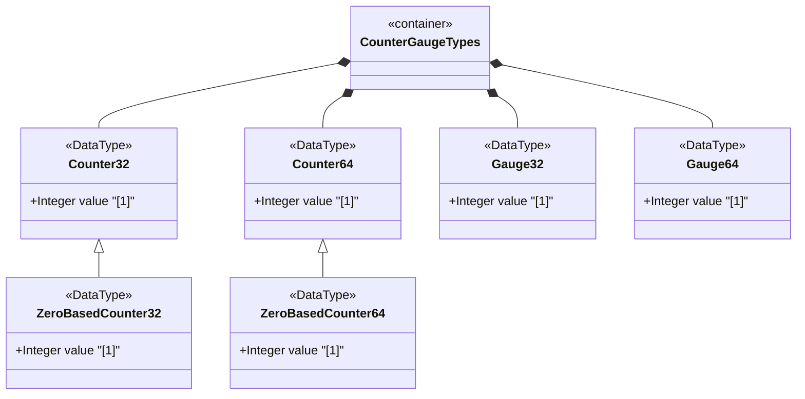

# Feature: Define Counter and Gauge Integer Types

## Parent Epic
- [ ] #11 - Core YANG Data Types

## Description
Defines monotonic counter types (counter32, zero-based-counter32, counter64, zero-based-counter64) and non-negative gauge types (gauge32, gauge64) for use as derived YANG data types in network management. Counters monotonically increase until they wrap at their maximum value. Gauges may increase or decrease but are clamped to their min and max bounds.

## UML Class Diagram


## Interface Requirements

### 1. Payload Schema
```json
{
  "counter32": 0,
  "zeroBasedCounter32": 0,
  "counter64": 0,
  "zeroBasedCounter64": 0,
  "gauge32": 100,
  "gauge64": 1000
}
```

### 2. Validation & Constraints
- counter32: Non-negative uint32, range [0, 4294967295], wraps to 0 after max
- zero-based-counter32: Derived from counter32, defaults to 0 on creation
- counter64: Non-negative uint64, range [0, 18446744073709551615], wraps to 0 after max
- zero-based-counter64: Derived from counter64, defaults to 0 on creation
- gauge32: Non-negative uint32, range [0, 4294967295], clamps at max/min
- gauge64: Non-negative uint64, range [0, 18446744073709551615], clamps at max/min
- Counters MUST NOT be used for configuration schema nodes
- Counters SHOULD NOT use a default statement
- Discontinuity detection requires an associated discontinuity indicator schema node

### 3. Logical Operations & Interface Messages
- Read counter/gauge value from the management data tree
- Subscribe to counter/gauge value change notifications
- Reset zero-based counters to zero on node creation
- Detect counter discontinuities via associated discontinuity indicator

### 4. Logical Exception States & Validation Failures
- Wrap event: counter exceeds max value, wraps to 0 and resumes incrementing
- Discontinuity event: counter value resets at re-initialization or node instantiation
- Gauge saturation: value clamps at max when information exceeds max, clamps at 0 when below min

## Given-When-Then Acceptance Criteria

**Scenario: Counter monotonic increment**
- Given a counter32 with current value 100
- When the counter is incremented by 1
- Then the counter value becomes 101

**Scenario: Counter wrap at maximum**
- Given a counter32 with current value 4294967295
- When the counter is incremented by 1
- Then the counter value wraps to 0

**Scenario: Zero-based counter initial value**
- Given a new zero-based-counter32 data node is created
- When the value is read
- Then the initial value is 0

**Scenario: Gauge within bounds**
- Given a gauge32 with current value 50
- When the modeled information increases to 75
- Then the gauge32 value becomes 75

**Scenario: Gauge saturation at maximum**
- Given a gauge32 with current value 4294967294
- When the modeled information exceeds 4294967295
- Then the gauge32 value is clamped at 4294967295

**Scenario: Gauge saturation at minimum**
- Given a gauge32 with current value 1
- When the modeled information drops below 0
- Then the gauge32 value is clamped at 0

**Scenario: Counter discontinuity detection**
- Given a counter32 that has wrapped or been re-initialized
- When a management station polls the counter value
- Then the associated discontinuity indicator reflects the discontinuity event

**Scenario: Counter not used as configuration**
- Given a schema node using counter32 type
- When the schema node is processed
- Then the counter32 must not be used for configuration schema nodes (read-only access)

## Specification Context (Verbatim)
> The counter32 type represents a non-negative integer that monotonically increases until it reaches a maximum value of 2^32-1 (4294967295 decimal), when it wraps around and starts increasing again from zero. Counters have no defined 'initial' value, and thus, a single value of a counter has (in general) no information content. Discontinuities in the monotonically increasing value normally occur at re-initialization of the management system and at other times as specified in the description of a schema node using this type.

> The zero-based-counter32 type represents a counter32 that has the defined 'initial' value zero. A data tree node using this type will be set to zero (0) on creation and will thereafter increase monotonically until it reaches a maximum value of 2^32-1 (4294967295 decimal), when it wraps around and starts increasing again from zero.

> The gauge32 type represents a non-negative integer, which may increase or decrease, but shall never exceed a maximum value, nor fall below a minimum value. The maximum value cannot be greater than 2^32-1 (4294967295 decimal), and the minimum value cannot be smaller than 0. The value of a gauge32 has its maximum value whenever the information being modeled is greater than or equal to its maximum value, and has its minimum value whenever the information being modeled is smaller than or equal to its minimum value.

## Source References
Structural Schema: [ietf-yang-types@2025-12-22.yang](https://github.com/YangModels/yang/blob/main/standard/ietf/RFC/ietf-yang-types%402025-12-22.yang) (Clause: typedef counter32, zero-based-counter32, counter64, zero-based-counter64, gauge32, gauge64)
Normative Specification: [RFC 9911](https://datatracker.ietf.org/doc/rfc9911/) (Clause: Section 3, /*** collection of counter and gauge types ***/)

## Logical UI & Layout Bindings
- **Target LUI Component:** N/A
- **Target Layout Container ID:** N/A
- **Data Source Bindings:** N/A
