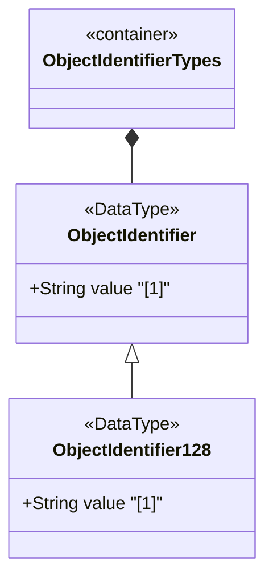

# Feature: Define Object Identifier Types

## Parent Epic
- [ ] #11 - Core YANG Data Types

## Description
Defines object-identifier and object-identifier-128 types for representing administratively assigned names in a registration-hierarchical-name tree (OID tree). The object-identifier type supports an unbounded number of sub-identifiers. The object-identifier-128 type restricts to 128 sub-identifiers for SMIv2 compatibility.

## UML Class Diagram


## Interface Requirements

### 1. Payload Schema
```json
{
  "objectIdentifier": "1.3.6.1.2.1.1.1.0",
  "objectIdentifier128": "1.3.6.1.2.1"
}
```

### 2. Validation & Constraints
- object-identifier: String matching dotted numeric sequence pattern
- Each sub-identifier value MUST NOT exceed 2^32-1 (4294967295)
- Sub-identifiers separated by single dots without whitespace
- First sub-identifier restricted to 0, 1, or 2 per ASN.1
- Second sub-identifier restricted to 0-39 if first is 0 or 1
- Must have at least two sub-identifiers
- object-identifier-128: Restricted to 128 sub-identifiers max

### 3. Logical Operations & Interface Messages
- Parse OID string into sub-identifier sequence
- Validate OID against ASN.1 constraints
- Compare OIDs for parent-child relationships in the OID tree
- Convert between OID string representation and internal numeric form

### 4. Logical Exception States & Validation Failures
- Invalid first sub-identifier (not 0, 1, or 2)
- Second sub-identifier exceeds 39 when first is 0 or 1
- Single sub-identifier only (violates minimum of 2)
- Sub-identifier exceeds 2^32-1
- object-identifier-128 with more than 128 sub-identifiers
- Whitespace between sub-identifiers

## Given-When-Then Acceptance Criteria

**Scenario: Parse valid object identifier**
- Given an OID string "1.3.6.1.2.1.1.1.0"
- When the value is validated
- Then the value is accepted with 8 sub-identifiers

**Scenario: Reject invalid first sub-identifier**
- Given an OID string "3.6.1"
- When the value is validated
- Then validation fails because the first sub-identifier must be 0, 1, or 2

**Scenario: Reject second sub-identifier out of range**
- Given an OID string "0.40.1"
- When the value is validated
- Then validation fails because the second sub-identifier exceeds 39 when first is 0

**Scenario: Reject single sub-identifier**
- Given an OID string "1"
- When the value is validated
- Then validation fails because at least two sub-identifiers are required

**Scenario: Reject sub-identifier overflow**
- Given an OID with a sub-identifier value exceeding 4294967295
- When the value is validated
- Then validation fails with a range overflow error

**Scenario: Reject object-identifier-128 exceeding limits**
- Given an OID string with 129 sub-identifiers
- When validated as object-identifier-128
- Then validation fails with a sub-identifier count limit error

**Scenario: Reject whitespace in OID**
- Given an OID string "1.3. 6.1"
- When the value is validated
- Then validation fails due to intermediate whitespace

## Specification Context (Verbatim)
> The object-identifier type represents administratively assigned names in a registration-hierarchical-name tree. Values of this type are denoted as a sequence of numerical non-negative sub-identifier values. Each sub-identifier value MUST NOT exceed 2^32-1 (4294967295). Sub-identifiers are separated by single dots and without any intermediate whitespace.

> The ASN.1 standard restricts the value space of the first sub-identifier to 0, 1, or 2. Furthermore, the value space of the second sub-identifier is restricted to the range 0 to 39 if the first sub-identifier is 0 or 1. Finally, the ASN.1 standard requires that an object identifier has always at least two sub-identifiers.

> This type SHOULD NOT be used to represent the SMIv2 OBJECT IDENTIFIER type; the object-identifier-128 type SHOULD be used instead.

## Source References
Structural Schema: [ietf-yang-types@2025-12-22.yang](https://github.com/YangModels/yang/blob/main/standard/ietf/RFC/ietf-yang-types%402025-12-22.yang) (Clause: typedef object-identifier, object-identifier-128)
Normative Specification: [RFC 9911](https://datatracker.ietf.org/doc/rfc9911/) (Clause: Section 3, /*** collection of identifier-related types ***/)

## Logical UI & Layout Bindings
- **Target LUI Component:** N/A
- **Target Layout Container ID:** N/A
- **Data Source Bindings:** N/A
