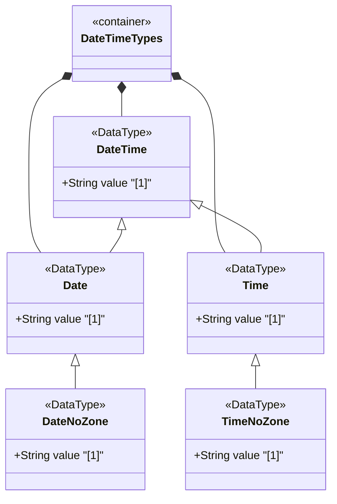

# Feature: Define Date and Time Representation Types

## Parent Epic
- [ ] #11 - Core YANG Data Types

## Description
Defines date-and-time, date, date-no-zone, time, and time-no-zone types for representing calendar dates and times with optional time zone offsets. The date-and-time type is a profile of ISO 8601 via RFC 3339/RFC 9557. The date type represents a 24-hour day interval. The time type represents a recurring instant of zero duration each day. Leap seconds are supported (seconds value 60).

## UML Class Diagram


## Interface Requirements

### 1. Payload Schema
```json
{
  "dateAndTime": "2025-12-22T14:30:00Z",
  "date": "2025-12-22",
  "dateNoZone": "2025-12-22",
  "time": "14:30:00+01:00",
  "timeNoZone": "14:30:00"
}
```

### 2. Validation & Constraints
- date-and-time: Pattern `YYYY-MM-DDTHH:MM:SS[.f+][Z|(+|-)HH:MM]`
  - Years must be non-negative (4 digits)
  - Month: 01-12, Day: 01-31
  - Hours: 00-23, Minutes: 00-59, Seconds: 00-60 (60 for leap seconds)
  - Optional fractional seconds
  - Optional time zone: Z (UTC, unknown local ref) or +/-HH:MM
- date: Pattern `YYYY-MM-DD[Z|(+|-)HH:MM]`
  - Same year/month/day constraints as date-and-time
  - Optional time zone offset
- date-no-zone: Derived from date without time zone offset
- time: Pattern `HH:MM:SS[.f+][Z|(+|-)HH:MM]`
  - Same time constraints as date-and-time
  - Seconds 60 for leap seconds only
- time-no-zone: Derived from time without time zone offset
- Canonical format: numeric time zone offset calculated from device's configured UTC offset
- Z indicates UTC with unknown local time zone reference point
- +00:00 indicates UTC with known local reference point being UTC

### 3. Logical Operations & Interface Messages
- Parse date-and-time string into structured components
- Format date/time values to canonical representation
- Compare date/time values accounting for time zones
- Convert between time zones
- Serialize/deserialize for transmission

### 4. Logical Exception States & Validation Failures
- Invalid month (>12) or day (>31 for given month)
- Negative year value
- Invalid time components (hour >23, minute >59, second >60)
- Seconds value 60 when no leap second applies
- Invalid time zone offset format
- Missing required time zone information when expected
- Malformed date/time string not matching expected pattern

## Given-When-Then Acceptance Criteria

**Scenario: Parse valid date-and-time with UTC**
- Given a date-and-time string "2025-12-22T14:30:00Z"
- When the value is parsed
- Then the date is 2025-12-22, time is 14:30:00, and the time zone is UTC

**Scenario: Parse valid date-and-time with positive offset**
- Given a date-and-time string "2025-12-22T14:30:00+01:00"
- When the value is parsed
- Then the date is 2025-12-22, time is 14:30:00, offset is +01:00

**Scenario: Support leap second**
- Given a date-and-time string "2016-12-31T23:59:60Z"
- When the value is parsed
- Then the seconds value of 60 is accepted as a leap second

**Scenario: Reject negative year**
- Given a date-and-time string "-0001-01-01T00:00:00Z"
- When the value is validated
- Then validation fails because negative years are not allowed

**Scenario: Reject invalid month**
- Given a date string "2025-13-01"
- When the value is validated
- Then validation fails because month 13 is invalid

**Scenario: Parse date without zone**
- Given a date-no-zone string "2025-12-22"
- When the value is parsed
- Then the date is 2025-12-22 with no time zone information

**Scenario: Parse time without zone**
- Given a time-no-zone string "14:30:00"
- When the value is parsed
- Then the time is 14:30:00 with no time zone information

**Scenario: Canonical format with known time zone**
- Given a date-and-time value with a known time zone
- When the canonical format is requested
- Then the value uses a numeric time zone offset calculated from the device's UTC offset

**Scenario: Z vs +00:00 semantics**
- Given two date-and-time values "2025-12-22T14:30:00Z" and "2025-12-22T14:30:00+00:00"
- When the semantics are compared
- Then Z indicates UTC with unknown local reference, +00:00 indicates UTC with local reference being UTC

**Scenario: Reject seconds 60 in non-leap context**
- Given a time string "14:30:60" on a non-leap-second date
- When the value is validated
- Then validation accepts the pattern but the leap second applicability depends on context

## Specification Context (Verbatim)
> The date-and-time type is a profile of the ISO 8601 standard for representation of dates and times using the Gregorian calendar. The profile is defined by the date-time production in Section 5.6 of RFC 3339 and the update defined in Section 2 of RFC 9557. The value of 60 for seconds is allowed only in the case of leap seconds.

> The time-offset Z indicates that the date-and-time value is reported in UTC and that the local time zone reference point is unknown. The time-offset +00:00 indicates that the date-and-time value is reported in UTC and that the local time zone reference point is UTC.

> The canonical format for date-and-time values with a known time zone uses a numeric time zone offset that is calculated using the device's configured known offset to UTC time. A change of the device's offset to UTC time will cause date-and-time values to change accordingly. Such changes might happen periodically if a server automatically follows daylight saving time (DST) time zone offset changes.

## Source References
Structural Schema: [ietf-yang-types@2025-12-22.yang](https://github.com/YangModels/yang/blob/main/standard/ietf/RFC/ietf-yang-types%402025-12-22.yang) (Clause: typedef date-and-time, date, date-no-zone, time, time-no-zone)
Normative Specification: [RFC 9911](https://datatracker.ietf.org/doc/rfc9911/) (Clause: Section 3, /*** collection of types related to date and time ***/)

## Logical UI & Layout Bindings
- **Target LUI Component:** N/A
- **Target Layout Container ID:** N/A
- **Data Source Bindings:** N/A
