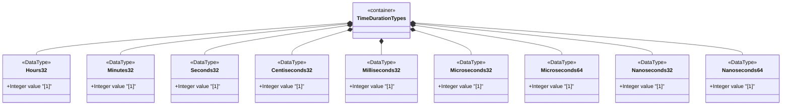

# Feature: Define Time Duration Measurement Types

## Parent Epic
- [ ] #11 - Core YANG Data Types

## Description
Defines signed integer types for measuring time durations at various resolutions, from hours down to nanoseconds, using both 32-bit and 64-bit base types. Each type represents a period of time measured in its respective unit. Types should be range-restricted with `range '0..max'` where only non-negative durations are desired.

## UML Class Diagram


## Interface Requirements

### 1. Payload Schema
```json
{
  "hours32": 24,
  "minutes32": 30,
  "seconds32": 45,
  "centiseconds32": 50,
  "milliseconds32": 500,
  "microseconds32": 1000,
  "microseconds64": 1000000,
  "nanoseconds32": 1000000,
  "nanoseconds64": 1000000000
}
```

### 2. Validation & Constraints
- hours32: int32, units "hours", range approx [-89478485 days to +89478485 days]
- minutes32: int32, units "minutes", range approx [-1491308 days to +1491308 days]
- seconds32: int32, units "seconds", range approx [-24855 days to +24855 days]
- centiseconds32: int32, units "centiseconds" (10^-2 s), range approx [-248 days to +248 days]
- milliseconds32: int32, units "milliseconds" (10^-3 s), range approx [-24 days to +24 days]
- microseconds32: int32, units "microseconds" (10^-6 s), range approx [-35 min to +35 min]
- microseconds64: int64, units "microseconds" (10^-6 s), range approx [-106751991 days to +106751991 days]
- nanoseconds32: int32, units "nanoseconds" (10^-9 s), range approx [-2 s to +2 s]
- nanoseconds64: int64, units "nanoseconds" (10^-9 s), range approx [-106753 days to +106752 days]
- All types permit signed values; restrict with `range '0..max'` for non-negative use cases

### 3. Logical Operations & Interface Messages
- Read duration value from the data tree
- Convert between duration units (e.g., nanoseconds to milliseconds)
- Add/subtract duration values
- Compare durations for ordering

### 4. Logical Exception States & Validation Failures
- Value exceeds the int32/int64 range for the given type
- Non-negative restriction violated when range-restricted to `0..max`
- Unit conversion overflow when converting between resolutions
- Duration underflow when subtracting a larger duration from a smaller one

## Given-When-Then Acceptance Criteria

**Scenario: Read hours duration**
- Given an hours32 value of 24
- When the value is read
- Then it represents a period of 24 hours

**Scenario: Negative duration allowed**
- Given a seconds32 value of -60
- When the value is read
- Then it represents a period of -60 seconds (1 minute in the past)

**Scenario: Non-negative range restriction enforced**
- Given a seconds32 type with range restriction `range '0..max'`
- When a value of -1 is assigned
- Then validation fails because negative values are prohibited by the range restriction

**Scenario: Millisecond to second conversion**
- Given a milliseconds32 value of 1500
- When the value is converted to seconds
- Then the equivalent duration is 1.5 seconds

**Scenario: Nanoseconds32 range limits**
- Given a nanoseconds32 value of 2000000000 (2 billion)
- When the value is validated against int32 range
- Then it is accepted (within the ~2 second range of int32 nanoseconds)

**Scenario: Microseconds64 large range**
- Given a microseconds64 value of 9223372036854775807 (int64 max)
- When the value is validated
- Then it is accepted as within the valid int64 range

**Scenario: Centiseconds32 overflow on conversion**
- Given a centiseconds32 value near int32 max
- When converting to milliseconds
- Then the conversion must handle potential overflow appropriately

**Scenario: Duration comparison**
- Given hours32 value 48 and seconds32 value 172800
- When the values are compared for equality after unit conversion
- Then 48 hours equals 172800 seconds

## Specification Context (Verbatim)
> A period of time measured in units of hours. The maximum time period that can be expressed is in the range [-89478485 days 08:00:00 to 89478485 days 07:00:00]. This type should be range-restricted in situations where only non-negative time periods are desirable (i.e., range '0..max').

> A period of time measured in units of 10^-2 seconds (centiseconds). A period of time measured in units of 10^-3 seconds (milliseconds). A period of time measured in units of 10^-6 seconds (microseconds). A period of time measured in units of 10^-9 seconds (nanoseconds).

## Source References
Structural Schema: [ietf-yang-types@2025-12-22.yang](https://github.com/YangModels/yang/blob/main/standard/ietf/RFC/ietf-yang-types%402025-12-22.yang) (Clause: typedef hours32, minutes32, seconds32, centiseconds32, milliseconds32, microseconds32, microseconds64, nanoseconds32, nanoseconds64)
Normative Specification: [RFC 9911](https://datatracker.ietf.org/doc/rfc9911/) (Clause: Section 3, time duration typedefs)

## Logical UI & Layout Bindings
- **Target LUI Component:** N/A
- **Target Layout Container ID:** N/A
- **Data Source Bindings:** N/A
