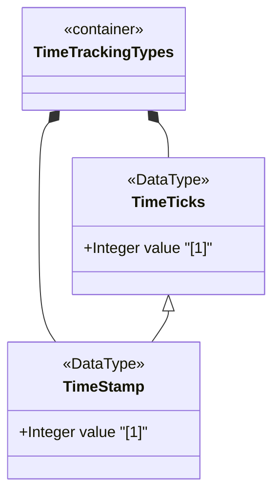

# Feature: Define Time Tracking Types

## Parent Epic
- [ ] #11 - Core YANG Data Types

## Description
Defines timeticks and timestamp types for tracking elapsed time between epochs and recording the occurrence of specific events. Timeticks represents non-negative time in hundredths of a second modulo 2^32. Timestamp captures the value of an associated timeticks node when a specific occurrence happened.

## UML Class Diagram


## Interface Requirements

### 1. Payload Schema
```json
{
  "timeTicks": 8640000,
  "timeStamp": 4320000
}
```

### 2. Validation & Constraints
- timeticks: Non-negative uint32, range [0, 2^32-1], hundredths of a second
  - Represents time modulo 2^32 (wraps after ~497 days)
  - Reference epochs must be identified in the schema node description
- timestamp: Non-negative uint32 derived from timeticks
  - Value is zero if the specific occurrence happened before the last timeticks zero point
  - Associated timeticks schema node must be specified in the schema node description
  - All timestamp values reset to zero when timeticks wraps

### 3. Logical Operations & Interface Messages
- Read timeticks value for elapsed time calculation
- Read timestamp for event occurrence time
- Calculate time delta between two timeticks values accounting for wrap
- Convert timeticks to human-readable duration
- Detect timeticks wrap events

### 4. Logical Exception States & Validation Failures
- Timeticks wrap: value reaches 2^32-1 and wraps to 0
- Timestamp reset: all timestamp values become zero on timeticks wrap
- Timestamp zero: occurrence happened before last timeticks zero
- Delta calculation overflow when timeticks wrap occurs between readings

## Given-When-Then Acceptance Criteria

**Scenario: Read timeticks value**
- Given a timeticks value of 8640000
- When the value is interpreted
- Then it represents 86400 seconds (24 hours) of elapsed time

**Scenario: Timeticks wrap at maximum**
- Given a timeticks value of 4294967295
- When one more hundredth of a second elapses
- Then the timeticks value wraps to 0

**Scenario: Timestamp captures event time**
- Given an associated timeticks value of 1000
- When a specific occurrence happens
- Then the timestamp value is recorded as 1000

**Scenario: Timestamp zero when occurrence precedes zero**
- Given a specific occurrence happened before the last timeticks zero
- When the timestamp value is read
- Then the timestamp value is zero

**Scenario: Timestamp reset on timeticks wrap**
- Given timeticks has wrapped to zero
- When reading all timestamp values
- Then all timestamp values are reset to zero

**Scenario: Delta calculation across wrap boundary**
- Given timeticks value was 4294967290 and is now 5
- When calculating the time delta
- Then the delta is 11 hundredths of a second (accounting for wrap)

## Specification Context (Verbatim)
> The timeticks type represents a non-negative integer that represents the time, modulo 2^32 (4294967296 decimal), in hundredths of a second between two epochs. When a schema node is defined that uses this type, the description of the schema node identifies both of the reference epochs.

> The timestamp type represents the value of an associated timeticks schema node instance at which a specific occurrence happened. The specific occurrence must be defined in the description of any schema node defined using this type. When the specific occurrence occurred prior to the last time the associated timeticks schema node instance was zero, then the timestamp value is zero.

> Note that this requires all timestamp values to be reset to zero when the value of the associated timeticks schema node instance reaches 497+ days and wraps around to zero. The associated timeticks schema node must be specified in the description of any schema node using this type.

## Source References
Structural Schema: [ietf-yang-types@2025-12-22.yang](https://github.com/YangModels/yang/blob/main/standard/ietf/RFC/ietf-yang-types%402025-12-22.yang) (Clause: typedef timeticks, timestamp)
Normative Specification: [RFC 9911](https://datatracker.ietf.org/doc/rfc9911/) (Clause: Section 3, timeticks and timestamp typedefs)

## Logical UI & Layout Bindings
- **Target LUI Component:** N/A
- **Target Layout Container ID:** N/A
- **Data Source Bindings:** N/A
