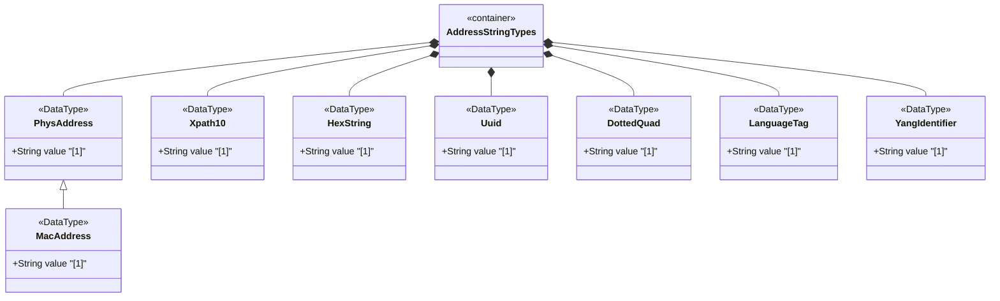

# Feature: Define Address and String Utility Types

## Parent Epic
- [ ] #11 - Core YANG Data Types

## Description
Defines physical address types (phys-address, mac-address), XML utility types (xpath1.0), and common string format types (hex-string, uuid, dotted-quad, language-tag, yang-identifier). These types provide standardized representations for MAC addresses, UUIDs, IPv4 dotted-quad notation, BCP 47 language tags, YANG identifiers, and XPath 1.0 expressions.

## UML Class Diagram


## Interface Requirements

### 1. Payload Schema
```json
{
  "physAddress": "00:1a:2b:3c:4d:5e",
  "macAddress": "00:1a:2b:3c:4d:5e",
  "xpath10": "/network/interfaces/interface[name='eth0']",
  "hexString": "00:1a:2b",
  "uuid": "f81d4fae-7dec-11d0-a765-00a0c91e6bf6",
  "dottedQuad": "192.0.2.1",
  "languageTag": "en-US",
  "yangIdentifier": "my-interface"
}
```

### 2. Validation & Constraints
- phys-address: Optional hex-octet sequence separated by colons, canonical lowercase
  - Pattern: `([0-9a-fA-F]{2}(:[0-9a-fA-F]{2})*)?`
- mac-address: Exactly 6 octets (48-bit) hex separated by colons, canonical lowercase
  - Pattern: `[0-9a-fA-F]{2}(:[0-9a-fA-F]{2}){5}`
- xpath1.0: Any string representing an XPath 1.0 expression
  - Schema node using this type MUST specify the XPath context
- hex-string: Same pattern as phys-address
- uuid: 36-character UUID string per RFC 9562, canonical lowercase
  - Pattern: `[0-9a-fA-F]{8}-[0-9a-fA-F]{4}-[0-9a-fA-F]{4}-[0-9a-fA-F]{4}-[0-9a-fA-F]{12}`
- dotted-quad: Four decimal octets (0-255) separated by dots
  - Pattern: `(([0-9]|[1-9][0-9]|1[0-9][0-9]|2[0-4][0-9]|25[0-5])\.){3}([0-9]|[1-9][0-9]|1[0-9][0-9]|2[0-4][0-9]|25[0-5])`
- language-tag: Well-formed BCP 47 language tag, canonical lowercase
- yang-identifier: Length 1..max, starts with [a-zA-Z_], followed by [a-zA-Z0-9\-_.]*
  - Pattern: `[a-zA-Z_][a-zA-Z0-9\-_.]*`

### 3. Logical Operations & Interface Messages
- Parse MAC address string into octet array
- Validate UUID string format and version
- Normalize hex strings to canonical lowercase representation
- Resolve XPath expressions within specified context
- Parse dotted-quad into 32-bit unsigned integer
- Validate language tag against BCP 47 well-formedness rules
- Validate YANG identifier against identifier production rules

### 4. Logical Exception States & Validation Failures
- Invalid MAC address length (not exactly 6 octets for mac-address)
- Invalid hex digits in phys-address or hex-string
- Invalid UUID format (wrong hyphen positions, non-hex characters)
- Octet value >255 in dotted-quad
- Invalid language tag per BCP 47
- YANG identifier starting with digit or invalid character
- Empty YANG identifier (length <1)

## Given-When-Then Acceptance Criteria

**Scenario: Parse valid MAC address**
- Given a mac-address string "00:1a:2b:3c:4d:5e"
- When the value is validated
- Then it is accepted as a 48-bit MAC address

**Scenario: Reject MAC address with wrong octet count**
- Given a mac-address string "00:1a:2b"
- When the value is validated
- Then validation fails because exactly 6 octets are required

**Scenario: Parse valid UUID**
- Given a uuid string "f81d4fae-7dec-11d0-a765-00a0c91e6bf6"
- When the value is validated
- Then it is accepted and canonicalized to lowercase

**Scenario: Reject invalid UUID format**
- Given a uuid string "f81d4fae-7dec-11d0-a765"
- When the value is validated
- Then validation fails because the UUID has insufficient hyphen-separated groups

**Scenario: Parse valid dotted-quad**
- Given a dotted-quad string "192.0.2.1"
- When the value is validated
- Then it is accepted as a valid 32-bit address in dotted notation

**Scenario: Reject dotted-quad with octet >255**
- Given a dotted-quad string "192.0.2.256"
- When the value is validated
- Then validation fails because octet 256 exceeds the 0-255 range

**Scenario: Parse valid language tag**
- Given a language-tag string "en-US"
- When the value is validated
- Then it is accepted as a valid BCP 47 language tag

**Scenario: Validate YANG identifier**
- Given a yang-identifier string "my-interface_1.0"
- When the value is validated
- Then it is accepted as starting with an alphabetic character

**Scenario: Reject YANG identifier starting with digit**
- Given a yang-identifier string "1st-interface"
- When the value is validated
- Then validation fails because the identifier starts with a digit

**Scenario: Validate XPath expression context**
- Given an xpath1.0 expression "/network/interfaces/interface[name='eth0']"
- When the schema node description specifies the XPath context
- Then the expression must be evaluated within that context

## Specification Context (Verbatim)
> Represents media- or physical-level addresses represented as a sequence of octets, each octet represented by two hexadecimal numbers. Octets are separated by colons. The canonical representation uses lowercase characters.

> The mac-address type represents a 48-bit IEEE 802 Media Access Control (MAC) address. The canonical representation uses lowercase characters. Note that there are IEEE 802 MAC addresses with a different length that this type cannot represent.

> A Universally Unique IDentifier in the string representation defined in RFC 9562. The canonical representation uses lowercase characters.

> An unsigned 32-bit number expressed in the dotted-quad notation, i.e., four octets written as decimal numbers and separated with the '.' (full stop) character.

> A language tag according to RFC 5646 (BCP 47). The canonical representation uses lowercase characters. Values of this type must be well-formed language tags, in conformance with the definition of well-formed tags in BCP 47.

> A YANG identifier string as defined by the 'identifier' rule in Section 14 of RFC 7950. An identifier must start with an alphabetic character or an underscore followed by an arbitrary sequence of alphabetic or numeric characters, underscores, hyphens, or dots.

## Source References
Structural Schema: [ietf-yang-types@2025-12-22.yang](https://github.com/YangModels/yang/blob/main/standard/ietf/RFC/ietf-yang-types%402025-12-22.yang) (Clause: typedef phys-address, mac-address, xpath1.0, hex-string, uuid, dotted-quad, language-tag, yang-identifier)
Normative Specification: [RFC 9911](https://datatracker.ietf.org/doc/rfc9911/) (Clause: Section 3, address and string types)

## Logical UI & Layout Bindings
- **Target LUI Component:** N/A
- **Target Layout Container ID:** N/A
- **Data Source Bindings:** N/A
