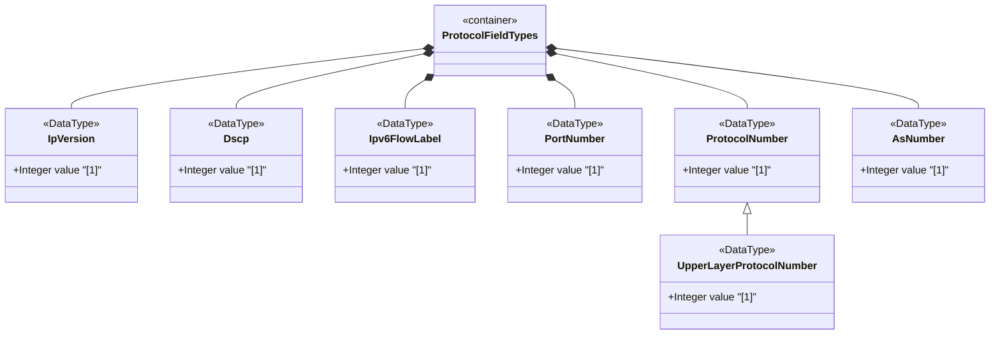

# Feature: Define Protocol Field and AS Number Types

## Parent Epic
- [ ] #12 - Internet Protocol Suite Data Types

## Description
Defines types for common Internet Protocol suite fields: IP version enumeration (unknown, IPv4, IPv6), Differentiated Services Code Point (DSCP, range 0-63), IPv6 flow label (range 0-1048575), port numbers (16-bit, range 0-65535), protocol numbers (8-bit), upper-layer protocol numbers, and autonomous system numbers (32-bit). These types map to standard IANA-registered protocol field values.

## UML Class Diagram


## Interface Requirements

### 1. Payload Schema
```json
{
  "ipVersion": 1,
  "dscp": 46,
  "ipv6FlowLabel": 12345,
  "portNumber": 443,
  "protocolNumber": 6,
  "upperLayerProtocolNumber": 6,
  "asNumber": 64496
}
```

### 2. Validation & Constraints
- ip-version: Enumeration with values {unknown=0, ipv4=1, ipv6=2}
  - unknown: Unknown or unspecified IP version
  - ipv4: IPv4 protocol per RFC 791
  - ipv6: IPv6 protocol per RFC 8200
- dscp: uint8 range 0-63, 6-bit Differentiated Services Code Point
- ipv6-flow-label: uint32 range 0-1048575 (20-bit flow label)
- port-number: uint16 range 0-65535, IANA-assigned transport-layer port
  - Value 0 is reserved by IANA, can be excluded via subtyping
- protocol-number: uint8, 8-bit IP protocol number, IANA-assigned
- upper-layer-protocol-number: Derived from protocol-number
  - For IPv6 with extension headers, represents the protocol in the last next-header field
- as-number: uint32, no range restriction, supports 32-bit AS numbers per RFC 6793

### 3. Logical Operations & Interface Messages
- Map IP version enum to protocol version string
- Classify traffic based on DSCP value
- Identify traffic flows by IPv6 flow label
- Map port numbers to IANA service names
- Map protocol numbers to IANA protocol names
- Validate AS number ranges (16-bit vs 32-bit)

### 4. Logical Exception States & Validation Failures
- DSCP value >63
- IPv6 flow label >1048575
- Port number >65535
- Reserved port 0 used in context where it is excluded
- Protocol number >255
- AS number exceeds uint32 range

## Given-When-Then Acceptance Criteria

**Scenario: Parse IP version as IPv4**
- Given an ip-version value of 1
- When the value is interpreted
- Then it represents IPv4 per RFC 791

**Scenario: Parse IP version as unknown**
- Given an ip-version value of 0
- When the value is interpreted
- Then it represents an unknown or unspecified IP version

**Scenario: Validate DSCP within range**
- Given a dscp value of 46 (EF PHB)
- When the value is validated
- Then it is accepted as a valid 6-bit DSCP value

**Scenario: Reject DSCP out of range**
- Given a dscp value of 64
- When the value is validated
- Then validation fails because DSCP must be 0-63

**Scenario: Validate IPv6 flow label within range**
- Given an ipv6-flow-label value of 1048575
- When the value is validated
- Then it is accepted at the maximum 20-bit flow label

**Scenario: Validate port number range**
- Given a port-number value of 65535
- When the value is validated
- Then it is accepted as the maximum 16-bit port number

**Scenario: Port zero reserved**
- Given a port-number type with zero excluded via subtyping
- When a value of 0 is assigned
- Then validation fails because port 0 is reserved by IANA

**Scenario: Validate protocol number**
- Given a protocol-number value of 6
- When the value is interpreted
- Then it represents the TCP protocol number

**Scenario: Upper-layer protocol for IPv6 with extension headers**
- Given an IPv6 packet with extension headers where the last next-header is 17
- When the upper-layer-protocol-number is extracted
- Then the value is 17 (UDP)

**Scenario: 32-bit AS number support**
- Given an as-number value of 196608
- When the value is validated
- Then it is accepted as a valid 32-bit AS number

## Specification Context (Verbatim)
> This value represents the version of the Internet Protocol. In the value set and its semantics, this type is equivalent to the InetVersion textual convention of the SMIv2.

> The dscp type represents a Differentiated Services Code Point that may be used for marking packets in a traffic stream. In the value set and its semantics, this type is equivalent to the Dscp textual convention of the SMIv2.

> The port-number type represents a 16-bit port number of an Internet transport-layer protocol such as UDP, TCP, DCCP, or SCTP. Port numbers are assigned by IANA. Note that the port number value zero is reserved by IANA.

> The as-number type represents autonomous system numbers that identify an Autonomous System (AS). Autonomous system numbers were originally limited to 16 bits. BGP extensions have enlarged the autonomous system number space to 32 bits. This type therefore uses an uint32 base type without a range restriction.

## Source References
Structural Schema: [ietf-inet-types@2025-12-22.yang](https://github.com/YangModels/yang/blob/main/standard/ietf/RFC/ietf-inet-types%402025-12-22.yang) (Clause: typedef ip-version, dscp, ipv6-flow-label, port-number, protocol-number, upper-layer-protocol-number, as-number)
Normative Specification: [RFC 9911](https://datatracker.ietf.org/doc/rfc9911/) (Clause: Section 4, protocol fields and AS types)

## Logical UI & Layout Bindings
- **Target LUI Component:** N/A
- **Target Layout Container ID:** N/A
- **Data Source Bindings:** N/A
