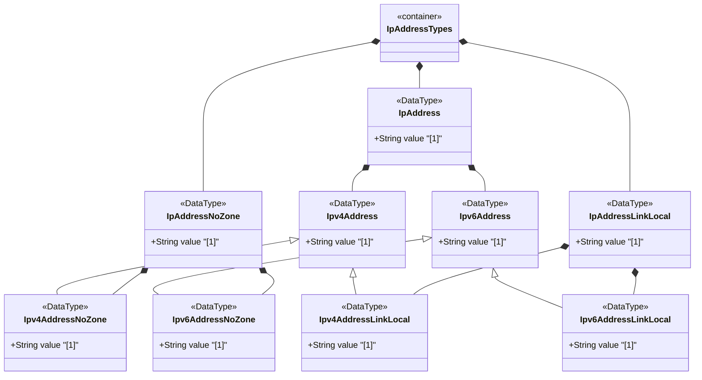

# Feature: Define IP Address Representation Types

## Parent Epic
- [ ] #12 - Internet Protocol Suite Data Types

## Description
Defines types for IPv4 and IPv6 address representations including address types with optional zone identifiers (ip-address, ipv4-address, ipv6-address), address types without zone identifiers (ip-address-no-zone, ipv4-address-no-zone, ipv6-address-no-zone), and link-local address types (ip-address-link-local, ipv4-address-link-local, ipv6-address-link-local). Zone indices disambiguate identical link-local addresses using interface names or numbers.

## UML Class Diagram


## Interface Requirements

### 1. Payload Schema
```json
{
  "ipAddress": "2001:db8::1",
  "ipv4Address": "192.0.2.1",
  "ipv6Address": "2001:db8::1%eth0",
  "ipAddressNoZone": "192.0.2.1",
  "ipv4AddressNoZone": "192.0.2.1",
  "ipv6AddressNoZone": "2001:db8::1",
  "ipAddressLinkLocal": "fe80::1%eth0",
  "ipv4AddressLinkLocal": "169.254.1.1",
  "ipv6AddressLinkLocal": "fe80::1"
}
```

### 2. Validation & Constraints
- ip-address: Union of ipv4-address and ipv6-address, IP version neutral, supports zone identifiers
- ipv4-address: Dotted-quad notation with optional zone index (suffix `%<zone>`)
  - Pattern: `(([0-9]|[1-9][0-9]|1[0-9][0-9]|2[0-4][0-9]|25[0-5])\.){3}([0-9]|[1-9][0-9]|1[0-9][0-9]|2[0-4][0-9]|25[0-5])(%.+)?`
  - Canonical zone index format: numerical
- ipv6-address: Full, mixed, shortened, or shortened-mixed notation with optional zone
  - Canonical format per RFC 5952 Section 4
  - Zone index separated by % sign
- ip-address-no-zone: Union without zone identifiers
- ipv4-address-no-zone: ipv4-address without zone suffix
- ipv6-address-no-zone: ipv6-address without zone suffix
- ip-address-link-local: Union of link-local IPv4 and IPv6 addresses
- ipv4-address-link-local: IPv4 in 169.254.0.0/16 prefix per RFC 3927
  - Pattern: `169\.254\..*`
- ipv6-address-link-local: IPv6 in fe80::/10 prefix per RFC 4291
  - Pattern: `[fF][eE][89aAbB][0-9a-fA-F]:.*`

### 3. Logical Operations & Interface Messages
- Parse IP address string into binary representation
- Validate address format against version-specific patterns
- Extract zone index from scoped addresses
- Compare IP addresses for equality/ordering
- Determine address scope (link-local, global, etc.)
- Convert between address representations (with/without zone)

### 4. Logical Exception States & Validation Failures
- Malformed IPv4 dotted-quad (octet >255, missing octets)
- Malformed IPv6 colon-hex notation
- IPv6 address with too many colon-separated groups
- Invalid zone index characters
- Link-local address outside expected prefix range
- Mixed IPv4/IPv6 notation inconsistency

## Given-When-Then Acceptance Criteria

**Scenario: Parse IPv4 dotted-quad**
- Given an ipv4-address string "192.0.2.1"
- When the value is validated
- Then it is accepted as a valid IPv4 address in dotted-quad notation

**Scenario: Parse IPv6 full notation**
- Given an ipv6-address string "2001:0db8:0000:0000:0000:0000:0000:0001"
- When the value is validated
- Then it is accepted as a valid IPv6 address

**Scenario: Parse IPv6 shortened notation**
- Given an ipv6-address string "2001:db8::1"
- When the value is validated
- Then it is accepted as a valid shortened IPv6 address

**Scenario: Parse IPv4 address with zone index**
- Given an ipv4-address string "169.254.1.1%eth0"
- When the value is parsed
- Then the address is 169.254.1.1 with zone index "eth0"

**Scenario: Reject IPv4 octet exceeding 255**
- Given an ipv4-address string "192.0.2.256"
- When the value is validated
- Then validation fails because octet 256 exceeds 255

**Scenario: Parse IPv4 address without zone**
- Given an ipv4-address-no-zone string "192.0.2.1"
- When the value is validated
- Then it is accepted with no zone identifier

**Scenario: Reject IPv4 with zone when using no-zone type**
- Given an ipv4-address-no-zone type
- When value "192.0.2.1%eth0" is validated
- Then validation fails because zone identifiers are not allowed

**Scenario: Parse link-local IPv4 address**
- Given an ipv4-address-link-local string "169.254.1.1"
- When the value is validated
- Then it is accepted as within the 169.254.0.0/16 prefix

**Scenario: Reject non-link-local IPv4 for link-local type**
- Given an ipv4-address-link-local type
- When value "192.0.2.1" is validated
- Then validation fails because it is outside 169.254.0.0/16

**Scenario: Parse link-local IPv6 address**
- Given an ipv6-address-link-local string "fe80::1"
- When the value is validated
- Then it is accepted as within the fe80::/10 prefix

**Scenario: Zero-compressed IPv6 canonicalization**
- Given an ipv6-address "2001:db8:0:0:0:0:0:1"
- When canonical format is requested per RFC 5952
- Then the canonical representation is "2001:db8::1"

**Scenario: IP version neutral union**
- Given an ip-address union type
- When an IPv4 address "192.0.2.1" is assigned
- Then the union resolves to the IPv4 member type

## Specification Context (Verbatim)
> The ip-address type represents an IP address and is IP version neutral. The format of the textual representation implies the IP version. This type supports scoped addresses by allowing zone identifiers in the address format.

> The ipv4-address type represents an IPv4 address in dotted-quad notation. The IPv4 address may include a zone index, separated by a % sign. The zone index is used to disambiguate identical address values. For link-local addresses, the zone index will typically be the interface index number or the name of an interface.

> The ipv6-address type represents an IPv6 address in full, mixed, shortened, and shortened-mixed notation. The IPv6 address may include a zone index, separated by a % sign. The canonical format of IPv6 addresses uses the textual representation defined in Section 4 of RFC 5952. The canonical format for the zone index is the numerical format as described in Section 11.2 of RFC 4007.

> The ipv4-address-link-local type represents a link-local IPv4 address in the prefix 169.254.0.0/16 as defined in Section 2.1 of RFC 3927.

> The ipv6-address-link-local type represents a link-local IPv6 address in the prefix fe80::/10 as defined in Section 2.4 of RFC 4291.

## Source References
Structural Schema: [ietf-inet-types@2025-12-22.yang](https://github.com/YangModels/yang/blob/main/standard/ietf/RFC/ietf-inet-types%402025-12-22.yang) (Clause: typedef ip-address, ipv4-address, ipv6-address, ip-address-no-zone, ipv4-address-no-zone, ipv6-address-no-zone, ip-address-link-local, ipv4-address-link-local, ipv6-address-link-local)
Normative Specification: [RFC 9911](https://datatracker.ietf.org/doc/rfc9911/) (Clause: Section 4, IP address types)

## Logical UI & Layout Bindings
- **Target LUI Component:** N/A
- **Target Layout Container ID:** N/A
- **Data Source Bindings:** N/A
