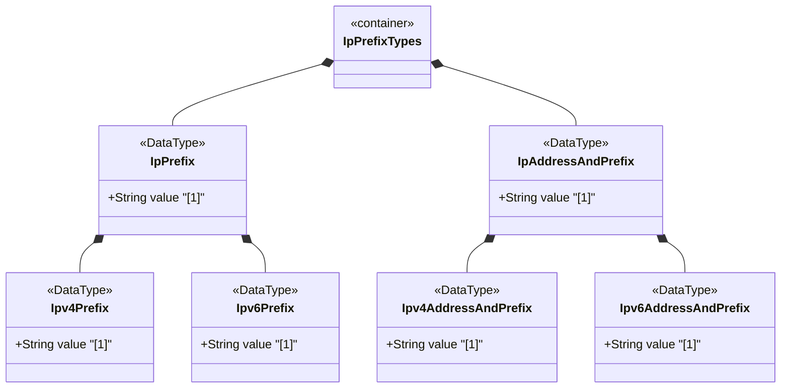

# Feature: Define IP Prefix Representation Types

## Parent Epic
- [ ] #12 - Internet Protocol Suite Data Types

## Description
Defines types for IP prefix notation including version-neutral IP prefix unions (ip-prefix, ip-address-and-prefix) and version-specific prefix types (ipv4-prefix, ipv6-prefix, ipv4-address-and-prefix, ipv6-address-and-prefix). Prefix types use CIDR notation with slash-separated prefix lengths. Address-and-prefix types combine a specific host address with its associated network prefix.

## UML Class Diagram


## Interface Requirements

### 1. Payload Schema
```json
{
  "ipPrefix": "192.0.2.0/24",
  "ipv4Prefix": "192.0.2.0/24",
  "ipv6Prefix": "2001:db8::/32",
  "ipAddressAndPrefix": "192.0.2.1/24",
  "ipv4AddressAndPrefix": "192.0.2.1/24",
  "ipv6AddressAndPrefix": "2001:db8::1/64"
}
```

### 2. Validation & Constraints
- ip-prefix: Union of ipv4-prefix and ipv6-prefix
- ipv4-prefix: IPv4 address/prefix-length, prefix 0-32
  - Pattern: dotted-quad followed by `/(0-32)`
  - Canonical format: non-prefix bits set to zero (e.g., 192.0.2.1/24 becomes 192.0.2.0/24)
  - Accepts non-canonical on input, returns canonical on output
- ipv6-prefix: IPv6 address/prefix-length, prefix 0-128
  - Canonical format per RFC 5952 with non-prefix bits zeroed
  - Accepts non-canonical on input, returns canonical on output
- ip-address-and-prefix: Union of ipv4-address-and-prefix and ipv6-address-and-prefix
- ipv4-address-and-prefix: IPv4 address with associated prefix, prefix 0-32
  - DOES NOT require non-prefix bits to be zero (represents a host address with its prefix)
- ipv6-address-and-prefix: IPv6 address with associated prefix, prefix 0-128
  - DOES NOT require non-prefix bits to be zero
  - Canonical format uses RFC 5952 representation

### 3. Logical Operations & Interface Messages
- Parse prefix notation into address and length components
- Convert prefix to network mask
- Determine if an IP address is within a prefix range
- Compute network address from prefix
- Compute broadcast address (IPv4)
- Compare prefixes for overlap or containment

### 4. Logical Exception States & Validation Failures
- Prefix length >32 for IPv4 or >128 for IPv6
- Negative prefix length
- Malformed address portion of prefix
- Non-contiguous prefix bits (semantic error, not pattern error)
- Address portion contains non-zero bits where prefix mask has zeros (for pure prefix types, accepted then canonicalized)

## Given-When-Then Acceptance Criteria

**Scenario: Parse valid IPv4 prefix**
- Given an ipv4-prefix string "192.0.2.0/24"
- When the value is validated
- Then it is accepted with address 192.0.2.0 and prefix length 24

**Scenario: Canonicalize non-canonical IPv4 prefix**
- Given an ipv4-prefix string "192.0.2.1/24"
- When the canonical format is requested
- Then the value is converted to "192.0.2.0/24"

**Scenario: Parse valid IPv6 prefix**
- Given an ipv6-prefix string "2001:db8::/32"
- When the value is validated
- Then it is accepted as a valid /32 IPv6 prefix

**Scenario: Reject IPv4 prefix length >32**
- Given an ipv4-prefix string "192.0.2.0/33"
- When the value is validated
- Then validation fails because prefix length must be 0-32

**Scenario: Reject IPv6 prefix length >128**
- Given an ipv6-prefix string "2001:db8::/129"
- When the value is validated
- Then validation fails because prefix length must be 0-128

**Scenario: Parse address-and-prefix with host bits set**
- Given an ipv4-address-and-prefix string "192.0.2.1/24"
- When the value is validated
- Then it is accepted as address 192.0.2.1 with prefix /24 (host bits preserved)

**Scenario: Parse IPv6 address-and-prefix**
- Given an ipv6-address-and-prefix string "2001:db8::1/64"
- When the value is validated
- Then it is accepted with canonical address per RFC 5952

**Scenario: IPv6 prefix canonicalization**
- Given an ipv6-prefix "2001:db8:0:0:0:0:0:1/64"
- When canonical format is requested
- Then non-prefix bits are zeroed and address uses RFC 5952 format: "2001:db8::/64"

**Scenario: IP version neutral prefix union**
- Given an ip-prefix union type
- When an IPv4 prefix "10.0.0.0/8" is assigned
- Then the union resolves to the IPv4 prefix member type

**Scenario: Prefix containment check**
- Given prefix "192.0.2.0/24" and address "192.0.2.100"
- When containment is checked
- Then the address is within the prefix

**Scenario: Prefix overlap detection**
- Given prefix "192.0.2.0/25" and prefix "192.0.2.128/25"
- When overlap is checked
- Then the prefixes do not overlap (adjacent blocks)

## Specification Context (Verbatim)
> The ipv4-prefix type represents an IPv4 prefix. The prefix length is given by the number following the slash character and must be less than or equal to 32. A prefix length value of n corresponds to an IP address mask that has n contiguous 1-bits from the most significant bit (MSB) and all other bits set to 0. The canonical format of an IPv4 prefix has all bits of the IPv4 address set to zero that are not part of the IPv4 prefix.

> The definition of ipv4-prefix does not require that bits that are not part of the prefix be set to zero. However, implementations have to return values in canonical format, which requires non-prefix bits to be set to zero. This means that 192.0.2.1/24 must be accepted as a valid value, but it will be converted into the canonical format 192.0.2.0/24.

> The ipv6-prefix type represents an IPv6 prefix. The prefix length is given by the number following the slash character and must be less than or equal to 128. The canonical format of an IPv6 prefix has all bits of the IPv6 address set to zero that are not part of the IPv6 prefix. Furthermore, the IPv6 address is represented as defined in Section 4 of RFC 5952.

## Source References
Structural Schema: [ietf-inet-types@2025-12-22.yang](https://github.com/YangModels/yang/blob/main/standard/ietf/RFC/ietf-inet-types%402025-12-22.yang) (Clause: typedef ip-prefix, ipv4-prefix, ipv6-prefix, ip-address-and-prefix, ipv4-address-and-prefix, ipv6-address-and-prefix)
Normative Specification: [RFC 9911](https://datatracker.ietf.org/doc/rfc9911/) (Clause: Section 4, IP prefix types)

## Logical UI & Layout Bindings
- **Target LUI Component:** N/A
- **Target Layout Container ID:** N/A
- **Data Source Bindings:** N/A
