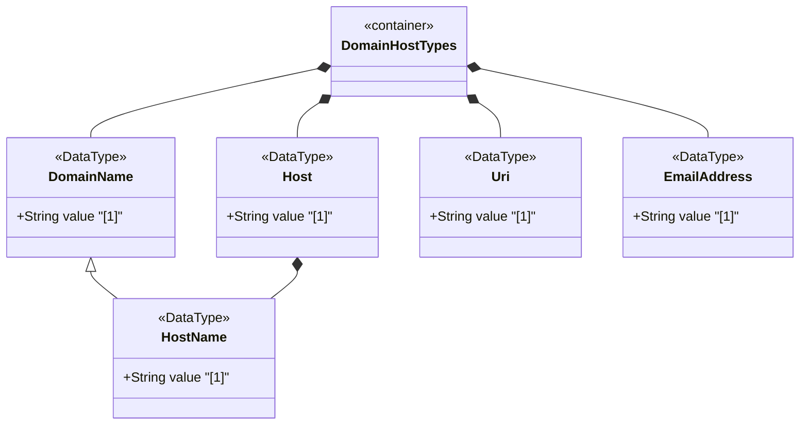

# Feature: Define Domain Name, Host, URI, and Email Types

## Parent Epic
- [ ] #12 - Internet Protocol Suite Data Types

## Description
Defines types for DNS domain names (domain-name), fully qualified host names (host-name), IP-or-hostname unions (host), Uniform Resource Identifiers (uri), and internationalized email addresses (email-address). Domain names follow RFC 1034/1123 syntax. Host names enforce stricter RFC 952 syntax. URIs follow RFC 3986 with mandatory normalization. Email addresses support internationalization per RFC 6532.

## UML Class Diagram


## Interface Requirements

### 1. Payload Schema
```json
{
  "domainName": "example.com",
  "hostName": "host.example.com",
  "host": "192.0.2.1",
  "uri": "https://example.com/resource",
  "emailAddress": "user@example.com"
}
```

### 2. Validation & Constraints
- domain-name: ASCII string, length 1-253, follows DNS label syntax
  - Labels: `[a-zA-Z0-9_]([a-zA-Z0-9\-_]){0,61}` separated by dots
  - Canonical format: lowercase ASCII
  - Internationalized domain names MUST be A-labels per RFC 5890
  - Wildcards (RFC 4592) and classless delegations (RFC 2317) not supported
  - Schema nodes using domain-name MUST describe resolution to IP addresses
- host-name: Derived from domain-name, length 2-max, restricted pattern `[a-zA-Z0-9\-\.]+`
  - At least two characters (per RFC 952)
  - Labels consist of letters, digits, hyphens separated by dots
  - Fully qualified host names
- host: Union of ip-address and host-name
- uri: ASCII string matching `[a-z][a-z0-9+.-]*:.*`
  - MUST be normalized per RFC 3986 Sections 6.2.1, 6.2.2.1, 6.2.2.2
  - Percent-encoding used only where necessary
  - Case-insensitive characters set to lowercase (except hex in percent-encoded triplets, which are uppercase)
  - Zero-length URI expresses "URI absent"
- email-address: String matching `.+@.+` (addr-spec per RFC 5322 Section 3.4.1)
  - MUST support internationalization per RFC 6532
  - Domain part supports A-labels and U-labels per RFC 5890
  - Canonical format: lowercase domain, U-labels where applicable
  - Support for obsolete local-part/domain syntax not required

### 3. Logical Operations & Interface Messages
- Validate domain name syntax and label length constraints
- Resolve domain name to IP addresses via DNS (A/AAAA records)
- Normalize URIs per RFC 3986 canonicalization rules
- Validate email address format and domain part
- Compare domain names case-insensitively
- Convert host union to/from string representation

### 4. Logical Exception States & Validation Failures
- Domain name length >253 characters
- Domain label length >63 characters
- Invalid characters in domain label
- Host name shorter than 2 characters
- URI missing scheme prefix
- URI scheme not starting with alphabetic character
- Email address missing @ separator
- Non-ASCII domain in email not supported by implementation
- URI normalization resolves to zero-length string

## Given-When-Then Acceptance Criteria

**Scenario: Parse fully qualified domain name**
- Given a domain-name string "example.com"
- When the value is validated
- Then it is accepted as a valid DNS domain name

**Scenario: Reject domain name exceeding 253 characters**
- Given a domain-name string with 254 characters
- When the value is validated
- Then validation fails due to length limit

**Scenario: Reject label exceeding 63 characters**
- Given a domain-name with a single label of 64 characters
- When the value is validated
- Then validation fails because DNS labels are limited to 63 characters

**Scenario: Parse valid host name**
- Given a host-name string "host.example.com"
- When the value is validated
- Then it is accepted as a valid host name with three labels

**Scenario: Reject host name shorter than 2 characters**
- Given a host-name string "a"
- When the value is validated
- Then validation fails because host names must be at least 2 characters

**Scenario: Parse host union with IP address**
- Given a host string "192.0.2.1"
- When the value is validated
- Then the union resolves to the ip-address member type

**Scenario: Parse host union with host name**
- Given a host string "example.com"
- When the value is validated
- Then the union resolves to the host-name member type

**Scenario: Parse valid URI**
- Given a uri string "https://example.com/path?query=value"
- When the value is validated
- Then it is accepted and normalized per RFC 3986

**Scenario: Normalize URI case-insensitive components**
- Given a uri string "HTTPS://Example.COM/Path"
- When the URI is normalized
- Then scheme is "https", host is "example.com", path preserved as "/Path"

**Scenario: Percent-encode uppercase hex digits**
- Given a uri string "https://example.com/path%3fvalue"
- When the URI is normalized
- Then percent-encoded hex digits are normalized to uppercase

**Scenario: Parse valid email address**
- Given an email-address string "user@example.com"
- When the value is validated
- Then it is accepted as a valid email address

**Scenario: Reject email missing @ sign**
- Given an email-address string "userexample.com"
- When the value is validated
- Then validation fails because no @ separator is present

**Scenario: Internationalized domain name as A-label**
- Given a domain-name with non-ASCII characters
- When the value is stored
- Then the domain MUST be represented as an A-label per RFC 5890

**Scenario: URI absent represented as zero-length**
- Given a URI field that is optional
- When no URI is provided
- Then a zero-length string expresses "URI absent"

## Specification Context (Verbatim)
> The domain-name type represents a DNS domain name. The name SHOULD be fully qualified whenever possible. This type does not support wildcards (see RFC 4592) or classless in-addr.arpa delegations (see RFC 2317). Internet domain names are only loosely specified. Section 3.5 of RFC 1034 recommends a syntax (modified in Section 2.1 of RFC 1123).

> The encoding of DNS names in the DNS protocol is limited to 255 characters. Since the encoding consists of labels prefixed by a length byte and there is a trailing NUL byte, only 253 characters can appear in the textual dotted notation.

> Domain-name values use the ASCII encoding. Their canonical format uses lowercase ASCII characters. Internationalized domain names MUST be A-labels as per RFC 5890.

> The host-name type represents fully qualified host names. Host names must be at least two characters long (see RFC 952), and they are restricted to labels consisting of letters, digits, and hyphens separated by dots.

> The uri type represents a Uniform Resource Identifier (URI) as defined by the rule 'URI' in RFC 3986. Objects using the uri type MUST be in ASCII encoding and MUST be normalized as described in Sections 6.2.1, 6.2.2.1, and 6.2.2.2 of RFC 3986.

> The email-address type represents an internationalized email address. The email address format is defined by the addr-spec ABNF rule in Section 3.4.1 of RFC 5322. This format has been extended by RFC 6532 to support internationalized email addresses.

## Source References
Structural Schema: [ietf-inet-types@2025-12-22.yang](https://github.com/YangModels/yang/blob/main/standard/ietf/RFC/ietf-inet-types%402025-12-22.yang) (Clause: typedef domain-name, host-name, host, uri, email-address)
Normative Specification: [RFC 9911](https://datatracker.ietf.org/doc/rfc9911/) (Clause: Section 4, domain name and URI types)

## Logical UI & Layout Bindings
- **Target LUI Component:** N/A
- **Target Layout Container ID:** N/A
- **Data Source Bindings:** N/A
