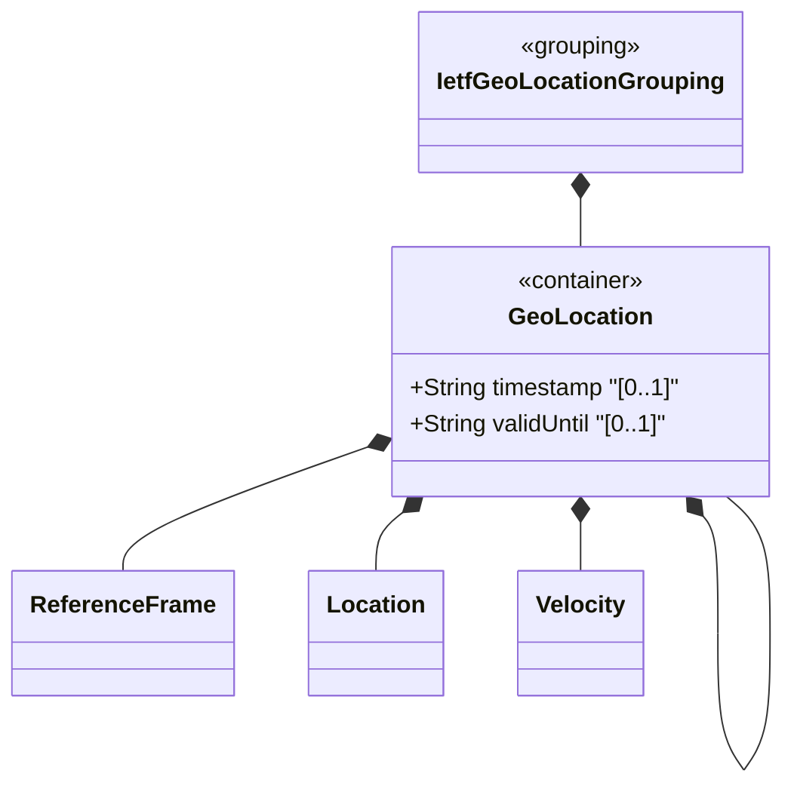

# Feature: Define Geo-Location Container

## Parent Epic
- [ ] #30 - [ietf-geo-location: Geographic Location Data Model](https://github.com/gintatkinson/3dgs-033/blob/main/docs/epics/epic-03-ietf-geo-location.md) (root container of the geo-location grouping, anchors all sub-containers)

## Description
Defines the root `geo-location` container that identifies a location on or around an astronomical body (e.g., Earth) somewhere in a universe. This container serves as the structural root that houses all geolocation data including the reference frame, coordinate location data, motion vectors, and temporal metadata. It provides two temporal leaf nodes: a `timestamp` recording when the location was captured and a `valid-until` field marking the expiration of the location data.

## UML Class Diagram


## Interface Requirements

### 1. Test Data Shape
```json
{
  "geo-location": {
    "reference-frame": {
      "astronomical-body": "earth",
      "geodetic-system": {
        "geodetic-datum": "wgs-84",
        "coord-accuracy": 0.000001,
        "height-accuracy": 0.01
      }
    },
    "latitude": 40.73297,
    "longitude": -74.007696,
    "velocity": {
      "v-north": 0.0,
      "v-east": 0.0,
      "v-up": 0.0
    },
    "timestamp": "2012-03-31T16:00:00Z",
    "valid-until": "2026-12-31T23:59:59Z"
  }
}
```

### 2. Validation & Constraints
- `timestamp`: type `yang:date-and-time` (ISO 8601 string format, imported from `ietf-yang-types`), optional, no default. Records the reference time when the location was captured
- `valid-until`: type `yang:date-and-time`, optional, no default. Marks the timestamp until which this geo-location data is considered valid. If unspecified, the geo-location has no specific expiration time
- Both temporal leaves are writable/configurable (config true)
- The geo-location container itself is writable and may appear zero or one time per parent entity

### 3. Visual Layout & Arrangement
- Display as a collapsible details section within a PropertyGrid, showing temporal metadata fields alongside child sub-containers in a vertically stacked layout
- Timestamp fields render as formatted date-time strings with locale-aware display (platform-independent, driven by tokenized formatting)
- The `valid-until` field should visually distinguish expired locations (valid-until in the past) from currently valid ones using status-aware styling
- Apply CSS reset to the container (box-sizing: border-box) with scoped naming (CSS Modules/BEM) to prevent specificity conflicts
- Layout containment restricted to outer splitter panels; do not apply containment on scrollable child sections within the PropertyGrid

### 4. Interactive Flow & States
- **Loading State**: Display skeleton placeholder for both timestamp fields while geo-location data is being fetched from the data source
- **Empty State**: When no geo-location data exists, show an empty state indicator with the option to configure a new geo-location record
- **Read-Only State**: When the underlying data node is read-only (config false in a specific usage context), display values as non-editable text labels
- **Edit State**: Timestamp fields render as editable date-time pickers; `valid-until` may be cleared to indicate no expiration
- **Error State**: Highlight fields with validation errors (malformed date-time strings); show inline error messages
- Computed-style assertions must verify scroll dimensions match container boundaries and that error-state highlight colors match token-defined values

## Given-When-Then Acceptance Criteria

**Scenario: Store geo-location with timestamp**
- Given a network entity with a geo-location container
- When a timestamp "2012-03-31T16:00:00Z" and ellipsoid coordinates are configured
- Then the geo-location data is stored with the recorded timestamp

**Scenario: Store geo-location with valid-until**
- Given a geo-location record with coordinates
- When a valid-until value of "2026-12-31T23:59:59Z" is set
- Then the system treats this location data as expiring at the specified time

**Scenario: Geo-location with no valid-until**
- Given a geo-location record with no valid-until value
- When the location data is queried
- Then the location data has no expiration and is considered valid indefinitely

**Scenario: Omitting timestamp**
- Given a geo-location container
- When location data is configured without a timestamp
- Then the timestamp field remains empty and no default value is populated

**Scenario: Validate malformed timestamp**
- Given a geo-location container in edit mode
- When a timestamp value of "invalid-date-string" is submitted
- Then validation fails with an error indicating the date-time format is not valid per ISO 8601

**Scenario: Valid-until before timestamp**
- Given a geo-location with timestamp "2025-06-01T12:00:00Z"
- When valid-until is set to "2025-01-01T00:00:00Z"
- Then the system accepts the value (no cross-field temporal ordering constraint exists in the schema)

**Scenario: Expired geo-location display**
- Given a geo-location with valid-until in the past
- When the PropertyGrid renders the geo-location data
- Then the valid-until field displays with an expired/expired-soon visual state distinct from valid entries

## Specification Context (Verbatim)
> This document defines a 'geo-location' YANG grouping that allows for all the above data to be captured. The geographical location grouping is intended to be used in YANG data models for specifying a location on or in reference to Earth or any other astronomical object.

> In many applications, we would like to specify the location of something geographically. Some examples of locations in networking might be the location of data centers, a rack in an Internet exchange point, a router, a firewall, a port on some device, or it could be the endpoints of a fiber, or perhaps the failure point along a fiber.

> Additionally, while this location is typically relative to Earth, it does not need to be. Indeed, it is easy to imagine a network or device located on the Moon, on Mars, on Enceladus (the moon of Saturn), or even on a comet (e.g., 67p/churyumov-gerasimenko).

> Additionally, while this location is typically relative to Earth, it does not need to be. Indeed, it is easy to imagine a network or device located on the Moon, on Mars, on Enceladus (the moon of Saturn), or even on a comet (e.g., 67p/churyumov-gerasimenko).

## Source References
Structural Schema: [ietf-geo-location@2022-02-11.yang](https://github.com/YangModels/yang/blob/main/standard/ietf/RFC/ietf-geo-location%402022-02-11.yang) (Clause: container geo-location)
Normative Specification: [RFC 9179](https://datatracker.ietf.org/doc/rfc9179/) (Clause: Section 2, The Geolocation Object)

## Logical UI & Layout Bindings
- **Target LUI Component:** PropertyGrid
- **Target Layout Container ID:** properties_view
- **Data Source Bindings:** `/nwi:network-inventory/nil:locations/nil:location/nil:geo-location`
