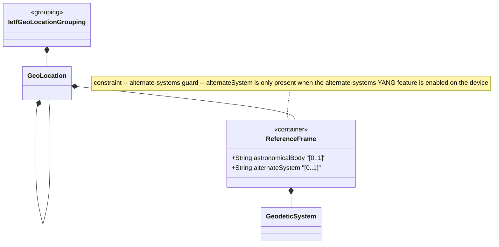

# Feature: Define Reference Frame

## Parent Epic
- [ ] #30 - [ietf-geo-location: Geographic Location Data Model](https://github.com/gintatkinson/3dgs-033/blob/main/docs/epics/epic-03-ietf-geo-location.md) (defines the frame of reference for location coordinate interpretation)

## Description
Defines the `reference-frame` container that establishes the frame of reference for all location values within the geo-location grouping. It specifies the astronomical body (e.g., Earth, Moon, Mars) upon or around which the location is defined, and optionally an alternate system identifier for non-physical coordinate systems (e.g., virtual realities). The `astronomical-body` leaf defaults to "earth" and is constrained by IAU naming conventions. The `alternate-system` leaf is gated by the `alternate-systems` YANG feature flag.

## UML Class Diagram


## Interface Requirements

### 1. Test Data Shape
```json
{
  "reference-frame": {
    "astronomical-body": "earth",
    "alternate-system": null,
    "geodetic-system": {
      "geodetic-datum": "wgs-84",
      "coord-accuracy": 0.000001,
      "height-accuracy": 0.01
    }
  }
}
```

### 2. Validation & Constraints
- `astronomical-body`: type `string` with pattern `[ -@\[-\^_-~]*` (ASCII values 32..64 and 91..126), optional, default "earth". Named per International Astronomical Union (IAU) conventions. Uppercase SHOULD be converted to lowercase. Control characters (values 0..31, 65..90, 127) are prohibited. Any preceding "the" in the name SHOULD NOT be included. Examples: "sun", "earth", "moon", "enceladus", "ceres", "67p/churyumov-gerasimenko"
- `alternate-system`: type `string`, optional, gated by `if-feature "alternate-systems"`. When present, identifies an alternate system in which the astronomical body and geodetic datum are defined (e.g., virtual realities). Normally absent, implying the natural universe. Modifies the definition but not the type of other reference-frame values. No pattern constraint specified
- All leaves are writable/configurable (config true)

### 3. Visual Layout & Arrangement
- Display as a grouped section within a PropertyGrid with a titled header "Reference Frame"
- `astronomical-body` renders as a text input field with auto-complete suggestions from IAU body names; display the default "earth" as pre-filled when configuring a new location
- `alternate-system` field is conditionally visible: only rendered when the `alternate-systems` feature flag is enabled on the device; when disabled, the field must be completely hidden from the UI layout
- Apply CSS reset (box-sizing: border-box) with scoped naming (CSS Modules/BEM); layout containment restricted to outer layout splitters, not on scrollable child panels

### 4. Interactive Flow & States
- **Loading State**: Display skeleton placeholder for reference-frame fields while data is being retrieved
- **Empty/Default State**: `astronomical-body` pre-fills with "earth" on new configuration; `alternate-system` field is hidden by default
- **Read-Only State**: Display both fields as non-editable text labels
- **Edit State**: `astronomical-body` is an editable text field; `alternate-system` is an editable text field (only when feature is enabled)
- **Feature Guard Toggle**: When `alternate-systems` feature is enabled, the `alternate-system` field fades/animates into view; when disabled, the field is removed from the layout entirely
- **Error State**: Invalid ASCII characters in `astronomical-body` trigger inline validation error with the exact character that violates the pattern constraint
- Computed-style assertions must verify the alternate-system field is not present in the DOM when the feature is disabled

## Given-When-Then Acceptance Criteria

**Scenario: Default astronomical body is earth**
- Given a new geo-location container with no specified astronomical-body
- When the reference-frame is created
- Then the astronomical-body defaults to "earth"

**Scenario: Specify a non-earth astronomical body**
- Given a geo-location on Mars
- When astronomical-body is set to "mars"
- Then the value "mars" is stored and used for coordinate interpretation

**Scenario: Reject uppercase in astronomical body**
- Given a reference-frame configuration
- When astronomical-body is set to "Earth" (uppercase)
- Then the value is accepted but SHOULD be normalized to lowercase "earth" for storage

**Scenario: Reject control characters in astronomical body**
- Given a reference-frame in edit mode
- When astronomical-body is set to a string containing byte value 10 (newline)
- Then validation fails because control characters (values 0..31) are prohibited by the pattern constraint

**Scenario: Feature guard hides alternate-system**
- Given a device that does not support the alternate-systems feature
- When the reference-frame is rendered in the PropertyGrid
- Then the alternate-system field is not visible and no alternate-system data is stored

**Scenario: Alternate-system is present when feature is enabled**
- Given a device with alternate-systems feature enabled
- When alternate-system is set to "simulation-xyz"
- Then the value "simulation-xyz" is stored alongside the reference-frame

**Scenario: Astronomical body with IAU naming**
- Given a reference-frame configuration
- When astronomical-body is set to "enceladus"
- Then the value is accepted as a valid IAU-named astronomical body (moon of Saturn)

**Scenario: Comet naming with path separator**
- Given a reference-frame configuration
- When astronomical-body is set to "67p/churyumov-gerasimenko"
- Then the value is accepted as valid (slash is within allowed ASCII range 32..64, 91..126)

## Specification Context (Verbatim)
> The frame of reference ('reference-frame') defines what the location values refer to and their meaning. The referred-to object can be any astronomical body. It could be a planet such as Earth or Mars, a moon such as Enceladus, an asteroid such as Ceres, or even a comet such as 1P/Halley. This value is specified in 'astronomical-body' and is defined by the International Astronomical Union <http://www.iau.org>. The default 'astronomical-body' value is 'earth'.

> Finally, we define an optional feature that allows for changing the system for which the above values are defined. This optional feature adds an 'alternate-system' value to the reference frame. This value is normally not present, which implies the natural universe is the system. The use of this value is intended to allow for creating virtual realities or perhaps alternate coordinate systems. The definition of alternate systems is outside the scope of this document.

## Source References
Structural Schema: [ietf-geo-location@2022-02-11.yang](https://github.com/YangModels/yang/blob/main/standard/ietf/RFC/ietf-geo-location%402022-02-11.yang) (Clause: container reference-frame, leaf astronomical-body, leaf alternate-system)
Normative Specification: [RFC 9179](https://datatracker.ietf.org/doc/rfc9179/) (Clause: Section 2.1, Frame of Reference)

## Logical UI & Layout Bindings
- **Target LUI Component:** PropertyGrid
- **Target Layout Container ID:** properties_view
- **Data Source Bindings:** `/nwi:network-inventory/nil:locations/nil:location/nil:geo-location/nil:reference-frame`
