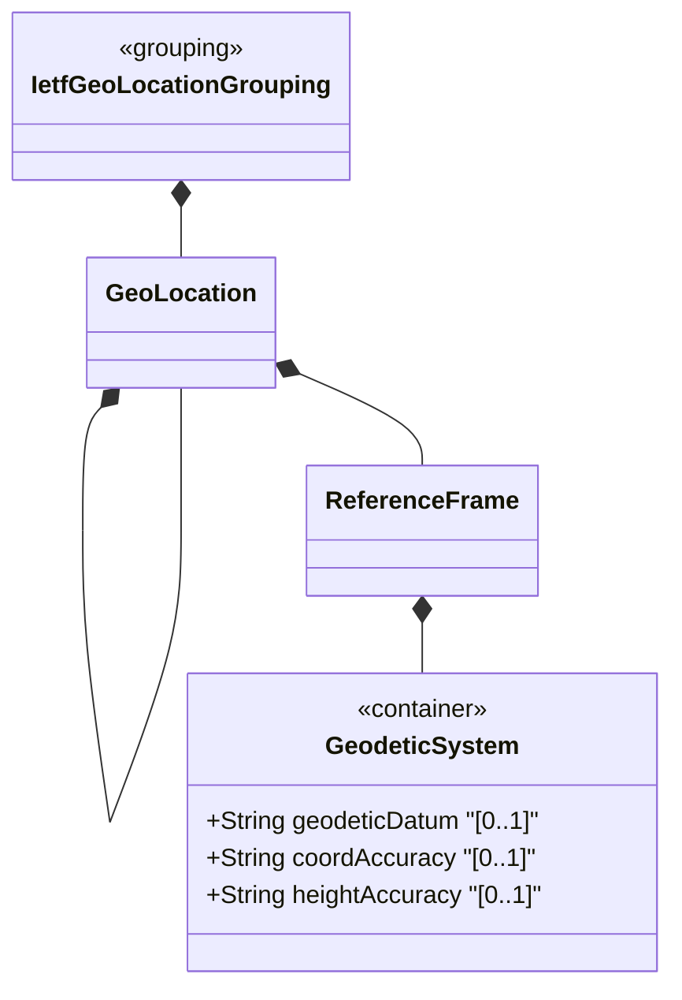

# Feature: Define Geodetic System

## Parent Epic
- [ ] #30 - [ietf-geo-location: Geographic Location Data Model](https://github.com/gintatkinson/3dgs-033/blob/main/docs/epics/epic-03-ietf-geo-location.md) (nested container within reference-frame defining coordinate system accuracy parameters)

## Description
Defines the `geodetic-system` container nested within `reference-frame` that specifies the geodetic datum and accuracy metadata for interpreting location coordinates. The `geodetic-datum` names the coordinate reference system (e.g., "wgs-84", "wgs-84-96", "wgs-84-08", "me" for lunar Mean Earth/Polar Axis). The `coord-accuracy` and `height-accuracy` fields provide optional overrides for the coordinate precision defaults implied by the datum. Accuracy values indicate how precisely coordinates and heights have been determined with respect to the coordinate system, accommodating measurement uncertainty.

## UML Class Diagram


## Interface Requirements

### 1. Test Data Shape
```json
{
  "geodetic-system": {
    "geodetic-datum": "wgs-84",
    "coord-accuracy": 0.000001,
    "height-accuracy": 0.01
  }
}
```

### 2. Validation & Constraints
- `geodetic-datum`: type `string` with pattern `[ -@\[-\^_-~]*` (ASCII values 32..64 and 91..126), optional, no explicit schema default. The specification describes an implied default of "wgs-84" when astronomical-body is "earth". Values from the IANA "Geodetic System Values" registry. Uppercase converted to lowercase; spaces converted to dashes. Examples: "wgs-84", "wgs-84-96", "wgs-84-08", "me"
- `coord-accuracy`: type `decimal64` with 6 fraction digits, optional, no default. Specifies accuracy of the latitude/longitude pair for ellipsoidal coordinates, or X/Y/Z components for Cartesian coordinates, in the datum's native units. Indicates how precisely coordinates have been determined
- `height-accuracy`: type `decimal64` with 6 fraction digits, optional, no default, units "meters". Specifies accuracy of the height value for ellipsoidal coordinates. Not used with Cartesian coordinates. Indicates how precisely heights have been determined
- All leaves are writable/configurable (config true)

### 3. Visual Layout & Arrangement
- Display as a nested sub-group within the Reference Frame section of a PropertyGrid, with a titled sub-header "Geodetic System"
- `geodetic-datum` renders as a text input with autocomplete suggesting values from the IANA Geodetic System Values registry (platform-independent suggestion mechanism)
- `coord-accuracy` and `height-accuracy` render as numeric input fields with 6 decimal places of precision, displayed in scientific or fixed notation depending on magnitude
- `height-accuracy` field displays its unit label ("meters") as a non-editable suffix
- Apply CSS reset (box-sizing: border-box) with scoped naming (CSS Modules/BEM); layout containment restricted to outer splitter panels

### 4. Interactive Flow & States
- **Loading State**: Skeleton placeholder for all three fields in the Geodetic System sub-group
- **Default/Empty State**: `geodetic-datum` displays a contextual hint "wgs-84 (default for Earth)" when no value is set and astronomical-body is "earth"; accuracy fields show empty with their respective unit labels
- **Read-Only State**: All fields displayed as non-editable formatted text with accuracy values shown to 6 decimal places
- **Edit State**: `geodetic-datum` is an editable text field; accuracy fields accept decimal input with validation against fraction-digits=6 constraint
- **Error State**: Accuracy fields reject values with more than 6 decimal places; `geodetic-datum` rejects characters outside the allowed ASCII pattern range
- Computed-style assertions must verify that accuracy fields display exactly 6 decimal places of precision when values are entered

## Given-When-Then Acceptance Criteria

**Scenario: Set geodetic datum to wgs-84**
- Given a geodetic-system configuration
- When geodetic-datum is set to "wgs-84"
- Then the system uses the World Geodetic System 1984 for coordinate interpretation

**Scenario: Default geodetic datum for Earth**
- Given a geo-location on Earth with no specified geodetic-datum
- When coordinates are interpreted
- Then the system uses "wgs-84" as the default geodetic datum per the specification

**Scenario: Set lunar geodetic datum**
- Given a geo-location on the Moon
- When geodetic-datum is set to "me" (Mean Earth/Polar Axis)
- Then the system uses the lunar coordinate reference system for position interpretation

**Scenario: Set coord-accuracy with 6 decimal places**
- Given a geodetic-system configuration
- When coord-accuracy is set to 0.000001 (1e-6)
- Then the value is stored with full 6-fraction-digit precision

**Scenario: Reject coord-accuracy exceeding fraction digits**
- Given a geodetic-system in edit mode
- When coord-accuracy is set to 0.0000001 (7 decimal places)
- Then validation fails because the value exceeds the 6 fraction-digit type constraint

**Scenario: Set height-accuracy in meters**
- Given a geodetic-system configuration for ellipsoidal coordinates
- When height-accuracy is set to 0.01 (1 centimeter)
- Then the value is stored with units of meters

**Scenario: Height-accuracy not used with Cartesian coordinates**
- Given a geo-location using Cartesian coordinates (x, y, z)
- When height-accuracy is configured to 0.01
- Then the field is stored but per specification semantics it is not used with Cartesian coordinates (no schema-level enforcement of this semantic constraint)

**Scenario: Validate datum against ASCII pattern**
- Given a geodetic-system in edit mode
- When geodetic-datum is set to a string containing a control character (byte value < 32)
- Then validation fails because the character is outside the pattern range [ -@\[-\^_-~]*

## Specification Context (Verbatim)
> In addition to identifying the astronomical body, we also need to define the meaning of the coordinates (e.g., latitude and longitude) and the definition of 0-height. This is done with a 'geodetic-datum' value. The default value for 'geodetic-datum' is 'wgs-84' (i.e., the World Geodetic System), which is used by the Global Positioning System (GPS) among many others. We define an IANA registry for specifying standard values for the 'geodetic-datum'.

> In addition to the 'geodetic-datum' value, we allow overriding the coordinate and height accuracy using 'coord-accuracy' and 'height-accuracy', respectively. When specified, these values override the defaults implied by the 'geodetic-datum' value.

## Source References
Structural Schema: [ietf-geo-location@2022-02-11.yang](https://github.com/YangModels/yang/blob/main/standard/ietf/RFC/ietf-geo-location%402022-02-11.yang) (Clause: container geodetic-system, leaf geodetic-datum, leaf coord-accuracy, leaf height-accuracy)
Normative Specification: [RFC 9179](https://datatracker.ietf.org/doc/rfc9179/) (Clause: Section 2.1, Frame of Reference; Section 6.1, Geodetic System Values Registry)

## Logical UI & Layout Bindings
- **Target LUI Component:** PropertyGrid
- **Target Layout Container ID:** properties_view
- **Data Source Bindings:** `/nwi:network-inventory/nil:locations/nil:location/nil:geo-location/nil:reference-frame/nil:geodetic-system`
