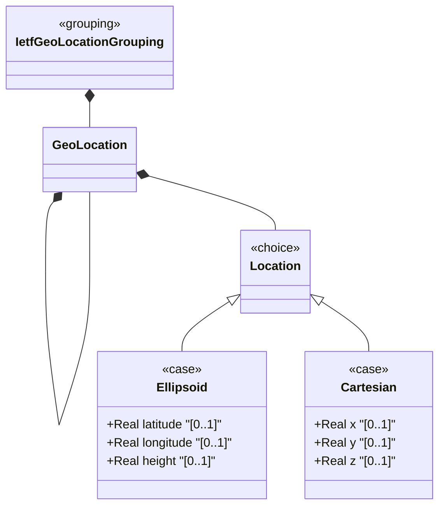

# Feature: Define Location Coordinate Choice

## Parent Epic
- [ ] #30 - [ietf-geo-location: Geographic Location Data Model](https://github.com/gintatkinson/3dgs-033/blob/main/docs/epics/epic-03-ietf-geo-location.md) (YANG choice node selecting between ellipsoidal and Cartesian coordinate representations)

## Description
Defines the `location` YANG choice node that selects between two mutually exclusive coordinate representation alternatives: ellipsoidal (latitude/longitude/height) and Cartesian (x/y/z). This choice enforces that at any given time, a geo-location uses exactly one coordinate system. The choice itself carries no data leaves; all data attributes are defined within the constituent cases. The choice is optional — a geo-location may be configured with no coordinate data at all.

## UML Class Diagram


## Interface Requirements

### 1. Test Data Shape
```json
{
  "location-ellipsoid": {
    "latitude": 40.73297,
    "longitude": -74.007696,
    "height": 35.0
  },
  "location-cartesian": {
    "x": 1335832.5,
    "y": -4652426.0,
    "z": 4138321.5
  }
}
```

### 2. Validation & Constraints
- The `location` choice is optional (no mandatory constraint); a geo-location may have no coordinate data
- Exactly one alternative (ellipsoid or cartesian) may be active at any time
- The choice itself carries no constraints; constraints are defined on the individual case leaves
- When switching between alternatives, the previous case's values are invalidated/replaced
- All case leaves are individually optional within their respective cases

### 3. Visual Layout & Arrangement
- Display as a mode toggle within the PropertyGrid: a segmented control or radio group labeled "Coordinate System" with two options: "Ellipsoidal" and "Cartesian"
- Selecting one option reveals the corresponding coordinate fields below the toggle
- The inactive alternative's fields are hidden from the layout entirely (not merely grayed out)
- Fields are grouped with a subtle border and background distinction to visually separate the coordinate section from other container children
- Apply CSS reset with scoped naming; layout containment restricted to outer splitter panels

### 4. Interactive Flow & States
- **Loading State**: Skeleton placeholder for the coordinate toggle and the current active alternative's fields
- **No Selection State**: When no location data is present, the toggle shows neither option selected and no coordinate fields are visible; an informational message reads "No coordinate data configured"
- **Ellipsoid Active State**: Toggle shows "Ellipsoidal" selected; latitude, longitude, and height fields are visible and editable
- **Cartesian Active State**: Toggle shows "Cartesian" selected; x, y, and z fields are visible and editable
- **Switch Warning**: When the user switches between alternatives and one alternative already has data, display a confirmation prompt warning that switching will discard the current alternative's coordinate values
- **Read-Only State**: Toggle is disabled; only the active alternative's fields are shown as non-editable text
- Computed-style assertions must verify that fields belonging to the inactive alternative are not present in the DOM

## Given-When-Then Acceptance Criteria

**Scenario: Select ellipsoidal coordinates**
- Given a geo-location with no coordinate data
- When the user selects "Ellipsoidal" as the coordinate system
- Then latitude, longitude, and height fields become visible and editable

**Scenario: Select Cartesian coordinates**
- Given a geo-location with no coordinate data
- When the user selects "Cartesian" as the coordinate system
- Then x, y, and z fields become visible and editable

**Scenario: Switch from ellipsoid to Cartesian**
- Given a geo-location with latitude=40.73, longitude=-74.01, height=35 set
- When the user switches the coordinate system to "Cartesian"
- Then the system prompts for confirmation and upon confirmation, the ellipsoid values are discarded and x/y/z fields appear empty

**Scenario: Geo-location with no coordinate choice**
- Given a geo-location container with reference-frame configured
- When no location choice alternative is selected
- Then the geo-location is valid and stores only the reference-frame data with no coordinates

**Scenario: Choice is exclusive**
- Given a geo-location with ellipsoidal coordinates active
- When the data is serialized
- Then only the ellipsoid case leaves (latitude, longitude, height) are present; Cartesian leaves (x, y, z) are absent from the data tree

**Scenario: Cartesian choice is exclusive**
- Given a geo-location with Cartesian coordinates active
- When the data is serialized
- Then only the Cartesian case leaves (x, y, z) are present; ellipsoid leaves are absent

## Specification Context (Verbatim)
> This is the location on, or relative to, the astronomical object. It is specified using two or three coordinate values. These values are given either as 'latitude', 'longitude', and an optional 'height', or as Cartesian coordinates of 'x', 'y', and 'z'. For the standard location choice, 'latitude' and 'longitude' are specified as decimal degrees, and the 'height' value is in fractions of meters. For the Cartesian choice, 'x', 'y', and 'z' are in fractions of meters. In both choices, the exact meanings of all the values are defined by the 'geodetic-datum' value in Section 2.1.

## Source References
Structural Schema: [ietf-geo-location@2022-02-11.yang](https://github.com/YangModels/yang/blob/main/standard/ietf/RFC/ietf-geo-location%402022-02-11.yang) (Clause: choice location, case ellipsoid, case cartesian)
Normative Specification: [RFC 9179](https://datatracker.ietf.org/doc/rfc9179/) (Clause: Section 2.2, Location)

## Logical UI & Layout Bindings
- **Target LUI Component:** PropertyGrid
- **Target Layout Container ID:** properties_view
- **Data Source Bindings:** `/nwi:network-inventory/nil:locations/nil:location/nil:geo-location`
