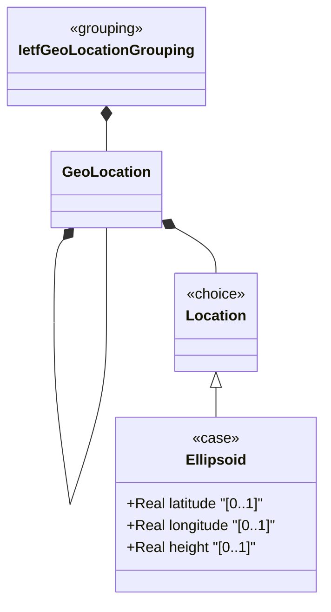

# Feature: Define Ellipsoid Coordinates

## Parent Epic
- [ ] #30 - [ietf-geo-location: Geographic Location Data Model](https://github.com/gintatkinson/3dgs-033/blob/main/docs/epics/epic-03-ietf-geo-location.md) (ellipsoidal coordinate alternative within the location choice, providing latitude-longitude-height representation)

## Description
Defines the `ellipsoid` case of the location choice, representing a geographic point using latitude, longitude, and an optional height. Latitude and longitude are measured in decimal degrees with 16 fractional digits of precision, conforming to ISO 6709:2008. Height is measured in meters from a reference zero value with 6 fractional digits. All values' exact meaning and precision are defined by the parent reference frame's geodetic datum.

## UML Class Diagram


## Interface Requirements

### 1. Test Data Shape
```json
{
  "latitude": 40.73297,
  "longitude": -74.007696,
  "height": 35.0
}
```

### 2. Validation & Constraints
- `latitude`: type `decimal64` with 16 fraction digits, optional, units "decimal degrees". The definition and precision of this measurement is indicated by the reference frame. Valid range implied by the reference frame's geodetic datum (e.g., -90.0 to +90.0 for Earth with standard datum)
- `longitude`: type `decimal64` with 16 fraction digits, optional, units "decimal degrees". The definition and precision indicated by the reference frame. Valid range implied by the geodetic datum (e.g., -180.0 to +180.0 for Earth with standard datum)
- `height`: type `decimal64` with 6 fraction digits, optional, units "meters". Height from a reference 0 value defined by the reference frame. The precision and zero value are defined by the reference frame
- All leaves individually optional. A minimum of latitude+longitude (2 values) is required for a meaningful geographic point per ISO 6709:2008; height is the optional third coordinate
- All leaves are writable/configurable (config true)
- Coordinate range constraints are not explicitly encoded in the YANG type but are implied by the geodetic datum (semantic, not structural constraint)

### 3. Visual Layout & Arrangement
- Display as three input fields arranged vertically within a PropertyGrid sub-group labeled "Coordinates (Ellipsoidal)"
- `latitude` and `longitude` display with unit suffix "decimal degrees" and 16 decimal place precision
- `height` displays with unit suffix "meters" and 6 decimal place precision
- Fields are laid out in logical order: latitude first (north-south), longitude second (east-west), height third (elevation)
- Apply CSS reset (box-sizing: border-box) with scoped naming (CSS Modules/BEM); layout containment restricted to outer splitters only

### 4. Interactive Flow & States
- **Loading State**: Skeleton placeholder for all three coordinate fields
- **Empty/Default State**: All three fields appear empty with placeholder text showing their units (e.g., "0.0000000000000000 decimal degrees" for latitude)
- **Read-Only State**: Coordinates displayed as formatted decimal numbers with full precision; unit labels displayed as non-editable suffixes
- **Edit State**: Fields accept decimal numeric input; real-time validation for fraction-digit overflow (>16 digits for lat/long, >6 digits for height) triggers inline error indicators
- **Coordinate Validity**: While range constraints are not structurally enforced, the UI may provide contextual warnings (e.g., latitude outside [-90, 90] for Earth) based on the active geodetic datum
- **Error State**: Invalid numeric formats or precision-overflow values show inline red border and error message text
- Computed-style assertions must verify error highlight colors match token-defined values

## Given-When-Then Acceptance Criteria

**Scenario: Store ellipsoid coordinates**
- Given a geo-location with reference frame set to Earth/wgs-84
- When latitude is set to 40.73297 and longitude to -74.007696
- Then the values are stored with 16 decimal-digit precision

**Scenario: Store ellipsoid coordinates with height**
- Given a geo-location with ellipsoidal coordinates active
- When latitude=48.8583424, longitude=2.3375084, and height=35 are configured
- Then all three values are stored and the height is recorded in meters

**Scenario: Store latitude only without longitude**
- Given a geo-location with ellipsoidal coordinates
- When latitude is set to 40.73297 but longitude is not provided
- Then the value is stored (individual leaves are optional), but the coordinate pair is incomplete for geographic positioning per ISO 6709:2008

**Scenario: Precision limit for latitude**
- Given an ellipsoid coordinate field
- When latitude is set to a value with 17 decimal digits (e.g., 40.73297000000000001)
- Then validation fails because the value exceeds the 16 fraction-digit type constraint

**Scenario: Precision limit for height**
- Given an ellipsoid coordinate field
- When height is set to a value with 7 decimal digits (e.g., 35.0000001)
- Then validation fails because the value exceeds the 6 fraction-digit type constraint

**Scenario: Negative longitude**
- Given a geo-location with ellipsoidal coordinates
- When longitude is set to -74.007696
- Then the negative value is accepted (representing west of the prime meridian)

**Scenario: Negative latitude**
- Given a geo-location with ellipsoidal coordinates
- When latitude is set to -33.8688
- Then the negative value is accepted (representing south of the equator)

**Scenario: Height zero reference**
- Given a geo-location with ellipsoidal coordinates
- When height is set to 0.0
- Then the value is accepted (representing exactly at the reference zero level defined by the geodetic datum)

## Specification Context (Verbatim)
> This is the location on, or relative to, the astronomical object. It is specified using two or three coordinate values. These values are given either as 'latitude', 'longitude', and an optional 'height' ... For the standard location choice, 'latitude' and 'longitude' are specified as decimal degrees, and the 'height' value is in fractions of meters. ... the exact meanings of all the values are defined by the 'geodetic-datum' value in Section 2.1.

> This specification conforms to [ISO.6709.2008].

## Source References
Structural Schema: [ietf-geo-location@2022-02-11.yang](https://github.com/YangModels/yang/blob/main/standard/ietf/RFC/ietf-geo-location%402022-02-11.yang) (Clause: case ellipsoid, leaf latitude, leaf longitude, leaf height)
Normative Specification: [RFC 9179](https://datatracker.ietf.org/doc/rfc9179/) (Clause: Section 2.2, Location; Section 4, ISO 6709:2008 Conformance)

## Logical UI & Layout Bindings
- **Target LUI Component:** PropertyGrid
- **Target Layout Container ID:** properties_view
- **Data Source Bindings:** `/nwi:network-inventory/nil:locations/nil:location/nil:geo-location`
