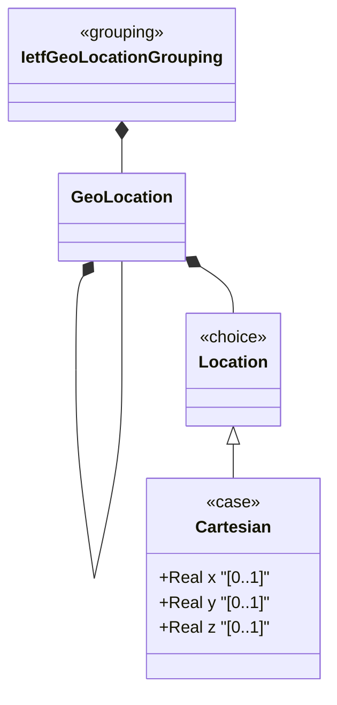

# Feature: Define Cartesian Coordinates

## Parent Epic
- [ ] #30 - [ietf-geo-location: Geographic Location Data Model](https://github.com/gintatkinson/3dgs-033/blob/main/docs/epics/epic-03-ietf-geo-location.md) (Cartesian coordinate alternative within the location choice, providing X-Y-Z representation)

## Description
Defines the `cartesian` case of the location choice, representing a geographic point using three-dimensional Cartesian coordinates (x, y, z) measured in meters with 6 fractional digits of precision. The exact meaning of each axis and the coordinate origin are defined by the parent reference frame's geodetic datum. This coordinate system is particularly useful for non-Earth astronomical bodies or when coordinate transformations to a Cartesian frame have been performed.

## UML Class Diagram


## Interface Requirements

### 1. Test Data Shape
```json
{
  "x": 1335832.5,
  "y": -4652426.0,
  "z": 4138321.5
}
```

### 2. Validation & Constraints
- `x`: type `decimal64` with 6 fraction digits, optional, units "meters". The X value as defined by the reference frame
- `y`: type `decimal64` with 6 fraction digits, optional, units "meters". The Y value as defined by the reference frame
- `z`: type `decimal64` with 6 fraction digits, optional, units "meters". The Z value as defined by the reference frame
- All three leaves are individually optional
- All leaves are writable/configurable (config true)
- No explicit range constraints in the YANG type; axis meanings are defined entirely by the geodetic datum
- The height-accuracy field from geodetic-system is explicitly not used with Cartesian coordinates per the specification

### 3. Visual Layout & Arrangement
- Display as three input fields arranged vertically within a PropertyGrid sub-group labeled "Coordinates (Cartesian)"
- Each field displays its axis label (X, Y, Z) with unit suffix "meters" and 6 decimal place precision
- Fields are laid out in order: X, Y, Z
- Apply CSS reset (box-sizing: border-box) with scoped naming (CSS Modules/BEM); layout containment restricted to outer splitters only

### 4. Interactive Flow & States
- **Loading State**: Skeleton placeholder for all three coordinate fields
- **Empty/Default State**: All three fields appear empty with placeholder text showing the axis name and units (e.g., "X (meters)")
- **Read-Only State**: Coordinates displayed as formatted decimal numbers with 6 decimal places; unit labels displayed as non-editable suffixes
- **Edit State**: Fields accept decimal numeric input; real-time validation for fraction-digit overflow (>6 digits) triggers inline error indicators
- **Error State**: Invalid numeric formats or precision-overflow values show inline red border and error message text
- Computed-style assertions must verify error highlight colors match token-defined values and that each field displays exactly 6 decimal places

## Given-When-Then Acceptance Criteria

**Scenario: Store Cartesian coordinates**
- Given a geo-location with reference frame set and Cartesian coordinates active
- When x=1335832.5, y=-4652426.0, and z=4138321.5 are configured
- Then all three values are stored in meters with 6 decimal-digit precision

**Scenario: Store partial Cartesian coordinates**
- Given a geo-location with Cartesian coordinates active
- When x and y values are set but z is not provided
- Then the x and y values are stored; z remains empty (leaves are individually optional)

**Scenario: Precision limit exceeded**
- Given a Cartesian coordinate field
- When x is set to a value with 7 decimal digits (e.g., 100.0000001)
- Then validation fails because the value exceeds the 6 fraction-digit type constraint

**Scenario: Negative Cartesian values**
- Given a geo-location with Cartesian coordinates
- When y is set to -4652426.0
- Then the negative value is accepted as valid

**Scenario: Zero coordinate values**
- Given a geo-location with Cartesian coordinates
- When x=0.0, y=0.0, z=0.0 are configured
- Then all values are accepted (representing the coordinate origin as defined by the reference frame)

**Scenario: Height-accuracy not applicable to Cartesian**
- Given a geo-location with Cartesian coordinates and height-accuracy set in geodetic-system
- When the coordinate data is displayed
- Then height-accuracy is present in the geodetic-system data but is semantically not applied to Cartesian X/Y/Z values per specification Section 2.1

**Scenario: Coordinate axis meaning from reference frame**
- Given a geo-location with Cartesian coordinates and a specific geodetic datum
- When the X, Y, Z values are stored
- Then the exact meaning of each axis (e.g., Earth-Centered Earth-Fixed for WGS-84) is defined by the geodetic datum, not by additional schema constraints

## Specification Context (Verbatim)
> This is the location on, or relative to, the astronomical object. It is specified using two or three coordinate values. These values are given ... as Cartesian coordinates of 'x', 'y', and 'z'. ... For the Cartesian choice, 'x', 'y', and 'z' are in fractions of meters. In both choices, the exact meanings of all the values are defined by the 'geodetic-datum' value in Section 2.1.

> The accuracy of the latitude/longitude pair for ellipsoidal coordinates, or the X, Y, and Z components for Cartesian coordinates. When coord-accuracy is specified, it indicates how precisely the coordinates in the associated list of locations have been determined with respect to the coordinate system defined by the geodetic-datum.

> The accuracy of the height value for ellipsoidal coordinates; this value is not used with Cartesian coordinates.

## Source References
Structural Schema: [ietf-geo-location@2022-02-11.yang](https://github.com/YangModels/yang/blob/main/standard/ietf/RFC/ietf-geo-location%402022-02-11.yang) (Clause: case cartesian, leaf x, leaf y, leaf z)
Normative Specification: [RFC 9179](https://datatracker.ietf.org/doc/rfc9179/) (Clause: Section 2.2, Location)

## Logical UI & Layout Bindings
- **Target LUI Component:** PropertyGrid
- **Target Layout Container ID:** properties_view
- **Data Source Bindings:** `/nwi:network-inventory/nil:locations/nil:location/nil:geo-location`
