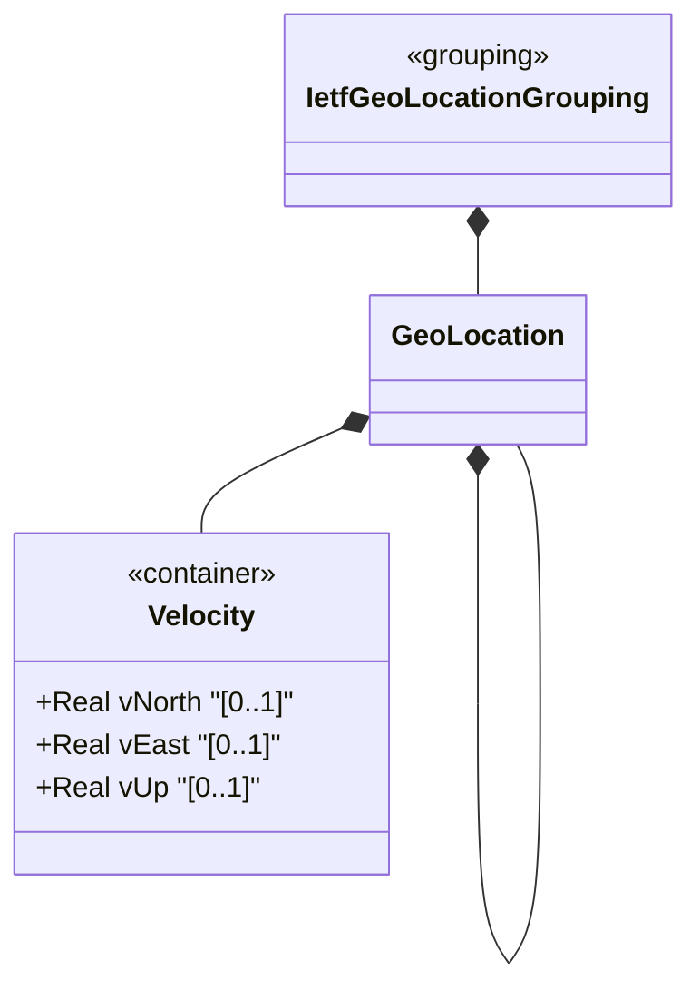

# Feature: Define Velocity Vector

## Parent Epic
- [ ] #30 - [ietf-geo-location: Geographic Location Data Model](https://github.com/gintatkinson/3dgs-033/blob/main/docs/epics/epic-03-ietf-geo-location.md) (motion vector container providing speed components for objects in relatively stable motion)

## Description
Defines the `velocity` container that describes the motion of an object at the time given by the geo-location's timestamp. It provides a three-dimensional velocity vector with components v-north (toward true north), v-east (perpendicular to the right of true north), and v-up (away from the center of mass), all measured in meters per second with 12 fractional digits of precision. The velocity can be converted to two-dimensional speed and heading using standard vector formulas. This container supports tracking slow movement such as continental drift for high-accuracy applications with infrequent data updates.

## UML Class Diagram


## Interface Requirements

### 1. Test Data Shape
```json
{
  "velocity": {
    "v-north": 0.5,
    "v-east": 0.0,
    "v-up": 0.0
  }
}
```

### 2. Validation & Constraints
- `v-north`: type `decimal64` with 12 fraction digits, optional, units "meters per second". Rate of change (speed) toward true north as defined by the geodetic system
- `v-east`: type `decimal64` with 12 fraction digits, optional, units "meters per second". Rate of change (speed) perpendicular to the right of true north as defined by the geodetic system
- `v-up`: type `decimal64` with 12 fraction digits, optional, units "meters per second". Rate of change (speed) away from the center of mass
- All three leaves are individually optional
- All leaves are writable/configurable (config true)
- Derived values: speed = sqrt(v_north^2 + v_east^2), heading = arctan(v_east / v_north)
- The velocity vector describes motion at the specific time given by the geo-location timestamp

### 3. Visual Layout & Arrangement
- Display as a grouped section within a PropertyGrid with a titled sub-header "Velocity"
- Three fields displayed vertically: V-North, V-East, V-Up
- Each field displays with unit suffix "meters per second" and 12 decimal place precision
- Optionally include computed derived fields (speed and heading) as read-only display values below the three vector components, updated reactively as vector values change
- Apply CSS reset (box-sizing: border-box) with scoped naming; layout containment restricted to outer splitters

### 4. Interactive Flow & States
- **Loading State**: Skeleton placeholder for all three velocity component fields
- **Empty State**: All three fields appear empty with placeholder text including unit labels; the derived speed/heading fields display "N/A" or are absent
- **Read-Only State**: Velocity fields displayed as formatted decimal numbers with 12 decimal places and unit suffixes; derived speed and heading shown as computed read-only labels
- **Edit State**: All three fields accept decimal numeric input; derived fields update reactively; precision overflow (>12 fraction digits) triggers inline validation
- **Error State**: Invalid numeric format or precision-overflow values trigger inline red border and error message per field
- Computed-style assertions must verify derived speed/heading fields update within one render cycle of vector component changes

## Given-When-Then Acceptance Criteria

**Scenario: Store northward velocity**
- Given a geo-location with a timestamp
- When v-north is set to 0.5 meters per second and v-east and v-up are 0.0
- Then the object is recorded as moving north at 0.5 m/s with speed 0.5 and heading 0 degrees (due north)

**Scenario: Store full 3D velocity vector**
- Given a geo-location with velocity data
- When v-north=3.0, v-east=4.0, v-up=0.1 are configured
- Then the speed is calculable as 5.0 m/s (sqrt(3^2 + 4^2)) and heading as arctan(4/3) relative to true north

**Scenario: Store velocity with 12-digit precision**
- Given a velocity component field
- When v-north is set to 0.123456789012
- Then the value is stored with full 12-fraction-digit precision

**Scenario: Precision limit exceeded**
- Given a velocity component field
- When v-east is set to a value with 13 decimal digits
- Then validation fails because the value exceeds the 12 fraction-digit type constraint

**Scenario: Negative velocity components**
- Given a velocity container
- When v-north is set to -2.0
- Then the negative value is accepted (representing movement toward true south)

**Scenario: Velocity with no timestamp**
- Given a geo-location with velocity data but no timestamp
- When the data is queried
- Then the velocity values are stored but the time reference for the motion is undefined per schema semantics

**Scenario: Partial velocity vector**
- Given a velocity container
- When only v-north and v-up are configured (v-east omitted)
- Then the two configured values are stored and v-east is absent; derived heading is not computable without both horizontal components

## Specification Context (Verbatim)
> Support is added for objects in relatively stable motion. For objects in relatively stable motion, the grouping provides a three-dimensional vector value. The components of the vector are 'v-north', 'v-east', and 'v-up', which are all given in fractional meters per second. The values 'v-north' and 'v-east' are relative to true north as defined by the reference frame for the astronomical body; 'v-up' is perpendicular to the plane defined by 'v-north' and 'v-east', and is pointed away from the center of mass.

> To derive the two-dimensional heading and speed, one would use the following formulas: speed = sqrt(v_north^2 + v_east^2), heading = arctan(v_east / v_north)

> For some applications that demand high accuracy and where the data is infrequently updated, this velocity vector can track very slow movement such as continental drift.

> Tracking more complex forms of motion is outside the scope of this work. The intent of the grouping being defined here is to identify where something is located, and generally this is expected to be somewhere on, or relative to, Earth (or another astronomical body).

## Source References
Structural Schema: [ietf-geo-location@2022-02-11.yang](https://github.com/YangModels/yang/blob/main/standard/ietf/RFC/ietf-geo-location%402022-02-11.yang) (Clause: container velocity, leaf v-north, leaf v-east, leaf v-up)
Normative Specification: [RFC 9179](https://datatracker.ietf.org/doc/rfc9179/) (Clause: Section 2.3, Motion)

## Logical UI & Layout Bindings
- **Target LUI Component:** PropertyGrid
- **Target Layout Container ID:** properties_view
- **Data Source Bindings:** `/nwi:network-inventory/nil:locations/nil:location/nil:geo-location/nil:velocity`
