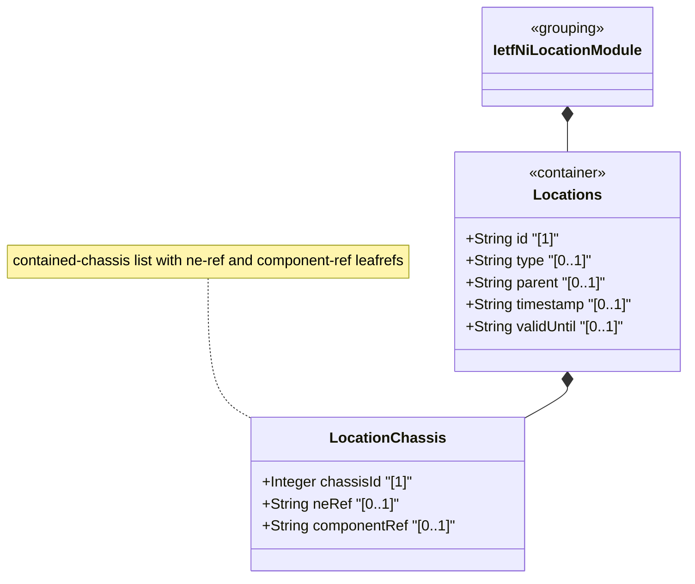

# Feature: Define Locations Container

## Parent Epic
- [ ] #49 - [ietf-ni-location: Network Inventory Location](https://github.com/gintatkinson/3dgs-033/blob/main/docs/epics/epic-04-ietf-ni-location.md) (top-level augment container anchoring all location data in the network inventory)

## Description
Defines the `locations` container that augments `/nwi:network-inventory` to add comprehensive location information to the network inventory model. This read-only container (`config false`) serves as the structural root for all location-related data. It houses the `location` list representing hierarchical geographical locations (sites, buildings, rooms) and the `racks` container for physical equipment rack information. Each location entry carries an identifier, type, optional parent reference for hierarchical nesting, temporal metadata (timestamp and valid-until), a physical address, geo-location coordinates, and a list of directly deployed chassis (`contained-chassis`). Each contained-chassis entry is keyed by `chassis-id` (uint32) and references a network element via `ne-ref` (leafref to `/nwi:network-inventory/nwi:network-elements/nwi:network-element/nwi:ne-id`) and a specific component via `component-ref` (leafref to the component within the referenced network element). This supports distributed chassis components that are logically part of a network element but physically deployed at the location without a rack enclosure.

## UML Class Diagram


## Interface Requirements

### 1. Test Data Shape
```json
{
  "locations": {
    "location": [
      {
        "id": "Foo-Enterprise-Campus",
        "uuid": "550e8400-e29b-41d4-a716-446655440000",
        "name": "Foo Enterprise Campus",
        "type": "site",
        "parent": null,
        "timestamp": "2026-01-15T08:30:00Z",
        "valid-until": "2030-12-31T23:59:59Z"
      }
    ]
  }
}
```

### 2. Validation & Constraints
- `locations`: container type, read-only (`config false`), mandatory presence via augment, no explicit cardinality constraints beyond schema structure
- `location`: list type, keyed by `id`, zero-or-more entries, read-only operational state data
- `id`: type `string`, mandatory (list key), uniquely identifies each location entry within the locations container
- `uuid`: type `yang:uuid` (imported from `ietf-yang-types`), optional, provides a globally unique identifier for the location
- `name`: type `string`, optional, human-readable name for the location
- `alias`: type `string`, optional, alternative name or shorthand for the location
- `description`: type `string`, optional, free-text description of the location
- `type`: type `string`, optional, free-form classification of the location (e.g., "site", "equipment room", "building", "floor", "pole", "roof") — string-based to allow operators to flexibly define custom location types without requiring model extensions
- `parent`: type `leafref` referencing `../../location/id`, optional, enables hierarchical nesting of locations (e.g., building within site, room within building)
- `timestamp`: type `yang:date-and-time`, optional, records when the location information was last captured
- `valid-until`: type `yang:date-and-time`, optional, marks the expiration time of this location data. If unset, the location has no specific expiration and is considered valid indefinitely
- `contained-chassis`: list type, keyed by `chassis-id`, zero-or-more entries, read-only. Contains chassis instances directly deployed at this location without a rack enclosure
- `chassis-id`: type `uint32`, mandatory (list key), unique identifier for this chassis instance at the location
- `ne-ref`: type `leafref` to `/nwi:network-inventory/nwi:network-elements/nwi:network-element/nwi:ne-id`, optional. References the network element this chassis belongs to. Multiple chassis entries may reference the same ne-ref for distributed systems
- `component-ref`: type `leafref` to `/nwi:network-inventory/nwi:network-elements/nwi:network-element[nwi:ne-id=current()/../ne-ref]/nwi:components/nwi:component/nwi:component-id`, optional. References the specific chassis component within the network element
- No additional constraints specified in schema beyond type definitions

### 3. Visual Layout & Arrangement
- Display the locations list as a hierarchical tree within a `PropertyGrid`, rendering nested parent-child relationships with collapsible expand/collapse controls
- Each location entry displays essential metadata (id, name, type) in a compact summary line, expandable to reveal full detail including timestamps, physical address, geo-location, and contained-chassis lists
- The parent-child hierarchy uses valid DOM nesting: recursive lists nested inside parent list-items to represent the tree structure
- Apply CSS reset (`box-sizing: border-box`) with scoped naming (CSS Modules/BEM) to prevent specificity conflicts from parent layout styles
- Layout containment restricted to outer splitter panels only; do not apply containment on scrollable child sections within the PropertyGrid
- Timestamp fields render as formatted date-time strings with locale-aware display driven by tokenized formatting
- The `valid-until` field visually distinguishes expired locations (valid-until in the past) from currently valid ones using status-aware styling tokens

### 4. Interactive Flow & States
- **Loading State**: Display skeleton placeholders for the location list while network inventory data is being fetched from the data source
- **Empty State**: When no locations exist in the inventory, display an empty state indicator with a message describing that no locations have been configured
- **Read-Only State**: All data nodes under `locations` are read-only (`config false`); values render as non-editable text labels, no inline editing controls are provided
- **Expanded State**: Selecting a location entry expands it to show full details including child sub-containers (physical-address, geo-location) and associated lists (contained-chassis)
- **Error State**: Highlight entries where `valid-until` has passed with an expired/expired-soon visual state distinct from valid entries
- Computed-style assertions must verify scroll dimensions match container boundaries and that error-state highlight colors match token-defined values

## Given-When-Then Acceptance Criteria

**Scenario: Retrieve location list from network inventory**
- Given a network inventory with configured locations
- When the locations container is queried via YANG retrieval operations
- Then the system returns a read-only list of location entries each keyed by a unique id

**Scenario: Location with hierarchical parent-child nesting**
- Given a building location with id "Building-A" and a room location with id "Room-101"
- When the room's parent leaf is set to "Building-A" via leafref
- Then the system recognizes Room-101 as a child location physically contained within Building-A

**Scenario: Location with no parent**
- Given a top-level site location with id "Site-X"
- When the parent leaf is absent (not configured)
- Then the location is treated as a root-level location in the hierarchy

**Scenario: Location type classification**
- Given a configuration with custom type string "roof"
- When the location entry is stored
- Then the type field accepts the free-form string without requiring model extension

**Scenario: Location with no expiration**
- Given a location entry with no valid-until value set
- When the location data is queried
- Then the location is considered valid indefinitely

**Scenario: Location with past expiration time**
- Given a location entry with valid-until set to a timestamp in the past
- When the location data is rendered in the PropertyGrid
- Then the valid-until field displays with an expired visual state distinct from currently valid entries

**Scenario: Timestamp records location capture time**
- Given a location entry with timestamp "2026-01-15T08:30:00Z"
- When the location data is queried
- Then the timestamp reflects when this location information was last recorded

**Scenario: Invalid parent leafref**
- Given a location entry with parent referencing a non-existent location id
- When the leafref constraint is validated
- Then the system rejects the reference as unresolved

**Scenario: Duplicate location id**
- Given an existing location with id "Site-X" in the same locations container
- When a second location entry attempts to use the same id
- Then the system rejects the duplicate key constraint

**Scenario: Empty locations container**
- Given a network inventory with no location data configured
- When the PropertyGrid renders the locations section
- Then an empty state message indicates no locations have been recorded

## Specification Context (Verbatim)
> The "location" list is generalized to support a variety of geographic location, such as sites, rooms, buildings.

> A site represents a general geographic location to group a set of NEs and corresponding inventory components. NEs, racks, equipment rooms, and buildings can be grouped within a site.

> A room is a facility, a space for network elements and other equipment (such as servers, storage) with power supply systems, air conditioning system, etc.

> Locations can be nested to form a hierarchy. For example, buildings may be within a site, and a room may be within a building.

> The "location-type" is defined as a YANG identity to identify the type of an inventory location, which may be site, equipment room, building, etc.

> This model serves as a complement to the base inventory, providing a read-only perspective of network inventory location information known to the controller. It reports the physical locations of network elements and components installed in the network, enabling queries for site, rack, and other location-related information associated with network elements and components.

> Before using a location for field dispatch or planning, verification is required to ensure at least one of physical-address or geo-location is present, and that the valid-until leaf is either not present or indicates a future time. Once the valid-until time has passed, the location MUST be considered stale and MUST NOT be used for operational purposes.

> Data quality is indicated through timestamps recording the last update time, as well as an optional expiration time for location validity.

## Source References
Structural Schema: [ietf-ni-location@2026-07-06.yang](https://github.com/ietf-ivy-wg/network-inventory-location/blob/main/ietf-ni-location.yang) (Clause: container locations)
Normative Specification: [draft-ietf-ivy-network-inventory-location-06](https://datatracker.ietf.org/doc/html/draft-ietf-ivy-network-inventory-location) (Clause: Section 2, Hierarchical Locations of Network Inventory)

## Logical UI & Layout Bindings
- **Target LUI Component:** PropertyGrid
- **Target Layout Container ID:** properties_view
- **Data Source Bindings:** `/nwi:network-inventory/nil:locations`
