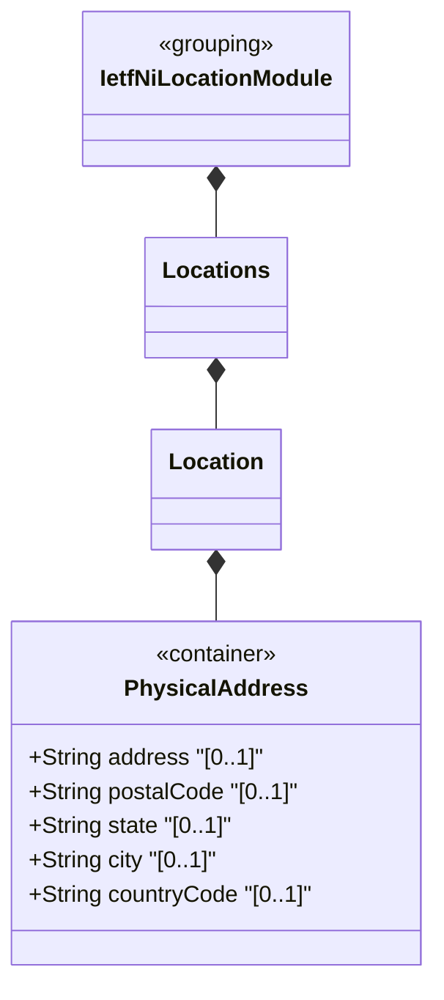

# Feature: Define Physical Address

## Parent Epic
- [ ] #49 - [ietf-ni-location: Network Inventory Location](https://github.com/gintatkinson/3dgs-033/blob/main/docs/epics/epic-04-ietf-ni-location.md) (nested container within location providing postal address details)

## Description
Defines the `physical-address` container nested within each `location` entry in the network inventory. This container captures human-readable postal address information including street address, postal code, state or region, city, and an ISO ALPHA-2 country code. The country-code leaf enforces a two-letter uppercase alphabetic pattern constraint. All five leaf nodes are optional strings, allowing partial address recording where complete address data is unavailable. This container supports the operational requirement that at least one of physical-address or geo-location must be present before using a location for field dispatch or planning.

## UML Class Diagram


## Interface Requirements

### 1. Test Data Shape
```json
{
  "physical-address": {
    "address": "123 Foo Street, Floor 2 East Corridor",
    "postal-code": "12345",
    "state": "Foo-State",
    "city": "Foo-City",
    "country-code": "ZZ"
  }
}
```

### 2. Validation & Constraints
- `address`: type `string`, optional, no default value. Specifies the street address (number and street name) for the location
- `postal-code`: type `string`, optional, no default value. Specifies the postal or ZIP code
- `state`: type `string`, optional, no default value. Specifies the state or province. Can also describe a region for countries without states
- `city`: type `string`, optional, no default value. Specifies the city or municipality name
- `country-code`: type `string` with pattern constraint `[A-Z]{2}`, optional, no default value. Must be exactly two uppercase alphabetic characters conforming to ISO ALPHA-2 country code format
- All leaf nodes are optional — partial addresses are permitted. No mandatory field constraints exist
- No additional schema-level constraints beyond type definitions and the country-code regex pattern

### 3. Visual Layout & Arrangement
- Display as a grouped fieldset or card section within a `PropertyGrid`, visually separated from adjacent sections (location metadata, geo-location, contained-chassis) with a section header labeled "Physical Address"
- Render address fields in a stacked vertical layout: address on top (single-line or multi-line text field), followed by postal-code and city on one row, state and country-code on the next row
- The country-code field displays as a two-character uppercase text label with input constrained to uppercase alphabetic input only
- Apply CSS reset (`box-sizing: border-box`) with scoped naming (CSS Modules/BEM) to prevent specificity conflicts
- Layout containment restricted to outer splitter panels; do not apply containment on scrollable child sections within the PropertyGrid

### 4. Interactive Flow & States
- **Loading State**: Display skeleton placeholders for all five address fields while location data is being fetched from the data source
- **Empty State**: When no physical address data exists for a location, show the section header with empty field values and a subdued indicator (dashed placeholder text) in each field
- **Read-Only State**: All data nodes are read-only (`config false` inherited from the parent location); values render as non-editable text labels with no inline editing controls
- **Partial Data State**: When only some address fields are populated, render populated fields with their values and empty fields with the empty state placeholder
- **Error State**: Highlight the country-code field with a validation error border if the value does not match the `[A-Z]{2}` pattern
- Computed-style assertions must verify that error-state highlight colors match token-defined values and that scroll dimensions match container boundaries

## Given-When-Then Acceptance Criteria

**Scenario: Store complete physical address**
- Given a location entry with an active record
- When all five physical-address fields (address, postal-code, state, city, country-code) are populated with valid string values
- Then the system stores the complete physical address and makes it available via read-only YANG retrieval

**Scenario: Store partial physical address**
- Given a location entry where only city and country-code are known
- When the address, postal-code, and state fields are left unconfigured
- Then the system stores the partial address data without requiring all fields to be populated

**Scenario: Validate country-code pattern**
- Given a physical-address container in a location entry
- When the country-code is set to "zz" (lowercase)
- Then the system rejects the value because it does not match the uppercase `[A-Z]{2}` pattern constraint

**Scenario: Validate country-code length**
- Given a physical-address container in a location entry
- When the country-code is set to "USA" (three characters)
- Then the system rejects the value because it exceeds the two-character pattern constraint

**Scenario: Validate country-code with digits**
- Given a physical-address container in a location entry
- When the country-code is set to "12"
- Then the system rejects the value because digits are not permitted by the `[A-Z]{2}` alpha-only pattern

**Scenario: Accept valid two-letter country code**
- Given a physical-address container in a location entry
- When the country-code is set to "FR"
- Then the system accepts the value as a valid ISO ALPHA-2 country code format

**Scenario: Empty physical address**
- Given a location entry with no physical-address data configured
- When the PropertyGrid renders the location details
- Then the physical address section appears with empty placeholder indicators for all five fields

**Scenario: State field used for region in non-state country**
- Given a location in a country without formal state subdivisions
- When the state field is populated with a region name
- Then the system stores the value as a region descriptor without semantic validation of state subdivisions

**Scenario: Physical address combined with geo-location for dispatch readiness**
- Given a location entry with both physical-address and geo-location data present and a valid-until in the future
- When the location is evaluated for field dispatch eligibility
- Then the location satisfies the requirement that at least one of physical-address or geo-location is present

## Specification Context (Verbatim)
> Before using a location for field dispatch or planning, verification is required to ensure at least one of physical-address or geo-location is present, and that the valid-until leaf is either not present or indicates a future time. Once the valid-until time has passed, the location MUST be considered stale and MUST NOT be used for operational purposes.

> The Network Inventory location model is to record physical locations, such as sites, building, equipment rooms, racks, and so on. Additionally, it includes provisions for physical addresses or geo-location data (geographic coordinates). The location model augments the base network inventory [I-D.ietf-ivy-network-inventory-yang] to enrich NEs with location information.

## Source References
Structural Schema: [ietf-ni-location@2026-07-06.yang](https://github.com/ietf-ivy-wg/network-inventory-location/blob/main/ietf-ni-location.yang) (Clause: container physical-address)
Normative Specification: [draft-ietf-ivy-network-inventory-location-06](https://datatracker.ietf.org/doc/html/draft-ietf-ivy-network-inventory-location) (Clause: Section 2, Hierarchical Locations of Network Inventory)

## Logical UI & Layout Bindings
- **Target LUI Component:** PropertyGrid
- **Target Layout Container ID:** properties_view
- **Data Source Bindings:** `/nwi:network-inventory/nil:locations/nil:location/nil:physical-address`
