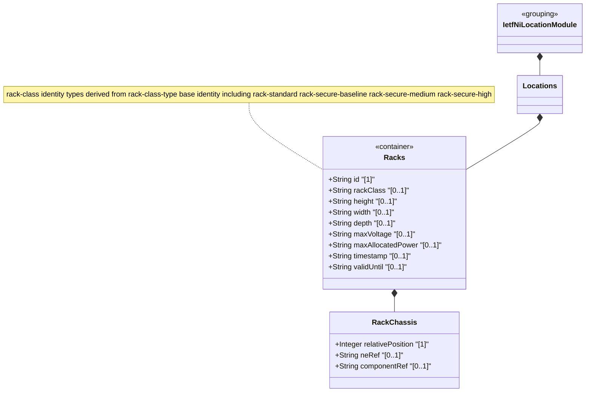

# Feature: Define Racks Container

## Parent Epic
- [ ] #49 - [ietf-ni-location: Network Inventory Location](https://github.com/gintatkinson/3dgs-033/blob/main/docs/epics/epic-04-ietf-ni-location.md) (top-level container for equipment rack data within the locations model)

## Description
Defines the `racks` container holding the list of physical equipment racks within the network inventory. This read-only container (`config false`) is a sibling of the `location` list inside the `locations` container. Each rack entry carries a unique string identifier, an optional security classification via identityref (`rack-class`), common entity attributes from the base inventory model, physical dimensions (`height`, `width`, `depth` in millimeters), electrical specifications (`max-voltage` in volts and `max-allocated-power` in watts), a rack-location sub-container for site positioning, a `contained-chassis` list for equipment installed in the rack, and temporal metadata (timestamp and valid-until). The rack security classification hierarchy is defined by the `rack-class-type` base identity with four standard derived identities: `rack-standard` (general-purpose rack without locking), `rack-secure-baseline` (baseline secure lockable), `rack-secure-medium` (medium security lockable), and `rack-secure-high` (high security lockable). Each contained-chassis entry is keyed by `relative-position` (uint8, representing U-slot position within the rack) and references a network element via `ne-ref` and a specific chassis component via `component-ref`.

## UML Class Diagram


## Interface Requirements

### 1. Test Data Shape
```json
{
  "racks": {
    "rack": [
      {
        "id": "Rack-101-A",
        "uuid": "660e8400-e29b-41d4-a716-446655440010",
        "name": "Rack A Room 101",
        "rack-class": "rack-standard",
        "rack-location": {
          "location-ref": "Room-101",
          "row-number": 1,
          "column-number": 1
        },
        "height": 2200,
        "width": 600,
        "depth": 1200,
        "max-voltage": 240,
        "max-allocated-power": 8000,
        "timestamp": "2026-01-15T10:00:00Z",
        "valid-until": "2028-01-15T10:00:00Z"
      }
    ]
  }
}
```

### 2. Validation & Constraints
- `racks`: container type, read-only (`config false`), mandatory presence via `uses racks` inside locations grouping, no explicit cardinality constraints beyond schema structure
- `rack`: list type, keyed by `id`, zero-or-more entries, read-only operational state data
- `id`: type `string`, mandatory (list key), uniquely identifies each rack within the racks container
- `rack-class`: type `identityref` with base `rack-class-type`, optional. Standard values include: `rack-standard` (standard general-purpose rack without physical locking), `rack-secure-baseline` (baseline secure lockable rack), `rack-secure-medium` (medium security lockable rack), `rack-secure-high` (high security lockable rack). The identity hierarchy is extensible by regional or vendor-specific rack classes
- `uuid`: type `yang:uuid` (imported from `ietf-yang-types`), optional, globally unique identifier for the rack
- `name`: type `string`, optional, human-readable name for the rack
- `alias`: type `string`, optional, alternative name or shorthand for the rack
- `description`: type `string`, optional, free-text description of the rack
- `height`: type `uint16`, units "millimeter", optional. Physical height of the rack enclosure
- `width`: type `uint16`, units "millimeter", optional. Physical width of the rack enclosure
- `depth`: type `uint16`, units "millimeter", optional. Physical depth of the rack enclosure
- `max-voltage`: type `uint16`, units "volt", optional. Maximum voltage supported by the rack power distribution
- `max-allocated-power`: type `uint16`, units "watts", optional. Maximum allocated power capacity for the rack
- `timestamp`: type `yang:date-and-time`, optional, records when the rack information was last captured
- `valid-until`: type `yang:date-and-time`, optional, marks the expiration time of this rack data. If unset, the rack data has no specific expiration
- No additional constraints specified in schema beyond type definitions and identityref base
- `contained-chassis`: list type, keyed by `relative-position`, zero-or-more entries, read-only. Contains chassis instances installed within this rack at specific U-slot positions
- `relative-position`: type `uint8` (0 to 255), mandatory (list key). Represents the U-slot position of the chassis within the rack
- `ne-ref` (rack chassis): type `leafref` to `/nwi:network-inventory/nwi:network-elements/nwi:network-element/nwi:ne-id`, optional. References the network element containing the chassis component
- `component-ref` (rack chassis): type `leafref` to `/nwi:network-inventory/nwi:network-elements/nwi:network-element[nwi:ne-id=current()/../ne-ref]/nwi:components/nwi:component/nwi:component-id`, optional. References the specific chassis component within the network element and contained by this rack

### 3. Visual Layout & Arrangement
- Display the rack list as a `TableView` with sortable columns for key fields: id, name, rack-class, height, width, depth, max-voltage, max-allocated-power
- Selecting a rack row in the table expands or navigates to a detail `PropertyGrid` view showing full rack information including rack-location, contained-chassis list, and temporal metadata
- Dimensional fields (height, width, depth) render with unit suffixes "mm" appended to the numeric value
- Electrical fields (max-voltage, max-allocated-power) render with unit suffixes "V" and "W" respectively
- The rack-class field renders as a human-readable label derived from the identityref value (e.g., "Standard", "Secure Baseline", "Secure Medium", "Secure High")
- Apply CSS reset (`box-sizing: border-box`) with scoped naming (CSS Modules/BEM) to prevent specificity conflicts
- Layout containment restricted to outer splitter panels; do not apply containment on scrollable child sections within the TableView

### 4. Interactive Flow & States
- **Loading State**: Display skeleton placeholder rows in the table while rack data is being fetched from the data source
- **Empty State**: When no racks exist, display an empty table with a message "No racks configured" in the empty state overlay
- **Read-Only State**: All data nodes are read-only (`config false`); table cells and detail fields render as non-editable text labels, no inline editing controls are provided
- **Sort State**: Table columns are sortable; clicking a column header toggles ascending/descending sort with a visual sort indicator arrow
- **Filter State**: Rack-class column supports filtering by security classification values; dimensional and electrical columns support numeric range filtering
- **Error State**: Highlight rows where `valid-until` has passed with an expired visual state distinct from valid entries
- Computed-style assertions must verify that column header sort indicators render correctly and that expired-row highlight colors match token-defined values

## Given-When-Then Acceptance Criteria

**Scenario: Retrieve rack list from network inventory**
- Given a network inventory with configured racks
- When the racks container is queried via YANG retrieval operations
- Then the system returns a read-only list of rack entries each keyed by a unique id

**Scenario: Rack with standard security classification**
- Given a new rack entry
- When the rack-class identityref is set to `rack-standard`
- Then the rack is classified as a standard general-purpose rack without physical locking mechanisms

**Scenario: Rack with secure-high classification**
- Given a rack located in a restricted-access facility
- When the rack-class identityref is set to `rack-secure-high`
- Then the rack is classified as a high-security lockable rack

**Scenario: Rack with physical dimensions**
- Given a rack entry with height 2200, width 600, and depth 1200
- When the rack data is queried
- Then the dimensions are reported in millimeters with their respective unit annotations

**Scenario: Rack with electrical specifications**
- Given a rack entry with max-voltage 240 and max-allocated-power 8000
- When the rack data is queried
- Then the voltage is reported as 240 volts and the allocated power as 8000 watts

**Scenario: Rack with no security classification**
- Given a rack entry where rack-class is not configured
- When the rack data is rendered
- Then the rack-class field displays as empty with no default value populated

**Scenario: Rack exceeding uint16 dimension range**
- Given a configuration attempt to set rack height to 70000
- When the value exceeds the uint16 maximum of 65535
- Then the system rejects the value with a type range violation error

**Scenario: Rack with no expiration**
- Given a rack entry with no valid-until value set
- When the rack data is queried
- Then the rack data has no expiration and is considered valid indefinitely

**Scenario: Expired rack entry**
- Given a rack entry with valid-until set to a timestamp in the past
- When the TableView renders the rack data
- Then the row displays with an expired visual state distinct from currently valid entries

**Scenario: Duplicate rack id**
- Given an existing rack with id "Rack-1-A" in the same racks container
- When a second rack entry attempts to use the same id
- Then the system rejects the duplicate key constraint

**Scenario: Rack with temporal metadata**
- Given a rack entry with timestamp "2026-01-15T10:00:00Z" and valid-until "2028-01-15T10:00:00Z"
- When the rack data is queried
- Then both temporal fields are returned, establishing the validity window for the rack information

**Scenario: Vendor-extended rack class identity**
- Given a vendor-specific rack class identity derived from `rack-class-type`
- When the rack-class identityref references the vendor extension
- Then the system accepts the extended classification without requiring model modification

## Specification Context (Verbatim)
> "racks" represent physical equipment racks in which NEs can be installed, which facilitate device maintenance. Through "rack-location", each rack can be assigned to a site or a specific location within a site, such as an equipment room.

> Each rack is assigned a unique ID and a name in the context of a facility, e.g. a site. A rack may have some specific attributes, such as appearance-related attributes and electricity-related attributes. The height, depth and width are described by Figure 2 (please consider that the door of the rack is facing the user).

> Max-voltage: the maximum voltage supported by the rack.

> Note: Further discussion is needed to decide whether to separate "racks" from the list of "location".

## Source References
Structural Schema: [ietf-ni-location@2026-07-06.yang](https://github.com/ietf-ivy-wg/network-inventory-location/blob/main/ietf-ni-location.yang) (Clause: container racks)
Normative Specification: [draft-ietf-ivy-network-inventory-location-06](https://datatracker.ietf.org/doc/html/draft-ietf-ivy-network-inventory-location) (Clause: Section 3, Rack)

## Logical UI & Layout Bindings
- **Target LUI Component:** PropertyGrid
- **Target Layout Container ID:** properties_view
- **Data Source Bindings:** `/nwi:network-inventory/nil:locations/nil:racks`
