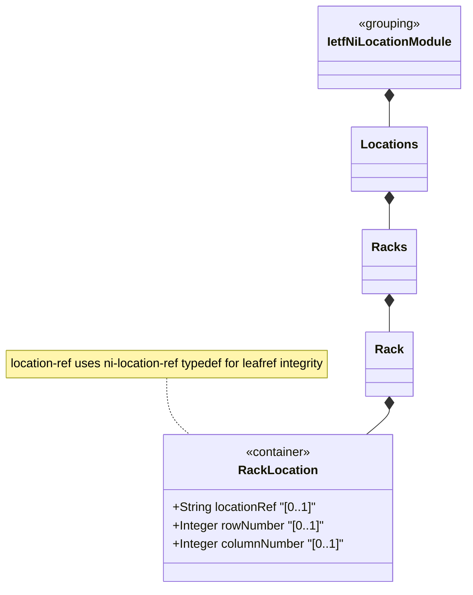

# Feature: Define Rack Location

## Parent Epic
- [ ] #49 - [ietf-ni-location: Network Inventory Location](https://github.com/gintatkinson/3dgs-033/blob/main/docs/epics/epic-04-ietf-ni-location.md) (nested container within rack specifying the physical position of a rack within a location)

## Description
Defines the `rack-location` container nested within each `rack` entry in the network inventory. This container specifies where a rack is physically positioned by referencing a location from the location list and providing grid coordinates (`row-number` and `column-number`) within that location. The `location-ref` leaf uses the `ni-location-ref` typedef, which is a leafref type referencing `/nwi:network-inventory/nil:locations/nil:location/nil:id`. This typedef establishes a reusable referential integrity constraint ensuring the referenced location must exist in the location list. The row-number and column-number are 32-bit unsigned integers enabling precise grid-based positioning within large equipment rooms or data centers.

## UML Class Diagram


## Interface Requirements

### 1. Test Data Shape
```json
{
  "rack-location": {
    "location-ref": "Room-101",
    "row-number": 1,
    "column-number": 1
  }
}
```

### 2. Validation & Constraints
- `location-ref`: type `ni-location-ref` (leafref to `/nwi:network-inventory/nil:locations/nil:location/nil:id`), optional, no default value. References the location where this rack is physically placed. The leafref constraint ensures referential integrity — the referenced location id must exist in the location list
- `row-number`: type `uint32`, optional, no default value. Identifies the row within the referenced location where the rack is located, enabling grid-based positioning
- `column-number`: type `uint32`, optional, no default value. Identifies the column within the referenced location where the rack is located, enabling grid-based positioning
- All three leaf nodes are optional — a rack may exist without explicit grid position or location reference
- The `ni-location-ref` typedef resolves through the full network inventory path: `/nwi:network-inventory/nil:locations/nil:location/nil:id`
- Row and column numbers must be within the uint32 range (0 to 4294967295)

### 3. Visual Layout & Arrangement
- Display as a grouped fieldset within a `PropertyGrid` detail panel for the selected rack, visually separated from rack dimensions and electrical specifications with a section header "Rack Location"
- Render the location-ref as a read-only text label; if the referenced location has a name, display the name alongside the id for human readability (e.g., "Room-101 (First Floor Telecom Room)")
- Row-number and column-number render as integer labels in a horizontal row layout with "Row" and "Column" labels prepended
- When location-ref is set but row-number or column-number are absent, display the grid coordinates as empty with dashed placeholder text
- Apply CSS reset (`box-sizing: border-box`) with scoped naming (CSS Modules/BEM) to prevent specificity conflicts
- Layout containment restricted to outer splitter panels; do not apply containment on scrollable child sections within the PropertyGrid

### 4. Interactive Flow & States
- **Loading State**: Display skeleton placeholders for location-ref, row-number, and column-number while rack data is being fetched
- **Empty State**: When no rack-location data exists, show the section header with empty placeholder indicators for all three fields
- **Read-Only State**: All data nodes are read-only (`config false` inherited from parent rack); values render as non-editable text labels with no inline editing controls
- **Unresolved Reference State**: When the referenced location id does not exist (broken leafref), highlight the location-ref field with a warning visual state indicating the reference is dangling
- **Error State**: No additional error states beyond the unresolved reference condition
- Computed-style assertions must verify that the warning highlight color for unresolved references matches token-defined values

## Given-When-Then Acceptance Criteria

**Scenario: Assign rack to a location**
- Given a location with id "Room-101" exists in the location list
- When a rack's location-ref is set to "Room-101"
- Then the leafref constraint validates that "Room-101" exists and the rack is associated with that location

**Scenario: Rack with grid coordinates**
- Given a rack located in an equipment room
- When the rack-location container specifies row-number 5 and column-number 3
- Then the rack's grid position within the referenced location is recorded as row 5, column 3

**Scenario: Rack without location reference**
- Given a rack entry with no rack-location data configured
- When the rack data is queried
- Then the rack-location container is absent and the rack has no assigned location or grid position

**Scenario: Rack with location ref but no grid coordinates**
- Given a rack referencing "Room-101" via location-ref
- When row-number and column-number are not configured
- Then the rack is associated with Room-101 but its precise grid position is unspecified

**Scenario: Invalid location reference**
- Given a rack with location-ref set to "NonExistent-Room"
- When "NonExistent-Room" does not exist in the location list
- Then the leafref constraint fails and the reference is rejected as unresolved

**Scenario: Row number at maximum uint32 value**
- Given a rack-location configuration
- When row-number is set to 4294967295
- Then the system accepts the value as within the uint32 range boundary

**Scenario: Row number exceeds uint32 maximum**
- Given a rack-location configuration
- When row-number is set to 4294967296
- Then the system rejects the value as exceeding the uint32 maximum range

**Scenario: Negative row number**
- Given a rack-location configuration
- When row-number is set to -1
- Then the system rejects the negative value because uint32 does not permit negative integers

**Scenario: Column number zero-based grid origin**
- Given a rack-location in a room using zero-based grid indexing
- When column-number is set to 0
- Then the system accepts zero as a valid uint32 column number for grid origin positioning

**Scenario: Multiple racks at same grid position**
- Given two racks in the same room
- When both racks have identical row-number and column-number values
- Then the system stores both without enforcing spatial uniqueness constraints on grid coordinates

**Scenario: Rack location reference chains**
- Given rack R1 in location-ref "Room-101" where Room-101 has parent "Building-A"
- When the inventory is queried for racks in Building-A
- Then R1 is logically associated with Building-A through the location hierarchy transitively

## Specification Context (Verbatim)
> Through "rack-location", each rack can be assigned to a site or a specific location within a site, such as an equipment room.

> Each rack is assigned a unique ID and a name in the context of a facility, e.g. a site.

> This model serves as a complement to the base inventory, providing a read-only perspective of network inventory location information known to the controller. It reports the physical locations of network elements and components installed in the network, enabling queries for site, rack, and other location-related information associated with network elements and components.

## Source References
Structural Schema: [ietf-ni-location@2026-07-06.yang](https://github.com/ietf-ivy-wg/network-inventory-location/blob/main/ietf-ni-location.yang) (Clause: container rack-location)
Normative Specification: [draft-ietf-ivy-network-inventory-location-06](https://datatracker.ietf.org/doc/html/draft-ietf-ivy-network-inventory-location) (Clause: Section 3, Rack)

## Logical UI & Layout Bindings
- **Target LUI Component:** PropertyGrid
- **Target Layout Container ID:** properties_view
- **Data Source Bindings:** `/nwi:network-inventory/nil:locations/nil:racks/nil:rack/nil:rack-location`
