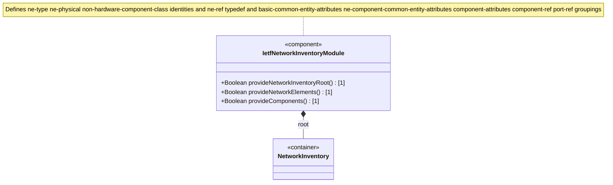

# Feature: Define Network Inventory Root Container

## Parent Epic
- [ ] #67 - [ietf-network-inventory: Base Network Inventory Data Model](https://github.com/gintatkinson/3dgs-033/blob/main/docs/epics/epic-05-ietf-network-inventory.md) (top-level read-only root container anchoring all network inventory data)

## Description
Defines the `network-inventory` container, the top-level read-only container (`config false`) that serves as the structural root for the entire network inventory data model. This container anchors the `network-elements` container, which holds the list of network elements, and provides an extensible root for future augmentations from companion modules. As the root of the network-wide inventory, this container establishes the read-only operational state boundary mandated by the Network Management Datastore Architecture (NMDA). The container carries no direct leaf attributes — its role is purely structural, providing the root node under which all inventory data nodes are organized.

The module also defines the following shared type definitions which are consumed by the network-element and component features:

**Identities:**
- `ne-type` — base identity for network element types, with derived identity `ne-physical` representing physical network elements
- `non-hardware-component-class` — base identity for non-hardware components (e.g., software components)

**Typedefs:**
- `ne-ref` — leafref type referencing `/nwi:network-inventory/nwi:network-elements/nwi:network-element/nwi:ne-id`, intended for cross-module NE referencing

**Groupings:**
- `basic-common-entity-attributes` — common attributes (uuid, name, alias, description) shared by all inventory entities
- `ne-component-common-entity-attributes` — extends basic-common with software-rev, mfg-name, product-name; shared by NEs and components
- `component-attributes` — full component attribute set including component-id, mandatory class union, hardware fields, asset tracking, and FRU annotation
- `component-ref` — grouping for referencing a component within a network element (ne-ref and component-ref leafrefs)
- `port-ref` — grouping for referencing a port component within a network element (ne-ref and port-ref leafref)

## UML Class Diagram


## Interface Requirements

### 1. Test Data Shape
```json
{
  "network-inventory": {
    "network-elements": {
      "network-element": []
    }
  }
}
```

### 2. Validation & Constraints
- `network-inventory`: container type, read-only (`config false`), mandatory presence as the top-level container for the module, no explicit cardinality constraints beyond schema structure
- The container is a pure structural wrapper with no leaf attributes — all data is housed in child containers and lists
- The `config false` flag applies to the entire subtree, meaning all descendants are operational state data (read-only)
- No key, no mandatory child nodes at this level — an empty `network-inventory` container with no network elements is valid per schema
- Conforms to the Network Management Datastore Architecture (NMDA) [RFC 8342] as operational state data

### 3. Visual Layout & Arrangement
- The root container is not directly rendered as a visible UI element — it is the structural anchor that provides the data tree root for navigation components
- The `network-inventory` path serves as the namespace root for all tree navigation and data source bindings in the application layout
- Display the label "Network Inventory" as the root node in the `HierarchyTreeSelector` (`resource_tree` container), with `network-elements` as its sole child branch
- Apply CSS reset (`box-sizing: border-box`) with scoped naming (CSS Modules/BEM) to prevent specificity conflicts in tree rendering
- Layout containment restricted to outer splitter panels; do not apply containment on scrollable child sections within the tree selector

### 4. Interactive Flow & States
- **Loading State**: Display a spinner or skeleton placeholder at the root node while the network-inventory data tree is being fetched from the server
- **Empty State**: When the network-inventory container exists but contains no network elements, show the root node with an empty children indicator (e.g., "No network elements")
- **Read-Only State**: All data nodes under network-inventory are read-only (`config false`); the tree displays data as non-editable labels with no inline editing controls
- **Error State**: If the network-inventory data fails to load, display an error indicator at the root node with a retry action

## Given-When-Then Acceptance Criteria

### Scenario: Network inventory root container exists in operational state
- **Given** a network controller with network inventory data
- **When** a client retrieves the `/nwi:network-inventory` subtree
- **Then** the `network-inventory` container is present and its `config` attribute is `false`
- **And** all descendant data nodes are read-only operational state data

### Scenario: Empty network inventory is valid
- **Given** a network controller with no discovered network elements
- **When** a client retrieves the `/nwi:network-inventory` subtree
- **Then** the `network-inventory` container is present
- **And** the `network-elements` container exists with an empty `network-element` list

### Scenario: Network inventory root provides extensible augmentation point
- **Given** an augmentation module such as `ietf-ni-location` that targets `/nwi:network-inventory`
- **When** the augmentation data is populated
- **Then** the augmented child containers (e.g., `nil:locations`) appear under `network-inventory`
- **And** the original `network-elements` container remains unmodified

## Specification Context (Verbatim)

From draft-ietf-ivy-network-inventory-yang-18, Section 3:

> The base network inventory model, defined in this document, provides a list of network elements and of network element components.
>
> The network-inventory top level container has been defined to support reporting other types of network inventory objects, besides the network elements and network element components.
>
> These additional types of network inventory objects can be defined, together with the associated YANG data model and the rationale for managing them as part of the network inventory, in other documents providing application- and technology-specific companion augmentation data models, such as [I-D.ietf-ivy-network-inventory-location].

From the YANG module description statement:

> This module defines a base model for retrieving network inventory. The model fully conforms to the Network Management Datastore Architecture (NMDA).

## Source References
Structural Schema: [ietf-network-inventory.yang](https://github.com/ietf-ivy-wg/network-inventory-yang/blob/main/yang/ietf-network-inventory.yang) (Clause: container network-inventory, lines 385-388)
Normative Specification: [draft-ietf-ivy-network-inventory-yang-18](https://datatracker.ietf.org/doc/html/draft-ietf-ivy-network-inventory-yang) (Section 3, Section 5)

## Logical UI & Layout Bindings
- **Target LUI Component:** PropertyGrid
- **Target Layout Container ID:** properties_view
- **Data Source Bindings:** /nwi:network-inventory
