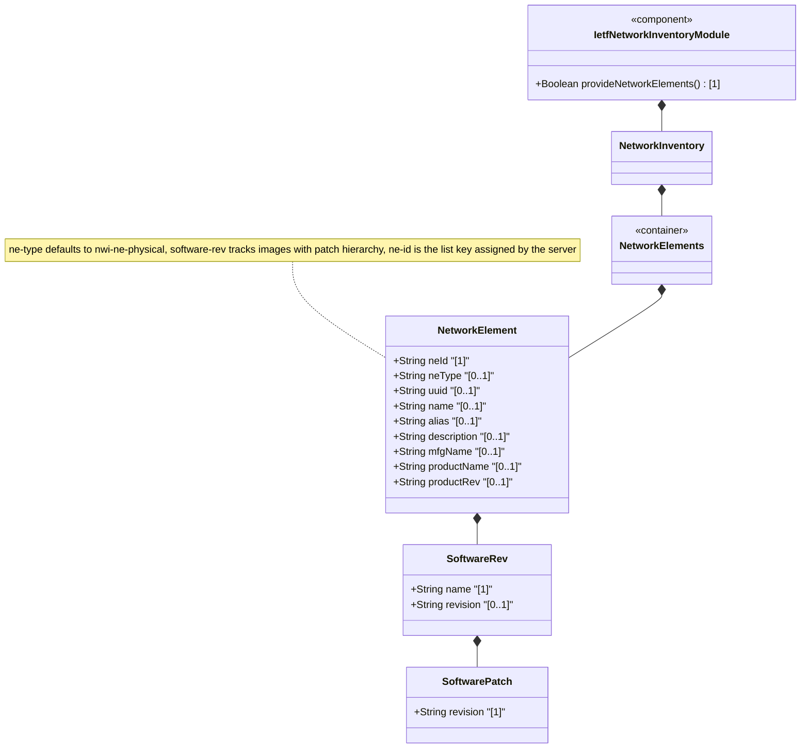

# Feature: Define Network Elements Container and List

## Parent Epic
- [ ] #67 - [ietf-network-inventory: Base Network Inventory Data Model](https://github.com/gintatkinson/3dgs-033/blob/main/docs/epics/epic-05-ietf-network-inventory.md) (container and list for network elements within the network inventory, draft-ietf-ivy-network-inventory-yang Section 3.2)

## Description
Defines the `network-elements` container and the `network-element` list, which form the core of the network inventory data model. Each network element (NE) is uniquely identified by `ne-id` — an identifier assigned by the server that persists across disconnections. The list supports physical network elements (the base type defined in this module) and is extensible to other NE types via the `ne-type` identity hierarchy. Each NE carries common entity attributes (UUID, name, alias, description), a software revision list tracking the software images intended to run on the NE (with nested patch information), manufacturer name, product name, and a vendor-specific product revision string. The `ne-type` leaf defaults to `nwi:ne-physical` representing a physical network element. This container serves as the structural anchor for the per-NE `components` container.

## UML Class Diagram


## Interface Requirements

### 1. Test Data Shape
```json
{
  "network-inventory": {
    "network-elements": {
      "network-element": [
        {
          "ne-id": "NE-001",
          "ne-type": "nwi:ne-physical",
          "uuid": "550e8400-e29b-41d4-a716-446655440000",
          "name": "Core Router NYC-01",
          "alias": "CR-NYC-01",
          "description": "Core router at NYC data center",
          "software-rev": [
            {
              "name": "IOS-XR",
              "revision": "7.9.2",
              "patch": [
                { "revision": "7.9.2-p1" },
                { "revision": "7.9.2-p2" }
              ]
            },
            {
              "name": "Firmware",
              "revision": "3.4.1"
            }
          ],
          "mfg-name": "Cisco Systems",
          "product-name": "ASR 9000 Series",
          "product-rev": "R6.5.3"
        }
      ]
    }
  }
}
```

### 2. Validation & Constraints
- `network-elements`: container type, read-only (`config false` inherited from root), wraps the `network-element` list, no explicit cardinality constraints beyond schema structure
- `network-element`: list type, keyed by `ne-id`, zero-or-more entries, read-only operational state data
- `ne-id`: type `string`, mandatory (list key), uniquely identifies the network element within the network, assigned by the server since NEs cannot guarantee unique local identifiers. The ne-id should be assigned such that the same network element is always identified through the same identifier even across disconnections (mechanisms to ensure this are implementation-specific and outside standardization scope)
- `ne-type`: type `identityref` with base `nwi:ne-type`, optional, default value `nwi:ne-physical`. Describes the type of network element. Only `ne-physical` is defined in this base module — other NE types may be defined in augmentation modules
- `uuid`: type `yang:uuid` (imported from `ietf-yang-types`), optional, globally unique identifier assigned by the server, guaranteed to be unique across systems
- `name`: type `string`, optional, human-interpretable label provided by a network operator or the server, provides a non-volatile handle for the entity. The server MAY set this to a locally unique value in operational state if no value is discovered. Can be changed at any time during the entity lifetime
- `alias`: type `string`, optional, alternative human-interpretable label provided by a network operator
- `description`: type `string`, optional, free-text human-interpretable description of the network element
- `software-rev`: list type, keyed by `name`, zero-or-more entries, read-only. Represents the software images intended to be running within the network element
- `software-rev/name`: type `string`, mandatory (list key), vendor-specific name of the software module
- `software-rev/revision`: type `string`, optional, vendor-specific revision string of the software module when not implicitly defined as part of the name
- `software-rev/patch`: list type, keyed by `revision`, zero-or-more entries, read-only. List of software patches configured to be active for the software module
- `software-rev/patch/revision`: type `string`, mandatory (list key), vendor-specific revision string of the software patch
- `mfg-name`: type `string`, optional, name of the manufacturer of the network element. If unknown to the server, this node is not instantiated
- `product-name`: type `string`, optional, vendor-specific human-interpretable string describing the network element type. Vendors assign unique product names to different entity types within their scope
- `product-rev`: type `string`, optional, vendor-specific product revision string for the network element

### 3. Visual Layout & Arrangement
- Display the network element list as a `TableView` (`elements_view` container) showing a sortable, filterable table of network elements with columns for ne-id, name, ne-type, mfg-name, product-name, and product-rev
- On selection of a network element row, display the element's full details in a `PropertyGrid` (`properties_view` container) grouped into sections: "Identification" (ne-id, uuid, name, alias, description), "Type & Manufacturer" (ne-type, mfg-name, product-name, product-rev), and "Software" (software-rev list)
- Render the software-rev list as a nested expandable list within the PropertyGrid; each software module entry shows name, revision, and expandable patch list
- Render `ne-type` as a read-only label showing the resolved identity name. When identity is `nwi:ne-physical`, display as "Physical Network Element"
- Apply CSS reset (`box-sizing: border-box`) with scoped naming (CSS Modules/BEM) to prevent specificity conflicts in table and property grid rendering
- Layout containment restricted to outer splitter panels; do not apply containment on scrollable child sections within the TableView or PropertyGrid

### 4. Interactive Flow & States
- **Loading State**: Display skeleton rows in the TableView while network element data is being fetched
- **Empty State**: When no network elements exist in the inventory, display an empty state message in the TableView: "No network elements discovered" with a call-to-action button to trigger a rediscovery (if supported by the controller)
- **Read-Only State**: All data nodes under network-elements are read-only; table rows are non-editable with no inline editing controls
- **Selection State**: Selecting a network element row highlights it and populates the PropertyGrid with the element's details; the selected state persists across view switches
- **Table Column Sort State**: Clicking a column header triggers sorting with a visible sort indicator (ascending/descending arrow); sort direction is computed from the column's data type
- **Filter State**: Active filters display as removable chips above the table; clearing all filters restores full list visibility

## Given-When-Then Acceptance Criteria

### Scenario: Retrieve list of network elements from inventory
- **Given** a network controller has discovered three network elements in the network
- **When** a client retrieves `/nwi:network-inventory/nwi:network-elements`
- **Then** the response contains a `network-element` list with exactly three entries
- **And** each entry has a unique `ne-id` value
- **And** each entry includes the `ne-type` leaf defaulting to `nwi:ne-physical` if not explicitly set

### Scenario: Network element key uniquely identifies each entry
- **Given** a network elements list with entries NE-001 and NE-002
- **When** a client queries for `network-element[ne-id="NE-001"]`
- **Then** exactly one network element entry is returned
- **And** the returned entry has `ne-id` equal to "NE-001"

### Scenario: Network element with software revision data
- **Given** a network element NE-001 with two software modules (IOS-XR and Firmware)
- **When** a client retrieves the network element details
- **Then** the `software-rev` list contains two entries
- **And** the IOS-XR entry has `revision` "7.9.2" and two patches
- **And** the Firmware entry has `revision` "3.4.1" and no patches

### Scenario: Network element type defaults to physical when not specified
- **Given** a network element entry with no explicit `ne-type` value
- **When** a client retrieves the network element
- **Then** the `ne-type` defaults to `nwi:ne-physical`

### Scenario: Network element without manufacturer name omits the mfg-name leaf
- **Given** a network element whose manufacturer name is unknown to the server
- **When** a client retrieves the network element
- **Then** the `mfg-name` leaf is not instantiated (absent from the response)

### Scenario: Empty network element list is valid
- **Given** a network controller with no discovered network elements
- **When** a client retrieves `/nwi:network-inventory/nwi:network-elements`
- **Then** the `network-element` list is present but empty

### Scenario: Software patch list with multiple revisions
- **Given** a software module "IOS-XR" with two active patches
- **When** a client retrieves the network element software-rev list
- **Then** the patch list for IOS-XR contains exactly two entries
- **And** each patch entry has a unique `revision` key

## Specification Context (Verbatim)

From draft-ietf-ivy-network-inventory-yang-18, Section 3.2:

> ### 3.2. Network Element
>
> In addition to the common attributes defined for network elements and components in Section 3.1, the following attributes are defined for the network elements:
>
> **ne-id:** The identifier that uniquely identifies the network element (NE) within the network, assigned by the server since the network elements cannot guarantee that their local identifier is unique within the network.
>
> The ne-id should be assigned such that the same network element will always be identified through the same identifier, even if the network elements get disconnected from the network controller. Mechanisms to ensure this (e.g., checking the mfg-name, product-name, management IP address, physical location) are implementation specific and outside the scope of standardization.
>
> **ne-type:** The type of network element (e.g., physical network element). See Section 3 for the definition of NE types.
>
> **product-rev:** A vendor-specific product revision string for the network-element.

From Section 3:

> The network element definition is generalized to support physical network elements and other types of components' groups that can be managed as physical network elements from an inventory perspective.
>
> Physical network elements are usually devices such as hosts, gateways, terminal servers, and the like, which have management agents responsible for performing the network management functions requested by the network management stations ([RFC1157]).
>
> The "ne-type" is defined as a YANG identity to describe the type of the network element. This document defines only the "physical-network-element" identity.

From Section 3.3.2:

> Each instance of a network element or a component includes its own "software-rev" list which provides basic software attributes for each entity (network element and component).
>
> The scope of the list is to provide information about the software images intended to be running within the related entity.

## Source References
Structural Schema: [ietf-network-inventory.yang](https://github.com/ietf-ivy-wg/network-inventory-yang/blob/main/yang/ietf-network-inventory.yang) (Clause: container network-elements and list network-element, lines 389-420)
Normative Specification: [draft-ietf-ivy-network-inventory-yang-18](https://datatracker.ietf.org/doc/html/draft-ietf-ivy-network-inventory-yang) (Section 3.2, Section 3.3.2)

## Logical UI & Layout Bindings
- **Target LUI Component:** TableView
- **Target Layout Container ID:** elements_view
- **Data Source Bindings:** /nwi:network-inventory/nwi:network-elements/nwi:network-element
