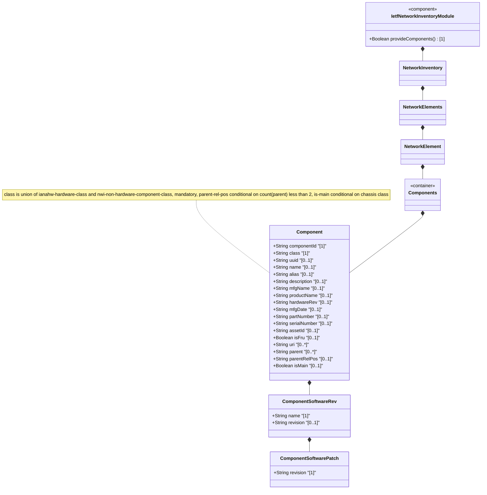

# Feature: Define Components Container and List

## Parent Epic
- [ ] #67 - [ietf-network-inventory: Base Network Inventory Data Model](https://github.com/gintatkinson/3dgs-033/blob/main/docs/epics/epic-05-ietf-network-inventory.md) (container and list for components within each network element, draft-ietf-ivy-network-inventory-yang Section 3.3)

## Description
Defines the `components` container and the `component` list within each network element. Each component is uniquely identified by `component-id` within its parent NE and classified by a union type that may be either a hardware class (from the `iana-hardware` module, e.g., chassis, slot, port, CPU, fan, power supply) or a non-hardware component class (from the `nwi:non-hardware-component-class` identity, e.g., software components). The `class` leaf is mandatory. Each component carries common inventory entity attributes (UUID, name, alias, description), software revision tracking with patch hierarchy, manufacturer and product identification, hardware-specific attributes (hardware revision, manufacture date, part number, serial number, asset tracking ID, field-replaceable unit flag, URIs), and structural containment information (parent component references, parent-relative position, and a main chassis role flag). The `parent` leaf-list uses leafref to reference sibling component-ids, enabling a containment hierarchy within the NE. The `parent-rel-pos` leaf is conditionally applicable only when the component has zero or one parent. The `is-main` leaf is conditionally applicable only when the component class derives from `ianahw:chassis`, identifying the main chassis in multi-chassis NEs.

## UML Class Diagram


## Interface Requirements

### 1. Test Data Shape
```json
{
  "components": {
    "component": [
      {
        "component-id": "Chassis-01",
        "class": "ianahw:chassis",
        "uuid": "660e8400-e29b-41d4-a716-446655440020",
        "name": "Main Chassis",
        "alias": "Chassis-01",
        "description": "Primary chassis for NE-001",
        "software-rev": [
          {
            "name": "Firmware",
            "revision": "2.1.0",
            "patch": [
              { "revision": "2.1.0-p1" }
            ]
          }
        ],
        "mfg-name": "Cisco Systems",
        "product-name": "ASR 9006 Chassis",
        "hardware-rev": "1.2",
        "mfg-date": "2025-03-15T00:00:00Z",
        "part-number": "ASR-9006-AC",
        "serial-number": "FTX12345678",
        "asset-id": "ASSET-001-001",
        "is-fru": true,
        "uri": [
          "https://inventory.example.com/component/Chassis-01"
        ],
        "parent": [],
        "parent-rel-pos": "0",
        "is-main": true
      },
      {
        "component-id": "Slot-01",
        "class": "ianahw:module",
        "uuid": "770e8400-e29b-41d4-a716-446655440030",
        "name": "Line Card Slot 1",
        "mfg-name": "Cisco Systems",
        "product-name": "ASR 9000 8-Port 100GE LC",
        "part-number": "A9K-8X100GE-L",
        "serial-number": "FOC98765432",
        "is-fru": true,
        "parent": ["Chassis-01"],
        "parent-rel-pos": "1"
      },
      {
        "component-id": "Port-01",
        "class": "ianahw:port",
        "name": "HundredGigE 0/0/0/0",
        "mfg-name": "Cisco Systems",
        "product-name": "100GE QSFP28",
        "hardware-rev": "3.0",
        "part-number": "QSFP-100G-SR4-S",
        "serial-number": "FBN23456789",
        "is-fru": true,
        "parent": ["Slot-01"],
        "parent-rel-pos": "0"
      }
    ]
  }
}
```

### 2. Validation & Constraints
- `components`: container type, read-only (`config false` inherited from root), wraps the `component` list, nested within each `network-element`, no explicit cardinality constraints beyond schema structure
- `component`: list type, keyed by `component-id`, zero-or-more entries per network element, read-only operational state data
- `component-id`: type `string`, mandatory (list key), uniquely identifies the component within the network element, assigned by the NE or by the server
- `class`: type `union` of `identityref{base ianahw:hardware-class}` and `identityref{base nwi:non-hardware-component-class}`, mandatory, no default. The type of the component (e.g., chassis, module, port, CPU, fan). Different component types are distinguished by the class identity
- `uuid`: type `yang:uuid` (imported from `ietf-yang-types`), optional, globally unique identifier assigned by the server
- `name`: type `string`, optional, human-interpretable label provided by a network operator or the server, provides a non-volatile handle
- `alias`: type `string`, optional, alternative human-interpretable label provided by a network operator
- `description`: type `string`, optional, free-text human-interpretable description of the component
- `software-rev`: list type, keyed by `name`, zero-or-more entries, read-only. Software images intended to be running within the component, refined from RFC 6933 entPhysicalSoftwareRev. Same structure as network element software-rev
- `software-rev/name`: type `string`, mandatory (list key), vendor-specific name of the software module
- `software-rev/revision`: type `string`, optional, vendor-specific revision string
- `software-rev/patch`: list type, keyed by `revision`, zero-or-more entries, read-only
- `software-rev/patch/revision`: type `string`, mandatory (list key), vendor-specific revision string of software patch
- `mfg-name`: type `string`, optional, name of the manufacturer of the component. The preferred value is the manufacturer name string printed on the component itself (if present). If the manufacturer name is unknown to the server, this node is not instantiated. Note that comparisons between instances of part-number, software-rev, and serial-number are only meaningful amongst components with the same mfg-name value, refined from RFC 6933 entPhysicalMfgName
- `product-name`: type `string`, optional, vendor-specific human-interpretable string describing the component type. Vendors assign unique product names to different component types within their scope
- `hardware-rev`: type `string`, optional, vendor-specific hardware revision string for the component. The preferred value is the hardware revision identifier printed on the component itself (if present), per RFC 6933 entPhysicalHardwareRev
- `mfg-date`: type `yang:date-and-time`, optional, date of manufacturing of the component, per RFC 6933 entPhysicalMfgDate
- `part-number`: type `string`, optional, vendor-specific part number of the component type. Vendors assign unique part numbers to different component types within their scope (formerly called "model-name" in RFC 8348). Although the term "part number" is often an alphanumeric string and not a number, this term is used since it is widely known in the industry
- `serial-number`: type `string`, optional, vendor-specific serial number of the component instance. Vendors assign unique serial numbers to different component instances at least within the scope of the part-number
- `asset-id`: type `string`, optional, asset tracking identifier for the component specified by a network operator. A server implementation MAY map this to entPhysicalAssetID MIB object, per RFC 6933
- `is-fru`: type `boolean`, optional, indicates whether this component is a field-replaceable unit by the vendor. Value `true` means field-replaceable; `false` means permanently contained within a field-replaceable unit, per RFC 6933 entPhysicalIsFRU
- `uri`: leaf-list type `inet:uri` (imported from `ietf-inet-types`), zero-or-more entries, optional. Contains identification information about the component, per RFC 6933 entPhysicalUris
- `parent`: leaf-list type `leafref` to `../../component/component-id` with `require-instance false`, zero-or-more entries, optional. Identifies all components that physically contain this component. If the list is empty, the component is not contained in any other component but is directly contained in the network-element, per RFC 6933 entPhysicalContainedIn
- `parent-rel-pos`: type `string`, optional, no default. The relative position with respect to the parent component among all sibling components. **Conditionally applicable** — only present when `count(../parent) < 2`, i.e., the component has zero or one parent. The format is implementation-specific; when mapping from RFC 6933, the entPhysicalParentRelPos integer value SHOULD be encoded as an integer string, per RFC 6933 entPhysicalParentRelPos
- `is-main`: type `boolean`, optional, no default. Indicates whether the chassis component takes the main role. **Conditionally applicable** — only present when `derived-from-or-self(../nwi:class, 'ianahw:chassis')`, i.e., for chassis components in multi-chassis network element scenarios. Omitted when the NE does not contain chassis components that can take the main role (e.g., single-chassis NEs)

### 3. Visual Layout & Arrangement
- Display the component list as a `TableView` within a tabbed details panel (`components_table` container) showing a sortable, filterable table of components for the selected network element, with columns for component-id, class, name, mfg-name, part-number, serial-number, and is-fru
- On selection of a component row, display the component's full details in a `PropertyGrid` (`properties_view` container) grouped into sections:
  - **Identification**: component-id, class, uuid, name, alias, description
  - **Manufacturer**: mfg-name, product-name, hardware-rev, mfg-date, part-number, serial-number
  - **Asset Tracking**: asset-id, is-fru, uri list
  - **Structural**: parent references, parent-rel-pos, is-main
  - **Software**: software-rev list with patches
- Render the `class` leaf as a read-only label showing the resolved identity name (e.g., "Chassis", "Module", "Port", "CPU")
- Render `is-fru` as a boolean badge ("FRU" / "Non-FRU") with corresponding visual distinction
- Render the `parent` leaf-list as a comma-separated list of component-id references; if empty, display "Directly contained in network element"
- Conditionally omit `parent-rel-pos` from the display when the component has more than one parent (per the `when` constraint)
- Conditionally omit `is-main` from the display when the component class is not derived from `ianahw:chassis`
- Apply CSS reset (`box-sizing: border-box`) with scoped naming (CSS Modules/BEM) to prevent specificity conflicts
- Layout containment restricted to outer splitter panels; do not apply containment on scrollable child sections within the TableView or PropertyGrid

### 4. Interactive Flow & States
- **Loading State**: Display skeleton rows in the components TableView while component data for the selected network element is being fetched
- **Empty State**: When the selected network element has no components, display "No components reported for this network element" in the TableView
- **Read-Only State**: All data nodes under components are read-only; table rows are non-editable with no inline editing controls
- **Selection State**: Selecting a component row highlights it and populates the PropertyGrid with component details; the selection is scoped to the active network element
- **Parent Hierarchy State**: In the TableView, render parent-referenced components with an indent or hierarchy visual to indicate containment nesting. Components with no parents render at root level
- **Conditional Field Visibility**: `parent-rel-pos` field in the PropertyGrid dynamically hides when multiple parents exist; `is-main` field hides when class is not chassis-derived. Use computed-style assertions in tests to verify the conditional visibility
- **Dangling Parent Reference State**: When a component's parent leafref references a component-id that does not exist in the current component list, highlight the parent field with a warning indicator
- **Filter State**: Provide a filter dropdown for component class enabling quick filtering by hardware type (e.g., "Show only ports", "Show only chassis")
- **URI List State**: Render each URI entry as a clickable link opening in a new browser tab; if URI list is empty, display "No URIs"

## Given-When-Then Acceptance Criteria

### Scenario: Retrieve components of a network element
- **Given** a network element NE-001 with three components (chassis, slot, port)
- **When** a client retrieves `/nwi:network-inventory/nwi:network-elements/nwi:network-element[ne-id="NE-001"]/nwi:components`
- **Then** the response contains a `component` list with exactly three entries
- **And** each entry has a unique `component-id` and a mandatory `class` leaf

### Scenario: Component class must be present (mandatory)
- **Given** a component entry being created or retrieved
- **When** the `class` leaf is absent from the component data
- **Then** the component is invalid per schema — `class` is mandatory

### Scenario: Component parent references form a containment hierarchy
- **Given** a component "Port-01" with `parent` leaf-list containing ["Slot-01"]
- **When** a client retrieves the component details
- **Then** the `parent` field references "Slot-01" via leafref to the sibling component list
- **And** component "Slot-01" exists as a peer component within the same network element

### Scenario: Component without parent is directly in network element
- **Given** a component "Chassis-01" with an empty `parent` leaf-list
- **When** a client retrieves the component
- **Then** the `parent` field is present but empty
- **And** this indicates the component is directly contained in the network element

### Scenario: Parent relative position conditional applicability (zero or one parent)
- **Given** a component with exactly one parent reference
- **When** a client retrieves the component
- **Then** the `parent-rel-pos` leaf MAY be present (condition satisfied: count(parent) < 2)
- **Given** a component with two or more parent references
- **When** a client retrieves the component
- **Then** the `parent-rel-pos` leaf is not instantiated (when condition fails: count(parent) >= 2)

### Scenario: Main chassis flag conditional applicability
- **Given** a component with `class` derived from `ianahw:chassis` in a multi-chassis NE
- **When** a client retrieves the component
- **Then** the `is-main` leaf MAY be present (when condition satisfied)
- **Given** a component with `class` derived from `ianahw:port`
- **When** a client retrieves the component
- **Then** the `is-main` leaf is not instantiated (when condition fails: class is not chassis)

### Scenario: Component with hardware identification details
- **Given** a component with manufacturing data populated
- **When** a client retrieves the component
- **Then** `hardware-rev`, `mfg-date`, `part-number`, `serial-number`, `asset-id`, `is-fru`, and `uri` fields are present with their respective values
- **And** `mfg-date` conforms to the `yang:date-and-time` format

### Scenario: Component with software revision and patches
- **Given** a component running a firmware with one active patch
- **When** a client retrieves the component software-rev list
- **Then** the software-rev entry for the firmware contains name, revision, and one patch entry with a revision key

### Scenario: Component with multiple URIs
- **Given** a component with two URI references
- **When** a client retrieves the component
- **Then** the `uri` leaf-list contains exactly two entries, each a valid URI per `inet:uri` type

### Scenario: Component manufacturer name comparison scope
- **Given** two components with different `mfg-name` values (e.g., "Cisco" and "Juniper")
- **When** comparing their `part-number`, `software-rev`, or `serial-number` values
- **Then** the comparison is not meaningful — per schema, comparisons are only meaningful amongst components with the same `mfg-name`

### Scenario: Component is a field-replaceable unit
- **Given** a component with `is-fru` set to `true`
- **When** a client retrieves the component
- **Then** the component is identified as field-replaceable by the vendor
- **And** components permanently contained within this FRU should have `is-fru` set to `false`

### Scenario: No components in a network element
- **Given** a network element with no reported components
- **When** a client retrieves the components container
- **Then** the `component` list is present but empty

## Specification Context (Verbatim)

From draft-ietf-ivy-network-inventory-yang-18, Section 3.3:

> The YANG data model for network inventory mainly follows the same approach of [RFC8348] and reports the network hardware inventory as a list of components with different types (e.g., chassis, module, and port).
>
> In addition to the common attributes defined for network elements and components in Section 3.1, the following attributes are defined for the components:
>
> **component-id:** The identifier that uniquely identifies the component within the NE. It can be assigned by the NE or by the server.
>
> **class:** The type of component (e.g., chassis, module, port). See Section 3 for the definition of component types.
>
> **hardware-rev:** The vendor-specific hardware revision string for the component. The preferred value is the hardware revision identifier actually printed on the component itself (if present).
>
> **mfg-date:** The date of manufacturing of the component.
>
> **part-number:** The vendor-specific part number of the component type. It is expected that vendors assign unique part numbers to different component types within the scope of the vendor. Although the part number is often an alphanumeric string and not a number, this document uses this term since it is widely used and well known in the industry.
>
> **serial-number:** The vendor-specific serial number of the component instance. It is expected that vendors assign unique serial numbers to different component instances at least within the scope of the part-number. Although the serial number is often an alphanumeric string and not a number, this document uses this term since it is widely used and well known in the industry.
>
> **asset-id:** An asset tracking identifier for the component, provided by a network operator.
>
> **is-fru:** Indicates whether or not a component is considered a 'field-replaceable unit' by the vendor.
>
> For state data like "admin-state", "oper-state", and so on, this document considers that they are related to device hardware management, not network inventory. Therefore, they are outside of the scope of this document. Same for the sensor-data, they should be defined in some other performance monitoring data models instead of the inventory data model.

From Section 3.3.1:

> The "iana-hardware" module [IANA_HW_YANG] defines YANG identities for the hardware component types in the IANA-maintained "IANA-ENTITY-MIB" registry.
>
> Some of the definitions taken from [RFC8348] are based on the ENTITY-MIB [RFC6933].

From Section 3.4.3 (Changes Since RFC 8348 - Parent relative position):

> There are some use cases where the parent relative position is not reported as an integer but as a string.
>
> In order to support these use cases and allowing a straightforward match between the relative position definition in the device and in the network inventory, this model is defining the 'parent-rel-pos' data node as a string instead of as an integer.
>
> If the device reports the relative position as an integer, e.g., using the device model defined in [RFC8348], the integer value reported by the device can be mapped into a string within the network inventory.

From Section 3.4.2 (Changes Since RFC 8348 - Component identifiers):

> There are some use cases where the name of the components are assigned and changed by the operator. In these cases, the assigned names are also not guaranteed to be always unique.
>
> In order to support these use cases, this model is not aligned with [RFC8348] in defining the component name as the key for the component list. Instead, the name is defined as an optional attribute and the component-id is defined as the key for the component list (in alignment with the approach followed for the network-element list).

## Source References
Structural Schema: [ietf-network-inventory.yang](https://github.com/ietf-ivy-wg/network-inventory-yang/blob/main/yang/ietf-network-inventory.yang) (Clause: container components and list component, lines 421-487)
Normative Specification: [draft-ietf-ivy-network-inventory-yang-18](https://datatracker.ietf.org/doc/html/draft-ietf-ivy-network-inventory-yang) (Section 3.3, Section 3.3.1, Section 3.3.2, Section 3.4.2, Section 3.4.3)

## Logical UI & Layout Bindings
- **Target LUI Component:** TableView
- **Target Layout Container ID:** elements_view
- **Data Source Bindings:** /nwi:network-inventory/nwi:network-elements/nwi:network-element/nwi:components/nwi:component
