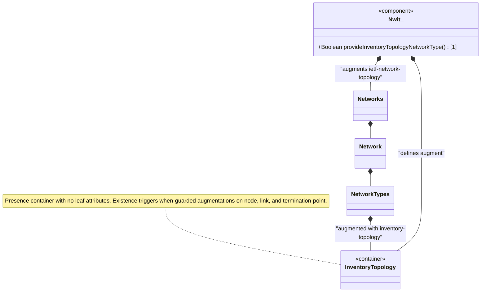

# Feature: Define Inventory Topology Network Type

## Parent Epic
- [ ] #86 - [ietf-network-inventory-topology: Network Inventory Topology Mapping](https://github.com/gintatkinson/3dgs-033/blob/main/docs/epics/epic-06-ietf-network-inventory-topology.md) (presence container defining the inventory-topology network type identifier, draft-ietf-ivy-network-inventory-topology Section 5)

## Description
Defines the `inventory-topology` presence container that augments the `ietf-network-topology` module's `/nw:networks/nw:network/nw:network-types` to introduce a new network type identifier. When present, this container signals that the network carries physical-layer augmentations as defined in this module — inventory mappings on nodes and termination points, link media type classification, and port breakout capabilities. This network type serves as the conditional guard (`when '../nw:network-types/nwit:inventory-topology'`) for all other augmentations in the module, ensuring inventory-mapping attributes are only instantiated on networks explicitly identified as inventory topologies.

This network type is typically discovered by a network controller when identifying a physical underlay network but may also be configured manually when discovery is unavailable. The container is a bare presence container with no leaf attributes — its existence alone triggers the conditional augmentations. It is intended to serve as the underlay for logical network topologies (Layer 2, Layer 3, Traffic Engineering, etc.).

## UML Class Diagram


## Interface Requirements

### 1. Test Data Shape
```json
{
  "ietf-network:networks": {
    "network": [
      {
        "network-id": "example:physical-underlay",
        "network-types": {
          "ietf-network-inventory-topology:inventory-topology": {}
        }
      }
    ]
  }
}
```

### 2. Validation & Constraints
- `inventory-topology`: presence container with no leaf attributes, no keys, `config` is `true` (default, meaning read-write for manual configuration)
- The container's presence (`presence` statement) indicates the network is a physical inventory topology — an empty container is semantically valid and fully expresses the network type
- Must be placed under `/nw:networks/nw:network/nw:network-types` per the ietf-network-topology augmentation target
- Conditional guard: all other augmentations in this module carry `when '../nw:network-types/nwit:inventory-topology'` — they are inactive unless this container is present
- May coexist with other network-type containers (e.g., Layer 3 topology, TE topology) — the inventory-topology type can be combined with logical overlay types

### 3. Visual Layout & Arrangement
- Display the "Inventory Topology" network type as an entry within the network's `network-types` property grid, rendered as a toggle indicator or badge in the `PropertyGrid` component (`properties_view` container)
- The network-type indicator should appear in the network detail panel alongside other active network types for a given `network-id`
- Apply CSS reset (`box-sizing: border-box`) with scoped naming (CSS Modules/BEM) on the PropertyGrid container to avoid specificity conflicts
- Layout containment restricted to the outer `properties_view` splitter panel; do not apply containment on scrollable child sections within the property grid

### 4. Interactive Flow & States
- **Present State**: When `inventory-topology` is active on a network, the indicator is shown in the PropertyGrid; all inventory-mapping attributes on nodes, links, and TPs become visible and active throughout the topology view
- **Absent State**: When the container is not present, the network is treated as a purely logical/non-inventory topology — no inventory-mapping panels are displayed for its nodes, links, or termination points
- **Loading State**: Display a placeholder indicator while the network-type data is being fetched from the network controller
- **Error State**: If the network-types data fails to load, display an error indicator in the PropertyGrid with a retry action

## Given-When-Then Acceptance Criteria

### Scenario: Inventory topology network type identifies a physical underlay network
- **Given** a network controller discovers a physical underlay network with hardware inventory data
- **When** the network is represented in the topology model
- **Then** the `nwit:inventory-topology` container is present under the network's `network-types`
- **And** the container is a bare presence container with no child leaf attributes
- **And** all when-guarded augmentations on nodes, links, and termination points within this network are active

### Scenario: Absent inventory-topology container suppresses inventory augmentations
- **Given** a network defined as a purely logical topology (e.g., Layer 3 overlay)
- **When** the `nwit:inventory-topology` container is NOT present under `network-types`
- **Then** no `nwit:inventory-mapping-attributes` containers appear on nodes, links, or termination points
- **And** no `nwit:port-breakout` containers appear on termination points
- **And** any attempt to instantiate these augmentations fails the when-guard validation

### Scenario: Inventory topology type coexists with other network types
- **Given** a network that serves as both a physical underlay and a Layer 3 topology
- **When** both `nwit:inventory-topology` and an L3 topology type container are present under `network-types`
- **Then** both network-type indicators are simultaneously active
- **And** the inventory-mapping attributes are available alongside the L3 topology attributes
- **And** neither network type conflicts with or excludes the other

### Scenario: Manual configuration of inventory-topology network type
- **Given** scenarios where automatic discovery is not feasible (e.g., CPE outside management domain, leased lines)
- **When** an operator manually adds the `nwit:inventory-topology` container to a network's `network-types`
- **Then** the container is committed to the configuration datastore
- **And** all when-guarded augmentations become active for that network
- **And** the operator can populate `nwit:inventory-mapping-attributes` on nodes, links, and termination points

## Specification Context (Verbatim)

From draft-ietf-ivy-network-inventory-topology-08, Section 4 (Module Tree Structure):

> The module augments the "ietf-network-topology" module as follows:
> Inventory mapping attributes for nodes, and termination points:
>   The corresponding containers augments the topology module with the references to the base network inventory

From the YANG module description statement for the inventory-topology augment:

> "Introduces a new network type for inventory topology mapping."
>
> "When present, it signals that the network contains physical-layer augmentations as defined in this module. This network type is intended to serve as the underlay for logical network topologies (Layer 2, Layer 3, Traffic Engineering (TE), etc.)."

From draft-ietf-ivy-network-inventory-topology-08, Section 1 (Introduction):

> "Therefore, this YANG data model can be used to represent a physical network instance at the lowest underlay abstraction level."

From draft-ietf-ivy-network-inventory-topology-08, Section 6 (Operational Considerations):

> "This model enables a network controller to report discovered network topology and inventory information. Automatic discovery serves as the primary mechanism, with selective configuration capabilities provided for scenarios where discovery is not feasible."
>
> "The inventory-mapping-attributes containers are defined as read-write (config true) to accommodate cases where automatic discovery is not possible, including: Customer-premises equipment (CPE) outside the operator's management domain; Leased lines and third-party transport resources; Planned or hypothetical resources for future deployment."

## Source References
Structural Schema: [ietf-network-inventory-topology.yang](https://github.com/ietf-ivy-wg/network-inventory-topology/blob/main/yang/ietf-network-inventory-topology.yang) (Clause: augment /nw:networks/nw:network/nw:network-types, lines 132-152)
Normative Specification: [draft-ietf-ivy-network-inventory-topology-08](https://datatracker.ietf.org/doc/html/draft-ietf-ivy-network-inventory-topology) (Section 4, Section 5, Section 6)

## Logical UI & Layout Bindings
- **Target LUI Component:** PropertyGrid
- **Target Layout Container ID:** properties_view
- **Data Source Bindings:** /nw:networks/nw:network/nw:network-types/nwit:inventory-topology
