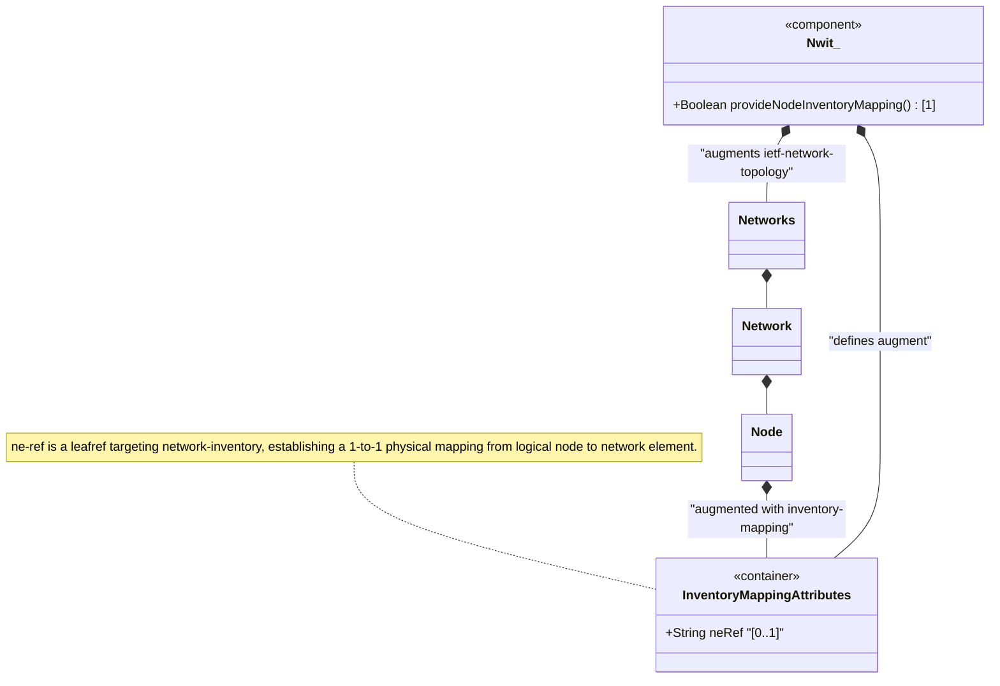

# Feature: Define Node Inventory Mapping Attributes

## Parent Epic
- [ ] #86 - [ietf-network-inventory-topology: Network Inventory Topology Mapping](https://github.com/gintatkinson/3dgs-033/blob/main/docs/epics/epic-06-ietf-network-inventory-topology.md) (augment container mapping topology node to physical network element, draft-ietf-ivy-network-inventory-topology Section 5)

## Description
Defines the `inventory-mapping-attributes` presence container that augments the ietf-network-topology module's `/nw:networks/nw:network/nw:node` to establish a correlation between a logical topology node and its physical network element (NE) in the network inventory. The container is conditionally active only when the parent network carries the `nwit:inventory-topology` network type (`when '../nw:network-types/nwit:inventory-topology'`).

When present, the container indicates the node is a **physical node** mapped to a network element. When absent, the node is treated as an **abstract/logical node** with no physical inventory correlation. The sole leaf `ne-ref` is of type `nwi:ne-ref` (imported from `ietf-network-inventory`), which is a leafref that points to a specific network element by its `ne-id` within the `/nwi:network-inventory/nwi:network-elements` list. This establishes a strict 1-to-1 mapping between the logical topology node and its physical NE.

## UML Class Diagram


## Interface Requirements

### 1. Test Data Shape
```json
{
  "ietf-network:networks": {
    "network": [
      {
        "network-id": "example:physical-underlay",
        "node": [
          {
            "node-id": "example:SW-1",
            "ietf-network-inventory-topology:inventory-mapping-attributes": {
              "ne-ref": "example:NE-SW1"
            }
          }
        ]
      }
    ]
  }
}
```

### 2. Validation & Constraints
- `inventory-mapping-attributes`: presence container, `config` is `true` (read-write), indicating the node is mapped to a physical NE; absence means the node is abstract/logical
- `ne-ref`: optional leaf (`?`), type `nwi:ne-ref` — a leafref that must reference an existing `ne-id` in `/nwi:network-inventory/nwi:network-elements/nwi:network-element`
- If `ne-ref` is unset or the container is absent, the node has no active inventory mapping and is treated as abstract
- The `when` condition (`../nw:network-types/nwit:inventory-topology`) must evaluate to true for this container to be valid
- Only one `inventory-mapping-attributes` per node is permitted (container cardinality is 1)
- Leafref integrity: the referenced NE must exist in the network inventory at the time of validation

### 3. Visual Layout & Arrangement
- Display the node inventory mapping as a read-only or configurable property in the `PropertyGrid` component (`properties_view` container) when a topology node is selected
- Show the `ne-ref` as a hyperlinked reference that, when clicked, navigates to the corresponding network element in the `HierarchyTreeSelector` (`resource_tree` container) or `TableView` (`elements_view` container)
- The property grid entry should indicate whether the node is "Physical (Mapped)" or "Abstract (Unmapped)" based on the presence/absence of the `inventory-mapping-attributes` container
- Apply CSS reset (`box-sizing: border-box`) with scoped naming (CSS Modules/BEM) to prevent specificity conflicts
- Layout containment restricted to the outer `properties_view` splitter panel

### 4. Interactive Flow & States
- **Physical Node State**: When `inventory-mapping-attributes` is present with a valid `ne-ref`, the node's visual representation in the topology view may include a physical indicator (e.g., solid fill), and the property grid shows the NE reference
- **Abstract Node State**: When the container is absent, the node is rendered as a logical/abstract node (e.g., dashed outline) and no inventory mapping properties are shown
- **Broken Reference State**: If `ne-ref` is set but the referenced NE no longer exists in the inventory, display a warning indicator with the dangling reference value, highlighting the referential integrity violation
- **Loading State**: Show a placeholder in the property grid while the node detail and NE reference resolution are being fetched
- **Error State**: Display an error indicator if the node inventory mapping data fails to load

## Given-When-Then Acceptance Criteria

### Scenario: Physical topology node maps to a network element
- **Given** a physical underlay network with `nwit:inventory-topology` network type
- **And** a network element "NE-R1" exists in the network inventory with `ne-id` "example:NE-R1"
- **When** a topology node "example:R1" has its `nwit:inventory-mapping-attributes` container present with `ne-ref` set to "example:NE-R1"
- **Then** the node is classified as a physical node with a 1-to-1 mapping to NE "NE-R1"
- **And** the `ne-ref` leafref successfully resolves to the NE in the network inventory

### Scenario: Abstract node has no inventory mapping
- **Given** a logical overlay network or a node without physical inventory correlation
- **When** the `nwit:inventory-mapping-attributes` container is NOT present under the node
- **Then** the node is classified as an abstract/logical node
- **And** no inventory correlation data is available for display

### Scenario: Node inventory mapping requires inventory-topology network type
- **Given** a network whose `network-types` does NOT include `nwit:inventory-topology`
- **When** a client attempts to instantiate `nwit:inventory-mapping-attributes` under a node in that network
- **Then** the when-guard rejects the operation
- **And** the inventory-mapping container is not valid in the data tree

### Scenario: Broken NE reference triggers validation error
- **Given** a topology node with `ne-ref` pointing to an NE that has been removed from the inventory
- **When** the data tree is validated or the node detail is queried
- **Then** the leafref constraint fails validation
- **And** the dangling reference is surfaced as a referential integrity error

### Scenario: Manual NE mapping for undiscovered nodes
- **Given** customer-premises equipment (CPE) outside the operator's management domain where automatic discovery is unavailable
- **When** an operator manually configures `nwit:inventory-mapping-attributes` with `ne-ref` pointing to a manually-registered NE
- **Then** the mapping is persisted in the configuration datastore
- **And** the node is treated as a physical node with NE correlation for service provisioning and inventory navigation

## Specification Context (Verbatim)

From draft-ietf-ivy-network-inventory-topology-08, Section 4 (Module Tree Structure):

> The module augments the "ietf-network-topology" module as follows:
> Inventory mapping attributes for nodes, and termination points:
>   The corresponding containers augments the topology module with the references to the base network inventory

From the YANG module augment description (node augment):

> "Augments the network topology node with inventory mapping attributes. This enables correlation between the logical node and its physical network element."

From the YANG module presence statement and description:

> "If present, it indicates this is a physical node, which maps to a network element. If not present, it indicates it is an abstract node."
>
> "Reference to the NE in the inventory that corresponds to this topology node. This reference establishes a 1:1 mapping between the logical node and its physical NE."

From draft-ietf-ivy-network-inventory-topology-08, Section 6 (Operational Considerations):

> "The inventory-mapping-attributes containers are defined as read-write (config true) to accommodate cases where automatic discovery is not possible, including: Customer-premises equipment (CPE) outside the operator's management domain; Leased lines and third-party transport resources; Planned or hypothetical resources for future deployment."

## Source References
Structural Schema: [ietf-network-inventory-topology.yang](https://github.com/ietf-ivy-wg/network-inventory-topology/blob/main/yang/ietf-network-inventory-topology.yang) (Clause: augment /nw:networks/nw:network/nw:node, lines 154-177)
Normative Specification: [draft-ietf-ivy-network-inventory-topology-08](https://datatracker.ietf.org/doc/html/draft-ietf-ivy-network-inventory-topology) (Section 4, Section 5, Section 6)

## Logical UI & Layout Bindings
- **Target LUI Component:** PropertyGrid
- **Target Layout Container ID:** properties_view
- **Data Source Bindings:** /nw:networks/nw:network/nw:node/nwit:inventory-mapping-attributes
