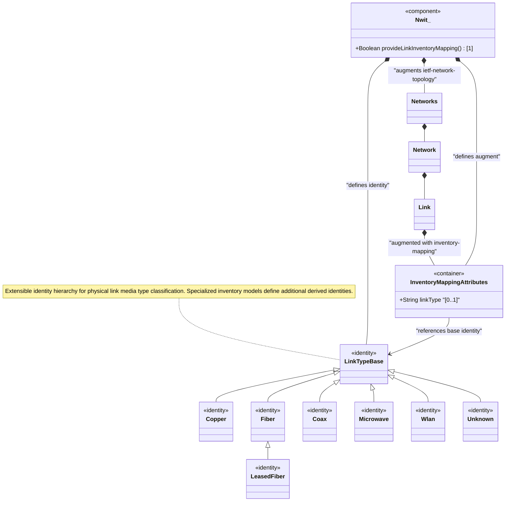

# Feature: Define Link Inventory Media Classification

## Parent Epic
- [ ] #86 - [ietf-network-inventory-topology: Network Inventory Topology Mapping](https://github.com/gintatkinson/3dgs-033/blob/main/docs/epics/epic-06-ietf-network-inventory-topology.md) (augment container providing link media type classification, draft-ietf-ivy-network-inventory-topology Section 4.1)

## Description
Defines the `inventory-mapping-attributes` presence container that augments the ietf-network-topology module's `/nw:networks/nw:network/nt:link` to provide lightweight physical media classification for topology links. The container is conditionally active only when the parent network carries the `nwit:inventory-topology` network type.

When present, the container indicates the link is a **physical link** at the lowest underlay abstraction level. The sole leaf `link-type` is of type `identityref` with base identity `link-type`, which is an extensible identity hierarchy defined in this module. The `link-type` serves as a lightweight discriminator that guides to the appropriate specialized inventory model for detailed resource information — wired media (fiber, copper, coax) typically reference passive network inventory, while wireless media (microwave, wlan) reference wireless-specific inventory.

The module defines the following link-type identity hierarchy: base identity `link-type` with direct subtypes `copper` (copper-based physical link), `fiber` (fiber-based physical link), `coax` (coaxial cable-based physical link), `microwave` (microwave-based wireless link), `wlan` (IEEE 802.11 wireless link), `unknown` (fallback for unclassifiable media, distinct from unset). Nested subtype `leased-fiber` (base `fiber`) represents leased fiber where detailed physical attributes are not visible to the lessee.

## UML Class Diagram


## Interface Requirements

### 1. Test Data Shape
```json
{
  "ietf-network:networks": {
    "network": [
      {
        "network-id": "example:campus-topology",
        "ietf-network-topology:link": [
          {
            "link-id": "example:Link-SW1-SW2",
            "source": {
              "source-node": "example:SW-1",
              "source-tp": "example:TP-SW1-P1"
            },
            "destination": {
              "dest-node": "example:SW-2",
              "dest-tp": "example:TP-SW2-P1"
            },
            "ietf-network-inventory-topology:inventory-mapping-attributes": {
              "link-type": "fiber"
            }
          }
        ]
      }
    ]
  }
}
```

### 2. Validation & Constraints
- `inventory-mapping-attributes`: presence container, `config` is `true` (read-write), indicating a physical link at the lowest underlay abstraction level; absence means the link is logical/abstract
- `link-type`: optional leaf (`?`), type `identityref` with base `link-type`, no default value — unset indicates the link type has not been assessed
- Valid `link-type` values: `copper`, `fiber`, `coax`, `microwave`, `wlan`, `unknown`, `leased-fiber` (and any future extension identities)
- `unknown` identity: explicitly records that the medium could not be classified (semantically distinct from unset/absent which means "not assessed")
- The base `link-type` identity is extensible — future modules may define additional derived identities
- The `when` condition (`../nw:network-types/nwit:inventory-topology`) must evaluate to true
- When `link-type` is `microwave`, detailed attributes are defined in the microwave topology data model; this module provides only the lightweight classification

### 3. Visual Layout & Arrangement
- Display the link inventory mapping as a property entry in the `PropertyGrid` component (`properties_view` container) when a topology link is selected in the `TopographicalView` (`topology_pane`) or `TableView` (`elements_view`)
- Render `link-type` as a dropdown selector or badge with color coding per media type (fiber blue, copper amber, coax grey, microwave yellow, wlan green, unknown grey-striped, leased-fiber blue with lock icon)
- Display the link in the topology view with a line style corresponding to the media type (solid for wired, dashed for wireless)
- Apply CSS reset (`box-sizing: border-box`) with scoped naming (CSS Modules/BEM) to prevent specificity conflicts
- Layout containment restricted to the outer `properties_view` splitter panel

### 4. Interactive Flow & States
- **Classified Link State**: When `inventory-mapping-attributes` is present with a valid `link-type`, the link's visual representation uses media-specific styling, and the property grid shows the classification with the corresponding color badge
- **Unclassified Link State**: When the container is present but `link-type` is unset, display "Not Assessed" with a neutral indicator in the property grid
- **Unknown Link State**: When `link-type` is `unknown`, display "Unknown Medium" with a warning indicator, indicating the medium could not be classified by the discovery system
- **Abstract Link State**: When the container is absent, no media type information is displayed; the link is rendered with default styling
- **Loading State**: Show a placeholder in the property grid while link detail data is being fetched

## Given-When-Then Acceptance Criteria

### Scenario: Fiber link is classified with appropriate media type
- **Given** a physical underlay network with `nwit:inventory-topology` network type
- **And** two switches are directly connected by a fiber optic cable
- **When** the topology link has its `nwit:inventory-mapping-attributes` container present with `link-type` set to `fiber`
- **Then** the link is classified as a physical link with fiber media
- **And** the `link-type` identityref resolves to the `fiber` identity
- **And** the system may reference the passive network inventory model for detailed fiber attributes

### Scenario: Leased fiber link has inherited fiber base but distinct identity
- **Given** a fiber link provided by a third-party operator where detailed physical attributes are not visible
- **When** the `link-type` is set to `leased-fiber`
- **Then** the link is classified as a fiber link (inherits from `fiber` base identity)
- **And** the `leased-fiber` identity indicates limited physical visibility to the lessee
- **And** the system does not attempt to query detailed passive inventoried attributes

### Scenario: Unknown medium explicitly records classification failure
- **Given** a discovery system that detects a physical link but cannot determine the medium type
- **When** the `link-type` is set to `unknown`
- **Then** the link is explicitly recorded as "unclassifiable"
- **And** this is semantically distinct from a link with `link-type` unset (which means "not assessed")

### Scenario: Abstract link has no media classification
- **Given** a logical overlay link (e.g., a Layer 3 adjacency) with no physical medium correlation
- **When** the `nwit:inventory-mapping-attributes` container is NOT present under the link
- **Then** the link is treated as abstract/logical with no media classification
- **And** no `link-type` information is available

### Scenario: Microwave link references specialized topology model
- **Given** a wireless microwave link
- **When** `link-type` is set to `microwave`
- **Then** the lightweight classification is applied
- **And** the system can navigate to the microwave topology data model for detailed attributes such as frequency, modulation, and capacity

## Specification Context (Verbatim)

From draft-ietf-ivy-network-inventory-topology-08, Section 4.1 (Link Extensions):

> This document adds a lightweight "link-type" leaf to the topology link mapping to enable basic physical media classification.
>
> "link-type": An identityref indicating the link media type.
>
> Examples of wired link types are "copper", "fiber", or "coax". For wireless media, values such as "microwave", or "wlan" may be used.
>
> The "link-type" serves as a lightweight discriminator that guides to the appropriate specialized inventory model for detailed resource information. For example, wired media ("fiber" or "copper") typically references a passive network inventory model.

From the YANG module container description (link augment):

> "Container for inventory-related attributes of a link."
>
> "This container provides lightweight media classification. The link-type indicates which specialized inventory model contains detailed resource information: Wired media (fiber, copper): passive network inventory; Wireless media (microwave, Wi-Fi): wireless-specific inventory. Detailed inventory references may be added in future modules."

From the `unknown` identity description:

> "The link media type is unknown or could not be determined. This identity is used as a fallback when the physical medium cannot be classified into any of the other defined types. When a discovery system is unable to determine the media type, it should set this identity rather than leaving the leaf unset. An unset leaf indicates that the link type has not been assessed, whereas unknown explicitly records that the medium could not be classified."

## Source References
Structural Schema: [ietf-network-inventory-topology.yang](https://github.com/ietf-ivy-wg/network-inventory-topology/blob/main/yang/ietf-network-inventory-topology.yang) (Clause: identities link-type/copper/fiber/coax/microwave/wlan/unknown/leased-fiber, lines 68-128; augment /nw:networks/nw:network/nt:link, lines 179-220)
Normative Specification: [draft-ietf-ivy-network-inventory-topology-08](https://datatracker.ietf.org/doc/html/draft-ietf-ivy-network-inventory-topology) (Section 4.1, Section 5, Appendix A)

## Logical UI & Layout Bindings
- **Target LUI Component:** PropertyGrid
- **Target Layout Container ID:** properties_view
- **Data Source Bindings:** /nw:networks/nw:network/nt:link/nwit:inventory-mapping-attributes
