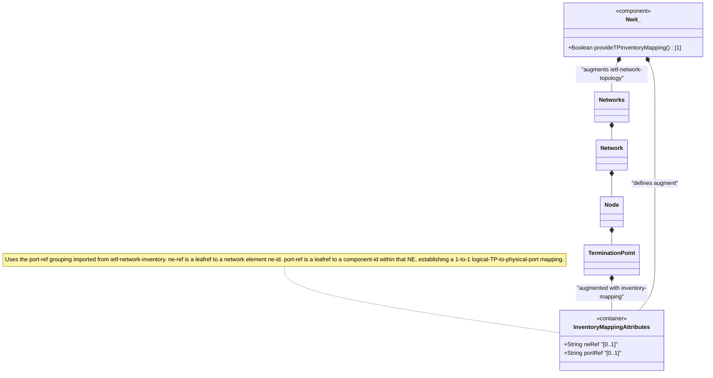

# Feature: Define Termination Point Inventory Mapping

## Parent Epic
- [ ] #86 - [ietf-network-inventory-topology: Network Inventory Topology Mapping](https://github.com/gintatkinson/3dgs-033/blob/main/docs/epics/epic-06-ietf-network-inventory-topology.md) (augment container mapping topology termination point to physical port component, draft-ietf-ivy-network-inventory-topology Section 5)

## Description
Defines the `inventory-mapping-attributes` presence container that augments the ietf-network-topology module's `/nw:networks/nw:network/nw:node/nt:termination-point` to establish a correlation between a logical termination point (TP) and its physical port component in the network inventory. The container is conditionally active only when the grandparent network carries the `nwit:inventory-topology` network type (`when '../../nw:network-types/nwit:inventory-topology'`).

When present, the container indicates the TP is a **physical TP** mapped to a port component. When absent, the TP is treated as a **logical TP** with no physical inventory correlation. The container uses the `nwi:port-ref` grouping (imported from `ietf-network-inventory`), which provides two leaves: `ne-ref` (type `nwi:ne-ref`, a leafref to the NE containing the port) and `port-ref` (type `leafref`, targeting the port component within the referenced NE). This establishes a 1-to-1 mapping between the logical TP and its physical port component, enabling correlation during service provisioning (e.g., mapping a Service Attachment Point's `parent-termination-point` to the underlying physical resource to verify capacity).

## UML Class Diagram


## Interface Requirements

### 1. Test Data Shape
```json
{
  "ietf-network:networks": {
    "network": [
      {
        "network-id": "example:campus-topology",
        "node": [
          {
            "node-id": "example:SW-1",
            "ietf-network-inventory-topology:inventory-mapping-attributes": {
              "ne-ref": "example:NE-SW1"
            },
            "ietf-network-topology:termination-point": [
              {
                "tp-id": "example:TP-SW1-P1",
                "ietf-network-inventory-topology:inventory-mapping-attributes": {
                  "ne-ref": "example:NE-SW1",
                  "port-ref": "/nwi:network-inventory/nwi:network-elements/nwi:network-element[ne-id='example:NE-SW1']/nwi:components/nwi:component[component-id='eth-port-1']"
                }
              }
            ]
          }
        ]
      }
    ]
  }
}
```

### 2. Validation & Constraints
- `inventory-mapping-attributes`: presence container, `config` is `true` (read-write), indicating the TP maps to a physical port; absence means the TP is logical
- `ne-ref`: optional leaf of type `nwi:ne-ref` — leafref that must reference a valid `ne-id` in the network inventory
- `port-ref`: optional leaf of type `leafref` — must reference a `component-id` within the components list of the network element identified by `ne-ref`
- Leafref integrity: both `ne-ref` and `port-ref` must resolve to existing inventory entities at validation time
- The `when` condition (`../../nw:network-types/nwit:inventory-topology`) must evaluate to true
- Both leaves are optional (`?`); if only `ne-ref` is set without `port-ref`, the TP maps to an NE but not to a specific port
- The `port-ref` expression targets the port component via the path `/nwi:network-inventory/nwi:network-elements/nwi:network-element/nwi:components/nwi:component` with XPath predicate filtering

### 3. Visual Layout & Arrangement
- Display the TP inventory mapping as property entries in the `PropertyGrid` component (`properties_view` container) when a termination point is selected in the `TopographicalView` (`topology_pane`) or `TableView` (`elements_view`)
- Show `ne-ref` and `port-ref` as hyperlinked references that navigate to the corresponding NE and component in the `HierarchyTreeSelector` (`resource_tree`)
- Display a composite label (e.g., "NE-SW1 / eth-port-1") for quick identification within the TP detail panel
- Indicate whether the TP is "Physical (Mapped)" or "Logical (Unmapped)" based on container presence
- Apply CSS reset (`box-sizing: border-box`) with scoped naming (CSS Modules/BEM) to prevent specificity conflicts
- Layout containment restricted to the outer `properties_view` splitter panel

### 4. Interactive Flow & States
- **Physical TP State**: When `inventory-mapping-attributes` is present with valid `ne-ref` and `port-ref`, the TP is rendered with a physical indicator, and the property grid shows both references with navigation links
- **Logical TP State**: When the container is absent, the TP is rendered as a logical termination point with no physical correlation shown
- **Partial Mapping State**: When only `ne-ref` is set but `port-ref` is absent, display the NE reference with a "(No port mapped)" annotation
- **Broken Reference State**: If either `ne-ref` or `port-ref` resolves to a non-existent entity, highlight the broken reference with an error indicator
- **Loading State**: Show placeholder entries in the property grid while TP detail data is being fetched

## Given-When-Then Acceptance Criteria

### Scenario: Physical termination point maps to a specific port component
- **Given** a physical underlay network with `nwit:inventory-topology` network type
- **And** network element "NE-SW1" contains a port component "eth-port-1" in the inventory
- **When** a termination point "TP-SW1-P1" has its `nwit:inventory-mapping-attributes` container present with `ne-ref` "NE-SW1" and `port-ref` pointing to "eth-port-1"
- **Then** the TP is classified as a physical TP with a 1-to-1 mapping to port "eth-port-1" on NE "NE-SW1"
- **And** the leafref integrity is validated — both references resolve correctly

### Scenario: Logical termination point has no physical port correlation
- **Given** a logical TP (e.g., a VLAN sub-interface or virtual interface) with no direct physical port mapping
- **When** the `nwit:inventory-mapping-attributes` container is NOT present under the TP
- **Then** the TP is treated as logical with no inventory correlation
- **And** no port reference information is available

### Scenario: SAP parent-termination-point resolves to physical port via inventory topology
- **Given** a Service Attachment Point (SAP) with a `parent-termination-point` referencing a topology TP
- **And** the referenced TP has `nwit:inventory-mapping-attributes` with a valid `port-ref`
- **When** the orchestrator queries the SAP and navigates to the parent TP
- **Then** the orchestrator can resolve the SAP to the underlying physical port component
- **And** the orchestrator can consult capacity models to verify port resource availability

### Scenario: Port-ref leafref integrity fails on dangling reference
- **Given** a termination point with `port-ref` pointing to a component that has been deleted from the inventory
- **When** the data tree is validated
- **Then** the leafref constraint fails
- **And** the dangling reference is reported as a referential integrity violation

### Scenario: Manual TP-to-port mapping for undiscovered ports
- **Given** a third-party transport resource port where automatic discovery is unavailable
- **When** an operator manually configures `nwit:inventory-mapping-attributes` on the TP with `ne-ref` and `port-ref` pointing to manually-registered inventory entities
- **Then** the mapping is persisted in the configuration datastore
- **And** the TP is correlated with its physical port for service provisioning purposes

## Specification Context (Verbatim)

From draft-ietf-ivy-network-inventory-topology-08, Section 3.1 (Determine Available Resources of Service Attachment Points):

> The inventory topology data model provides a physical port reference (port-ref) that enables correlation between logical topology entities and physical inventory components. During service provisioning, the SAP's parent-termination-point can be associated with the inventory topology's port-ref to locate the underlying physical resource.
>
> The orchestrator can then consult other relevant topology models to verify whether the identified port has adequate capacity for the requested service. If the physical port underlying a candidate SAP has insufficient resources (e.g., port speed fully utilized), the orchestrator can select an alternate SAP that maps to a different port with adequate capacity.

From the YANG module augment description (termination-point augment):

> "Augments the TP with inventory mapping and port breakout."

From the YANG module presence statement and refined port-ref description:

> "If present, it indicates this is a physical termination point (TP), which maps to a port component. If not present, it indicates it is a logical TP."
>
> "Reference to the physical port component in the network inventory. This reference establishes a 1:1 mapping between the logical TP and its physical port component."

## Source References
Structural Schema: [ietf-network-inventory-topology.yang](https://github.com/ietf-ivy-wg/network-inventory-topology/blob/main/yang/ietf-network-inventory-topology.yang) (Clause: augment /nw:networks/nw:network/nw:node/nt:termination-point, lines 222-267)
Normative Specification: [draft-ietf-ivy-network-inventory-topology-08](https://datatracker.ietf.org/doc/html/draft-ietf-ivy-network-inventory-topology) (Section 3.1, Section 4, Section 5, Appendix A)

## Logical UI & Layout Bindings
- **Target LUI Component:** PropertyGrid
- **Target Layout Container ID:** properties_view
- **Data Source Bindings:** /nw:networks/nw:network/nw:node/nt:termination-point/nwit:inventory-mapping-attributes
