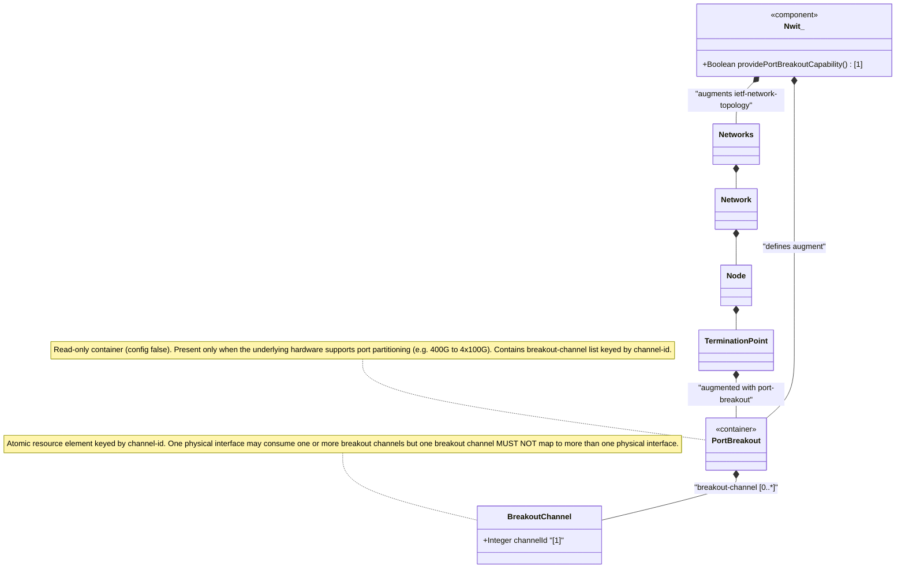

# Feature: Define Port Breakout Capability

## Parent Epic
- [ ] #86 - [ietf-network-inventory-topology: Network Inventory Topology Mapping](https://github.com/gintatkinson/3dgs-033/blob/main/docs/epics/epic-06-ietf-network-inventory-topology.md) (read-only container listing breakout channel capability of a physical port, draft-ietf-ivy-network-inventory-topology Section 4.2)

## Description
Defines the `port-breakout` presence container that augments the ietf-network-topology module's `/nw:networks/nw:network/nw:node/nt:termination-point` to expose the breakout capability of the physical port represented by the TP. This is a read-only (`config false`) container that is present only when the underlying hardware supports partitioning the port into multiple independent channels (e.g., a 400 Gb/s DR4 port that can be split into 4x100 Gb/s lanes).

The container contains a `breakout-channel` list keyed by `channel-id` (type `uint16`). Each entry represents an independent lane or sub-port that can be used for channelized interfaces. The channels represent the intrinsic capability of the port to be partitioned, regardless of whether the port is currently configured as a trunk (single interface) or as a breakout port (multiple interfaces).

Key behavioral constraints: one TP maps to one physical port with breakout channels listed within that port's container. One physical interface may be associated with one or more breakout channels, but one breakout channel MUST NOT be associated with more than one physical interface. A trunk port is associated with exactly one physical interface. A breakout port is decomposed into two or more physical interfaces, which may run at the same or different speeds and may consume the same or a different number of breakout channels. Only TPs whose parent port is breakout-capable need to instantiate this container; otherwise it is omitted to keep the topology model minimal.

## UML Class Diagram


## Interface Requirements

### 1. Test Data Shape
```json
{
  "ietf-network:networks": {
    "network": [
      {
        "network-id": "example:underlay-topology-400g",
        "node": [
          {
            "node-id": "example:n1",
            "ietf-network-topology:termination-point": [
              {
                "tp-id": "example:400g-1/0/1",
                "ietf-network-inventory-topology:inventory-mapping-attributes": {
                  "ne-ref": "example:NE-1",
                  "port-ref": "example:port-1"
                },
                "ietf-network-inventory-topology:port-breakout": {
                  "breakout-channel": [
                    { "channel-id": 1 },
                    { "channel-id": 2 },
                    { "channel-id": 3 },
                    { "channel-id": 4 }
                  ]
                }
              }
            ]
          }
        ]
      }
    ]
  }
}
```

### 2. Validation & Constraints
- `port-breakout`: presence container, `config false` — strictly read-only operational state representing hardware-determined capability
- `breakout-channel`: list keyed by `channel-id` (type `uint16`), no `min-elements` or `max-elements` constraints — the number of channels is determined by hardware
- `channel-id`: mandatory key leaf (`uint16`), unique within the scope of the parent port, serving as the channel identifier — valid range from 0 to 65535
- The `config false` flag means breakout channels cannot be created, modified, or deleted via configuration — they are discovered from hardware
- The container is present only when the underlying hardware supports partitioning; for non-breakout-capable ports, the container is omitted entirely
- The `when` condition (`../../nw:network-types/nwit:inventory-topology`) must evaluate to true
- Breakout channel count reflects the maximum physical subdivision of the port, not the current configured interface count
- No default values — the list may be empty if the port is breakout-capable but no channels are currently exposed

### 3. Visual Layout & Arrangement
- Display the breakout channel list in a `TableView` component (`elements_view` container) when a termination point that supports port breakout is selected
- Each row shows the `channel-id` value; columns may include derived interface associations if populated by companion models
- Render a breakout capability indicator on the TP in the `TopographicalView` (`topology_pane`) — a stacked port icon or channel count badge — to visually distinguish breakout-capable ports
- For non-breakout-capable ports, the `port-breakout` section is not rendered at all in the property grid or table view
- Apply CSS reset (`box-sizing: border-box`) with scoped naming (CSS Modules/BEM) to prevent specificity conflicts
- Layout containment restricted to the outer `elements_view` splitter panel; do not apply containment on scrollable child sections within the table

### 4. Interactive Flow & States
- **Breakout-Capable State**: When `port-breakout` is present with one or more `breakout-channel` entries, the TP shows a breakout indicator; the table view lists all channels with their `channel-id` values
- **Trunk Port State**: When `port-breakout` is present but the port is currently configured as a trunk (single physical interface), the breakout channels are still listed — the table shows the intrinsic capability, and a note indicates "Currently configured as trunk"
- **Non-Breakout Port State**: When the `port-breakout` container is absent, no breakout information is displayed — the port is assumed to be a single, non-partitionable physical port
- **Empty Channel State**: If the `breakout-channel` list is empty but the container is present, display "Breakout-capable: No channels provisioned" — hardware supports partitioning but no lanes are allocated
- **Loading State**: Show a skeleton table with placeholder rows while the TP detail and breakout data are being fetched from the network controller

## Given-When-Then Acceptance Criteria

### Scenario: Breakout-capable port exposes its channel subdivision
- **Given** a 400 Gb/s DR4 port that is physically implemented as four independent 100 Gb/s lanes (MPO breakout)
- **When** the `nwit:port-breakout` container is present on the TP
- **Then** the `breakout-channel` list contains exactly 4 entries with `channel-id` values 1, 2, 3, 4
- **And** each channel-id is unique within the list
- **And** the `config false` flag prevents any modification of the channel list

### Scenario: Non-breakout-capable port omits the port-breakout container
- **Given** a standard 10 Gb/s SFP+ port that does not support channel breakout
- **When** the port's TP data is queried
- **Then** the `nwit:port-breakout` container is NOT present in the data tree
- **And** no breakout UI elements are rendered for this TP

### Scenario: Trunk port retains channel listing but operates as single interface
- **Given** a breakout-capable 400G port currently configured as a single trunk interface
- **When** the `port-breakout` container is present with 4 breakout channels
- **Then** the channel list remains visible (reflecting intrinsic hardware capability)
- **And** the system indicates the port is currently operating in trunk mode (single physical interface)
- **And** the operator can reconfigure the port to use breakout channels without changing the hardware capability data

### Scenario: One breakout channel is exclusive to one physical interface
- **Given** a breakout-capable port with 4 breakout channels
- **And** an interface configuration system that assigns physical interfaces to breakout channels
- **When** breakout channel 1 is assigned to physical interface "if-100G-1"
- **Then** breakout channel 1 MUST NOT be simultaneously assigned to another physical interface
- **And** the one-channel-to-many-interfaces constraint is enforced at the interface configuration layer

### Scenario: Breakout channel data is read-only hardware state
- **Given** a TP with `nwit:port-breakout` container present
- **When** a client attempts to create, modify, or delete a `breakout-channel` entry via the configuration datastore
- **Then** the operation is rejected because `port-breakout` is `config false`
- **And** the breakout channel list can only be updated by hardware discovery, not by manual configuration

### Scenario: Breakout capability independent of inventory mapping
- **Given** a TP with `nwit:port-breakout` container present
- **And** the `nwit:inventory-mapping-attributes` container is also present (the TP maps to a physical port)
- **When** the breakout channels are enumerated
- **Then** the breakout data represents the hardware capability of the mapped physical port
- **And** the inventory mapping (`port-ref`) identifies which port component provides this breakout capability

## Specification Context (Verbatim)

From draft-ietf-ivy-network-inventory-topology-08, Section 4.2 (Port-Breakout Capability):

> High-density Ethernet ports (e.g., 400 Gb/s DR4) can be split into multiple independent lower-speed channels. The breakout channels represent the intrinsic capability of the port to be partitioned, regardless of whether the port is currently configured as a trunk or as a breakout port.
>
> A trunk port is associated with exactly one physical interface. A breakout port is a port that is decomposed into two or more physical interfaces; those interfaces may run at the same or different speeds and may consume the same or a different number of breakout channels.
>
> The container "port-breakout" is added under the termination-point augmentation. It lists the logical channels into which the single physical port can be divided. Only termination-points whose parent port is breakout-capable need to instantiate the container; otherwise the container is omitted, keeping the topology model minimal for the common non-breakout case.
>
> Breakout channel is an atomic resource element obtained by partitioning a breakout port. One physical interface may be associated with one or more breakout channels, but one breakout channel MUST NOT be associated with more than one physical interface.
>
> It is assumed that a port which supports breakout can be configured either as a trunk port or as a breakout port. Interface channelisation (e.g., VLAN sub-interfaces) is outside the scope of this document and is addressed by the Layer 2 network topology model.

From the YANG module description statement (port-breakout):

> "Breakout capability of the physical port represented by this TP. One TP maps to one physical port; channels are listed here. This container is present only when the underlying hardware supports partitioning the port into multiple independent channels (e.g., 400G to 4x100G)."

From draft-ietf-ivy-network-inventory-topology-08, Section 6 (Operational Considerations):

> port-breakout: Hardware capability determined by physical port characteristics (config false)

From draft-ietf-ivy-network-inventory-topology-08, Appendix B:

> "This appendix provides an example of a 400 Gb/s DR4 port that is physically implemented as four independent 100 Gb/s lanes (an MPO breakout). The lanes are exposed as breakout-channel entries so that the port can later be configured as either a single 400G trunk or four 100G breakout interfaces."

## Source References
Structural Schema: [ietf-network-inventory-topology.yang](https://github.com/ietf-ivy-wg/network-inventory-topology/blob/main/yang/ietf-network-inventory-topology.yang) (Clause: container port-breakout and list breakout-channel, lines 244-266)
Normative Specification: [draft-ietf-ivy-network-inventory-topology-08](https://datatracker.ietf.org/doc/html/draft-ietf-ivy-network-inventory-topology) (Section 4.2, Section 5, Section 6, Appendix B)

## Logical UI & Layout Bindings
- **Target LUI Component:** TableView
- **Target Layout Container ID:** elements_view
- **Data Source Bindings:** /nw:networks/nw:network/nw:node/nt:termination-point/nwit:port-breakout
