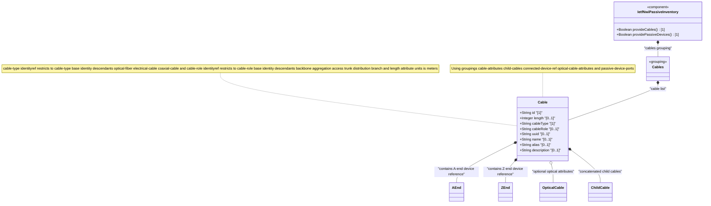

# Feature: Define Cable Entity

## Parent Epic
- [ ] #108 - [IETF NWI Passive Inventory](https://github.com/gintatkinson/3dgs-033/blob/main/docs/epics/epic-07-ietf-nwi-passive-inventory.md) (YANG list node defining the cable entity keyed by id, augmented under the base network inventory root)

## Description
Defines the `cable` list, the primary entity for representing guiding media (optical fiber cables, electrical cables, and coaxial cables) within the passive network inventory model. Cables are physical transmission pathways that direct and confine electromagnetic signals. Each cable is uniquely identified by an `id` and carries classification attributes (`cable-type`, `cable-role`), physical characteristics (`length` in meters), and inherits common entity attributes (`uuid`, `name`, `alias`, `description`) from the base network inventory module. The cable entity anchors the containment hierarchy for connection endpoints (a-end, z-end), optical fiber-specific attributes (when applicable), and concatenated child cables.

**Identities consumed by this feature:**
- `cable-type` base identity hierarchy: `optical-fiber`, `electrical-cable`, `coaxial-cable`
- `cable-role` base identity hierarchy: `backbone`, `aggregation`, `access`, `trunk`, `distribution`, `branch`
- `cable-attributes` grouping: composed from `common-cable-attributes` (id, length, connected-device-ref a-end and z-end), inherited `nwi:basic-common-entity-attributes`, cable-type leaf, cable-role leaf, and `optical-cable-attributes`
- `child-cables` grouping: list of `child-cable` entries
- `connected-device-ref` grouping: defines a-end and z-end container endpoints

## UML Class Diagram


## Interface Requirements

### 1. Test Data Shape
```json
{
  "nwi-passive:cable": [
    {
      "id": "cable-fo-001",
      "length": 1500,
      "cable-type": "nwi-passive:optical-fiber",
      "cable-role": "nwi-passive:backbone",
      "uuid": "550e8400-e29b-41d4-a716-446655440000",
      "name": "Fiber Backbone Cable Segment A",
      "alias": "FB-A",
      "description": "Long-haul optical backbone cable between Central Office A and Central Office B"
    }
  ]
}
```

### 2. Validation & Constraints
- `id` (type: string): mandatory key field, must be unique within the cable list, no explicit pattern or length constraint in schema
- `length` (type: uint32, units: meter): optional, non-negative integer representing cable length in meters, no explicit range constraint beyond uint32 maximum
- `cable-type` (type: identityref base cable-type): mandatory, must resolve to a valid cable-type identity — one of `optical-fiber`, `electrical-cable`, or `coaxial-cable`
- `cable-role` (type: identityref base cable-role): optional, must resolve to one of `backbone`, `aggregation`, `access`, `trunk`, `distribution`, or `branch` if present
- `uuid` (type: string, from nwi:basic-common-entity-attributes): optional, RFC 9562 UUID for the cable entity
- `name` (type: string): optional, human-readable name for the cable
- `alias` (type: string): optional, shorter alias for display or identification
- `description` (type: string): optional, free-text description of the cable
- The cable-type `optical-fiber` enables the conditional `optical-cable` container via `when` expression
- The cable-type `electrical-cable` and its descendant `coaxial-cable` are guiding media using metal conductors
- All inherited basic-common-entity-attributes carry no additional constraints beyond their type definitions

### 3. Visual Layout & Arrangement
- Display cables as rows in a `TableView` component with columns for id, name, cable-type, cable-role, and length
- The id column should serve as the primary row identifier displayed in monospace font
- Cable-type and cable-role columns render as human-readable labels resolved from the identity hierarchy
- Length column renders with "m" unit suffix (e.g., "1500 m")
- Row selection triggers detail expansion in the PropertyGrid showing the full cable entity with all attributes
- Apply CSS reset (`box-sizing: border-box`) with scoped naming (CSS Modules/BEM) to prevent specificity conflicts in table rendering
- Layout containment restricted to outer splitter panels; do not apply containment on scrollable child panels within the table

### 4. Interactive Flow & States
- **Empty state**: When the cable list is empty, display an empty-state placeholder with the text "No cables defined" and a visual indicator
- **Loading state**: Display a loading skeleton or spinner while cable data is being fetched from the backend data store
- **Error state**: On fetch failure, display an error banner with the error message and a retry action button
- **Row selection**: Selecting a cable row highlights it with a visual indicator (background color change) and loads its details into the PropertyGrid
- **Inline editing**: The cable id is read-only (key field); all other leaf attributes support inline editing with validation feedback for type mismatches
- Mandate computed-style assertions for highlight colors and selection indicators in automated tests

## Given-When-Then Acceptance Criteria

**Scenario: Create a new optical fiber cable**
- **Given** the network inventory has no cables defined
- **When** the operator creates a new cable with id "cable-fo-001", cable-type "optical-fiber", length 1500, and cable-role "backbone"
- **Then** the cable is persisted with all specified attributes, the list displays one entry, and the type is reported as optical-fiber

**Scenario: Create a cable without required identifier**
- **Given** the cable list is open for data entry
- **When** the operator attempts to create a cable without specifying an id
- **Then** the operation is rejected with a validation error indicating that id is mandatory

**Scenario: Assign an invalid cable-type identity**
- **Given** the cable list has at least one cable
- **When** the operator attempts to set cable-type to a value not derived from the cable-type base identity
- **Then** the operation is rejected with a validation error indicating the value must be a valid cable-type identity

**Scenario: Assign an invalid cable-role identity**
- **Given** a cable entry with id "cable-fo-001"
- **When** the operator attempts to set cable-role to a value not derived from the cable-role base identity
- **Then** the operation is rejected with a validation error

**Scenario: Read cable details by identifier**
- **Given** a cable with id "cable-fo-001" exists in the inventory
- **When** the operator selects the cable row in the table view
- **Then** the PropertyGrid displays all cable attributes including id, length, cable-type, cable-role, and inherited common attributes

**Scenario: Update cable length with negative value**
- **Given** a cable with id "cable-fo-001" and length 1500 exists
- **When** the operator attempts to set length to -100
- **Then** the operation is rejected because length is uint32 (non-negative integer range)

**Scenario: Delete a cable that is referenced by a child entity**
- **Given** a cable with id "cable-fo-001" has associated a-end and z-end references
- **When** the operator attempts to delete the cable
- **Then** the system cascades the deletion to all associated child entities or rejects with a referential integrity warning

## Specification Context (Verbatim)

From draft-ygb-ivy-passive-network-inventory-05, Section 5 (YANG Model Overview):

> "The YANG data model in this draft augments the model defined in [I-D.ietf-ivy-network-inventory-yang] with the following information:
> * Cables: a list of cables with each containing an optional list of child cables."

From Section 3.1 (Terminology):

> "Guiding media: refers to physical transmission pathways - such as optical fiber cables, electrical cables, and coaxial cables - that direct and confine electromagnetic signals along a specific route. These media provide a bounded channel for data transmission, ensuring signal integrity, minimizing interference, and enabling high-speed communication over varying distances. This category is also commonly known as guided media or wired transmission media. Guiding media can be concatenated to form longer guiding media."

> "Optical Cable: refers to a type of guiding media that uses optical fiber as media to transmit optical signals. An optical cable can contain one or multiple fiber cores, also known as fiber strands, each serving as an independent guiding media for data transmission. Optical cables can be spliced or fused through joint boxes, optical distribution frames (ODF), or fiber jumpers."

> "Electrical Cable: refers to a type of guiding media that uses metal conductors (such as copper or aluminum wires) as a medium to carry electrical signals for communication or power distribution. Common examples include twisted-pair cables (such as CAT-5/6 and DSL cables), and coaxial cables, which feature a single-core conductor commonly used in DOCSIS and MoCA-based broadband access networks. Electrical cables can be connected through splicing, connectors, or junction boxes."

## Source References
Structural Schema: [ietf-nwi-passive-inventory.yang](https://github.com/aguoietf/draft-ygb-ivy-passive-network-inventory/blob/main/yang/ietf-nwi-passive-inventory.yang) (Clause: grouping cables, cable list, grouping common-cable-attributes, grouping cable-attributes, grouping child-cables, grouping connected-device-ref, grouping optical-cable-attributes, lines 348-448)
Normative Specification: [draft-ygb-ivy-passive-network-inventory-05](https://datatracker.ietf.org/doc/draft-ygb-ivy-passive-network-inventory/) (Clause: Section 3.1, Section 5)

## Logical UI & Layout Bindings
- **Target LUI Component:** TableView
- **Target Layout Container ID:** elements_view
- **Data Source Bindings:** `/nwi:network-inventory/nwi-passive:cables/nwi-passive:cable`
