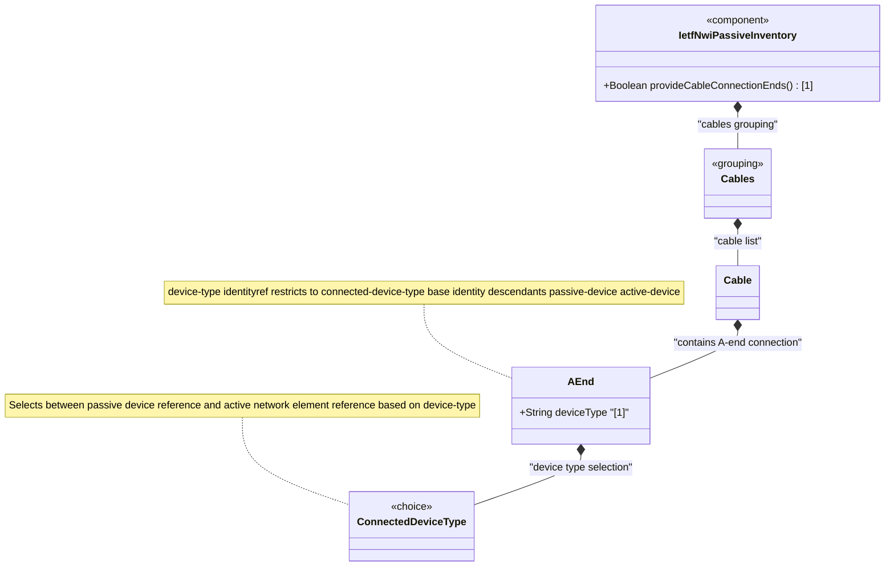

# Feature: Define Cable A-End Connection

## Parent Epic
- [ ] #108 - [IETF NWI Passive Inventory](https://github.com/gintatkinson/3dgs-033/blob/main/docs/epics/epic-07-ietf-nwi-passive-inventory.md) (YANG container node defining the A-end device connection reference within a cable)

## Description
Defines the `a-end` container that represents the A-end (source/head-end) device connection point for a cable or child cable. This container holds the `device-type` classification leaf and the `connected-device-type` choice which selects between a passive device reference (`device-id`) and an active network element reference (`ne-ref` and `component-ref`). The A-end together with the Z-end container forms a complete device-to-device connection topology over a guiding medium. The device-type leaf is an identityref constrained to the `connected-device-type` base identity (descendants: `passive-device`, `active-device`), and each choice case carries a `must` constraint ensuring the device-type value is consistent with the selected reference fields.

This container is defined in the `connected-device-ref` grouping and reused identically at both the cable and child-cable levels via the `common-cable-attributes` grouping.

**Identities consumed:**
- `connected-device-type` base identity: passive-device, active-device

## UML Class Diagram


## Interface Requirements

### 1. Test Data Shape
```json
{
  "a-end": {
    "device-type": "nwi-passive:active-device",
    "connected-device-type": {
      "ne-ref": "ne-core-router-01",
      "component-ref": "port-eth-1-1-1"
    }
  }
}
```

### 2. Validation & Constraints
- `device-type` (type: identityref base connected-device-type): mandatory leaf, must resolve to either `passive-device` or `active-device`
- `device-type` drives conditional validation via `must` expressions on the choice cases — if `passive-device`, only `device-id` is valid; if `active-device`, only `ne-ref` and `component-ref` are valid
- The `a-end` container is optional (no mandatory constraint on the container itself); a cable may exist without A-end device references
- No additional constraints beyond type enforcement at the container level — all case-specific constraints are delegated to the connected-device-type choice

### 3. Visual Layout & Arrangement
- Display the A-end connection section as a collapsible group within the PropertyGrid for the selected cable
- Show the `device-type` selector as a dropdown or radio group with two options: "Passive Device" and "Active Device (Network Element)"
- When "Passive Device" is selected, reveal a single text input field labeled "Device Identifier"
- When "Active Device (Network Element)" is selected, reveal two fields: "Network Element Reference" and "Component Reference"
- The selector and fields are rendered within a bordered section with the heading "A-End Connection"
- Use scoped CSS naming (BEM) to avoid specificity conflicts with the Z-end section which has identical structure
- Apply CSS reset (`box-sizing: border-box`) for consistent field sizing

### 4. Interactive Flow & States
- **Default state**: The A-end section is collapsed by default when no device-type has been selected
- **Device type selection**: Changing the device-type selector immediately swaps the visible fields; values from the previously selected type are preserved but hidden
- **Validation feedback**: Invalid device-type values display an inline error message below the selector
- **Parent cable context**: The A-end section label includes the parent cable's id for disambiguation when multiple cable panels are open
- Mandate computed-style assertions for collapsed/expanded transitions and error highlight colors in automated tests

## Given-When-Then Acceptance Criteria

**Scenario: Configure A-end with active device reference**
- **Given** a cable with id "cable-fo-001" exists
- **When** the operator sets device-type to "active-device", ne-ref to "ne-core-01", and component-ref to "port-1-1-1"
- **Then** the A-end connection is persisted with all three values, and the active device fields are visible

**Scenario: Configure A-end with passive device reference**
- **Given** a cable with id "cable-fo-001" exists
- **When** the operator sets device-type to "passive-device" and device-id to "splitter-outdoor-05"
- **Then** the A-end connection is persisted, the passive device-id field is visible, and the NE reference fields are hidden

**Scenario: Device-type mismatch with active case**
- **Given** a cable A-end is configured with device-type "passive-device"
- **When** the operator attempts to set ne-ref to "ne-core-01"
- **Then** the operation is rejected because the must constraint requires device-type to be active-device when ne-ref is present

**Scenario: Device-type mismatch with passive case**
- **Given** a cable A-end is configured with device-type "active-device"
- **When** the operator attempts to set device-id to "splitter-01"
- **Then** the operation is rejected because the must constraint requires device-type to be passive-device when device-id is present

**Scenario: Remove A-end connection**
- **Given** a cable A-end is configured with an active device reference
- **When** the operator clears all A-end fields
- **Then** the A-end container is removed from the cable data, and the section collapses to its default empty state

**Scenario: Reference an invalid network element**
- **Given** a cable A-end with device-type "active-device"
- **When** the operator sets ne-ref to a value that does not correspond to any existing network element in the inventory
- **Then** the operation is rejected because ne-ref is a leafref that must resolve to an existing NE identifier

## Specification Context (Verbatim)

From draft-ygb-ivy-passive-network-inventory-05, Section 3.1 (Terminology):

> "Passive device: refers to a physical device within a network that does not require external power to function, and simply manipulates signals through processes like transmission, reflection, splitting, filtering, or attenuation without actively amplifying or generating the signal."

> "Active device: refers to a physical device that contains hardware and software and is manageable through communication interfaces. Network elements defined by [I-D.ietf-ivy-network-inventory-yang] are examples of active device."

## Source References
Structural Schema: [ietf-nwi-passive-inventory.yang](https://github.com/aguoietf/draft-ygb-ivy-passive-network-inventory/blob/main/yang/ietf-nwi-passive-inventory.yang) (Clause: grouping connected-device-end, grouping connected-device-ref, container a-end, lines 283-346)
Normative Specification: [draft-ygb-ivy-passive-network-inventory-05](https://datatracker.ietf.org/doc/draft-ygb-ivy-passive-network-inventory/) (Clause: Section 3.1)

## Logical UI & Layout Bindings
- **Target LUI Component:** PropertyGrid
- **Target Layout Container ID:** properties_view
- **Data Source Bindings:** `/nwi:network-inventory/nwi-passive:cables/nwi-passive:cable/nwi-passive:a-end`
