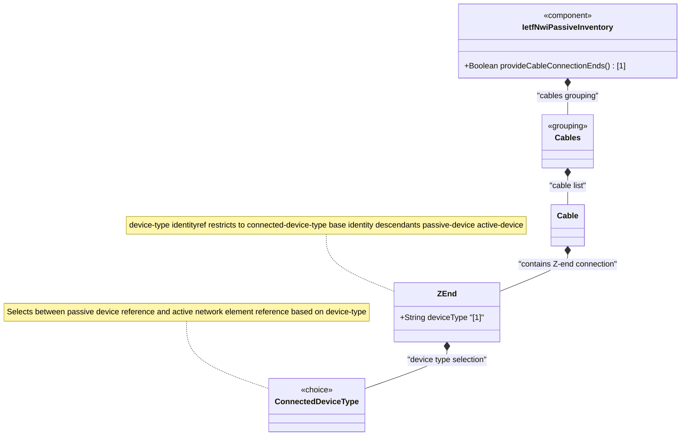

# Feature: Define Cable Z-End Connection

## Parent Epic
- [ ] #108 - [IETF NWI Passive Inventory](https://github.com/gintatkinson/3dgs-033/blob/main/docs/epics/epic-07-ietf-nwi-passive-inventory.md) (YANG container node defining the Z-end device connection reference within a cable)

## Description
Defines the `z-end` container that represents the Z-end (destination) device connection point for a cable or child cable. This container is structurally identical to the A-end — both use the same `connected-device-end` grouping via the `connected-device-ref` grouping — and holds the `device-type` classification leaf and the `connected-device-type` choice selecting between passive and active device references. The Z-end represents the logical destination end of the guiding medium. Separate A-end and Z-end containers allow a cable to be connected to two different device types at its two ends (e.g., active network element at A-end, passive splitter at Z-end).

**Identities consumed:**
- `connected-device-type` base identity: passive-device, active-device

## UML Class Diagram


## Interface Requirements

### 1. Test Data Shape
```json
{
  "z-end": {
    "device-type": "nwi-passive:passive-device",
    "connected-device-type": {
      "device-id": "odf-rack-3-bay-2"
    }
  }
}
```

### 2. Validation & Constraints
- `device-type` (type: identityref base connected-device-type): mandatory leaf, must resolve to either `passive-device` or `active-device`
- `device-type` drives conditional validation via `must` expressions on the choice cases — if `passive-device`, only `device-id` is valid; if `active-device`, only `ne-ref` and `component-ref` are valid
- The `z-end` container is optional (no mandatory constraint on the container itself); a cable may exist without Z-end device references
- The Z-end is structurally independent from the A-end; the same or different device types may be configured at each end
- All other constraints match those of the A-end container (identical grouping)

### 3. Visual Layout & Arrangement
- Display the Z-end connection section as a collapsible group within the PropertyGrid for the selected cable, positioned below the A-end section
- Use identical layout pattern as the A-end: device-type selector dropdown/radio group, conditional fields based on selection
- Visually distinguish the Z-end section from the A-end section using a "Z-End Connection" heading and subtle border styling
- Use scoped CSS naming (BEM) to prevent specificity conflicts between the structurally identical A-end and Z-end sections
- Apply CSS reset (`box-sizing: border-box`) for consistent field sizing

### 4. Interactive Flow & States
- **Default state**: The Z-end section mirrors A-end behavior — collapsed by default when no device-type has been selected
- **Device type selection**: Identical behavior to A-end — swapping device-type immediately toggles visible fields
- **Independent state**: The Z-end state operates independently from A-end; selecting "Passive Device" on Z-end does not affect A-end's selection
- **Validation feedback**: Same inline error pattern as A-end for invalid device-type values
- Mandate computed-style assertions for highlight colors and expanded/collapsed state in automated tests

## Given-When-Then Acceptance Criteria

**Scenario: Configure Z-end with passive device reference**
- **Given** a cable with id "cable-fo-001" exists
- **When** the operator sets z-end device-type to "passive-device" and device-id to "odf-rack-3-bay-2"
- **Then** the Z-end connection is persisted, and the passive device fields are visible

**Scenario: Configure Z-end with active device reference**
- **Given** a cable with id "cable-fo-001" exists
- **When** the operator sets z-end device-type to "active-device", ne-ref to "ne-edge-02", and component-ref to "port-1-1"
- **Then** the Z-end connection is persisted with the active device reference

**Scenario: Mixed device types at A-end and Z-end**
- **Given** a cable A-end is configured with active-device (ne-ref "ne-core-01")
- **When** the operator configures Z-end with device-type "passive-device" and device-id "splitter-03"
- **Then** both ends are persisted independently with their respective device types, and both display correctly in the PropertyGrid

**Scenario: Device-type mismatch with active case at Z-end**
- **Given** a cable Z-end is configured with device-type "passive-device"
- **When** the operator attempts to set ne-ref at Z-end to "ne-core-01"
- **Then** the operation is rejected because the must constraint requires device-type to be active-device when ne-ref is present

**Scenario: Remove Z-end connection**
- **Given** a cable Z-end is configured with a passive device reference
- **When** the operator clears all Z-end fields
- **Then** the Z-end container is removed from the cable data

## Specification Context (Verbatim)

From draft-ygb-ivy-passive-network-inventory-05, Section 2.1 (Passive Infrastructure in Optical Transport Networks):

> "Passive infrastructure in optical transport networks serves as the backbone for high-capacity data transmission. Key components include fiber optic cables, which act as the primary medium of long distance transmission. Optical connectors, patch panels, and splice enclosures are crucial for joining and managing fiber links."

From Section 1 (Introduction):

> "Passive infrastructure serves as physical connections between active network devices, forming the backbone for network topology."

## Source References
Structural Schema: [ietf-nwi-passive-inventory.yang](https://github.com/aguoietf/draft-ygb-ivy-passive-network-inventory/blob/main/yang/ietf-nwi-passive-inventory.yang) (Clause: grouping connected-device-ref, container z-end, lines 333-346)
Normative Specification: [draft-ygb-ivy-passive-network-inventory-05](https://datatracker.ietf.org/doc/draft-ygb-ivy-passive-network-inventory/) (Clause: Section 1, Section 2.1)

## Logical UI & Layout Bindings
- **Target LUI Component:** PropertyGrid
- **Target Layout Container ID:** properties_view
- **Data Source Bindings:** `/nwi:network-inventory/nwi-passive:cables/nwi-passive:cable/nwi-passive:z-end`
