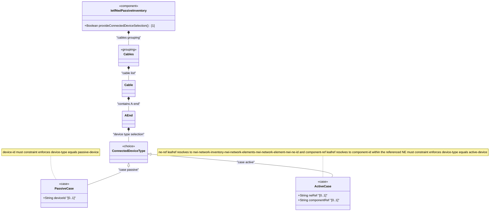

# Feature: Define Connected Device Type Selector

## Parent Epic
- [ ] #108 - [IETF NWI Passive Inventory](https://github.com/gintatkinson/3dgs-033/blob/main/docs/epics/epic-07-ietf-nwi-passive-inventory.md) (YANG choice node selecting between passive and active device reference alternatives at cable end connections)

## Description
Defines the `connected-device-type` YANG choice node that selects between two mutually exclusive connection endpoint alternatives within a cable's A-end or Z-end container. The choice enforces that a cable end can be connected to exactly one type of device at a time: either a passive device (identified by `device-id` in the `passive` case) or an active network element (identified by `ne-ref` referencing a network element and `component-ref` referencing a specific component within that NE in the `active` case). Each case carries a `must` constraint cross-validating against the parent `device-type` leaf to ensure consistency between the type declaration and the reference fields.

**Identities consumed:**
- `connected-device-type` base identity with descendants: `passive-device`, `active-device`

## UML Class Diagram


## Interface Requirements

### 1. Test Data Shape
```json
{
  "connected-device-type-active": {
    "ne-ref": "ne-core-router-01",
    "component-ref": "port-eth-1-1-1"
  },
  "connected-device-type-passive": {
    "device-id": "splitter-outdoor-05"
  }
}
```

### 2. Validation & Constraints
- The `connected-device-type` choice is optional within its parent container; a cable end may have no device reference at all
- Exactly one case (`passive` or `active`) may be selected at any time per YANG choice semantics
- **Case passive constraints:**
  - `device-id` (type: string): optional within the case, free-form string identifier for a connected passive device
  - `must` constraint: `derived-from-or-self(../device-type, 'nwi-passive:passive-device')` — the parent device-type MUST be `passive-device`
- **Case active constraints:**
  - `ne-ref` (type: leafref): optional, must resolve to an existing `/nwi:network-inventory/nwi:network-elements/nwi:network-element/nwi:ne-id`
  - `component-ref` (type: leafref): optional, must resolve to an existing component under the NE referenced by ne-ref
  - `must` constraint: `derived-from-or-self(../device-type, 'nwi-passive:active-device')` — the parent device-type MUST be `active-device`
- Switching between cases invalidates the previous case's data values
- All case leaves are individually optional within their respective cases
- The `component-ref` leafref path builds on `ne-ref` via `current()` to resolve within the correct NE's component list

### 3. Visual Layout & Arrangement
- Display the connected device type selector as a segmented toggle or radio group within the parent A-end or Z-end PropertyGrid section
- Two mutually exclusive options: "Passive Device" and "Active Device (Network Element)"
- **Passive option selected**: Show a single text input "Device ID" with placeholder "Enter passive device identifier"
- **Active option selected**: Show two input fields — "Network Element" (autocomplete/dropdown from deployed NEs) and "Component" (cascading autocomplete filtered by selected NE)
- The component reference field is conditionally enabled only after a valid NE reference is selected
- Visual grouping with subtle border and background to distinguish the active case fields from parent container fields

### 4. Interactive Flow & States
- **Default state**: Neither case is selected; the toggle shows both options unselected; no fields displayed
- **Case switch transition**: Selecting the other case hides the previous case's fields and reveals the new case's fields; the previous values are preserved in memory but not displayed
- **Validation states**: Each leafref field (ne-ref, component-ref) displays a loading indicator while validation against the backend data store is in progress; resolved references show a valid state indicator; unresolvable references show an error state
- **Cascading validation**: Changing ne-ref triggers re-validation of component-ref against the new NE's component list
- Mandate computed-style assertions for error highlight colors, valid/invalid state indicators, and field visibility transitions in automated tests

## Given-When-Then Acceptance Criteria

**Scenario: Select passive device case with valid identifier**
- **Given** a cable A-end has device-type set to "passive-device"
- **When** the operator selects the passive case and enters device-id "splitter-outdoor-05"
- **Then** the device-id is persisted, the active case fields remain hidden, and the must constraint passes (device-type matches passive-device)

**Scenario: Select active device case with valid NE and component references**
- **Given** a cable A-end has device-type set to "active-device"
- **When** the operator selects the active case, sets ne-ref to "ne-core-01", and sets component-ref to "port-1-1-1"
- **Then** both references are persisted, and the must constraint passes (device-type matches active-device)

**Scenario: Passive case with device-type mismatch**
- **Given** a cable A-end has device-type set to "active-device"
- **When** the operator attempts to select the passive case and enter a device-id
- **Then** the system rejects the entry because the must constraint requires device-type to be passive-device

**Scenario: Active case with device-type mismatch**
- **Given** a cable A-end has device-type set to "passive-device"
- **When** the operator attempts to select the active case and enter ne-ref "ne-core-01"
- **Then** the system rejects the entry because the must constraint requires device-type to be active-device

**Scenario: Invalid NE reference (leafref resolution failure)**
- **Given** a cable A-end with device-type "active-device"
- **When** the operator sets ne-ref to "ne-nonexistent-99"
- **Then** the operation is rejected because the leafref cannot resolve to an existing network element

**Scenario: Invalid component reference within valid NE**
- **Given** a cable A-end with device-type "active-device" and ne-ref "ne-core-01"
- **When** the operator sets component-ref to a component ID not present within NE "ne-core-01"
- **Then** the operation is rejected because the component leafref cannot resolve

**Scenario: Switch from passive to active case**
- **Given** a cable A-end has the passive case selected with device-id "splitter-01"
- **When** the operator switches the device-type to "active-device" and selects the active case
- **Then** the passive device-id is cleared, and the active case fields become available for input

## Specification Context (Verbatim)

From draft-ygb-ivy-passive-network-inventory-05, Section 1 (Introduction):

> "[I-D.ietf-ivy-network-inventory-yang] incorporates the component concept from [RFC8348] to detail the equipment and holder information of a NE. This encompasses chassis, slot/sub-slot, board/sub-board, port, and transceiver. As these items are recognized by the NE through internal protocols, the passive devices that cannot be discovered by the NE are thus not included in the modeling and needs to be addressed."

> "[I-D.ietf-ivy-network-inventory-location] emphasizes the relative and geographic location, e.g. equipment room, geo-loation for NE. A passive device is deployed in a certain location visible by the operator, and thus can reference the location defined by [I-D.ietf-ivy-network-inventory-location]."

## Source References
Structural Schema: [ietf-nwi-passive-inventory.yang](https://github.com/aguoietf/draft-ygb-ivy-passive-network-inventory/blob/main/yang/ietf-nwi-passive-inventory.yang) (Clause: grouping connected-device-end, choice connected-device-type, case passive, case active, lines 283-331)
Normative Specification: [draft-ygb-ivy-passive-network-inventory-05](https://datatracker.ietf.org/doc/draft-ygb-ivy-passive-network-inventory/) (Clause: Section 1, Section 3.1)

## Logical UI & Layout Bindings
- **Target LUI Component:** PropertyGrid
- **Target Layout Container ID:** properties_view
- **Data Source Bindings:** `/nwi:network-inventory/nwi-passive:cables/nwi-passive:cable/nwi-passive:a-end`
