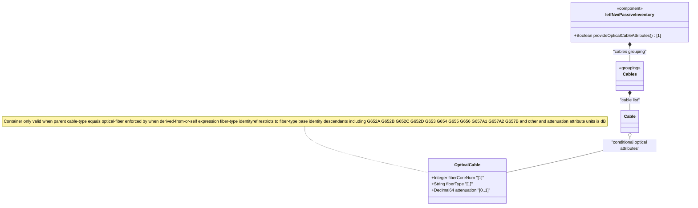

# Feature: Define Optical Cable Attributes

## Parent Epic
- [ ] #108 - [IETF NWI Passive Inventory](https://github.com/gintatkinson/3dgs-033/blob/main/docs/epics/epic-07-ietf-nwi-passive-inventory.md) (YANG container node for fiber-specific attributes conditionally attached to a cable of type optical-fiber)

## Description
Defines the `optical-cable` container, a conditional container that holds attributes specific to fiber optic cables. This container is only valid when the parent cable's `cable-type` is `optical-fiber`, enforced by the `when` expression `derived-from-or-self(../cable-type, 'optical-fiber')`. It contains three attributes: `fiber-core-num` (the number of fiber cores/strands within the cable), `fiber-type` (the optical fiber standard type), and `attenuation` (the fiber attenuation measured in decibels). These attributes characterize the optical transmission properties of the cable and are essential for optical link budgeting and network planning.

**Identities consumed:**
- `fiber-type` base identity hierarchy: G652A, G652B, G652C, G652D, G653, G654, G655, G656, G657A1, G657A2, G657B, other
- `optical-cable-attributes` grouping: container with when expression, fiber-core-num leaf, fiber-type leaf, attenuation leaf

## UML Class Diagram


## Interface Requirements

### 1. Test Data Shape
```json
{
  "optical-cable": {
    "fiber-core-num": 96,
    "fiber-type": "nwi-passive:G652D",
    "attenuation": 0.22
  }
}
```

### 2. Validation & Constraints
- **Container presence**: The `optical-cable` container is conditionally valid — only present when parent cable's `cable-type` equals `optical-fiber`, enforced by `when "derived-from-or-self(../cable-type, 'optical-fiber')"`; for electrical or coaxial cables, this container must not appear
- `fiber-core-num` (type: uint32): mandatory within the container, positive integer representing the count of individual fiber cores/strands within the cable, no explicit range constraint beyond uint32 maximum
- `fiber-type` (type: identityref base fiber-type): mandatory, must resolve to one of the recognized optical fiber types defined in the fiber-type identity hierarchy
- `attenuation` (type: decimal64 with fraction-digits 2, units: dB): optional, fiber attenuation coefficient in decibels, two decimal places precision, typically positive value between 0.00 and 999...99

### 3. Visual Layout & Arrangement
- Display the optical cable attributes as a distinct sub-section within the Cable PropertyGrid, shown only when cable-type is "optical-fiber"
- Label the sub-section "Optical Cable Properties" with a fiber optic icon or visual indicator
- Arrange the three fields vertically: Fiber Core Count (numeric input), Fiber Type (dropdown from fiber-type identity hierarchy), Attenuation (decimal input with dB suffix and two decimal precision)
- The entire sub-section is hidden entirely when cable-type is electrical-cable or coaxial-cable (not grayed out — removed from layout)
- Apply scoped CSS (BEM) for the sub-section styling to prevent conflicts with cable entity fields above
- Apply CSS reset (`box-sizing: border-box`) for consistent field sizing

### 4. Interactive Flow & States
- **Cable type change triggers visibility**: When the operator changes the cable's cable-type from optical-fiber to electrical-cable, the optical cable section collapses and its data is discarded (or preserved-but-hidden per implementation); when switching to optical-fiber, the section expands with default empty values
- **Fiber type selection**: The fiber-type dropdown displays optical fiber standard types in a hierarchical grouped format (G.652 group, G.653-G.657 group, other)
- **Attenuation precision**: The attenuation field enforces two decimal place precision on input; values with more than two decimal places are rounded or rejected
- **Validation feedback**: Missing mandatory fiber-core-num or fiber-type shows inline error messages; invalid fiber-type identities are rejected
- Mandate computed-style assertions for visibility transitions (hidden vs displayed) and error highlight colors in automated tests

## Given-When-Then Acceptance Criteria

**Scenario: Configure optical cable attributes for fiber optic cable**
- **Given** a cable exists with id "cable-fo-001" and cable-type "optical-fiber"
- **When** the operator sets fiber-core-num to 96, fiber-type to "G652D", and attenuation to 0.22
- **Then** the optical cable attributes are persisted and visible within the cable details

**Scenario: Optical cable container not available for electrical cable**
- **Given** a cable exists with cable-type "electrical-cable"
- **When** the operator views the cable details
- **Then** the optical-cable section is hidden/absent because the when expression evaluates to false

**Scenario: Optical cable container appears when type changes to optical-fiber**
- **Given** a cable was created with cable-type "electrical-cable"
- **When** the operator changes cable-type to "optical-fiber"
- **Then** the optical-cable section becomes available for data entry

**Scenario: Optical cable container removed when type changes from optical-fiber**
- **Given** a cable exists with cable-type "optical-fiber" and configured optical-cable attributes (fiber-core-num 48, fiber-type G657A1)
- **When** the operator changes cable-type to "electrical-cable"
- **Then** the optical-cable container is removed and its data is discarded

**Scenario: Create optical cable without fiber-core-num**
- **Given** a cable with cable-type "optical-fiber"
- **When** the operator enters fiber-type "G652D" but omits fiber-core-num
- **Then** the operation is rejected because fiber-core-num is mandatory within the container

**Scenario: Create optical cable with invalid fiber type**
- **Given** a cable with cable-type "optical-fiber"
- **When** the operator attempts to set fiber-type to a value not derived from the fiber-type base identity
- **Then** the operation is rejected with a validation error indicating the type must be a valid fiber-type identity

**Scenario: Attenuation with excessive decimal precision**
- **Given** a cable with optical-cable attributes configured
- **When** the operator attempts to set attenuation to 0.225 (three decimal places)
- **Then** the value is rounded to 0.23 (two decimal places) or rejected per decimal64 fraction-digits constraint

**Scenario: Zero fiber core count**
- **Given** a cable with cable-type "optical-fiber"
- **When** the operator attempts to set fiber-core-num to 0
- **Then** the system accepts zero as technically valid (uint32 allows 0, no explicit min constraint), though a business rule may warn about zero-core cables

## Specification Context (Verbatim)

From draft-ygb-ivy-passive-network-inventory-05, Section 3.1 (Terminology):

> "Optical Cable: refers to a type of guiding media that uses optical fiber as media to transmit optical signals. An optical cable can contain one or multiple fiber cores, also known as fiber strands, each serving as an independent guiding media for data transmission. Optical cables can be spliced or fused through joint boxes, optical distribution frames (ODF), or fiber jumpers."

From Section 2.1 (Passive Infrastructure in Optical Transport Networks):

> "Passive infrastructure in optical transport networks serves as the backbone for high-capacity data transmission. Key components include fiber optic cables, which act as the primary medium of long distance transmission. Optical connectors, patch panels, and splice enclosures are crucial for joining and managing fiber links. Couplers and splitters are used for signal distribution and combining."

> "Attenuators, on the other hand, are placed at places through connectors or built-in modules for reducing optical power."

## Source References
Structural Schema: [ietf-nwi-passive-inventory.yang](https://github.com/aguoietf/draft-ygb-ivy-passive-network-inventory/blob/main/yang/ietf-nwi-passive-inventory.yang) (Clause: grouping optical-cable-attributes, container optical-cable, lines 366-395)
Normative Specification: [draft-ygb-ivy-passive-network-inventory-05](https://datatracker.ietf.org/doc/draft-ygb-ivy-passive-network-inventory/) (Clause: Section 2.1, Section 3.1)

## Logical UI & Layout Bindings
- **Target LUI Component:** PropertyGrid
- **Target Layout Container ID:** properties_view
- **Data Source Bindings:** `/nwi:network-inventory/nwi-passive:cables/nwi-passive:cable/nwi-passive:optical-cable`
