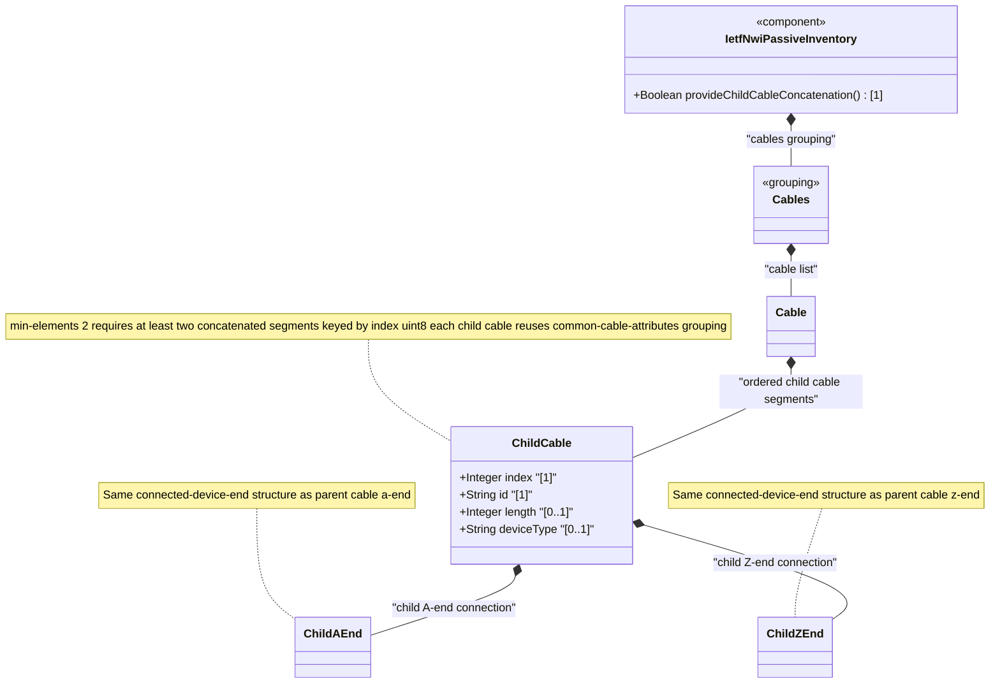

# Feature: Define Child Cables

## Parent Epic
- [ ] #108 - [IETF NWI Passive Inventory](https://github.com/gintatkinson/3dgs-033/blob/main/docs/epics/epic-07-ietf-nwi-passive-inventory.md) (YANG list node defining concatenated child cable segments within a parent cable)

## Description
Defines the `child-cable` list, representing concatenated child cable segments that together form a longer composite cable. Each child cable is keyed by `index` (a uint8 value identifying the concatenation order) and carries the same `common-cable-attributes` as a parent cable: `id`, `length`, and `a-end`/`z-end` connection references. The list requires a minimum of 2 elements (`min-elements 2`), ensuring that a composite cable always consists of at least two concatenated segments. This structure supports modeling of cables that span multiple physical spans, pass through joint boxes or splice points, or transition between different cable types along their route.

**Identities consumed:**
- `common-cable-attributes` grouping: id, length, a-end/z-end via `connected-device-ref`
- `child-cables` grouping: list of `child-cable` entries with min-elements 2 and index key

## UML Class Diagram


## Interface Requirements

### 1. Test Data Shape
```json
{
  "child-cable": [
    {
      "index": 1,
      "id": "child-segment-001",
      "length": 500,
      "a-end": {
        "device-type": "nwi-passive:active-device",
        "ne-ref": "ne-core-01"
      },
      "z-end": {
        "device-type": "nwi-passive:passive-device",
        "device-id": "joint-box-street-5"
      }
    },
    {
      "index": 2,
      "id": "child-segment-002",
      "length": 600,
      "a-end": {
        "device-type": "nwi-passive:passive-device",
        "device-id": "joint-box-street-5"
      },
      "z-end": {
        "device-type": "nwi-passive:active-device",
        "ne-ref": "ne-edge-02"
      }
    }
  ]
}
```

### 2. Validation & Constraints
- `index` (type: uint8): mandatory key field, identifies the concatenation order of child cables within the parent cable; must be unique within the child-cable list; uint8 range [0..255]
- `id` (type: string): mandatory, unique identifier for the child cable segment
- `length` (type: uint32, units: meter): optional, length of this child cable segment in meters
- `min-elements 2`: the child-cable list must contain at least 2 entries; a single child cable or empty list is invalid
- Each child cable carries its own `a-end` and `z-end` containers with the same `connected-device-end` structure as the parent cable (including the device-type choice selection)
- Child cables do NOT inherit `cable-type` or `cable-role` from the parent — only `common-cable-attributes` fields
- The concatenation order defined by `index` is semantically significant: segment 1 connects to segment 2, segment 2 to segment 3, etc., forming a continuous physical path

### 3. Visual Layout & Arrangement
- Display child cables as an ordered table within the parent cable's PropertyGrid, with columns for index, id, and length
- Each row is expandable to reveal the child cable's a-end and z-end connection details (same layout pattern as parent cable's connection ends)
- Rows are sorted by index in ascending order (index 1, index 2, ..., index N)
- Provide add/remove controls for managing the child cable list, with remove disabled when only 2 entries remain (min-elements constraint)
- The child cables table is labeled "Concatenated Segments" with a visual badge showing the count (e.g., "3 segments")
- Use scoped CSS naming (BEM) to prevent specificity conflicts with the parent cable fields
- Apply CSS reset (`box-sizing: border-box`) for consistent table cell sizing

### 4. Interactive Flow & States
- **Empty state** (invalid): The child-cable list must have at least 2 entries; creating a cable with no child cables shows the list with a minimum-of-two validation hint
- **Minimum elements enforcement**: The remove/delete action on the last 2 entries is disabled; attempting to remove a third-to-last entry displays a validation message "At least 2 concatenated child cables are required"
- **Index uniqueness**: Adding a child cable auto-assigns the next available index; manually editing the index triggers uniqueness validation
- **Child expansion**: Clicking a child cable row expands inline or slides open a detail panel showing the child's a-end and z-end connection fields
- **Order reordering**: The index field supports direct editing to reorder segments; validation ensures no duplicate indices
- Mandate computed-style assertions for disabled action buttons, expansion transitions, and validation error indicators in automated tests

## Given-When-Then Acceptance Criteria

**Scenario: Create parent cable with concatenated child segments**
- **Given** a parent cable with id "cable-composite-001" exists
- **When** the operator adds two child cables: index 1 (id "seg-001", length 500) and index 2 (id "seg-002", length 600)
- **Then** both child cables are persisted, ordered by index, and the parent cable is considered a valid composite cable

**Scenario: Create composite cable with fewer than minimum required segments**
- **Given** a parent cable with only one child cable (index 1, id "seg-001")
- **When** the system validates the cable structure
- **Then** a validation error is raised because the child-cable list has only 1 entry (min-elements 2)

**Scenario: Delete a child cable segment violating minimum elements**
- **Given** a cable has exactly 2 child cables (index 1 and index 2)
- **When** the operator attempts to delete child cable index 2
- **Then** the operation is rejected because it would leave only 1 child cable, violating min-elements 2

**Scenario: Duplicate child cable index**
- **Given** a cable has child cable with index 1 (id "seg-001")
- **When** the operator attempts to add another child cable also with index 1
- **Then** the operation is rejected because index is the key and must be unique within the list

**Scenario: Configure child cable with end-to-end device references**
- **Given** a child cable with index 1 exists under parent cable "cable-composite-001"
- **When** the operator configures the child cable's a-end as active-device (ne-ref "ne-core-01") and z-end as passive-device (device-id "joint-box-05")
- **Then** both end connections are persisted for the child cable segment

**Scenario: Index value exceeds uint8 maximum**
- **Given** a parent cable with child cables
- **When** the operator attempts to set a child cable index to 256
- **Then** the operation is rejected because uint8 maximum is 255

## Specification Context (Verbatim)

From draft-ygb-ivy-passive-network-inventory-05, Section 3.1 (Terminology):

> "Guiding media: refers to physical transmission pathways - such as optical fiber cables, electrical cables, and coaxial cables - that direct and confine electromagnetic signals along a specific route. ... Guiding media can be concatenated to form longer guiding media."

From Section 5 (YANG Model Overview):

> "Cables: a list of cables with each containing an optional list of child cables."

## Source References
Structural Schema: [ietf-nwi-passive-inventory.yang](https://github.com/aguoietf/draft-ygb-ivy-passive-network-inventory/blob/main/yang/ietf-nwi-passive-inventory.yang) (Clause: grouping child-cables, list child-cable, lines 419-436)
Normative Specification: [draft-ygb-ivy-passive-network-inventory-05](https://datatracker.ietf.org/doc/draft-ygb-ivy-passive-network-inventory/) (Clause: Section 3.1, Section 5)

## Logical UI & Layout Bindings
- **Target LUI Component:** TableView
- **Target Layout Container ID:** elements_view
- **Data Source Bindings:** `/nwi:network-inventory/nwi-passive:cables/nwi-passive:cable/nwi-passive:child-cable`
