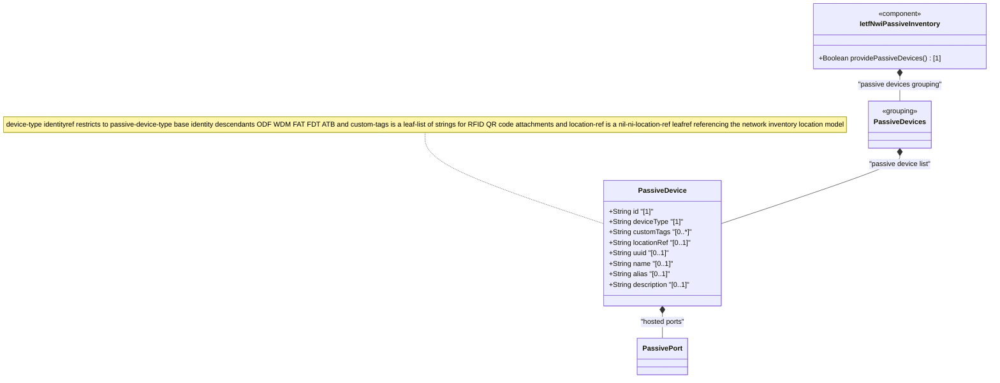

# Feature: Define Passive Device Entity

## Parent Epic
- [ ] #108 - [IETF NWI Passive Inventory](https://github.com/gintatkinson/3dgs-033/blob/main/docs/epics/epic-07-ietf-nwi-passive-inventory.md) (YANG list node defining passive device entities within the network inventory)

## Description
Defines the `passive-device` list, representing non-powered physical devices deployed within the network infrastructure. Passive devices manipulate signals through transmission, reflection, splitting, filtering, or attenuation without actively amplifying or generating signals. Each passive device is keyed by `id` and classified by `device-type` (identityref to `passive-device-type` base identity). The entity carries customizable `custom-tags` (e.g., RFID, QR codes), a `location-ref` leafref to the network inventory location model, and inherits common entity attributes (`uuid`, `name`, `alias`, `description`). Passive devices can optionally host a list of `passive-port` entries.

Typical examples include Optical Distribution Frames (ODF), Wavelength Division Multiplexers (WDM), Fiber Access Terminals (FAT), Fiber Distribution Terminals (FDT), and Access Terminal Boxes (ATB).

**Identities consumed:**
- `passive-device-type` base identity hierarchy: ODF, WDM, FAT, FDT, ATB
- `passive-device-ports` grouping: list of `passive-port` entries hosted on each device

## UML Class Diagram


## Interface Requirements

### 1. Test Data Shape
```json
{
  "nwi-passive:passive-device": [
    {
      "id": "odf-central-office-01",
      "device-type": "nwi-passive:ODF",
      "custom-tags": ["RFID-8844-9921", "QR-ODF-CO-01"],
      "location-ref": "loc-equipment-room-3a",
      "uuid": "6ba7b810-9dad-11d1-80b4-00c04fd430c8",
      "name": "Central Office ODF Bay 1",
      "alias": "ODF-CO-01",
      "description": "Main optical distribution frame in Central Office equipment room 3A"
    }
  ]
}
```

### 2. Validation & Constraints
- `id` (type: string): mandatory key field, must be unique within the passive-device list
- `device-type` (type: identityref base passive-device-type): mandatory, must resolve to one of `ODF`, `WDM`, `FAT`, `FDT`, or `ATB`
- `custom-tags` (type: leaf-list of string): optional, zero or more string entries representing RFID tags, QR codes, or other custom identifiers attached to the device
- `location-ref` (type: nil:ni-location-ref): optional, leafref that must resolve to a valid location in the network inventory location model
- `uuid` (type: string): optional, RFC 9562 UUID from inherited basic-common-entity-attributes
- `name` (type: string): optional, human-readable name
- `alias` (type: string): optional, short alias
- `description` (type: string): optional, free-text description
- No explicit cardinality constraints beyond schema structure; the passive-device list may be empty
- The `location-ref` referential integrity must be maintained — deleting a location that is referenced by a passive device must be prevented or cascade-handled

### 3. Visual Layout & Arrangement
- Display passive devices as rows in a `TableView` component with columns for id, name, device-type, location-ref, and custom-tags count
- The device-type column renders resolved human-readable labels from the passive-device-type identity hierarchy (e.g., "Optical Distribution Frame", "Fiber Access Terminal")
- The location-ref column displays the location name or identifier, hyperlinked to navigate to the referenced location
- The custom-tags column shows a tag count badge with hover tooltip listing the individual tag values
- Row selection triggers detail expansion in the PropertyGrid showing all passive device attributes including the hosted ports section
- Apply CSS reset (`box-sizing: border-box`) with scoped naming (CSS Modules/BEM) for table styling

### 4. Interactive Flow & States
- **Empty state**: When the passive device list is empty, display an empty-state placeholder "No passive devices defined" with a visual indicator
- **Loading state**: Display a loading skeleton while passive device data is being fetched
- **Error state**: On fetch failure, display an error banner with retry action
- **Row selection**: Selecting a passive device row highlights it and loads details into the PropertyGrid, including the ports sub-table
- **Location reference navigation**: Clicking the location-ref link navigates to the referenced location in the inventory tree
- **Custom tags management**: Tags are displayed as a chip/tag list with individual delete actions and an "Add Tag" input for appending new tags
- Mandate computed-style assertions for highlight colors, link hover states, and tag chip render states in automated tests

## Given-When-Then Acceptance Criteria

**Scenario: Create a new passive device with all attributes**
- **Given** the passive device list is empty
- **When** the operator creates a new passive device with id "odf-co-01", device-type "ODF", location-ref "loc-eq-3a", and custom-tags ["RFID-001"]
- **Then** the passive device is persisted with all attributes and appears in the table view

**Scenario: Create passive device without required identifier**
- **Given** the passive device entry form is open
- **When** the operator attempts to save a device without specifying an id
- **Then** the operation is rejected with a validation error indicating id is mandatory

**Scenario: Create passive device with invalid device-type**
- **Given** the passive device entry form
- **When** the operator attempts to set device-type to a value not derived from passive-device-type base identity
- **Then** the operation is rejected with a validation error

**Scenario: Reference a non-existent location**
- **Given** the location inventory has no location with id "loc-nonexistent"
- **When** the operator sets location-ref to "loc-nonexistent"
- **Then** the operation is rejected because the leafref cannot resolve to a valid location

**Scenario: Add multiple custom tags**
- **Given** a passive device with id "odf-co-01" exists
- **When** the operator adds custom-tags "RFID-001", "QR-ODF-BAY1", and "ASSET-9921"
- **Then** all three tags are persisted as a leaf-list and displayed as tag chips

**Scenario: Remove a custom tag**
- **Given** a passive device has custom-tags ["RFID-001", "QR-001"]
- **When** the operator removes "RFID-001"
- **Then** the tag is removed from the leaf-list, leaving only "QR-001"

**Scenario: Update passive device device-type**
- **Given** a passive device exists with device-type "ODF"
- **When** the operator changes device-type to "FDT"
- **Then** the device-type is updated and the table view reflects the change

## Specification Context (Verbatim)

From draft-ygb-ivy-passive-network-inventory-05, Section 1 (Introduction):

> "Passive infrastructure refers to the underlying infrastructure of a telecommunication network that is not actively detectable or manageable. It typically includes non-powered, non-communicating devices and components, such as cabinets, cables, connectors, splitters, antennas, distribution frames, etc., that are either hosted within an actively managed device or deployed along the physical pathway between active devices."

> "[I-D.ietf-ivy-network-inventory-location] emphasizes the relative and geographic location, e.g. equipment room, geo-loation for NE. A passive device is deployed in a certain location visible by the operator, and thus can reference the location defined by [I-D.ietf-ivy-network-inventory-location]."

From Section 3.1 (Terminology):

> "Passive device: refers to a physical device within a network that does not require external power to function, and simply manipulates signals through processes like transmission, reflection, splitting, filtering, or attenuation without actively amplifying or generating the signal. Examples include optical fibers, splitters, couplers, and optical filters, all of which are used to direct signals within a system without needing power. A passive device typically does not have management interfaces and is typically deployed in a location tracked by the network operator."

From Section 5 (YANG Model Overview):

> "Passive devices: a list of passive devices with extended attributed reported by the domain controller."

## Source References
Structural Schema: [ietf-nwi-passive-inventory.yang](https://github.com/aguoietf/draft-ygb-ivy-passive-network-inventory/blob/main/yang/ietf-nwi-passive-inventory.yang) (Clause: grouping passive-devices, list passive-device, grouping passive-device-ports, lines 478-511)
Normative Specification: [draft-ygb-ivy-passive-network-inventory-05](https://datatracker.ietf.org/doc/draft-ygb-ivy-passive-network-inventory/) (Clause: Section 1, Section 3.1, Section 5)

## Logical UI & Layout Bindings
- **Target LUI Component:** TableView
- **Target Layout Container ID:** elements_view
- **Data Source Bindings:** `/nwi:network-inventory/nwi-passive:passive-devices/nwi-passive:passive-device`
