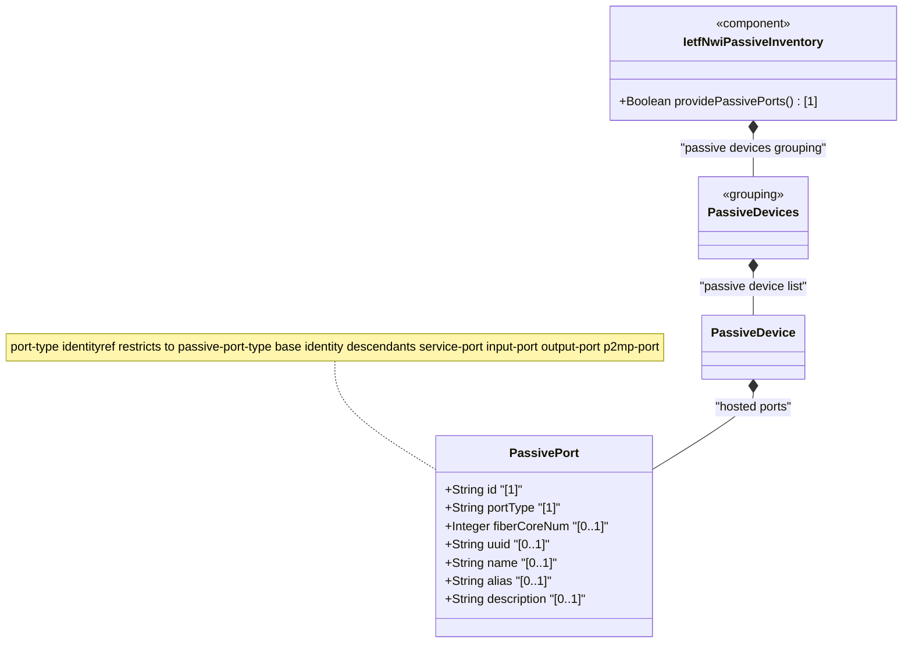

# Feature: Define Passive Port

## Parent Epic
- [ ] #108 - [IETF NWI Passive Inventory](https://github.com/gintatkinson/3dgs-033/blob/main/docs/epics/epic-07-ietf-nwi-passive-inventory.md) (YANG list node defining ports hosted on a passive device)

## Description
Defines the `passive-port` list, representing physical ports on a passive device through which signals enter or leave. Each port is keyed by `id` and classified by `port-type` (identityref to `passive-port-type` base identity). The port carries a `fiber-core-num` attribute indicating the number of fiber cores terminated at the port, and inherits common entity attributes (`uuid`, `name`, `alias`, `description`). Passive ports model the physical interface points of devices such as ODFs, splitters, and fiber distribution terminals, providing the termination points for cable connections.

**Identities consumed:**
- `passive-port-type` base identity hierarchy: service-port, input-port, output-port, p2mp-port

## UML Class Diagram


## Interface Requirements

### 1. Test Data Shape
```json
{
  "passive-port": [
    {
      "id": "port-1-1",
      "port-type": "nwi-passive:service-port",
      "fiber-core-num": 1,
      "name": "Service Port 1",
      "alias": "SVC-1"
    },
    {
      "id": "port-1-2",
      "port-type": "nwi-passive:input-port",
      "fiber-core-num": 12,
      "name": "Input Port 2"
    }
  ]
}
```

### 2. Validation & Constraints
- `id` (type: string): mandatory key field, must be unique within the parent passive device's port list
- `port-type` (type: identityref base passive-port-type): mandatory, must resolve to one of `service-port`, `input-port`, `output-port`, or `p2mp-port`
- `fiber-core-num` (type: uint32): optional, number of fiber cores connected to or terminated at this port; no explicit range constraint beyond uint32
- `uuid` (type: string): optional, from inherited basic-common-entity-attributes
- `name` (type: string): optional, human-readable port name
- `alias` (type: string): optional, short alias
- `description` (type: string): optional, free-text description
- The passive-port list is optional within a passive device; a device may have no ports defined
- Port order within the list is not semantically constrained (not an ordered-by-user list)
- The `p2mp-port` type (point-to-multipoint) has a description of "Input port" in the schema, indicating it is used for the input/trunk side of a passive splitter where one input feeds multiple outputs

### 3. Visual Layout & Arrangement
- Display ports as a sub-table or nested list within the passive device's PropertyGrid, below the device attributes
- Columns: Port ID, Port Type, Fiber Core Count, Name
- The port-type column renders human-readable labels: "Service Port", "Input Port", "Output Port", "P2MP Port"
- The fiber-core-num column displays the count with "cores" suffix when greater than 1, or "1 core" for singleton
- Provide add/remove row controls for managing the port list
- The port sub-section is labeled "Ports" with a count badge
- Use scoped CSS naming (BEM) to prevent specificity conflicts with parent device fields
- Apply CSS reset (`box-sizing: border-box`) for table cell consistency

### 4. Interactive Flow & States
- **Empty state**: When a passive device has no ports, display "No ports configured" within the ports sub-section
- **Row selection**: Selecting a port row highlights it and expands inline fields for editing
- **Port type assignment**: The port-type field uses a dropdown selector with the four passive-port-type options; the p2mp-port option displays an informative note about its point-to-multipoint role
- **Port id uniqueness**: When adding or editing a port id, the system validates uniqueness within the parent device's port list
- **Validation feedback**: Mandatory fields (id, port-type) show inline error messages when omitted; invalid port-type identities are rejected
- Mandate computed-style assertions for highlight colors, dropdown option rendering, and validation error indicators in automated tests

## Given-When-Then Acceptance Criteria

**Scenario: Add a service port to a passive device**
- **Given** a passive device with id "odf-co-01" exists
- **When** the operator adds a port with id "port-1-1", port-type "service-port", and fiber-core-num 1
- **Then** the port is persisted as a child of the passive device and appears in the ports table

**Scenario: Add multiple ports with different types**
- **Given** a passive device with id "fat-outdoor-01" exists
- **When** the operator adds ports: port "in-1" (input-port, 12 cores), port "out-1" through "out-8" (output-port, 1 core each)
- **Then** all 9 ports are persisted with their respective types and fiber core counts

**Scenario: Create port without required identifier**
- **Given** a passive device with id "odf-co-01"
- **When** the operator attempts to save a port without an id
- **Then** the operation is rejected with a validation error indicating id is mandatory

**Scenario: Duplicate port id within same device**
- **Given** a passive device has a port with id "port-1-1"
- **When** the operator attempts to add another port also with id "port-1-1" to the same device
- **Then** the operation is rejected because port id must be unique within the parent device

**Scenario: Create port with invalid port-type**
- **Given** a passive device with id "fdt-01"
- **When** the operator attempts to set port-type to a value not derived from passive-port-type base identity
- **Then** the operation is rejected with a validation error

**Scenario: Delete a port from a passive device**
- **Given** a passive device has 3 ports (port-1-1, port-1-2, port-1-3)
- **When** the operator deletes port "port-1-2"
- **Then** the port is removed, leaving 2 ports, and the table updates to reflect the change

**Scenario: Update port type of an existing port**
- **Given** a port with id "port-1-1" and port-type "service-port"
- **When** the operator changes port-type to "output-port"
- **Then** the port type is updated to output-port

**Scenario: Duplicate port id allowed across different devices**
- **Given** passive device "odf-co-01" has port "port-1-1" and passive device "odf-co-02" exists
- **When** the operator adds port "port-1-1" to device "odf-co-02"
- **Then** the operation succeeds because port id uniqueness is scoped to the parent device, not globally

## Specification Context (Verbatim)

From draft-ygb-ivy-passive-network-inventory-05, Section 2.1 (Passive Infrastructure in Optical Transport Networks):

> "Within a physical network element (NE) there are also presence of passive components. For example, fiber optic cables are used to connect the ports of different modules within the same or between different chassis."

From Section 2.2 (Passive Infrastructure in Optical Access Networks):

> "Passive Optical Networks (PONs) are a typical type of optical access network with significant passive infrastructure. The passive infrastructure in PON, often referred to as Optical Distribution Network (ODN), is the physical optical fiber-based network that connects the Optical Line Terminal (OLT) typically hosted in a central office to the Optical Network Unit/Terminal (ONU/ONT) typically deployed at the user's location. The ODN is equipped with one or multiple cascaded passive optical splitter thus creating a physical point-to-multipoint fiber network between an OLT port and the multiple connected ONU/ONTs."

## Source References
Structural Schema: [ietf-nwi-passive-inventory.yang](https://github.com/aguoietf/draft-ygb-ivy-passive-network-inventory/blob/main/yang/ietf-nwi-passive-inventory.yang) (Clause: grouping passive-device-ports, list passive-port, lines 450-476)
Normative Specification: [draft-ygb-ivy-passive-network-inventory-05](https://datatracker.ietf.org/doc/draft-ygb-ivy-passive-network-inventory/) (Clause: Section 2.1, Section 2.2)

## Logical UI & Layout Bindings
- **Target LUI Component:** TableView
- **Target Layout Container ID:** elements_view
- **Data Source Bindings:** `/nwi:network-inventory/nwi-passive:passive-devices/nwi-passive:passive-device/nwi-passive:passive-port`
