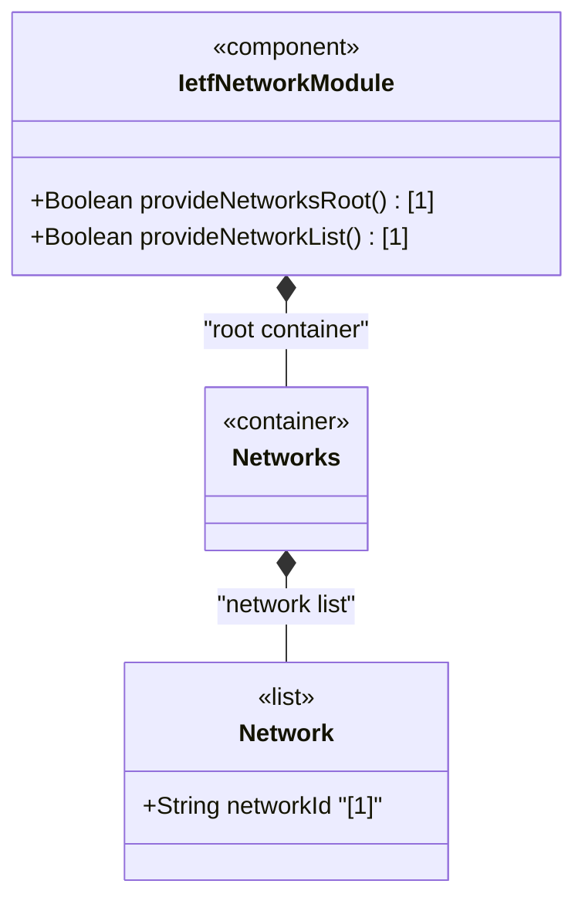

# Feature: Define Networks Root Container

## Parent Epic
- [ ] #124 - [ietf-network: Base Network Data Model](https://github.com/gintatkinson/3dgs-033/blob/main/docs/epics/epic-08-ietf-network.md) (top-level root container anchoring the network list, clause 4.1)

## Description
Defines the `networks` container, the top-level structural root for the `ietf-network` module. This container serves as the anchor for a list of abstract network instances and is the primary entry point for the network data model. It carries no direct leaf attributes or key — its role is purely structural, providing the root node under which all `network` list entries are organized. The container supports read-write access (`config true`) and may be instantiated in both the intended and operational state datastores per the Network Management Datastore Architecture (NMDA) [RFC 8342].

## UML Class Diagram


## Interface Requirements

### 1. Payload Schema
```json
{
  "networks": {
    "network": [
      {
        "network-id": "example-network-001",
        "network-types": {},
        "supporting-network": [],
        "node": []
      }
    ]
  }
}
```

### 2. Validation & Constraints
- `networks`: read-write (`config true`), top-level container, no mandatory child nodes at this level
- An empty `networks` container with no `network` list entries is valid per schema
- The container has no explicit cardinality constraints — zero or one instance per datastore as implied by YANG container semantics
- No key, no unique constraint — the container itself has no identifying attributes

### 3. Logical Operations & Interface Messages
- **Read networks**: `GET /networks` — retrieve the networks container and its child network entries
- **Read networks patch**: `GET /networks?depth=1` — retrieve just the container metadata without full tree expansion
- The container serves as the namespace root for all network-level operations

### 4. Logical Exception States & Validation Failures
- N/A — the container itself has no validation constraints; errors would arise from child list operations
- If a downstream augmentation references this container path and the container is absent, referential integrity violations result in removal from the operational state datastore

## Given-When-Then Acceptance Criteria
- **Given** an empty datastore, **When** a server initializes the ietf-network module, **Then** the `networks` container path is available as a valid data tree root
- **Given** the `networks` container exists, **When** a client creates a `network` list entry, **Then** the new entry is nested under `networks` and accessible at `/networks/network`
- **Given** the `networks` container exists, **When** a client queries the operational state datastore, **Then** the container and all system-controlled child entries are visible
- **Given** an empty `networks` container, **When** a client deletes the container itself, **Then** the operation succeeds and the container is removed from the intended datastore (subject to YANG deletion semantics)

## Specification Context (Verbatim)
From the IETF Network Topologies YANG Data Model specification, Section 4.1 (Base Network Model):

"The data model contains a container with a list of networks. Each network is captured in its own list entry, distinguished via a network-id."

"A network has a certain type, such as L2, L3, OSPF, or IS-IS. A network can even have multiple types simultaneously. The type or types are captured underneath the container 'network-types'."

"Furthermore, a network contains an inventory of nodes that are part of the network. The nodes of a network are captured in their own list."

From the IETF Network Topologies YANG Data Model specification, Section 4.4.1 (Container Structure):

"Rather than maintaining lists in separate containers, the data model is kept relatively flat in terms of its containment structure. Lists of nodes, links, termination points, and supporting nodes; supporting links; and supporting termination points are not kept in separate containers."

## Source References
Structural Schema: [ietf-network@2018-02-26.yang](https://github.com/YangModels/yang/blob/main/standard/ietf/RFC/ietf-network%402018-02-26.yang) (Clause: 6.1, lines 119-121)
Normative Specification: [the IETF Network Topologies YANG Data Model specification](https://datatracker.ietf.org/doc/rfc8345/) (Clause: 4.1, Figure 4)

## Logical UI & Layout Bindings
- **Target LUI Component:** HierarchyTreeSelector
- **Target Layout Container ID:** resource_tree
- **Data Source Bindings:** `/nw:networks`
