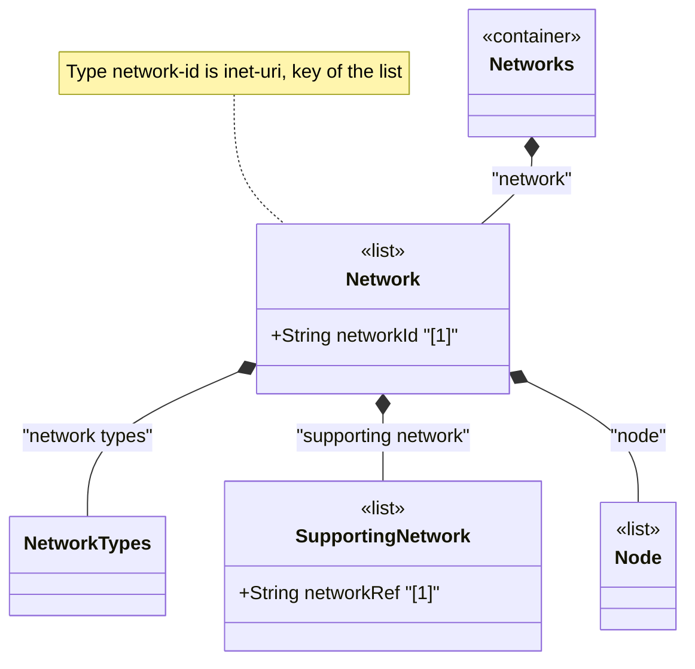

# Feature: Define Network List Entry

## Parent Epic
- [ ] #124 - [ietf-network: Base Network Data Model](https://github.com/gintatkinson/3dgs-033/blob/main/docs/epics/epic-08-ietf-network.md) (list of abstract networks keyed by network-id, clause 4.1)

## Description
Defines the `network` list entry, the primary structural entity of the `ietf-network` module. Each network instance is identified by a unique `network-id` of type `network-id` (which is `inet:uri`). A network represents an abstract collection of nodes and may be augmented with topology information via the `ietf-network-topology` module, with inventory information via inventory data models, and with network-type-specific data via technology-specific augmentations. Networks support hierarchical layering through the `supporting-network` list, enabling representation of underlay/overlay relationships and network stacks.

The `network-id` leaf serves as the list key and uses a URI type to allow globally unique identification. The identifier SHOULD be chosen such that the same network will always be identified through the same identifier, even if the data model is instantiated in separate datastores.

## UML Class Diagram


## Interface Requirements

### 1. Payload Schema
```json
{
  "network": {
    "network-id": "urn:example:network:core-l3",
    "network-types": {},
    "supporting-network": [
      {
        "network-ref": "urn:example:network:physical-underlay"
      }
    ],
    "node": [
      {
        "node-id": "urn:example:node:router-01"
      }
    ]
  }
}
```

### 2. Validation & Constraints
- `network-id`: type `network-id` (derived from `inet:uri`), mandatory as list key, MUST be unique within the `networks` container
- `network-id` SHOULD be a URI chosen for stable identity across datastore instantiations
- The list is read-write (`config true`), supporting both client-configured overlay networks and system-controlled discovered networks
- A network may have zero or more `supporting-network` entries — representing that it is a standalone (root) network or has underlay dependencies
- A network may have zero or more `node` entries — an empty node list represents a network with no inventoried members
- Referential integrity: `supporting-network/network-ref` leafrefs to `../../../supporting-network/network-ref` which in turn leafrefs to `../../network-id`

### 3. Logical Operations & Interface Messages
- **Create network**: `POST /networks/network` — create a new network list entry with a unique network-id
- **Read network**: `GET /networks/network/{network-id}` — retrieve a specific network and its child data
- **Update network**: `PATCH /networks/network/{network-id}` — modify network attributes
- **Delete network**: `DELETE /networks/network/{network-id}` — remove the network and all its child nodes, supporting networks, and associated topology data

### 4. Logical Exception States & Validation Failures
- **Duplicate network-id**: Creation of a network with an already-existing network-id MUST be rejected with a data-exists error
- **Dangling reference**: If a `supporting-network/network-ref` refers to a non-existent network, the entry is removed from the operational state datastore until the reference is resolved
- **Missing key**: Creation without a network-id MUST be rejected as invalid input

## Given-When-Then Acceptance Criteria
- **Given** a `networks` container exists, **When** a client creates a new network with a unique network-id "urn:example:net-01", **Then** the network entry appears in the list and is queryable by its network-id
- **Given** a network exists with network-id "urn:example:net-01", **When** a client attempts to create another network with the same network-id, **Then** the server rejects the operation with a data-exists error
- **Given** a network with a supporting-network referencing a valid underlay network-id, **When** that underlay network is deleted, **Then** the supporting-network entry with the dangling reference is removed from the operational state datastore
- **Given** a standalone network with no supporting-network entries, **When** a client queries the network structure, **Then** the network appears as a root-level network in the hierarchy
- **Given** a network with a network-id, **When** the same network identifier is used across separate datastores, **Then** the identifier consistently refers to the same logical network

## Specification Context (Verbatim)
From the IETF Network Topologies YANG Data Model specification, Section 4.1 (Base Network Model):

"The abstract (base) network data model is defined in the 'ietf-network' module. Its structure is shown in Figure 4." [Figure 4 shows the tree structure with `networks` → `network* [network-id]`]

"A network has a certain type, such as L2, L3, OSPF, or IS-IS. A network can even have multiple types simultaneously. The type or types are captured underneath the container 'network-types'. In this model, it serves merely as an augmentation target; network-specific modules will later introduce new data nodes to represent new network types below this target."

"A network can in turn be part of a hierarchy of networks, building on top of other networks. Any such networks are captured in the list 'supporting-network'. A supporting network is, in effect, an underlay network."

From the IETF Network Topologies YANG Data Model specification, Section 4.4.9 (Representing the Same Device in Multiple Networks):

"One common requirement concerns the ability to indicate that the same device can be part of multiple networks and topologies. However, the data model defines a node as relative to the network that contains it. The same node cannot be part of multiple topologies. In many cases, a node will be the abstraction of a particular device in a network."

## Source References
Structural Schema: [ietf-network@2018-02-26.yang](https://github.com/YangModels/yang/blob/main/standard/ietf/RFC/ietf-network%402018-02-26.yang) (Clause: 6.1, lines 122-153)
Normative Specification: [the IETF Network Topologies YANG Data Model specification](https://datatracker.ietf.org/doc/rfc8345/) (Clause: 4.1, Figure 4)

## Logical UI & Layout Bindings
- **Target LUI Component:** HierarchyTreeSelector
- **Target Layout Container ID:** resource_tree
- **Data Source Bindings:** `/nw:networks/nw:network`
