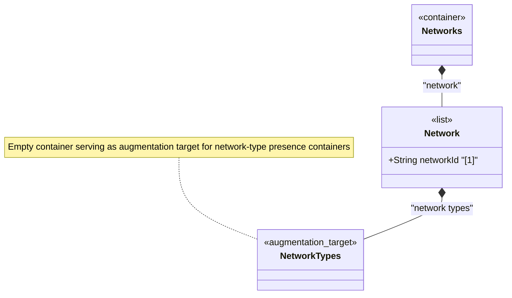

# Feature: Define Network Types Container

## Parent Epic
- [ ] #124 - [ietf-network: Base Network Data Model](https://github.com/gintatkinson/3dgs-033/blob/main/docs/epics/epic-08-ietf-network.md) (augmentation target for network type classification, clause 4.1)

## Description
Defines the `network-types` container, an empty structural placeholder within each `network` list entry that serves purely as an augmentation target. Network-specific modules (e.g., Layer 3 unicast IGP, OSPF, IS-IS) augment into this container with presence containers representing each network type. A network may carry multiple network types simultaneously, and the use of presence containers (rather than `empty` leafs) enables the representation of hierarchical type refinement — for example, an OSPF network is also a Layer 3 unicast IGP network.

The container itself carries no leaf attributes, keys, or direct constraints. Its role is to anchor augmentations that classify the network instance into one or more network-type categories.

## UML Class Diagram


## Interface Requirements

### 1. Payload Schema
```json
{
  "network": {
    "network-id": "urn:example:network:ospf-area-0",
    "network-types": {
      "l3-unicast-igp-network": {
        "ospf-network": {}
      }
    }
  }
}
```

### 2. Validation & Constraints
- `network-types`: empty container, config true, no mandatory child nodes
- Network types SHOULD be represented using presence containers, not leafs of type `empty` — this enables type hierarchy representation
- Zero or more network-type presence containers may be present, indicating the network can have zero or multiple types
- The container serves as an augmentation target — all network-type containers are inserted via YANG augmentation in technology-specific modules
- No key, no leaf attributes, no union or choice constraints at this level

### 3. Logical Operations & Interface Messages
- **Read network types**: `GET /networks/network/{network-id}/network-types` — retrieve the type classification for a network
- **Augment network type**: Technology-specific modules insert presence containers via YANG augmentation at this path
- No direct create/update/delete operations on the container itself — management of network types occurs through augmented child nodes

### 4. Logical Exception States & Validation Failures
- If an augmenting module declares conditional (`when`) constraints on the presence of a network-type container, operations on dependent data nodes are rejected when the required type is absent
- Conflicting type classifications within the same type hierarchy MAY be rejected by augmenting modules but are not enforced at this base level

## Given-When-Then Acceptance Criteria
- **Given** a network exists, **When** no technology-specific augmentations are applied, **Then** the `network-types` container exists as an empty node with no children
- **Given** a network exists, **When** an L3 unicast IGP module augments a presence container `l3-unicast-igp-network` into `network-types`, **Then** the network is classified as an L3 unicast IGP network
- **Given** an L3 unicast IGP network, **When** an OSPF module further augments `ospf-network` as a child of `l3-unicast-igp-network`, **Then** the network is classified as both an L3 unicast IGP network and an OSPF network in a type refinement hierarchy
- **Given** a network with multiple type containers at the same level, **When** a client queries the network types, **Then** all applicable type containers are returned

## Specification Context (Verbatim)
From the IETF Network Topologies YANG Data Model specification, Section 4.1 (Base Network Model):

"In this model, it serves merely as an augmentation target; network-specific modules will later introduce new data nodes to represent new network types below this target, i.e., will insert them below 'network-types' via YANG augmentation."

"When a network is of a certain type, it will contain a corresponding data node. Network types SHOULD always be represented using presence containers, not leafs of type 'empty'. This allows the representation of hierarchies of network subtypes within the instance information. For example, an instance of an OSPF network (which, at the same time, is a Layer 3 unicast IGP network) would contain underneath 'network-types' another presence container 'l3-unicast-igp-network', which in turn would contain a presence container 'ospf-network'."

From the IETF Network Topologies YANG Data Model specification, Section 4.3 (Extending the Data Model):

"First, a new network type needs to be defined; this is done by defining a presence container that represents the new network type. The new network type is inserted, by means of augmentation, below the network-types container."

## Source References
Structural Schema: [ietf-network@2018-02-26.yang](https://github.com/YangModels/yang/blob/main/standard/ietf/RFC/ietf-network%402018-02-26.yang) (Clause: 6.1, lines 134-139)
Normative Specification: [the IETF Network Topologies YANG Data Model specification](https://datatracker.ietf.org/doc/rfc8345/) (Clause: 4.1, 4.3)

## Logical UI & Layout Bindings
- **Target LUI Component:** PropertyGrid
- **Target Layout Container ID:** properties_view
- **Data Source Bindings:** `/nw:networks/nw:network/nw:network-types`
