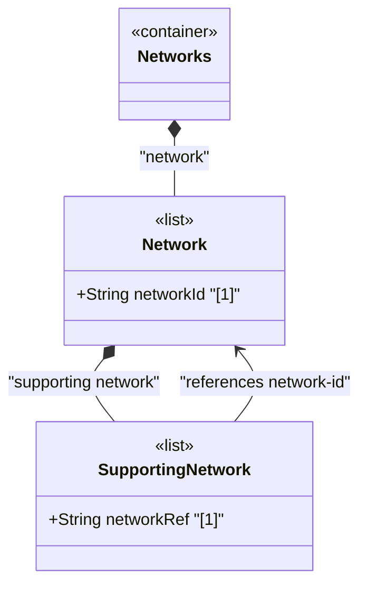

# Feature: Define Supporting Network List

## Parent Epic
- [ ] #124 - [ietf-network: Base Network Data Model](https://github.com/gintatkinson/3dgs-033/blob/main/docs/epics/epic-08-ietf-network.md) (underlay network layering hierarchy, clause 4.1)

## Description
Defines the `supporting-network` list, a list keyed by `network-ref` that captures hierarchical layering relationships between networks. Each entry identifies an underlay network upon which the containing network depends or is layered. This construct enables the representation of network stacks where overlay networks such as VPNs or service topologies are built on top of underlay networks such as IP-routed or optical transport networks.

The `network-ref` leaf is a `leafref` pointing to `/nw:networks/nw:network/nw:network-id` with `require-instance` set to `false`, allowing references to networks that may not yet exist in the operational state datastore (for configured overlays referencing discovered underlays). A network with an empty `supporting-network` list is a root network with no underlay dependencies.

## UML Class Diagram


## Interface Requirements

### 1. Payload Schema
```json
{
  "network": {
    "network-id": "urn:example:network:overlay-vpn",
    "supporting-network": [
      {
        "network-ref": "urn:example:network:core-l3-igp"
      },
      {
        "network-ref": "urn:example:network:optical-transport"
      }
    ]
  }
}
```

### 2. Validation & Constraints
- `network-ref`: type `leafref` with path `/nw:networks/nw:network/nw:network-id`, `require-instance false`, mandatory as list key, MUST be unique within the list
- The list is config true, supporting explicit configuration of underlay dependencies
- Multiple supporting-network entries are permitted — a network may be layered on top of multiple underlay networks simultaneously
- `require-instance false` means configured references to non-existent networks are accepted in the intended datastore but the entry is excluded from the operational state datastore until referential integrity is satisfied
- Circular dependencies (a network listing itself or a transitive descendant as supporting-network) are logically invalid but not blocked by the YANG schema at this level

### 3. Logical Operations & Interface Messages
- **Add supporting network**: `POST /networks/network/{network-id}/supporting-network` — declare a new underlay dependency
- **Read supporting networks**: `GET /networks/network/{network-id}/supporting-network` — retrieve all underlay dependencies
- **Remove supporting network**: `DELETE /networks/network/{network-id}/supporting-network/{network-ref}` — remove an underlay dependency
- **Churn handling**: When a supporting network is deleted, the dependent overlay entry is removed from the operational state datastore

### 4. Logical Exception States & Validation Failures
- **Duplicate reference**: Creating a supporting-network entry with a network-ref that already exists in the list MUST be rejected
- **Dangling reference in operational state**: If the referenced underlay network does not exist in the operational state datastore, the supporting-network entry is excluded from operational state until the reference resolves
- **Self-reference**: Configuring a network to support itself creates a circular dependency that is logically invalid

## Given-When-Then Acceptance Criteria
- **Given** an overlay network and an underlay network both exist, **When** a client adds the underlay network's network-id to the overlay's `supporting-network` list, **Then** the layering relationship is established and the entry appears in both intended and operational datastores
- **Given** an overlay network with a supporting-network reference, **When** the referenced underlay network is deleted, **Then** the supporting-network entry is removed from the operational state datastore and remains in the intended datastore as a dangling reference
- **Given** an overlay network with a supporting-network reference to a non-existent network, **When** that underlay network is subsequently created, **Then** the supporting-network entry becomes operational and appears in the operational state datastore
- **Given** a network with no supporting-network entries, **When** a client queries the network, **Then** it is identified as a root network with no underlay dependencies

## Specification Context (Verbatim)
From the IETF Network Topologies YANG Data Model specification, Section 4.1 (Base Network Model):

"A network can in turn be part of a hierarchy of networks, building on top of other networks. Any such networks are captured in the list 'supporting-network'. A supporting network is, in effect, an underlay network."

From the IETF Network Topologies YANG Data Model specification, Section 4.4.2 (Underlay Hierarchies and Mappings):

"To minimize assumptions regarding what a particular entity might actually represent, mappings between networks, nodes, links, and termination points are kept strictly generic."

From the IETF Network Topologies YANG Data Model specification, Section 4.4.3 (Dealing with Changes in Underlay Networks):

"It is possible for a network to undergo churn even as other networks are layered on top of it. When a supporting node, link, or termination point is deleted, the supporting leafrefs in the overlay will be left dangling. To allow for this possibility, the data model makes use of the 'require-instance' construct of YANG 1.1."

## Source References
Structural Schema: [ietf-network@2018-02-26.yang](https://github.com/YangModels/yang/blob/main/standard/ietf/RFC/ietf-network%402018-02-26.yang) (Clause: 6.1, lines 140-153)
Normative Specification: [the IETF Network Topologies YANG Data Model specification](https://datatracker.ietf.org/doc/rfc8345/) (Clause: 4.1, 4.4.2, 4.4.3)

## Logical UI & Layout Bindings
- **Target LUI Component:** TableView
- **Target Layout Container ID:** elements_view
- **Data Source Bindings:** `/nw:networks/nw:network/nw:supporting-network`
